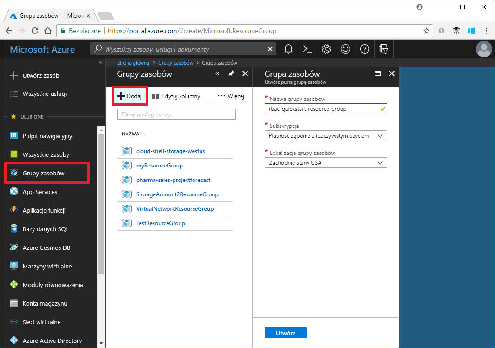
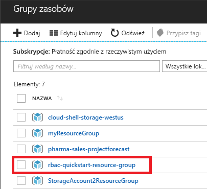
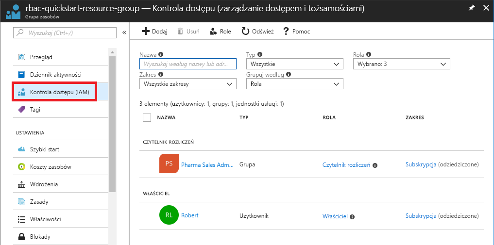
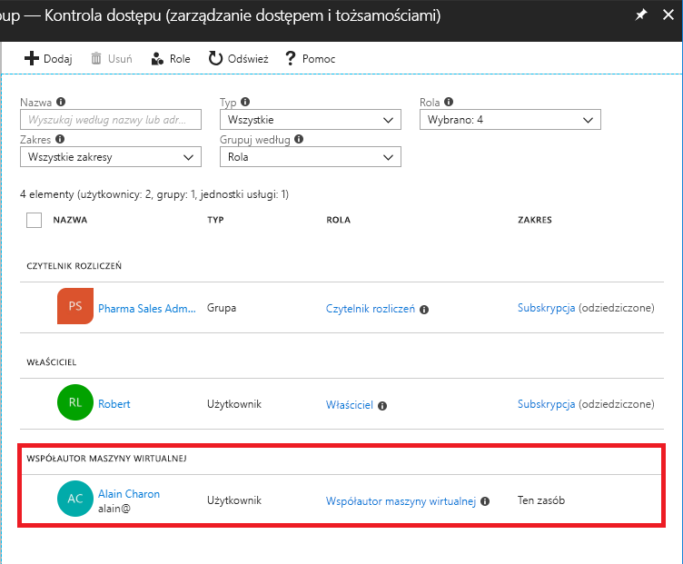
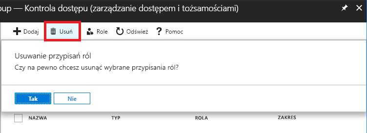
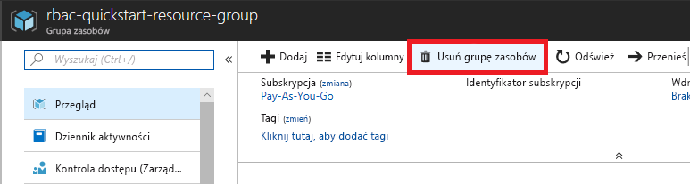

# Tutorial: Grant a user access to Azure resources using RBAC and the Azure portal

[Kontrola dostępu oparta na rolach (RBAC, Role Based Access Control)](overview.md) to sposób zarządzania dostępem do zasobów platformy Azure. W tym samouczku udzielisz użytkownikowi praw dostępu do tworzenia maszyn wirtualnych i zarządzania nimi w grupie zasobów.

Ten samouczek zawiera informacje na temat wykonywania następujących czynności:

> [!div class="checklist"]
> * Udzielanie dostępu użytkownikowi w zakresie grupy zasobów
> * Usuwanie dostępu

Jeśli nie masz subskrypcji platformy Azure, przed rozpoczęciem utwórz [bezpłatne konto](https://azure.microsoft.com/free/?WT.mc_id=A261C142F).

## Zaloguj się w usłudze Azure

Zaloguj się do witryny Azure Portal pod adresem https://portal.azure.com.

## Utwórz grupę zasobów

1. Na liście nawigacji kliknij pozycję **Grupy zasobów**.

1. Kliknij pozycję **Dodaj**, aby otworzyć blok **Grupa zasobów**.

   

1. W polu **Nazwa grupy zasobów** wprowadź nazwę **rbac-resource-group**.

1. Wybierz subskrypcję i lokalizację.

1. Kliknij pozycję **Utwórz**, aby utworzyć grupę zasobów.

1. Kliknij pozycję **Odśwież**, aby odświeżyć listę grup zasobów.

   Nowa grupa zasobów zostanie wyświetlona na liście grup zasobów.

   

## Udzielanie dostępu

Aby udzielić dostępu za pomocą kontroli dostępu opartej na rolach, tworzy się przypisanie roli.

1. Na liście **Grupy zasobów** kliknij nową grupę zasobów **rbac-resource-group**.

1. Kliknij pozycję **Kontrola dostępu (IAM)** .

1. Kliknij kartę **Przypisania ról**, aby wyświetlić bieżącą listę przypisań ról.

   

1. Kliknij pozycję **Dodaj** > **Dodaj przypisanie roli**, aby otworzyć okienko Dodawanie przypisania roli.

   Jeśli nie masz uprawnień do przypisywania ról, opcja Dodaj przypisanie roli będzie wyłączona.

   

   

1. Z listy rozwijanej **Rola** wybierz pozycję **Współautor·maszyny·wirtualnej**.

1. Z listy **Wybierz** wybierz siebie lub innego użytkownika.

1. Kliknij pozycję **Zapisz**, aby utworzyć przypisanie roli.

   Po kilku chwilach użytkownik zostanie przypisany do roli Współautor maszyny wirtualnej w zakresie grupy zasobów rbac-resource-group.

   

## Usuwanie dostępu

Aby usunąć dostęp za pomocą kontroli dostępu opartej na rolach, usuwa się przypisanie roli.

1. Na liście przypisań ról dodaj znacznik wyboru obok użytkownika z rolą Współautor maszyny wirtualnej.

1. Kliknij pozycję **Usuń**.

   

1. W wyświetlonym komunikacie dotyczącym usuwania przypisania roli wybierz pozycję **Tak**.

## Czyszczenie

1. Na liście nawigacji kliknij pozycję **Grupy zasobów**.

1. Kliknij pozycję **rbac-resource-group**, aby otworzyć grupę zasobów.

1. Kliknij pozycję **Usuń grupę zasobów**, aby usunąć grupę zasobów.

   

1. W bloku **Czy na pewno chcesz usunąć** wpisz nazwę grupy zasobów: **rbac-resource-group**.

1. Kliknij pozycję **Usuń**, aby usunąć grupę zasobów.

## Następne kroki

> [!div class="nextstepaction"]
> [Tutorial: Grant a user access to Azure resources using RBAC and Azure PowerShell](tutorial-role-assignments-user-powershell.md)
