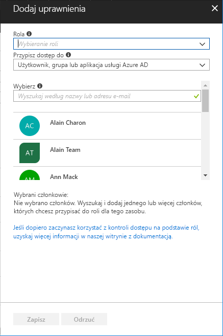

# Szybki start: udzielanie dostępu użytkownikowi za pomocą kontroli RBAC i witryny Azure Portal

Kontrola dostępu na podstawie ról (RBAC, Role Based Access Control) to sposób zarządzania dostępem do zasobów na platformie Azure. W tym przewodniku Szybki start udzielisz użytkownikowi praw dostępu do tworzenia maszyn wirtualnych i zarządzania nimi w grupie zasobów.

Jeśli nie masz subskrypcji platformy Azure, przed rozpoczęciem utwórz [bezpłatne konto](https://azure.microsoft.com/free/?WT.mc_id=A261C142F).

## Logowanie do platformy Azure

Zaloguj się do witryny Azure Portal pod adresem http://portal.azure.com.

## Tworzenie grupy zasobów

1. Na liście nawigacji wybierz pozycję **Grupy zasobów**.

1. Wybierz pozycję **Dodaj**, aby otworzyć blok **Grupa zasobów**.

   

1. W polu **Nazwa grupy zasobów** wprowadź ciąg **rbac-quickstart-resource-group**.

1. Wybierz subskrypcję i lokalizację.

1. Wybierz pozycję **Utwórz**, aby utworzyć grupę zasobów.

1. Wybierz pozycję **Odśwież**, aby odświeżyć listę grup zasobów.

   Nowa grupa zasobów zostanie wyświetlona na liście grup zasobów.

   

## Udzielanie dostępu

Aby udzielić dostępu za pomocą kontroli dostępu opartej na rolach, tworzy się przypisanie roli.

1. Na liście **grup zasobów** wybierz nową grupę zasobów **rbac-quickstart-resource-group**.

1. Wybierz pozycję **Kontrola dostępu (Zarządzanie dostępem i tożsamościami)**, aby wyświetlić bieżącą listę przypisań ról.

   

1. Wybierz pozycję **Dodaj**, aby otworzyć okienko **Dodaj uprawnienia**.

   Jeśli nie masz uprawnień do przypisywania ról, nie zobaczysz opcji **Dodaj**.

   

1. Z listy rozwijanej **Rola** wybierz pozycję **Współautor·maszyny·wirtualnej**.

1. Z listy **Wybierz** wybierz siebie lub innego użytkownika.

1. Wybierz pozycję **Zapisz**, aby utworzyć przypisanie roli.

   Po kilku chwilach użytkownik zostanie przypisany do roli Współautor maszyny wirtualnej w zakresie grupy zasobów rbac-quickstart-resource-group.

   

## Usuwanie dostępu

Aby usunąć dostęp za pomocą kontroli dostępu opartej na rolach, usuwa się przypisanie roli.

1. Na liście przypisań ról dodaj znacznik wyboru obok użytkownika z rolą Współautor maszyny wirtualnej.

1. Wybierz pozycję **Usuń**.

   

1. W komunikacie dotyczącym usuwania przypisania roli wybierz pozycję **Tak**.

## Czyszczenie

1. Na liście nawigacji wybierz pozycję **Grupy zasobów**.

1. Wybierz pozycję **rbac-quickstart-resource-group**, aby otworzyć grupę zasobów.

1. Wybierz pozycję **Usuń grupę zasobów**, aby usunąć grupę zasobów.

   

1. W bloku **Czy na pewno chcesz usunąć** wpisz nazwę grupy zasobów: **rbac-quickstart-resource-group**.

1. Wybierz pozycję **Usuń**, aby usunąć grupę zasobów.

## Następne kroki

> [!div class="nextstepaction"]
> [Samouczek: udzielanie dostępu użytkownikowi za pomocą kontroli RBAC i programu PowerShell](tutorial-role-assignments-user-powershell.md)

