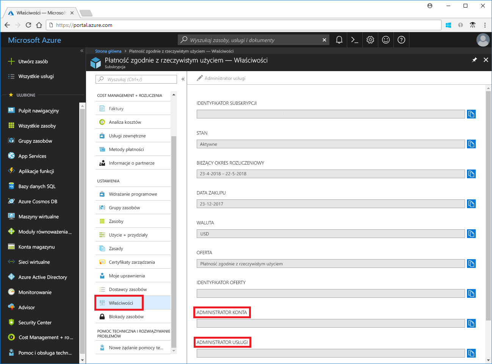
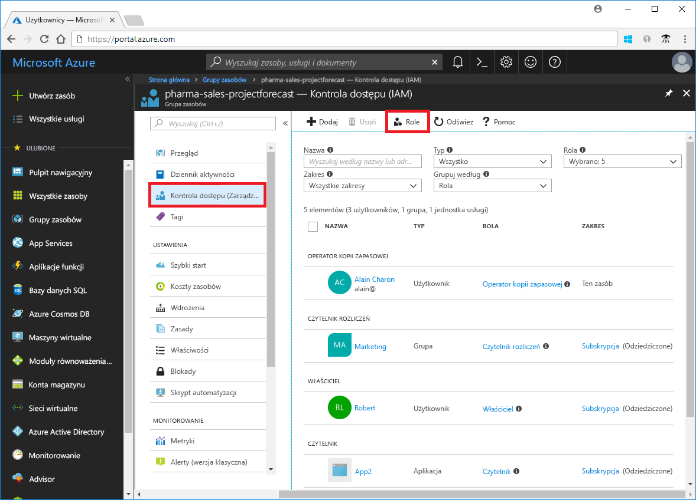
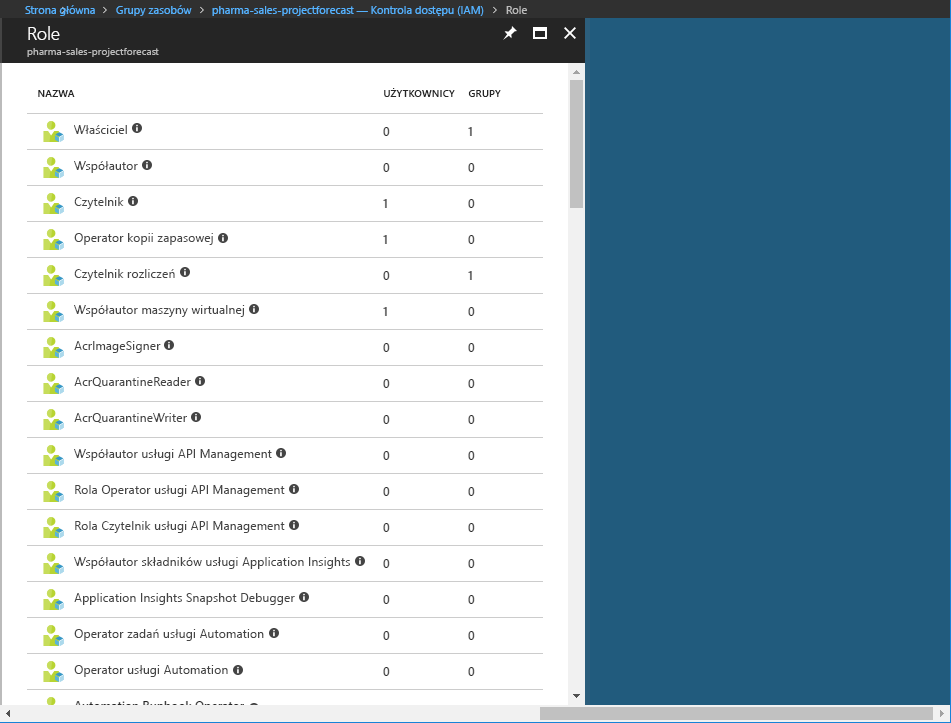

# Zrozumienie różnych ról na platformie Azure

Jeśli jesteś nowym użytkownikiem platformy Azure, może okazać się trudne do zrozumienia różnych ról na platformie Azure. W tym artykule zawarto wyjaśniono następujące role i zastosowania każdego:
- Klasyczni ról administratora
- Role kontroli dostępu opartej na rolach na platformie Azure
- Role administratora usługi Azure Active Directory (Azure AD)

## Jak role są powiązane

Aby lepiej zrozumieć ról na platformie Azure, warto wiedzieć, niektóre z historii. Gdy Azure pierwotnie został wydany, dostęp do zasobów było zarządzane przy użyciu trzech ról administratora: konto administratora, Administrator usługi i administratora współpracującego. Później kontrola dostępu oparta na rolach (RBAC) dla zasobów platformy Azure został dodany. Azure RBAC jest nowszy system autoryzacja oparta na [usługi Azure Resource Manager](../azure-resource-manager/resource-group-overview.md) która umożliwia szczegółowe zarządzanie dostępem do zasobów platformy Azure. RBAC zawiera wiele wbudowanych ról, można przypisać w różnych zakresach i pozwala na tworzenie własnych ról niestandardowych. Do zarządzania zasobami w usłudze Azure AD, takie jak użytkownikami, grupami i domenami, istnieje kilka ról administratora w usłudze Azure AD.

Poniższy diagram jest ogólny widok, w jaki sposób są powiązane klasyczni ról administratora, ról RBAC platformy Azure i role administratora usługi Azure AD.

## Klasyczni Administratorzy

Konto administratora, Administrator usługi i administratora współpracującego są trzy role administratora subskrypcji klasycznych na platformie Azure. Klasyczni Administratorzy mają pełny dostęp do subskrypcji platformy Azure. Mogą zarządzać zasobami przy użyciu witryny Azure portal, interfejsów API usługi Azure Resource Manager i Klasyczny model wdrażania interfejsów API. Konto, które jest używane do konta na platformie Azure zostanie automatycznie ustawione jako Administrator usługi i konta administratora. Następnie można dodać dodatkowych administratorów współpracujących. Administrator usługi Współadministratorów się równoważne dostępu użytkowników, którzy zostali przypisani do roli właściciel (rolę RBAC platformy Azure) w zakresie subskrypcji. W poniższej tabeli opisano różnice między te trzy role administracyjne klasyczni.

| Klasyczny administrator subskrypcji | Limit | Uprawnienia | Uwagi |
| --- | --- | --- | --- |
| Administrator konta | 1 na konto platformy Azure | <ul><li>Dostęp [Centrum konta platformy Azure](https://account.azure.com/Subscriptions)</li><li>Zarządzaj wszystkimi subskrypcjami na koncie usługi</li><li>Utwórz nowe subskrypcje</li><li>Anulowanie subskrypcji</li><li>Zmiany rozliczeń dla subskrypcji</li><li>Zmiana administratora usługi</li></ul> | Model rozliczeń właściciela subskrypcji.|
| Administrator usługi | 1 na subskrypcję platformy Azure | <ul><li>Zarządzanie usługami w [witryny Azure portal](https://portal.azure.com)</li><li>Przypisywanie użytkowników do roli Współadministratora</li></ul> | Domyślnie, aby uzyskać nową subskrypcję Administrator konta jest również administratorem usługi. Administrator usługi ma równoważne dostępu użytkownika, któremu przypisano rolę właściciela w zakresie subskrypcji. |
| Administrator współpracujący | 200 na subskrypcję | <ul><li>Takie same poziomy dostępu jak Administrator usługi, ale nie zmieniać skojarzenia subskrypcji z katalogami platformy Azure</li><li>Przypisywanie użytkowników do roli administratora współpracującego, ale nie można zmienić administratora usługi</li></ul> | Administrator współpracujący ma równoważne dostępu użytkownika, któremu przypisano rolę właściciela w zakresie subskrypcji. |

W witrynie Azure portal można zobaczyć, kto jest przydzielony do administratora konta i Administrator usługi, wyświetlając właściwości subskrypcji.

Aby uzyskać informacje o tym, jak dodać lub zmienić administratorów subskrypcji, zobacz [Administratorzy subskrypcji platformy Azure Dodaj lub zmień](../billing/billing-add-change-azure-subscription-administrator.md) w dokumentacji rozliczeń platformy Azure.

### Konto platformy Azure i subskrypcji platformy Azure

Konto platformy Azure reprezentuje relację rozliczeń. Konto platformy Azure jest tożsamość użytkownika, co najmniej jedną subskrypcję platformy Azure i skojarzony zestaw zasobów platformy Azure. Osoba, która tworzy to konto jest administratorem konta dla wszystkich subskrypcji, utworzone w ramach tego konta. Osoba ta jest również domyślnego administratora usługi dla subskrypcji.

Subskrypcje platformy Azure umożliwiają konfigurowanie dostępu do zasobów platformy Azure. Subskrypcje te ułatwiają również zarządzanie raportowaniem i rozliczaniem użycia zasobów oraz regulowaniem płatności za to użycie. Każda subskrypcja może mieć różne ustawienia rozliczeń i płatności, aby mogły być różnych subskrypcji i planów dostosowanych do pakietu office, działów, projektów i tak dalej. Do każdej usługi, należy do subskrypcji i identyfikator subskrypcji może być wymagane dla operacji programistyczny.

Konta i subskrypcje, które są zarządzane w [Centrum konta platformy Azure](https://account.azure.com/Subscriptions).
## Ról RBAC platformy Azure

RBAC platformy Azure to system, który umożliwia szczegółowe zarządzanie dostępem do zasobów platformy Azure, takich jak zasoby obliczeniowe i magazyn. RBAC platformy Azure obejmuje ponad 60 wbudowanych ról. Istnieją cztery podstawowe role RBAC. Pierwsze trzy mają zastosowanie do wszystkich typów zasobów:

| Rola RBAC na platformie Azure | Uprawnienia | Uwagi |
| --- | --- | --- |
| [Właściciel](built-in-roles.md#owner) | <ul><li>Pełny dostęp do wszystkich zasobów</li><li>Delegowanie dostępu do innych osób</li></ul> | Administrator usługi i Współadministratorzy są przypisaną rolę właściciela w zakresie subskrypcji Dotyczy to wszystkich typów zasobów. |
| [Współautor](built-in-roles.md#contributor) | <ul><li>Tworzenie i zarządzanie nimi, wszystkie typy zasobów platformy Azure</li><li>Nie może przyznawać dostępu innym osobom</li></ul> | Dotyczy to wszystkich typów zasobów. |
| [Czytelnik](built-in-roles.md#reader) | <ul><li>Wyświetlanie zasobów platformy Azure</li></ul> | Dotyczy to wszystkich typów zasobów. |
| [Administrator dostępu użytkowników](built-in-roles.md#user-access-administrator) | <ul><li>Zarządzanie dostępem użytkowników do zasobów platformy Azure</li></ul> |  |

Pozostała część wbudowanych ról umożliwiają zarządzanie określonych zasobów platformy Azure. Na przykład [Współautor maszyny wirtualnej](built-in-roles.md#virtual-machine-contributor) rola pozwala użytkownikowi na tworzenie i zarządzanie maszynami wirtualnymi. Aby uzyskać listę wbudowanych ról, zobacz [wbudowane role](built-in-roles.md).

Tylko w witrynie Azure portal i interfejsów API usługi Azure Resource Manager obsługuje RBAC. Nie można użyć użytkownikom, grupom i aplikacjom, które są przypisane role RBAC [klasycznego modelu wdrażania platformy interfejsów API](../azure-resource-manager/resource-manager-deployment-model.md).

W witrynie Azure portal, przypisania roli przy użyciu funkcji RBAC są wyświetlane w **kontrola dostępu (IAM)** bloku. Ten blok można znaleźć w portalu, np. subskrypcji, grupy zasobów i różnych zasobów.

Po kliknięciu **role** opcji, zostanie wyświetlony na liście ról wbudowanych i niestandardowych.

## Role administratora usługi Azure AD

Administrator usługi Azure AD, które role są używane do zarządzania zasobami usługi Azure AD w katalogu, takimi jak utworzyć lub edytować użytkowników, przypisywać role administracyjne innym osobom, resetować hasła użytkowników, zarządzać licencjami użytkowników i zarządzać domenami. W poniższej tabeli opisano kilka ważniejsze role administratora usługi Azure AD.

| Rola administratora w usłudze Azure AD | Uprawnienia | Uwagi |
| --- | --- | --- |
| [Administrator globalny](../active-directory/active-directory-assign-admin-roles-azure-portal.md#company-administrator) | <ul><li>Zarządzanie dostępem do wszystkich funkcji administracyjnych w usłudze Azure Active Directory, a także usług, które Federację z usługą Azure Active Directory</li><li>Przypisywanie ról administratorów do innych osób</li><li>Resetowanie hasła dla wszystkich użytkowników oraz wszystkich innych administratorów</li></ul> | Osoba, która zarejestruje się dla dzierżawy usługi Azure Active Directory staje się administratorem globalnym. |
| [Administrator użytkowników](../active-directory/active-directory-assign-admin-roles-azure-portal.md#user-account-administrator) | <ul><li>Tworzenie i zarządzać wszystkimi aspektami użytkowników i grup</li><li>Zarządzanie biletami pomocy technicznej</li><li>Monitorowanie kondycji usługi</li><li>Zmienianie haseł dla użytkowników, administratorów pomocy i Administratorzy innych użytkowników</li></ul> |  |
| [Administrator pomocy technicznej](../active-directory/active-directory-assign-admin-roles-azure-portal.md#helpdesk-administrator) | <ul><li>Zmienianie haseł dla użytkowników i innych administratorów pomocy technicznej</li><li>Zarządzanie żądaniami obsługi</li><li>Monitorowanie kondycji usługi</li></ul> |  |
| [Administrator rozliczeń](../active-directory/active-directory-assign-admin-roles-azure-portal.md#billing-administrator) | <ul><li>Dokonywanie zakupów</li><li>Zarządzanie subskrypcjami</li><li>Zarządzanie biletami pomocy technicznej</li><li>Monitory kondycji usługi</li></ul> |  |

Aby uzyskać listę wszystkich ról administratora usługi Azure AD, zobacz [przypisywanie ról administratorów w usłudze Azure Active Directory](/azure/active-directory/active-directory-assign-admin-roles-azure-portal).

W witrynie Azure portal można przypisać role administratora usługi Azure AD w **usługi Azure Active Directory** bloku.

## Różnice między ról RBAC platformy Azure i role administratora usługi Azure AD

Na wysokim poziomie ról RBAC platformy Azure, kontrolować uprawnienia do zarządzania zasobami platformy Azure, gdy role administratora usługi Azure AD, kontrolować uprawnienia do zarządzania zasobami usługi Azure Active Directory. W poniższej tabeli porównano niektóre różnice.

| Ról RBAC platformy Azure | Role administratora usługi Azure AD |
| --- | --- |
| Zarządzanie dostępem do zasobów platformy Azure | Zarządzanie dostępem do zasobów usługi Azure Active Directory |
| Obsługuje role niestandardowe | Nie można tworzyć własne role |
| Można określić zakres na wielu poziomach (grupy zarządzania, subskrypcji, grupy zasobów, zasobów) | Zakres jest na poziomie dzierżawy |
| Informacje o rolach można uzyskać w witrynie Azure portal, interfejsu wiersza polecenia platformy Azure, programu Azure PowerShell, szablony usługi Azure Resource Manager, interfejsu API REST | Informacje o rolach można uzyskać w portalu administracyjnego platformy Azure do administratora portalu usługi Office 365, Microsoft Graph AzureAD PowerShell |

### Czy ról RBAC platformy Azure i role administratora usługi Azure AD nakładają się na siebie?

Domyślnie ról RBAC platformy Azure i role administratora usługi Azure AD nie obejmują platformy Azure i usługi Azure AD. Jednak jeśli Administrator globalny skutkująca podniesieniem uprawnień dostępu, wybierając **Administrator globalny może zarządzać subskrypcjami platformy Azure i grup zarządzania** przełączyć się w witrynie Azure portal zostanie udzielony administratora globalnego [ Administrator dostępu użytkowników](built-in-roles.md#user-access-administrator) roli (rola RBAC) na wszystkie subskrypcje dla określonej dzierżawy. Rola Administrator dostępu użytkowników umożliwia użytkownikowi udzielać innym użytkownikom dostępu do zasobów platformy Azure. Ten przełącznik może być przydatne odzyskać dostęp do subskrypcji. Aby uzyskać więcej informacji, zobacz [podniesienie poziomu dostępu jako administrator usługi Azure AD](elevate-access-global-admin.md).

Kilka zakres role administratora usługi Azure AD usługi Azure AD i Microsoft Office 365, takich jak role administratora globalnego i administratora użytkowników. Na przykład jeśli jesteś członkiem roli administratora globalnego, masz możliwości administratora globalnego w usłudze Azure AD i Office 365, takich jak tworzenie zmiany programu Microsoft Exchange i Microsoft SharePoint. Jednak domyślnie przez administratora globalnego nie ma dostępu do zasobów platformy Azure.

## Następne kroki

- [Co to jest kontrola dostępu oparta na rolach (RBAC)?](overview.md)
- [Przypisywanie ról administratorów w usłudze Azure Active Directory](/azure/active-directory/active-directory-assign-admin-roles-azure-portal)
- [Dodawanie lub zmienianie Administratorzy subskrypcji platformy Azure](/azure/billing/billing-add-change-azure-subscription-administrator)
