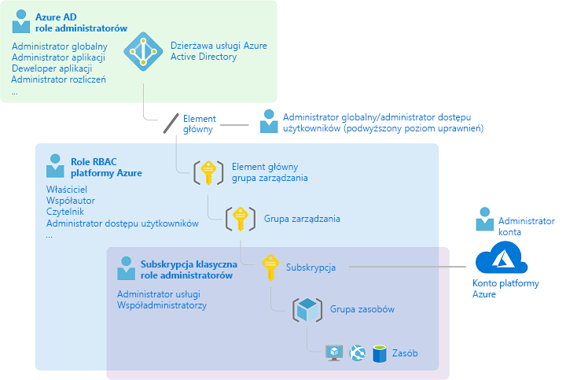
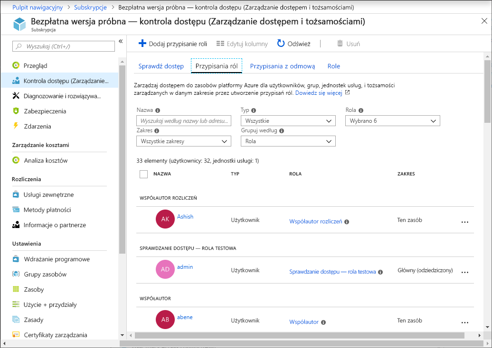
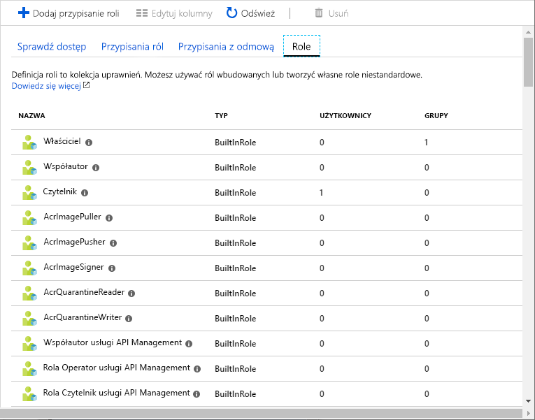
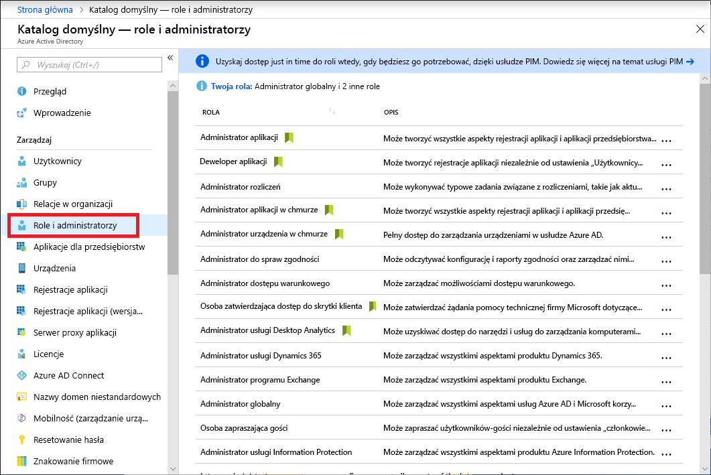
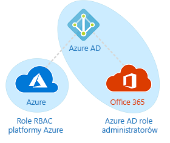

# Role klasycznego administratora subskrypcji, role kontroli na podstawie ról (RBAC) platformy Azure i role administratora usługi Azure AD

Jeśli dopiero zaczynasz korzystać z platformy Azure, zrozumienie poszczególnych ról może sprawiać pewne trudności. W tym artykule wyjaśniono następujące role i możliwości ich zastosowania:
- Role klasycznego administratora subskrypcji
- Role kontroli dostępu opartej na rolach (RBAC) platformy Azure
- Role administratora usługi Azure Active Directory (Azure AD)

## Jak role są powiązane ze sobą

Aby lepiej zrozumieć, na czym polegają role dostępne na platformie Azure, warto sięgnąć pamięcią nieco wstecz. W początkowej wersji platformy Azure dostępem do zasobów można było zarządzać przy użyciu trzech ról administratora: administratora konta, administratora usługi i współadministratora. Później dodano kontrolę dostępu opartą na rolach (RBAC) na potrzeby zasobów platformy Azure. Kontrola RBAC platformy Azure to nowszy system autoryzacji umożliwiający szczegółowe zarządzanie dostępem do zasobów platformy Azure. System RBAC zawiera wiele wbudowanych ról, może być przypisany do różnych zakresów i pozwala na tworzenie własnych ról niestandardowych. Do zarządzania zasobami w usłudze Azure AD, takimi jak użytkownicy, grupy i domeny, służy kilka ról administratora w usłudze Azure AD.

Poniższy diagram przedstawia w uproszczeniu powiązania między rolami klasycznego administratora subskrypcji, rolami RBAC platformy Azure i rolami administratora usługi Azure AD.

## Role klasycznego administratora subskrypcji

Administrator konta, administrator usługi i współadministrator to trzy role klasycznego administratora subskrypcji na platformie Azure. Klasyczni administratorzy subskrypcji mają pełny dostęp do subskrypcji platformy Azure. Mogą zarządzać zasobami przy użyciu witryny Azure Portal, interfejsów API usługi Azure Resource Manager i interfejsów API klasycznego modelu wdrożenia. Konto używane do rejestracji na platformie Azure zostanie automatycznie przypisane do administratora konta i administratora usługi. Następnie można dodać dodatkowych współadministratorów. Administrator usługi i współadministratorzy mają takie same uprawnienia dostępu, co użytkownicy, którzy zostali przypisani do roli właściciela (rola RBAC platformy Azure) w zakresie subskrypcji. Poniższa tabela zawiera różnice między tymi trzema klasycznymi rolami administracyjnymi subskrypcji.

| Klasyczny administrator subskrypcji | Limit | Uprawnienia | Uwagi |
| --- | --- | --- | --- |
| Administrator konta | 1 na konto platformy Azure | <ul><li>Dostęp do [Centrum konta platformy Azure](https://account.azure.com/Subscriptions)</li><li>Zarządzanie wszystkimi subskrypcjami na koncie</li><li>Tworzenie nowych subskrypcji</li><li>Anulowanie subskrypcji</li><li>Zmienianie rozliczeń dla subskrypcji</li><li>Zmienianie administratora usługi</li></ul> | Równoważny właścicielowi modelu rozliczania subskrypcji. Administrator konta nie ma dostępu do witryny Azure Portal. |
| Administrator usługi | 1 na subskrypcję platformy Azure | <ul><li>Zarządzanie usługami w [witrynie Azure Portal](https://portal.azure.com)</li><li>Anuluj subskrypcję</li><li>Przypisywanie użytkowników do roli współadministratora</li></ul> | W przypadku nowych subskrypcji administrator konta jest również domyślnie administratorem usługi. Administrator usługi ma takie same uprawnienia dostępu co użytkownik, któremu przypisano rolę właściciela w zakresie subskrypcji. Administrator usługi ma pełny dostęp do witryny Azure Portal. |
| Współadministrator | 200 na subskrypcję | <ul><li>Takie same uprawnienia dostępu jak administrator usługi, ale bez możliwości zmiany skojarzenia subskrypcji do katalogów platformy Azure</li><li>Przypisywanie użytkowników do roli współadministratora, ale bez możliwości zmiany administratora usługi</li></ul> | Współadministrator ma takie same uprawnienia dostępu co użytkownik, któremu przypisano rolę właściciela w zakresie subskrypcji. |

W witrynie Azure Portal można zarządzać współadministratorami lub wyświetlać administratora usługi za pomocą karty **Klasyczni administratorzy**.

W witrynie Azure Portal możesz wyświetlić lub zmienić administratora usługi albo wyświetlić administratora konta w bloku właściwości Twojej subskrypcji.

Aby uzyskać więcej informacji, zobacz [Klasyczni administratorzy subskrypcji platformy Azure](classic-administrators.md).

### Konto platformy Azure i subskrypcje platformy Azure

Konto platformy Azure reprezentuje relację rozliczeniową. Konto platformy Azure składa się z tożsamości użytkownika, co najmniej jednej subskrypcji platformy Azure oraz ze skojarzonego zestawu zasobów platformy Azure. Osoba, która tworzy konto, jest jego administratorem dla wszystkich subskrypcji utworzonych w ramach tego konta. Osoba ta jest również domyślnym administratorem usługi dla subskrypcji.

Subskrypcje platformy Azure pozwalają organizować dostęp do zasobów platformy Azure. Subskrypcje te ułatwiają również zarządzanie raportowaniem i rozliczaniem użycia zasobów oraz regulowaniem płatności za to użycie. Poszczególne subskrypcje mogą mieć różne ustawienia rozliczeń i płatności, co pozwala na korzystanie z wielu subskrypcji i planów dostosowanych do potrzeb konkretnych biur, działów, projektów itp. Każda usługa należy do subskrypcji, a identyfikator subskrypcji może być wymagany podczas wykonywania operacji programistycznych.

Każda subskrypcja jest skojarzona z katalogiem usługi Azure AD. Aby znaleźć katalog, z którym jest skojarzona subskrypcja, Otwórz pozycję **subskrypcje** w Azure Portal a następnie wybierz subskrypcję, aby wyświetlić katalog.

Konta i subskrypcje są zarządzane w [Centrum konta platformy Azure](https://account.azure.com/Subscriptions).

## Role RBAC platformy Azure

Kontrola dostępu oparta na rolach (RBAC) platformy Azure stanowi system autoryzacji oparty na usłudze [Azure Resource Manager](../azure-resource-manager/management/overview.md), umożliwiający szczegółowe zarządzanie dostępem do zasobów platformy Azure, takich jak zasoby obliczeniowe i magazynowe. Kontrola RBAC platformy Azure obejmuje ponad 70 wbudowanych ról. Istnieją cztery podstawowe role RBAC. Pierwsze trzy mają zastosowanie do wszystkich typów zasobów:

| Rola RBAC platformy Azure | Uprawnienia | Uwagi |
| --- | --- | --- |
| [Właściciel](built-in-roles.md#owner) | <ul><li>Pełny dostęp do wszystkich zasobów</li><li>Delegowanie dostępu do innych osób</li></ul> | Do administratora usługi i współadministratorów jest przypisana rola właściciela w zakresie subskrypcji Dotyczy wszystkich typów zasobów. |
| [Współautor](built-in-roles.md#contributor) | <ul><li>Tworzenie wszystkich typów zasobów platformy Azure i zarządzanie nimi</li><li>Brak możliwości przyznawania dostępu innym osobom</li></ul> | Dotyczy wszystkich typów zasobów. |
| [Czytelnik](built-in-roles.md#reader) | <ul><li>Wyświetlanie zasobów platformy Azure</li></ul> | Dotyczy wszystkich typów zasobów. |
| [Administrator dostępu użytkowników](built-in-roles.md#user-access-administrator) | <ul><li>Zarządzanie dostępem użytkowników do zasobów platformy Azure</li></ul> |  |

Pozostałe role wbudowane umożliwiają zarządzanie określonymi zasobami platformy Azure. Na przykład rola [współautora maszyny wirtualnej](built-in-roles.md#virtual-machine-contributor) pozwala użytkownikom na tworzenie maszyn wirtualnych i zarządzanie nimi. Aby uzyskać listę wbudowanych ról, zobacz [Wbudowane role dla zasobów platformy Azure](built-in-roles.md).

Tylko witryna Azure Portal i interfejsy API usługi Azure Resource Manager obsługują kontrolę RBAC. Użytkownicy, grupy i aplikacje, którym zostały przypisane role RBAC, nie mogą używać [interfejsów API klasycznego modelu wdrażania platformy Azure](../azure-resource-manager/resource-manager-deployment-model.md).

W witrynie Azure Portal przypisania ról dokonane przy użyciu kontroli dostępu opartej na rolach pojawiają się w bloku **Zarządzanie dostępem i tożsamościami (IAM)** . Ten blok można znaleźć w portalu, takich jak grupy zarządzania, subskrypcje, grupy zasobów i różne zasoby.

Po kliknięciu karty **Role** zostanie wyświetlona lista wbudowanych i niestandardowych ról.

Aby uzyskać więcej informacji, zobacz [Zarządzanie dostępem do zasobów platformy Azure przy użyciu kontroli dostępu opartej na rolach i witryny Azure Portal](role-assignments-portal.md).

## i role administratora usługi Azure AD

Role administratora usługi Azure AD służą do zarządzania zasobami usługi Azure AD w katalogu, takimi jak tworzenie lub edytowanie użytkowników, przypisywanie ról administracyjnych innym osobom, resetowanie haseł użytkowników, zarządzanie licencjami użytkowników i zarządzanie domenami. W poniższej tabeli opisano kilka najważniejszych ról administratora usługi Azure AD.

| Rola administratora usługi Azure AD | Uprawnienia | Uwagi |
| --- | --- | --- |
| [Administrator globalny](../active-directory/users-groups-roles/directory-assign-admin-roles.md#company-administrator-permissions) | <ul><li>Zarządzanie dostępem do wszystkich funkcji administracyjnych w usłudze Azure Active Directory, a także usług, które są sfederowane z usługą Azure Active Directory</li><li>Przypisywanie ról administratorów do innych osób</li><li>Resetowanie haseł wszystkich użytkowników oraz wszystkich innych administratorów</li></ul> | Osoba, która zarejestruje się dla dzierżawy usługi Azure Active Directory, staje się administratorem globalnym. |
| [Administrator użytkowników](../active-directory/users-groups-roles/directory-assign-admin-roles.md#user-administrator) | <ul><li>Tworzenie i zarządzanie wszystkimi aspektami użytkowników i grup</li><li>Zarządzanie biletami pomocy technicznej</li><li>Monitorowanie kondycji usługi</li><li>Zmienianie haseł użytkowników, administratorów pomocy technicznej i innych administratorów użytkowników</li></ul> |  |
| [Administrator rozliczeń](../active-directory/users-groups-roles/directory-assign-admin-roles.md#billing-administrator) | <ul><li>Dokonywanie zakupów</li><li>Zarządzanie subskrypcjami</li><li>Zarządzanie biletami pomocy technicznej</li><li>Monitorowanie kondycji usługi</li></ul> |  |

Listę ról administratora usługi Azure AD można wyświetlić w bloku **Role i administratorzy** witryny Azure Portal. Aby uzyskać listę wszystkich ról administratora usługi Azure AD, zobacz [Uprawnienia ról administratorów w usłudze Azure Active Directory](../active-directory/users-groups-roles/directory-assign-admin-roles.md).

## Różnice między rolami RBAC platformy Azure i rolami administratora usługi Azure AD

Na wysokim poziomie role RBAC platformy Azure kontrolują uprawnienia do zarządzania zasobami platformy Azure, natomiast role administratora usługi Azure AD kontrolują uprawnienia do zarządzania zasobami usługi Azure Active Directory. W poniższej tabeli porównano niektóre różnice.

| Role RBAC platformy Azure | i role administratora usługi Azure AD |
| --- | --- |
| Zarządzanie dostępem do zasobów platformy Azure | Zarządzanie dostępem do zasobów usługi Azure Active Directory |
| Obsługa ról niestandardowych | Obsługa ról niestandardowych |
| Możliwość określenia zakresu na wielu poziomach (grupa zarządzania, subskrypcja, grupa zasobów, zasób) | Zakres znajduje się na poziomie dzierżawy |
| Informacje o rolach można uzyskać w witrynie Azure Portal, interfejsie wiersza polecenia platformy Azure, programie Azure PowerShell, szablonach usługi Azure Resource Manager, interfejsie API REST | Dostęp do informacji o rolach można uzyskać w portalu administracyjnym platformy Azure, Microsoft 365 centrum administracyjnym, Microsoft Graph, AzureAD PowerShell |

### Czy role RBAC platformy Azure i role administratora usługi Azure AD nakładają się na siebie?

Domyślnie role RBAC platformy Azure i role administratora usługi Azure AD nie wykraczają poza platformę Azure i usługę Azure AD. Jeśli jednak administrator globalny podniesie ich uprawnienia dostępu, wybierając przełącznik **Administrator globalny może zarządzać subskrypcjami platformy Azure i grupami zarządzania** w witrynie Azure Portal, administratorowi globalnemu zostanie przyznana rola [administratora dostępu użytkowników](built-in-roles.md#user-access-administrator) (rola RBAC) na poziomie wszystkich subskrypcji dla określonej dzierżawy. Rola administratora dostępu użytkowników pozwala użytkownikom udzielać innym użytkownikom dostępu do zasobów platformy Azure. Ten przełącznik może być przydatny w odzyskaniu dostępu do subskrypcji. Aby uzyskać więcej informacji, zobacz [Elevate access as an Azure AD administrator (Podniesienie poziomu dostępu jako administratora usługi Azure AD)](elevate-access-global-admin.md).

Kilka ról administratora usługi Azure AD występuje zarówno w usłudze Azure AD, jak i Microsoft Office 365, m.in. role administratora globalnego i administratora użytkowników. Jeśli na przykład należysz do roli administratora globalnego, masz możliwości administratora globalnego w usłudze Azure AD oraz w usłudze Office 365 i możesz m.in. dokonywać zmian w programach Microsoft Exchange i Microsoft SharePoint. Jednak domyślnie administrator globalny nie ma dostępu do zasobów platformy Azure.

## Następne kroki

- [Co to jest kontrola dostępu oparta na rolach (RBAC) dla zasobów platformy Azure?](overview.md)
- [Uprawnienia ról administratorów w usłudze Azure Active Directory](../active-directory/users-groups-roles/directory-assign-admin-roles.md)
- [Klasyczni administratorzy subskrypcji platformy Azure](classic-administrators.md)
