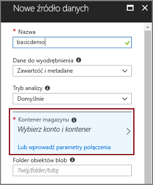
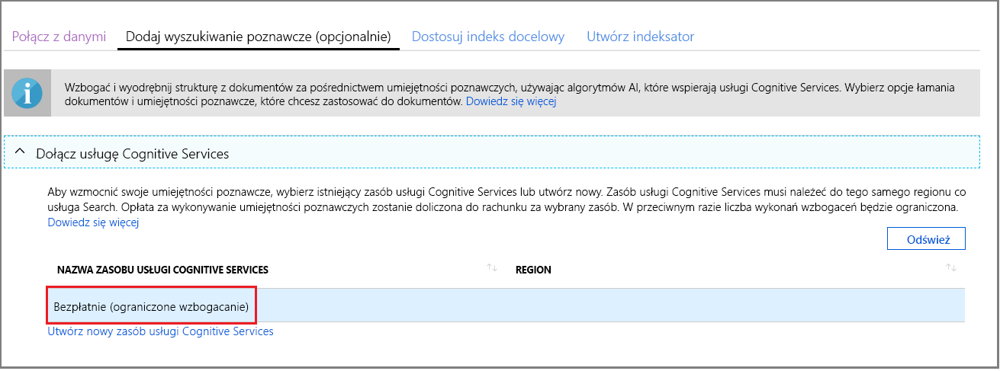
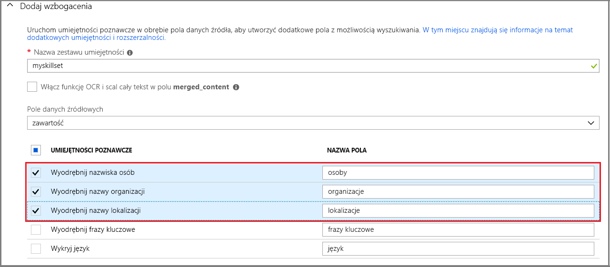
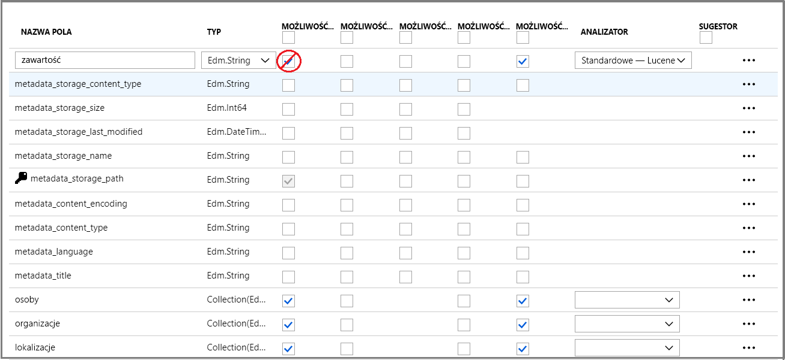
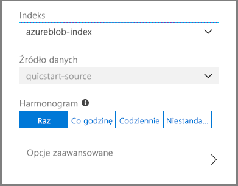
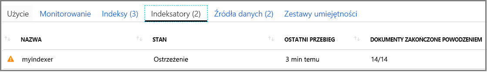

# Szybki Start: Tworzenie usługi Azure Wyszukiwanie poznawcze poznawcze zestawu umiejętności w Azure Portal

Zestawu umiejętności to funkcja AI, która wyodrębnia informacje i strukturę z dużych nierozróżnianych plików tekstowych lub obrazów, i umożliwia indeksowanie i wyszukiwanie kwerend wyszukiwania pełnotekstowego w usłudze Azure Wyszukiwanie poznawcze. 

W tym przewodniku szybki start utworzysz usługi i dane w chmurze platformy Azure, aby utworzyć zestawu umiejętności. Gdy wszystko będzie na miejscu, uruchom kreatora **importowania danych** w portalu, aby ściągnąć wszystkie te elementy. Wynik końcowy to indeks z możliwością wyszukiwania, wypełniony danymi utworzonymi przez przetwarzanie AI, które można badać w portalu ([Eksplorator wyszukiwania](search-explorer.md)).

Jeśli nie masz subskrypcji platformy Azure, przed rozpoczęciem utwórz [bezpłatne konto](https://azure.microsoft.com/free/?WT.mc_id=A261C142F).

## Tworzenie usług i ładowanie danych

Ten przewodnik Szybki Start używa platformy Azure Wyszukiwanie poznawcze, usługi Azure Blob Storage i [usługi azure Cognitive Services dla systemu](https://azure.microsoft.com/services/cognitive-services/) AI. 

Ze względu na to, że obciążenie jest małe, Cognitive Services jest wybierana w tle, aby zapewnić bezpłatne przetwarzanie do 20 transakcji codziennie w przypadku wywołania z usługi Azure Wyszukiwanie poznawcze. Jeśli używasz przykładowych danych, które udostępniamy, możesz pominąć tworzenie i dołączanie zasobów Cognitive Services.

1. [Pobierz przykładowe dane](https://1drv.ms/f/s!As7Oy81M_gVPa-LCb5lC_3hbS-4) składające się z małego zestawu plików różnych typów. Rozpakuj pliki.

1. [Utwórz konto usługi Azure Storage](https://docs.microsoft.com/azure/storage/common/storage-quickstart-create-account?tabs=azure-portal) lub [Znajdź istniejące konto](https://ms.portal.azure.com/#blade/HubsExtension/BrowseResourceBlade/resourceType/Microsoft.Storage%2storageAccounts/). 

   Wybierz ten sam region co usługa Azure Wyszukiwanie poznawcze. Wybierz typ konta StorageV2 (ogólnego przeznaczenia w wersji 2), jeśli chcesz wypróbować funkcję magazynu wiedzy później, w innym instruktażu. W przeciwnym razie wybierz dowolny typ.

1. Otwórz strony usługi BLOB Services i Utwórz kontener. Można użyć domyślnego poziomu dostępu publicznego. 

1. W kontenerze kliknij pozycję **Przekaż** , aby przekazać pliki przykładowe pobrane w pierwszym kroku. Należy zauważyć, że masz szeroką gamę typów zawartości, w tym obrazy i pliki aplikacji, które nie umożliwiają wyszukiwania pełnotekstowego w ich formatach natywnych.

   

1. [Utwórz usługę Azure wyszukiwanie poznawcze](search-create-service-portal.md) lub [Znajdź istniejącą usługę](https://ms.portal.azure.com/#blade/HubsExtension/BrowseResourceBlade/resourceType/Microsoft.Search%2FsearchServices). Możesz użyć bezpłatnej usługi dla tego przewodnika Szybki Start.

<!-- 1. You are almost done with this resource, but before you leave these pages, use a link on the left navigation pane to open the **Access Keys** page. In many tutorials, especially those that use the REST API, you will need a connection string to retrieve data from Blob storage. A connection string looks similar to the following example: `DefaultEndpointsProtocol=https;AccountName=<YOUR-ACCOUNT-NAME>;AccountKey=<YOUR-ACCOUNT-KEY>;EndpointSuffix=core.windows.net` -->

Teraz można przystąpić do przenoszenia Kreatora importu danych.

## Uruchom Kreatora importowania danych

Na stronie Przegląd usługi wyszukiwania kliknij pozycję **Importuj dane** na pasku poleceń, aby skonfigurować wzbogacanie poznawcze w czterech krokach.

  

### Krok 1. Tworzenie źródła danych

1. W obszarze **Połącz z danymi**wybierz pozycję **Azure Blob Storage**, wybierz utworzone konto magazynu i kontener. Podaj nazwę źródła danych i użyj wartości domyślnych dla pozostałych ustawień. 

   

1. Przejdź do następnej strony.

### Krok 2. Dodawanie umiejętności poznawczych

Następnie Dodaj umiejętności poznawcze, aby wywoływać przetwarzanie języka naturalnego. Przykładowe dane składają się z 12 plików, więc w tym przewodniku szybki start wystarcza bezpłatny przydział 20 transakcji na Cognitive Services. Ponieważ nie używamy OCR, są zliczane, pęknięte i używane w tym procesie tylko pliki niebędące obrazami.

1. W tym przewodniku szybki start korzystamy z **bezpłatnego** zasobu Cognitive Services.

   

1. Rozwiń pozycję **Dodaj umiejętności** i wybierz umiejętności, które wykonują przetwarzanie w języku naturalnym. W ramach tego przewodnika Szybki start wybierz rozpoznawanie jednostek dla osób, organizacji i lokalizacji.

   

1. Zaakceptuj domyślne pole źródłowe: `content`. Może to wyglądać jak niewielki element docelowy, ale w przypadku obiektów blob platformy Azure pole `content` zawiera większość dokumentu obiektu BLOB (na przykład dokument programu Word lub talię programu PowerPoint), co sprawia, że jest to dobry kandydat.

1. Przejdź do następnej strony.

> [!NOTE]
> Umiejętności przetwarzania języka naturalnego pracują na zawartości tekstowej w przykładowym zestawie danych. Ponieważ nie wybrano żadnej opcji OCR, w tym przewodniku Szybki start pliki JPEG i PNG znalezione w przykładowym zestawie danych nie będą przetwarzane. 

### Krok 3. Konfigurowanie indeksu

Na platformie Azure Wyszukiwanie poznawcze indeks zawiera zawartość z możliwością wyszukiwania, a Kreator **importu danych** może zazwyczaj utworzyć schemat za pomocą próbkowania źródła danych. W tym kroku zapoznaj się z wygenerowanym schematem i ewentualnie Popraw wszystkie ustawienia. Poniżej znajduje się domyślny schemat utworzony dla demonstracyjnego zestawu danych obiektów BLOB.

W przypadku tego przewodnika Szybki start kreator wykonuje dobrą pracę, ustawiając rozsądne wartości domyślne: 

+ Nazwa domyślna to *azureblob-index* w przypadku tego źródła danych. 

+ Pola domyślne są oparte na pierwotnym polu danych źródłowych (`content`) oraz polach wyjściowych (`people`, `organizations`i `locations`) utworzonych przez umiejętności poznawcze. Domyślne typy danych są wnioskowane na podstawie próbkowania metadanych i danych.

+ Domyślny klucz dokumentu jest *metadata_storage_path* (wybrany, ponieważ pole zawiera unikatowe wartości).

+ Atrybuty domyślne tych pól to **Możliwość pobierania** i **Możliwość wyszukiwania**. Atrybut **Możliwość wyszukiwania** wskazuje, że pole może być przeszukiwane. Atrybut **Możliwość pobierania** oznacza, że może ono być zwracane w wynikach. W kreatorze przyjęto założenie, że chcesz, aby te pola oferowały możliwości pobierania i wyszukiwania, ponieważ zostały utworzone za pośrednictwem zestawu umiejętności.

  

Zwróć uwagę na przekreślenie i znak zapytania w atrybucie **Możliwość pobierania** obok pola `content`. W przypadku dokumentów obiektów blob z dużą ilością tekstu pole `content` zawiera większą część pliku, która może potencjalnie składać się z tysięcy wierszy. Jeśli musisz przekazać zawartość pliku do kodu klienta, upewnij się, że opcja **Możliwość pobierania** pozostanie wybrana. W przeciwnym razie rozważ wyczyszczenie tego atrybutu w elemencie `content`, jeśli wyodrębnione elementy (`people`, `organizations` i `locations`) są wystarczające dla Twoich celów.

Oznaczenie pola jako **Możliwość pobierania** nie oznacza, że pole *musi* znajdować się w wynikach wyszukiwania. Można precyzyjnie kontrolować wyniki wyszukiwania za pomocą parametru zapytania **$select** w celu wybrania pól do uwzględnienia. W przypadku pól zawierających dużo tekstu, takich jak `content`, parametr **$select** to rozwiązanie, które oferuje użytkownikom aplikacji łatwe w zarządzaniu wyniki wyszukiwania, gwarantując jednocześnie, że kod klienta ma dostęp do wszystkich wymaganych informacji za pośrednictwem atrybutu **Możliwość pobierania**.
  
Przejdź do następnej strony.

### Krok 4. Konfigurowanie indeksatora

Indeksator jest procesem wysokiego poziomu sterującym procesem indeksowania. Określa on nazwę źródła danych, docelowy indeks oraz częstotliwość wykonywania. Kreator **importu danych** tworzy kilka obiektów, a z nich jest zawsze indeksator, który można wielokrotnie uruchamiać.

1. Na stronie **indeksatora** można zaakceptować nazwę domyślną i kliknąć opcję harmonogramu **jednokrotnego** , aby natychmiast uruchomić ją. 

   

1. Kliknij przycisk **Prześlij**, aby utworzyć i od razu uruchomić indeksator.

## Monitorowanie stanu

Indeksowanie umiejętności poznawcze trwa dłużej niż typowe indeksowanie tekstowe. Aby monitorować postęp, przejdź do strony przegląd i kliknij pozycję **indeksatory** na środku strony.

Ostrzeżenie występuje, ponieważ pliki obrazów JPG i PNG znajdują się w źródle danych i pominięto umiejętność OCR z tego potoku. Zobaczysz również powiadomienia o obcięciu danych. Wyodrębnianie jest ograniczone do 32 000 znaków w warstwie Bezpłatna.

  

Indeksowanie i wzbogacenie może potrwać, dlatego na potrzeby wcześniejszej eksploracji zaleca się użycie mniejszych zestawów danych. 

W Azure Portal można także monitorować dziennik aktywności powiadomień dla łącza stanu **powiadomień wyszukiwanie poznawcze platformy Azure** . Wykonanie może potrwać kilka minut.

## Zapytanie w Eksploratorze wyszukiwania

Po utworzeniu indeksu możesz przesyłać zapytania, aby zwrócić dokumenty z indeksu. W portalu użyj **Eksploratora wyszukiwania**, aby uruchomić zapytania i wyświetlić wyniki. 

1. Na stronie pulpitu nawigacyjnego usługi wyszukiwania kliknij pozycję **Eksplorator wyszukiwania** na pasku poleceń.

1. Kliknij pozycję **Zmień indeks** u góry, aby wybrać utworzony indeks.

1. Wprowadź ciąg wyszukiwania, aby wykonać zapytanie względem indeksu, np. `search=Microsoft&searchFields=Organizations`.

Wyniki są zwracane w formacie JSON, który może zawierać wiele danych i być trudny do odczytania, szczególnie w przypadku dużych dokumentów pochodzących z obiektów blob platformy Azure. Jeśli nie można łatwo skanować wyników, wyszukaj dane w dokumentach za pomocą klawiszy CTRL+F. Dla tego zapytania możesz wyszukać określone terminy w zawartości JSON. 

Użycie klawiszy CTRL+F może również ułatwić określenie liczby dokumentów znajdujących się w danym zestawie wyników. Dla obiektów blob platformy Azure portal wybiera klucz „metadata_storage_path”, ponieważ każda wartość jest unikatowa dla dokumentu. Przy użyciu klawiszy CTRL+F wyszukaj ciąg „metadata_storage_path”, aby uzyskać liczbę dokumentów. 

  

## Wnioski

Po utworzeniu pierwszej zestawu umiejętności i zapoznaniu się z ważnymi pojęciami przydatnymi przy tworzeniu prototypów rozwiązania do wyszukiwania przy użyciu własnych danych.

Niektóre kluczowe założenia, które, mamy nadzieję, zostały wychwycone, obejmują zależności od źródeł danych platformy Azure. Zestawu umiejętności jest powiązany z indeksatorem, a Indeksatory są oparte na platformie Azure i dla źródła. Mimo że w tym przewodniku Szybki start jest używana usługa Azure Blob Storage, możliwe są inne źródła danych platformy Azure. Aby uzyskać więcej informacji, zobacz [indeksatory w usłudze Azure wyszukiwanie poznawcze](search-indexer-overview.md).

Innym ważnym pojęciem jest to, że umiejętności działają na polach danych wejściowych. W portalu należy wybrać pojedyncze pole źródłowe dla wszystkich umiejętności. W kodzie danymi wejściowymi mogą być inne pola lub dane wyjściowe nadrzędnej umiejętności.

Dane wyjściowe są kierowane do indeksu wyszukiwania i istnieje mapowanie między parami nazw-wartości utworzonymi podczas indeksowania i poszczególnych pól w indeksie. Wewnętrznie portal konfiguruje [adnotacje](cognitive-search-concept-annotations-syntax.md) i definiuje [zestaw umiejętności](cognitive-search-defining-skillset.md), ustanawiając kolejność operacji i ogólny przepływ. Te kroki są ukryte w portalu, ale po rozpoczęciu pisania kodu te koncepcje stają się istotne.

Na koniec nauczysz się, że można zweryfikować zawartość, badając indeks. Na końcu usługa Azure Wyszukiwanie poznawcze zapewnia indeks z możliwością wyszukiwania, który można badać przy użyciu [prostej](https://docs.microsoft.com/rest/api/searchservice/simple-query-syntax-in-azure-search) lub w [pełni rozszerzonej składni zapytania](https://docs.microsoft.com/rest/api/searchservice/lucene-query-syntax-in-azure-search). Indeks zawierający wzbogacone pola jest taki sam, jak każdy inny. Jeśli chcesz uwzględnić standardowe lub [Niestandardowe analizatory](search-analyzers.md), [Profile oceniania](https://docs.microsoft.com/rest/api/searchservice/add-scoring-profiles-to-a-search-index), [synonimy](search-synonyms.md), [filtry aspektowe](search-filters-facets.md), wyszukiwanie geograficzne lub dowolną inną funkcję wyszukiwanie poznawcze platformy Azure, możesz to zrobić.

## Oczyszczanie zasobów

Gdy pracujesz nad własną subskrypcją, dobrym pomysłem jest zakończenie projektu w celu ustalenia, czy nadal potrzebujesz utworzonych zasobów. Zasoby po lewej stronie mogą być kosztowne. Możesz usunąć zasoby pojedynczo lub usunąć grupę zasobów, aby usunąć cały zestaw zasobów.

Zasoby można znaleźć w portalu i zarządzać nimi za pomocą linku **wszystkie zasoby** lub **grupy zasobów** w okienku nawigacji po lewej stronie.

Jeśli używasz bezpłatnej usługi, pamiętaj, że masz ograniczone do trzech indeksów, indeksatorów i źródeł danych. Możesz usunąć poszczególne elementy w portalu, aby zachować limit. 

> [!Tip]
> Jeśli chcesz powtórzyć to ćwiczenie lub wypróbuj inny Przewodnik wzbogacania, Usuń indeksator w portalu. Usunięcie indeksatora resetuje bezpłatny dzienny licznik transakcji do zera na potrzeby przetwarzania Cognitive Services.

## Następne kroki

Umiejętności można utworzyć przy użyciu portalu, zestawu SDK platformy .NET lub interfejsu API REST. Aby dowiedzieć się więcej, wypróbuj interfejs API REST przy użyciu programu Poster i więcej przykładowych danych.

> [!div class="nextstepaction"]
> [Samouczek: Dodawanie struktury do "zawartości bez struktury" przy użyciu wzbogacania AI](cognitive-search-tutorial-blob.md)