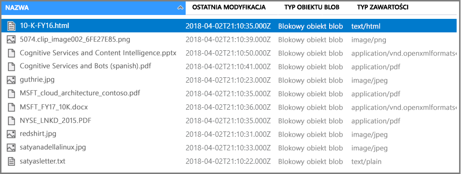

# <a name="tutorial-create-an-ai-enrichment-pipeline-using-rest-and-python"></a>Tutorial: Create an AI enrichment pipeline using REST and Python

In this tutorial, you learn the mechanics of programming data enrichment in Azure Cognitive Search using *cognitive skills*. Skills are backed by natural language processing (NLP) and image analysis capabilities in Cognitive Services. Through skillset composition and configuration, you can extract text and text representations of an image or scanned document file. You can also detect language, entities, key phrases, and more. The result is rich additional content in a search index, created with AI enrichments in an indexing pipeline. 

In this tutorial, you'll use Python to do the following tasks:

> [!div class="checklist"]
> * Utworzenie potoku indeksowania, który wzbogaca przykładowe dane w drodze do indeksu
> * Zastosowanie wbudowanych umiejętności: rozpoznawania jednostek, wykrywania języka, manipulacji tekstem i wyodrębniania fraz kluczowych
> * Poznanie sposobu łączenia umiejętności w łańcuch przez mapowanie danych wejściowych na dane wyjściowe w zestawie umiejętności
> * Wykonywanie żądań i przeglądanie wyników
> * Resetowanie indeksu i indeksatorów w celu kontynuowania opracowywania

Output is a full text searchable index on Azure Cognitive Search. Indeks możesz rozszerzyć za pomocą innych standardowych możliwości, takich jak [synonimy](search-synonyms.md), [profile oceniania](https://docs.microsoft.com/rest/api/searchservice/add-scoring-profiles-to-a-search-index), [analizatory](search-analyzers.md) i [filtry](search-filters.md). 

This tutorial runs on the Free service, but the number of free transactions is limited to 20 documents per day. If you want to run this tutorial more than once in the same day, use a smaller file set so that you can fit in more runs.

> [!NOTE]
> As you expand scope by increasing the frequency of processing, adding more documents, or adding more AI algorithms, you will need to [attach a billable Cognitive Services resource](cognitive-search-attach-cognitive-services.md). Charges accrue when calling APIs in Cognitive Services, and for image extraction as part of the document-cracking stage in Azure Cognitive Search. There are no charges for text extraction from documents.
>
> Execution of built-in skills is charged at the existing [Cognitive Services pay-as-you go price](https://azure.microsoft.com/pricing/details/cognitive-services/). Image extraction pricing is described on the [Azure Cognitive Search pricing page](https://go.microsoft.com/fwlink/?linkid=2042400).

Jeśli nie masz subskrypcji platformy Azure, przed rozpoczęciem utwórz [bezpłatne konto](https://azure.microsoft.com/free/?WT.mc_id=A261C142F).

## <a name="prerequisites"></a>Wymagania wstępne

The following services, tools, and data are used in this tutorial. 

+ [Create an Azure storage account](https://docs.microsoft.com/azure/storage/common/storage-quickstart-create-account) for storing the sample data. Make sure the storage account is in the same region as Azure Cognitive Search.

+ [Anaconda 3.x](https://www.anaconda.com/distribution/#download-section), providing Python 3.x and Jupyter Notebooks.

+ [Sample data](https://1drv.ms/f/s!As7Oy81M_gVPa-LCb5lC_3hbS-4) consists of a small file set of different types. 

+ [Create an Azure Cognitive Search service](search-create-service-portal.md) or [find an existing service](https://ms.portal.azure.com/#blade/HubsExtension/BrowseResourceBlade/resourceType/Microsoft.Search%2FsearchServices) under your current subscription. You can use a free service for this tutorial.

## <a name="get-a-key-and-url"></a>Get a key and URL

To interact with your Azure Cognitive Search service, you will need the service URL and an access key. A search service is created with both, so if you added Azure Cognitive Search to your subscription, follow these steps to get the necessary information:

1. [Sign in to the Azure portal](https://portal.azure.com/), and in your search service **Overview** page, get the URL. Przykładowy punkt końcowy może wyglądać podobnie jak `https://mydemo.search.windows.net`.

1. In **Settings** > **Keys**, get an admin key for full rights on the service. There are two interchangeable admin keys, provided for business continuity in case you need to roll one over. You can use either the primary or secondary key on requests for adding, modifying, and deleting objects.


All requests require an api-key on every request sent to your service. A valid key establishes trust, on a per request basis, between the application sending the request and the service that handles it.

## <a name="prepare-sample-data"></a>Prepare sample data

Potok wzbogacania ściąga dane ze źródeł danych platformy Azure. Source data must originate from a supported data source type of an [Azure Cognitive Search indexer](search-indexer-overview.md). Na potrzeby tego ćwiczenia będziemy korzystać z usługi Blob Storage, aby zaprezentować wiele typów zawartości.

1. [Sign in to the Azure portal](https://portal.azure.com), navigate to your Azure storage account, click **Blobs**, and then click **+ Container**.

1. [Create a Blob container](https://docs.microsoft.com/azure/storage/blobs/storage-quickstart-blobs-portal) to contain sample data. You can set the Public Access Level to any of its valid values.

1. After the container is created, open it and select **Upload** on the command bar to upload the sample files you downloaded in a previous step.

   

1. Po załadowaniu przykładowych plików uzyskaj nazwę kontenera i parametry połączenia dla usługi Blob Storage. Te dane są dostępne po przejściu do konta usługi Storage w witrynie Azure Portal. Click **Access keys**, and then copy the **Connection String**  field.

The connection string will have this format: `DefaultEndpointsProtocol=https;AccountName=<YOUR-STORAGE-ACCOUNT-NAME>;AccountKey=<YOUR-STORAGE-ACCOUNT-KEY>;EndpointSuffix=core.windows.net`

Keep the connection string handy. You will need it in a future step.

Istnieją inne sposoby określania parametrów połączenia, takie jak podanie sygnatury dostępu współdzielonego. Aby dowiedzieć się więcej na temat poświadczeń źródła danych, zobacz [Indeksowanie w usłudze Azure Blob Storage](search-howto-indexing-azure-blob-storage.md#Credentials).

## <a name="create-a-jupyter-notebook"></a>Tworzenie notesu Jupyter

> [!Note]
> This article shows you how to build a data source, index, indexer and skillset using a series of Python scripts. To download the complete notebook example, go to the [Azure-Search-python-samples repo](https://github.com/Azure-Samples/azure-search-python-samples/tree/master/Tutorial-AI-Enrichment-Jupyter-Notebook).

Use Anaconda Navigator to launch Jupyter Notebook and create a new Python 3 notebook.

## <a name="connect-to-azure-cognitive-search"></a>Connect to Azure Cognitive Search

In your notebook, run this script to load the libraries used for working with JSON and formulating HTTP requests.

```python
import json
import requests
from pprint import pprint
```

Next, define the names for the data source, index, indexer, and skillset. Run this script to set up the names for this tutorial.

```python
# Define the names for the data source, skillset, index and indexer
datasource_name = "cogsrch-py-datasource"
skillset_name = "cogsrch-py-skillset"
index_name = "cogsrch-py-index"
indexer_name = "cogsrch-py-indexer"
```

> [!Tip]
> On a free service, you are limited to three indexes, indexers, and data sources. W ramach tego samouczka tworzony jest jeden element każdego z tych typów. Make sure you have room to create new objects before going any further.

In the following script, replace the placeholders for your search service (YOUR-SEARCH-SERVICE-NAME) and admin API key (YOUR-ADMIN-API-KEY), and then run it to set up the search service endpoint.

```python
# Setup the endpoint
endpoint = 'https://<YOUR-SEARCH-SERVICE-NAME>.search.windows.net/'
headers = {'Content-Type': 'application/json',
           'api-key': '<YOUR-ADMIN-API-KEY>'}
params = {
    'api-version': '2019-05-06'
}
```

## <a name="create-a-data-source"></a>Tworzenie źródła danych

Teraz, gdy usługi i pliki źródłowe są gotowe, rozpocznij łączenie składników potoku indeksowania. Begin with a data source object that tells Azure Cognitive Search how to retrieve external source data.

In the following script, replace the placeholder YOUR-BLOB-RESOURCE-CONNECTION-STRING with the connection string for the blob you created in the previous step. Then, run the script to create a data source named `cogsrch-py-datasource`.

```python
# Create a data source
datasourceConnectionString = "<YOUR-BLOB-RESOURCE-CONNECTION-STRING>"
datasource_payload = {
    "name": datasource_name,
    "description": "Demo files to demonstrate cognitive search capabilities.",
    "type": "azureblob",
    "credentials": {
        "connectionString": datasourceConnectionString
    },
    "container": {
        "name": "basic-demo-data-pr"
    }
}
r = requests.put(endpoint + "/datasources/" + datasource_name,
                 data=json.dumps(datasource_payload), headers=headers, params=params)
print(r.status_code)
```

The request should return a status code of 201 confirming success.

In the Azure portal, on the search service dashboard page, verify that the cogsrch-py-datasource appears in the **Data sources** list. Click **Refresh** to update the page.


## <a name="create-a-skillset"></a>Tworzenie zestawu umiejętności

In this step, you will define a set of enrichment steps to apply to your data. Każdy krok wzbogacania to *umiejętność*, a zestaw kroków wzbogacenia to *zestaw umiejętności*. This tutorial uses [built-in cognitive skills](cognitive-search-predefined-skills.md) for the skillset:

+ [Wykrywanie języka](cognitive-search-skill-language-detection.md) — identyfikowanie języka zawartości.

+ [Dzielenie tekstu](cognitive-search-skill-textsplit.md) — dzielenie dużej zawartości na mniejsze fragmenty przed wywołaniem umiejętności wyodrębniania fraz kluczowych. Umiejętność wyodrębniania fraz kluczowych przyjmuje dane wejściowe składające się maksymalnie z 50 000 znaków. Kilka przykładowych plików należy podzielić, aby zmieścić się w tym limicie.

+ [Entity Recognition](cognitive-search-skill-entity-recognition.md) for extracting the names of organizations from content in the blob container.

+ [Wyodrębnianie kluczowych fraz](cognitive-search-skill-keyphrases.md) — określanie najczęściej występujących fraz kluczowych. 

### <a name="python-script"></a>Python script
Run the following script to create a skillset called `cogsrch-py-skillset`.

```python
# Create a skillset
skillset_payload = {
    "name": skillset_name,
    "description":
    "Extract entities, detect language and extract key-phrases",
    "skills":
    [
        {
            "@odata.type": "#Microsoft.Skills.Text.EntityRecognitionSkill",
            "categories": ["Organization"],
            "defaultLanguageCode": "en",
            "inputs": [
                {
                    "name": "text", "source": "/document/content"
                }
            ],
            "outputs": [
                {
                    "name": "organizations", "targetName": "organizations"
                }
            ]
        },
        {
            "@odata.type": "#Microsoft.Skills.Text.LanguageDetectionSkill",
            "inputs": [
                {
                    "name": "text", "source": "/document/content"
                }
            ],
            "outputs": [
                {
                    "name": "languageCode",
                    "targetName": "languageCode"
                }
            ]
        },
        {
            "@odata.type": "#Microsoft.Skills.Text.SplitSkill",
            "textSplitMode": "pages",
            "maximumPageLength": 4000,
            "inputs": [
                {
                    "name": "text",
                    "source": "/document/content"
                },
                {
                    "name": "languageCode",
                    "source": "/document/languageCode"
                }
            ],
            "outputs": [
                {
                    "name": "textItems",
                    "targetName": "pages"
                }
            ]
        },
        {
            "@odata.type": "#Microsoft.Skills.Text.KeyPhraseExtractionSkill",
            "context": "/document/pages/*",
            "inputs": [
                {
                    "name": "text", "source": "/document/pages/*"
                },
                {
                    "name": "languageCode", "source": "/document/languageCode"
                }
            ],
            "outputs": [
                {
                    "name": "keyPhrases",
                    "targetName": "keyPhrases"
                }
            ]
        }
    ]
}

r = requests.put(endpoint + "/skillsets/" + skillset_name,
                 data=json.dumps(skillset_payload), headers=headers, params=params)
print(r.status_code)
```

The request should return a status code of 201 confirming success.

The key phrase extraction skill is applied for each page. By setting the context to `"document/pages/*"`, you run this enricher for each member of the document/pages array (for each page in the document).

Każda umiejętność jest wykonywana dla zawartości dokumentu. During processing, Azure Cognitive Search cracks each document to read content from different file formats. Text found in the source file is placed into a `content` field, one for each document. Therefore, set the input as `"/document/content"`.

Graficzna reprezentacja zestawu umiejętności jest przedstawiona poniżej.


Outputs can be mapped to an index, used as input to a downstream skill, or both, as is the case with language code. W indeksie kod języka jest przydatny do filtrowania. Kod języka jest używany jako dane wejściowe przez umiejętności analizy tekstu w celu określenia zasad podziału wyrazów przez reguły językowe.

Aby uzyskać więcej podstawowych informacji na temat zestawów umiejętności, zobacz [Jak zdefiniować zestaw umiejętności](cognitive-search-defining-skillset.md).

## <a name="create-an-index"></a>Tworzenie indeksu

In this section, you define the index schema by specifying the fields to include in the searchable index, and setting the search attributes for each field. Pola mogą mieć typ i atrybuty, które określają sposób używania pola (z możliwością wyszukiwania, sortowania itp.). Nazwy pól w indeksie nie muszą dokładnie zgadzać się z nazwami pól w źródle. W kolejnym kroku są dodawane mapowania pól w indeksatorze w celu połączenia pól źródłowych z polami docelowymi. W tym kroku zdefiniuj indeks przy użyciu konwencji nazewnictwa pól właściwej dla aplikacji wyszukiwania.

W tym ćwiczeniu są używane następujące pola i typy pól:

| field-names: | id         | content   | languageCode | keyPhrases         | organizations     |
|--------------|----------|-------|----------|--------------------|-------------------|
| field-types: | Edm.String|Edm.String| Edm.String| List<Edm.String>  | List<Edm.String>  |

Run this script to create the index named `cogsrch-py-index`.

```python
# Create an index
index_payload = {
    "name": index_name,
    "fields": [
        {
            "name": "id",
            "type": "Edm.String",
            "key": "true",
            "searchable": "true",
            "filterable": "false",
            "facetable": "false",
            "sortable": "true"
        },
        {
            "name": "content",
            "type": "Edm.String",
            "sortable": "false",
            "searchable": "true",
            "filterable": "false",
            "facetable": "false"
        },
        {
            "name": "languageCode",
            "type": "Edm.String",
            "searchable": "true",
            "filterable": "false",
            "facetable": "false"
        },
        {
            "name": "keyPhrases",
            "type": "Collection(Edm.String)",
            "searchable": "true",
            "filterable": "false",
            "facetable": "false"
        },
        {
            "name": "organizations",
            "type": "Collection(Edm.String)",
            "searchable": "true",
            "sortable": "false",
            "filterable": "false",
            "facetable": "false"
        }
    ]
}

r = requests.put(endpoint + "/indexes/" + index_name,
                 data=json.dumps(index_payload), headers=headers, params=params)
print(r.status_code)
```

The request should return a status code of 201 confirming success.

To learn more about defining an index, see [Create Index (Azure Cognitive Search REST API)](https://docs.microsoft.com/rest/api/searchservice/create-index).

## <a name="create-an-indexer-map-fields-and-execute-transformations"></a>Tworzenie indeksatora, mapowanie pól i wykonywanie przekształceń

So far, you have created a data source, a skillset, and an index. Te trzy składniki staną się częścią [indeksatora](search-indexer-overview.md), który łączy wszystkie części w pojedynczą operację obejmującą wiele faz. To tie these objects together in an indexer, you must define field mappings.

+ The fieldMappings are processed before the skillset, mapping source fields from the data source to target fields in an index. If field names and types are the same at both ends, no mapping is required.

+ The outputFieldMappings are processed after the skillset, referencing sourceFieldNames that don't exist until document cracking or enrichment creates them. The targetFieldName is a field in an index.

Besides hooking up inputs to outputs, you can also use field mappings to flatten data structures. For more information, see [How to map enriched fields to a searchable index](cognitive-search-output-field-mapping.md).

Run this script to create an indexer named `cogsrch-py-indexer`.

```python
# Create an indexer
indexer_payload = {
    "name": indexer_name,
    "dataSourceName": datasource_name,
    "targetIndexName": index_name,
    "skillsetName": skillset_name,
    "fieldMappings": [
        {
            "sourceFieldName": "metadata_storage_path",
            "targetFieldName": "id",
            "mappingFunction":
            {"name": "base64Encode"}
        },
        {
            "sourceFieldName": "content",
            "targetFieldName": "content"
        }
    ],
    "outputFieldMappings":
    [
        {
            "sourceFieldName": "/document/organizations",
            "targetFieldName": "organizations"
        },
        {
            "sourceFieldName": "/document/pages/*/keyPhrases/*",
            "targetFieldName": "keyPhrases"
        },
        {
            "sourceFieldName": "/document/languageCode",
            "targetFieldName": "languageCode"
        }
    ],
    "parameters":
    {
        "maxFailedItems": -1,
        "maxFailedItemsPerBatch": -1,
        "configuration":
        {
            "dataToExtract": "contentAndMetadata",
            "imageAction": "generateNormalizedImages"
        }
    }
}

r = requests.put(endpoint + "/indexers/" + indexer_name,
                 data=json.dumps(indexer_payload), headers=headers, params=params)
print(r.status_code)
```

The request should quickly return a status code of 201, however, the processing can take several minutes to complete. Although the data set is small, analytical skills, such as image analysis, are computationally intensive and take time.

Use the [Check indexer status](#check-indexer-status) script in the next section to determine when the indexer process is complete.

> [!TIP]
> Utworzenie indeksatora powoduje wywołanie potoku. If there is a problem accessing the data, mapping inputs and outputs, or with the order of operations, it will appear at this stage. To re-run the pipeline with code or script changes, you may need to delete objects first. Aby uzyskać więcej informacji, zobacz [Resetowanie i ponowne uruchamianie](#reset).

#### <a name="explore-the-request-body"></a>Eksplorowanie treści żądania

Skrypt ustawia dla elementu `"maxFailedItems"` wartość -1, która powoduje, że aparat indeksowania ignoruje błędy podczas importowania danych. Jest to przydatne, ponieważ pokazowe źródło danych zawiera tak mało dokumentów. W przypadku większego źródła danych należy ustawić wartość większą od 0.

Ponadto zwróć uwagę na instrukcję `"dataToExtract":"contentAndMetadata"` w parametrach konfiguracji. This statement tells the indexer to  extract the content from different file formats and the metadata related to each file.

Gdy zawartość zostanie wyodrębniona, możesz ustawić element `imageAction`, aby wyodrębnić tekst z obrazów znalezionych w źródle danych. Konfiguracja `"imageAction":"generateNormalizedImages"`, w połączeniu z umiejętnością OCR i umiejętnością scalania tekstu, wskazuje indeksatorowi, aby wyodrębniał tekst z obrazów (np. wyraz „stop” ze znaku drogowego Stop) i osadzał go jako część pola zawartości. This behavior applies to both the images embedded in the documents (think of an image inside a PDF)and images found in the data source, for instance a JPG file.

<a name="check-indexer-status"></a>

## <a name="check-indexer-status"></a>Sprawdzanie stanu indeksatora

Po zdefiniowaniu indeksatora jest on uruchamiany automatycznie przy przesyłaniu żądania. W zależności od tego, które umiejętności poznawcze zdefiniowano, indeksowanie może trwać dłużej, niż oczekujesz. To find out whether the indexer  processing is complete, run the following script.

```python
# Get indexer status
r = requests.get(endpoint + "/indexers/" + indexer_name +
                 "/status", headers=headers, params=params)
pprint(json.dumps(r.json(), indent=1))
```

In the response, monitor the "lastResult" for its "status" and "endTime" values. Periodically run the script to check the status. When the indexer has completed, the status will be set to "success", an "endTime" will be specified, and the response will include any errors and warnings that occurred during enrichment.


Ostrzeżenia często występują dla niektórych kombinacji plików źródłowych i umiejętności oraz nie zawsze wskazują istnienie problemu. In this tutorial, the warnings are benign. For example, one of the JPEG files that does not have text will show the warning in this screenshot.


## <a name="query-your-index"></a>Tworzenie zapytań względem indeksu

Po zakończeniu indeksowania uruchom zapytania zwracające zawartość poszczególnych pól. By default, Azure Cognitive Search returns the top 50 results. Przykładowych danych jest mało, więc wartość domyślna działa dobrze. Jednak podczas pracy z większymi zestawami danych może być konieczne dołączenie do ciągu zapytania parametrów powodujących zwrócenie większej liczby wyników. For instructions, see [How to page results in Azure Cognitive Search](search-pagination-page-layout.md).

W ramach kroku weryfikacji odpytaj indeks o wszystkie pola.

```python
# Query the index for all fields
r = requests.get(endpoint + "/indexes/" + index_name,
                 headers=headers, params=params)
pprint(json.dumps(r.json(), indent=1))
```

The results should look similar to the following example. The screenshot only shows a part of the response.


Dane wyjściowe to schemat indeksu z nazwą, typem i atrybutami każdego pola.

Prześlij drugie zapytanie o element `"*"`, co spowoduje zwrócenie całej zawartości pojedynczego pola, takiego jak `organizations`.

```python
# Query the index to return the contents of organizations
r = requests.get(endpoint + "/indexes/" + index_name +
                 "/docs?&search=*&$select=organizations", headers=headers, params=params)
pprint(json.dumps(r.json(), indent=1))
```

The results should look similar to the following example. The screenshot only shows a part of the response.


Repeat for additional fields: content, languageCode, keyPhrases, and organizations in this exercise. Istnieje możliwość zwrócenia wielu pól za pomocą elementu `$select` używającego listy wartości rozdzielonych przecinkami.

W zależności od złożoności i długości ciągu zapytania można użyć metody GET lub POST. Aby uzyskać więcej informacji, zobacz [Odpytywanie przy użyciu interfejsu API REST](https://docs.microsoft.com/rest/api/searchservice/search-documents).

<a name="reset"></a>

## <a name="reset-and-rerun"></a>Resetowanie i ponowne uruchamianie

In the early experimental stages of pipeline development, the most practical approach for design iterations is to delete the objects from Azure Cognitive Search and allow your code to rebuild them. Nazwy zasobów są unikatowe. Usunięcie obiektu umożliwia jego ponowne utworzenie przy użyciu tej samej nazwy.

Aby zaindeksować dokumenty za pomocą nowych definicji:

1. Usuń indeks, aby usunąć utrwalone dane. Usuń indeksator, aby utworzyć go ponownie w usłudze.
2. Modify the skillset and index definitions.
3. Utwórz ponownie indeks i indeksator dla usługi w celu uruchomienia potoku.

You can use the portal to delete indexes, indexers, and skillsets. When you delete the indexer, you can optionally, selectively delete the index, skillset, and data source at the same time.


You can also delete them using a script. The following script will delete the skillset we created. You can easily modify the request to delete the index, indexer, and data source.

```python
# delete the skillset
r = requests.delete(endpoint + "/skillsets/" + skillset_name,
                    headers=headers, params=params)
pprint(json.dumps(r.json(), indent=1))
```

W miarę rozwoju kodu można udoskonalić strategię odbudowywania. Aby uzyskać więcej informacji, zobacz [Jak odbudować indeks](search-howto-reindex.md).

## <a name="takeaways"></a>Wnioski

W tym samouczku przedstawiono podstawowe kroki tworzenia wzbogaconego potoku indeksowania przez utworzenie elementów będących jego składnikami: źródła danych, zestawu umiejętności, indeksu i indeksatora.

[Built-in skills](cognitive-search-predefined-skills.md) were introduced, along with skillset definitions and a way to chain skills together through inputs and outputs. You also learned that `outputFieldMappings` in the indexer definition is required for routing enriched values from the pipeline into a searchable index on an Azure Cognitive Search service.

Finally, you learned how to test the results and reset the system for further iterations. Omówiono proces, w ramach którego odpytanie indeksu powoduje zwrócenie danych wyjściowych utworzonych przez wzbogacony potok indeksowania. W tej wersji jest dostępny mechanizm wyświetlania wewnętrznych konstrukcji (wzbogaconych dokumentów utworzonych przez system). You also learned how to check the indexer status and what  objects must be deleted before rerunning a pipeline.

## <a name="clean-up-resources"></a>Oczyszczanie zasobów

The fastest way to clean up after a tutorial is by deleting the resource group containing the Azure Cognitive Search service and Azure Blob service. Assuming you put both services in the same group, delete the resource group to permanently delete everything in it, including the services and any stored content that you created for this tutorial. W portalu nazwa grupy zasobów znajduje się na stronie Przegląd każdej usługi.

## <a name="next-steps"></a>Następne kroki

Dostosuj lub rozszerz potok za pomocą umiejętności niestandardowych. Utworzenie umiejętności niestandardowej i dołączenie jej do zestawu umiejętności pozwala na dodanie samodzielnie napisanej analizy tekstu lub obrazu.

> [!div class="nextstepaction"]
> [Example: Creating a custom skill for AI enrichment](cognitive-search-create-custom-skill-example.md)
