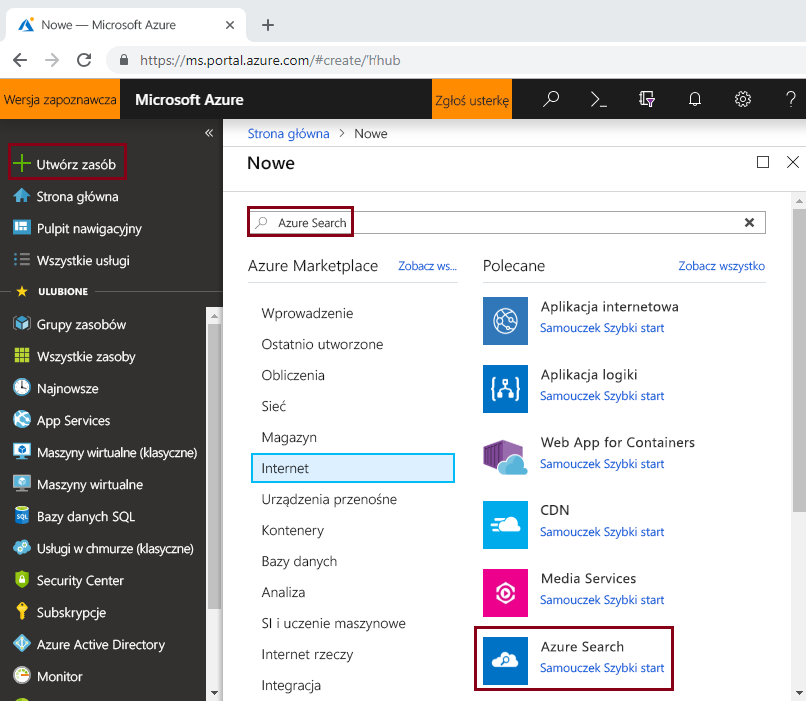
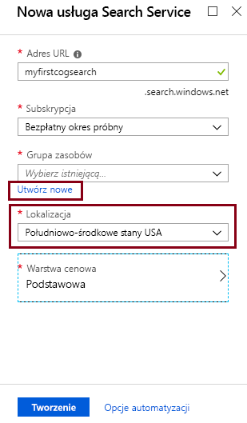
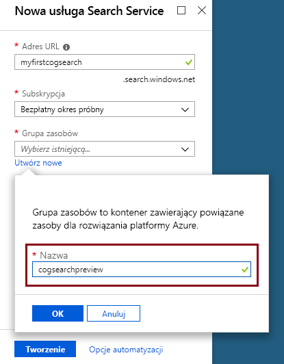
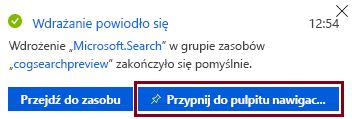

# <a name="tutorial-call-cognitive-services-apis-in-an-azure-search-indexing-pipeline-preview"></a>Samouczek: Wywołania interfejsów API usług Cognitive Services w usłudze Azure Search indeksowanie potoku (wersja zapoznawcza)

Za pomocą tego samouczka poznasz mechanizm programistycznego wzbogacania danych w usłudze Azure Search przy użyciu *umiejętności poznawczych*. Umiejętności są wspierane przez możliwości analizy obrazu, w usługach Cognitive Services i przetwarzania języka naturalnego (NLP). Za pomocą zestawu umiejętności tworzenia i konfiguracji można wyodrębnić tekst i reprezentacja tekstowa obrazu lub pliku skanowanego dokumentu. Może także wykryć język, jednostki, kluczowe frazy i. Wynik końcowy to zaawansowane dodatkowej zawartości do indeksu usługi Azure Search, utworzone przez potokiem indeksowania bazujących na sztucznej Inteligencji. 

W tym samouczku interfejs API REST jest wywoływany w celu wykonania następujących zadań:

> [!div class="checklist"]
> * Utworzenie potoku indeksowania, który wzbogaca przykładowe dane w drodze do indeksu
> * Zastosowanie wbudowanych umiejętności: rozpoznawania jednostek, wykrywania języka, manipulacji tekstem i wyodrębniania fraz kluczowych
> * Poznanie sposobu łączenia umiejętności w łańcuch przez mapowanie danych wejściowych na dane wyjściowe w zestawie umiejętności
> * Wykonywanie żądań i przeglądanie wyników
> * Resetowanie indeksu i indeksatorów w celu kontynuowania opracowywania

Dane wyjściowe stanowią indeks z możliwością wyszukiwania pełnotekstowego w usłudze Azure Search. Indeks możesz rozszerzyć za pomocą innych standardowych możliwości, takich jak [synonimy](search-synonyms.md), [profile oceniania](https://docs.microsoft.com/rest/api/searchservice/add-scoring-profiles-to-a-search-index), [analizatory](search-analyzers.md) i [filtry](search-filters.md).

Jeśli nie masz subskrypcji platformy Azure, przed rozpoczęciem utwórz [bezpłatne konto](https://azure.microsoft.com/free/?WT.mc_id=A261C142F).

> [!NOTE]
> Od 21 grudnia 2018 roku będziesz mieć możliwość skojarzenia swojego zasobu w usługach Cognitive Services z zestawem umiejętności usługi Azure Search. Rozpoczniemy wówczas naliczanie opłat za wykonywanie zestawu umiejętności. Od tego dnia zaczniemy też naliczać opłaty za wyodrębnianie obrazów w ramach etapu analizowania dokumentów. Wyodrębnianie tekstu z dokumentów nadal będzie oferowane bez dodatkowych opłat.
>
> Opłaty za wykonywanie wbudowanych umiejętności będą naliczane na podstawie istniejącej [ceny przy płatności zgodnie z rzeczywistym użyciem](https://azure.microsoft.com/pricing/details/cognitive-services/) za usługi Cognitive Services. Opłaty za wyodrębnianie obrazów będą naliczane zgodnie z cenami w wersji zapoznawczej. Opisano to [na stronie z cennikiem usługi Azure Search](https://go.microsoft.com/fwlink/?linkid=2042400). Dowiedz się [więcej](cognitive-search-attach-cognitive-services.md).

## <a name="prerequisites"></a>Wymagania wstępne

To Twoja pierwsza styczność z wyszukiwaniem poznawczym? Przeczytaj artykuł [„Co to jest wyszukiwanie poznawcze?”](cognitive-search-concept-intro.md), aby zapoznać się z tym tematem, lub wypróbuj [przewodnik Szybki start portalu](cognitive-search-quickstart-blob.md), aby uzyskać praktyczne wprowadzenie do ważnych pojęć.

Do wykonywania wywołań REST usługi Azure Search, czyli tworzenia żądań HTTP, użyj programu PowerShell lub internetowego narzędzia do testowania, takiego jak Telerik Fiddler lub Postman. Jeśli nie znasz tych narzędzi, zobacz [Odkrywanie interfejsów API REST usługi Azure Search przy użyciu narzędzia Fiddler lub Postman](search-fiddler.md).

Za pomocą witryny [Azure Portal](https://portal.azure.com/) utwórz usługi używane w kompletnym przepływie pracy. 

### <a name="set-up-azure-search"></a>Konfigurowanie usługi Azure Search

Najpierw utwórz konto usługi Azure Search. 

1. Przejdź do witryny [Azure Portal](https://portal.azure.com) i zaloguj się przy użyciu konta platformy Azure.

1. Kliknij pozycję **Utwórz zasób**, wyszukaj usługę Azure Search i kliknij pozycję **Utwórz**. Zobacz [Tworzenie usługi Azure Search w portalu](search-create-service-portal.md), jeśli konfigurujesz usługę wyszukiwania po raz pierwszy.

   

1. W obszarze Grupa zasobów utwórz grupę zasobów, która będzie zawierać wszystkie zasoby utworzone w tym samouczku. Ułatwi to wyczyszczenie zasobów po ukończeniu samouczka.

1. Dla lokalizacji wybierz region, który znajduje się w pobliżu danych i innymi aplikacjami w chmurze.

1. W obszarze Warstwa cenowa możesz utworzyć usługę w warstwie **Bezpłatna**, aby ukończyć samouczki i przewodniki Szybki start. Na potrzeby głębszej analizy z wykorzystaniem własnych danych możesz utworzyć [płatną usługę](https://azure.microsoft.com/pricing/details/search/), taką jak usługa w warstwie **Podstawowa** lub **Standardowa**. 

   Usługa w warstwie Bezpłatna jest ograniczona do 3 indeksów, maksymalnego rozmiaru obiektu blob równego 16 MB i 2 minut indeksowania, co nie wystarcza do korzystania z pełnych możliwości wyszukiwania poznawczego. Aby przejrzeć limity dla różnych warstw, zobacz [ograniczenia usługi](search-limits-quotas-capacity.md).

   
   

 
1. Przypnij usługę do pulpitu nawigacyjnego, aby uzyskać szybki dostęp do informacji o niej.

   

1. Po utworzeniu usługi zbierz następujące informacje: adres **URL** ze strony Przegląd i klucz **api-key** (podstawowy lub pomocniczy) ze strony Klucze.

   

### <a name="set-up-azure-blob-service-and-load-sample-data"></a>Konfigurowanie usługi Azure Blob Service i ładowanie przykładowych danych

Potok wzbogacania ściąga dane ze źródeł danych platformy Azure. Dane muszą pochodzić ze źródła danych, którego typ jest obsługiwany przez [indeksator usługi Azure Search](search-indexer-overview.md). Pamiętaj, usługa Azure Table Storage nie jest obsługiwana w usłudze wyszukiwania poznawczego. Na potrzeby tego ćwiczenia będziemy korzystać z usługi Blob Storage, aby zaprezentować wiele typów zawartości.

1. [Pobierz przykładowe dane](https://1drv.ms/f/s!As7Oy81M_gVPa-LCb5lC_3hbS-4). Przykładowe dane składają się z małego zestawu plików różnych typów. 

1. Utwórz konto usługi Azure Blob Storage, utwórz konto usługi Storage, zaloguj się w Eksploratorze usługi Storage i utwórz kontener o nazwie `basicdemo`. Instrukcje dotyczące wszystkich kroków zawiera [Przewodnik Szybki start dotyczący Eksploratora usługi Azure Storage](../storage/blobs/storage-quickstart-blobs-storage-explorer.md).

1. Korzystając z Eksploratora usługi Azure Storage, w utworzonym kontenerze `basicdemo` kliknij pozycję **Przekaż**, aby przekazać przykładowe pliki.

1. Po załadowaniu przykładowych plików uzyskaj nazwę kontenera i parametry połączenia dla usługi Blob Storage. Te dane są dostępne po przejściu do konta usługi Storage w witrynie Azure Portal. Na stronie **Klucze dostępu**, a następnie skopiuj pole **Parametry połączenia**.

   Parametry połączenia powinny być adresem URL podobnym do następującego przykładu:

      ```http
      DefaultEndpointsProtocol=https;AccountName=cogsrchdemostorage;AccountKey=<your account key>;EndpointSuffix=core.windows.net
      ```

Istnieją inne sposoby określania parametrów połączenia, takie jak podanie sygnatury dostępu współdzielonego. Aby dowiedzieć się więcej na temat poświadczeń źródła danych, zobacz [Indeksowanie w usłudze Azure Blob Storage](search-howto-indexing-azure-blob-storage.md#Credentials).

## <a name="create-a-data-source"></a>Tworzenie źródła danych

Teraz, gdy usługi i pliki źródłowe są gotowe, rozpocznij łączenie składników potoku indeksowania. Zacznij od [obiektu źródła danych](https://docs.microsoft.com/rest/api/searchservice/create-data-source), który informuje usługę Azure Search o tym, jak pobrać zewnętrzne dane źródłowe.

W tym samouczku jest używany interfejs API REST i narzędzie, które umożliwia tworzenie i wysyłanie żądań HTTP, takie jak PowerShell, Postman lub Fiddler. W nagłówku żądania podaj nazwę usługi użytą podczas tworzenia usługi Azure Search i klucz api-key wygenerowany dla usługi wyszukiwania. W treści żądania określ nazwę kontenera obiektów blob i parametry połączenia.

### <a name="sample-request"></a>Przykładowe żądanie
```http
POST https://[service name].search.windows.net/datasources?api-version=2017-11-11-Preview
Content-Type: application/json
api-key: [admin key]
```
#### <a name="request-body-syntax"></a>Składnia treści żądania
```json
{
  "name" : "demodata",
  "description" : "Demo files to demonstrate cognitive search capabilities.",
  "type" : "azureblob",
  "credentials" :
  { "connectionString" :
    "DefaultEndpointsProtocol=https;AccountName=<your account name>;AccountKey=<your account key>;"
  },
  "container" : { "name" : "<your blob container name>" }
}
```
Wyślij żądanie. Internetowe narzędzie do testowania powinno zwrócić kod stanu 201 oznaczający powodzenie. 

Ponieważ jest to pierwsze żądanie, sprawdź w witrynie Azure Portal, czy źródło danych zostało utworzone w usłudze Azure Search. Na stronie pulpitu nawigacyjnego usługi wyszukiwania zweryfikuj, czy kafelek Źródła danych zawiera nowy element. Może trzeba będzie zaczekać kilka minut na odświeżenie strony portalu. 

  

Jeśli otrzymujesz błąd 403 lub 404, sprawdź, czy żądanie jest poprawnie skonstruowane: w punkcie końcowym powinien znajdować się element `api-version=2017-11-11-Preview`, natomiast w nagłówku, po elemencie `Content-Type`, powinien znajdować się element `api-key`, a jego wartość musi być prawidłowa dla usługi wyszukiwania. Tego nagłówka możesz użyć ponownie w pozostałych krokach tego samouczka.

## <a name="create-a-skillset"></a>Tworzenie zestawu umiejętności

W tym kroku zdefiniujesz zestaw kroków wzbogacania, które mają być stosowane dla danych. Każdy krok wzbogacania to *umiejętność*, a zestaw kroków wzbogacenia to *zestaw umiejętności*. W ramach tego samouczka są używane [wstępnie zdefiniowane umiejętności poznawcze](cognitive-search-predefined-skills.md) z następujących zestawów umiejętności:

+ [Wykrywanie języka](cognitive-search-skill-language-detection.md) — identyfikowanie języka zawartości.

+ [Dzielenie tekstu](cognitive-search-skill-textsplit.md) — dzielenie dużej zawartości na mniejsze fragmenty przed wywołaniem umiejętności wyodrębniania fraz kluczowych. Umiejętność wyodrębniania fraz kluczowych przyjmuje dane wejściowe składające się maksymalnie z 50 000 znaków. Kilka przykładowych plików należy podzielić, aby zmieścić się w tym limicie.

+ [Rozpoznawanie jednostek znaku](cognitive-search-skill-named-entity-recognition.md) — wyodrębnianie nazw organizacji z zawartości w kontenerze obiektów blob.

+ [Wyodrębnianie kluczowych fraz](cognitive-search-skill-keyphrases.md) — określanie najczęściej występujących fraz kluczowych. 

### <a name="sample-request"></a>Przykładowe żądanie
Przed wykonaniem tego wywołania REST pamiętaj o zastąpieniu nazwy usługi i klucza administratora w żądaniu poniżej, jeśli narzędzie nie zachowuje nagłówka żądania między wywołaniami. 

To żądanie powoduje utworzenie zestawu umiejętności. W pozostałej części tego samouczka przywołuj ten zestaw umiejętności za pomocą nazwy ```demoskillset```.

```http
PUT https://[servicename].search.windows.net/skillsets/demoskillset?api-version=2017-11-11-Preview
api-key: [admin key]
Content-Type: application/json
```
#### <a name="request-body-syntax"></a>Składnia treści żądania
```json
{
  "description":
  "Extract entities, detect language and extract key-phrases",
  "skills":
  [
    {
      "@odata.type": "#Microsoft.Skills.Text.NamedEntityRecognitionSkill",
      "categories": [ "Organization" ],
      "defaultLanguageCode": "en",
      "inputs": [
        {
          "name": "text", "source": "/document/content"
        }
      ],
      "outputs": [
        {
          "name": "organizations", "targetName": "organizations"
        }
      ]
    },
    {
      "@odata.type": "#Microsoft.Skills.Text.LanguageDetectionSkill",
      "inputs": [
        {
          "name": "text", "source": "/document/content"
        }
      ],
      "outputs": [
        {
          "name": "languageCode",
          "targetName": "languageCode"
        }
      ]
    },
    {
      "@odata.type": "#Microsoft.Skills.Text.SplitSkill",
      "textSplitMode" : "pages",
      "maximumPageLength": 4000,
      "inputs": [
        {
          "name": "text",
          "source": "/document/content"
        },
        {
          "name": "languageCode",
          "source": "/document/languageCode"
        }
      ],
      "outputs": [
        {
          "name": "textItems",
          "targetName": "pages"
        }
      ]
    },
    {
      "@odata.type": "#Microsoft.Skills.Text.KeyPhraseExtractionSkill",
      "context": "/document/pages/*",
      "inputs": [
        {
          "name": "text", "source": "/document/pages/*"
        },
        {
          "name":"languageCode", "source": "/document/languageCode"
        }
      ],
      "outputs": [
        {
          "name": "keyPhrases",
          "targetName": "keyPhrases"
        }
      ]
    }
  ]
}
```

Wyślij żądanie. Internetowe narzędzie do testowania powinno zwrócić kod stanu 201 oznaczający powodzenie. 

#### <a name="about-the-request"></a>Informacje o żądaniu

Zwróć uwagę, jak umiejętność wyodrębniania fraz kluczowych jest stosowana dla każdej strony. Ustawienie kontekstu na ```"document/pages/*"``` powoduje uruchomienie tego elementu wzbogacającego dla każdego elementu członkowskiego tablicy dokumentów/stron (dla każdej strony w dokumencie).

Każda umiejętność jest wykonywana dla zawartości dokumentu. Podczas przetwarzania usługa Azure Search analizuje każdy dokument w celu odczytania zawartości plików w różnych formatach. Tekst znaleziony w pliku źródłowym jest umieszczany w polu ```content``` generowanym pojedynczo dla każdego dokumentu. Dlatego dane wejściowe należy określić jako ```"/document/content"```.

Graficzna reprezentacja zestawu umiejętności jest przedstawiona poniżej. 


Dane wyjściowe można mapować na indeks i/lub używać ich jako danych wejściowych umiejętności podrzędnej — jak w przypadku kodu języka. W indeksie kod języka jest przydatny do filtrowania. Kod języka jest używany jako dane wejściowe przez umiejętności analizy tekstu w celu określenia zasad podziału wyrazów przez reguły językowe.

Aby uzyskać więcej podstawowych informacji na temat zestawów umiejętności, zobacz [Jak zdefiniować zestaw umiejętności](cognitive-search-defining-skillset.md).

## <a name="create-an-index"></a>Tworzenie indeksu

W tej sekcji zdefiniujesz schemat indeksu przez określenie pól do umieszczenia w indeksie z możliwością wyszukiwania oraz atrybutów wyszukiwania dla każdego pola. Pola mogą mieć typ i atrybuty, które określają sposób używania pola (z możliwością wyszukiwania, sortowania itp.). Nazwy pól w indeksie nie muszą dokładnie zgadzać się z nazwami pól w źródle. W kolejnym kroku są dodawane mapowania pól w indeksatorze w celu połączenia pól źródłowych z polami docelowymi. W tym kroku zdefiniuj indeks przy użyciu konwencji nazewnictwa pól właściwej dla aplikacji wyszukiwania.

W tym ćwiczeniu są używane następujące pola i typy pól:

| field-names: | `id`       | content   | languageCode | keyPhrases         | organizations     |
|--------------|----------|-------|----------|--------------------|-------------------|
| field-types: | Edm.String|Edm.String| Edm.String| List<Edm.String>  | List<Edm.String>  |


### <a name="sample-request"></a>Przykładowe żądanie
Przed wykonaniem tego wywołania REST pamiętaj o zastąpieniu nazwy usługi i klucza administratora w żądaniu poniżej, jeśli narzędzie nie zachowuje nagłówka żądania między wywołaniami. 

To żądanie powoduje utworzenie indeksu. W pozostałej części tego samouczka używaj nazwy indeksu ```demoindex```.

```http
PUT https://[servicename].search.windows.net/indexes/demoindex?api-version=2017-11-11-Preview
api-key: [api-key]
Content-Type: application/json
```
#### <a name="request-body-syntax"></a>Składnia treści żądania

```json
{
  "fields": [
    {
      "name": "id",
      "type": "Edm.String",
      "key": true,
      "searchable": true,
      "filterable": false,
      "facetable": false,
      "sortable": true
    },
    {
      "name": "content",
      "type": "Edm.String",
      "sortable": false,
      "searchable": true,
      "filterable": false,
      "facetable": false
    },
    {
      "name": "languageCode",
      "type": "Edm.String",
      "searchable": true,
      "filterable": false,
      "facetable": false
    },
    {
      "name": "keyPhrases",
      "type": "Collection(Edm.String)",
      "searchable": true,
      "filterable": false,
      "facetable": false
    },
    {
      "name": "organizations",
      "type": "Collection(Edm.String)",
      "searchable": true,
      "sortable": false,
      "filterable": false,
      "facetable": false
    }
  ]
}
```
Wyślij żądanie. Internetowe narzędzie do testowania powinno zwrócić kod stanu 201 oznaczający powodzenie. 

Aby dowiedzieć się więcej na temat definiowania indeksu, zobacz [Tworzenie indeksu (interfejs API REST usługi Azure Search)](https://docs.microsoft.com/rest/api/searchservice/create-index).


## <a name="create-an-indexer-map-fields-and-execute-transformations"></a>Tworzenie indeksatora, mapowanie pól i wykonywanie przekształceń

Do tej pory utworzono źródło danych, zestaw umiejętności i indeks. Te trzy składniki staną się częścią [indeksatora](search-indexer-overview.md), który łączy wszystkie części w pojedynczą operację obejmującą wiele faz. Aby powiązać je razem w indeksatorze, należy zdefiniować mapowania pól. Mapowania pól są częścią definicji indeksatora i wykonują przekształcenia przy przesyłaniu żądania.

W przypadku indeksowania bez wzbogacania definicja indeksatora może zawierać opcjonalną sekcję *fieldMappings*, jeśli nazwy pól lub typy danych nie pasują dokładnie lub aby umożliwić użycie funkcji.

W przypadku obciążeń wyszukiwania poznawczego z potokiem wzbogacania indeksator wymaga elementu *outputFieldMappings*. Te mapowania są używane, gdy proces wewnętrzny (potok wzbogacania) jest źródłem wartości pól. Zachowania unikatowe dla elementu *outputFieldMappings* obejmują możliwość obsługi typów złożonych utworzonych w ramach wzbogacania (za pomocą umiejętności kształtowania). Ponadto dokument może zawierać wiele elementów (na przykład wiele organizacji). Konstrukcja *outputFieldMappings* umożliwia nakazanie systemowi „spłaszczania” kolekcji elementów w pojedynczy rekord.

### <a name="sample-request"></a>Przykładowe żądanie

Przed wykonaniem tego wywołania REST pamiętaj o zastąpieniu nazwy usługi i klucza administratora w żądaniu poniżej, jeśli narzędzie nie zachowuje nagłówka żądania między wywołaniami. 

Ponadto podaj nazwę indeksatora. W pozostałej części tego samouczka możesz przywoływać go za pomocą nazwy ```demoindexer```.

```http
PUT https://[servicename].search.windows.net/indexers/demoindexer?api-version=2017-11-11-Preview
api-key: [api-key]
Content-Type: application/json
```
#### <a name="request-body-syntax"></a>Składnia treści żądania

```json
{
  "name":"demoindexer", 
  "dataSourceName" : "demodata",
  "targetIndexName" : "demoindex",
  "skillsetName" : "demoskillset",
  "fieldMappings" : [
    {
      "sourceFieldName" : "metadata_storage_path",
      "targetFieldName" : "id",
      "mappingFunction" :
        { "name" : "base64Encode" }
    },
    {
      "sourceFieldName" : "content",
      "targetFieldName" : "content"
    }
  ],
  "outputFieldMappings" :
  [
    {
      "sourceFieldName" : "/document/organizations",
      "targetFieldName" : "organizations"
    },
    {
      "sourceFieldName" : "/document/pages/*/keyPhrases/*",
      "targetFieldName" : "keyPhrases"
    },
    {
      "sourceFieldName": "/document/languageCode",
      "targetFieldName": "languageCode"
    }
  ],
  "parameters":
  {
    "maxFailedItems":-1,
    "maxFailedItemsPerBatch":-1,
    "configuration":
    {
      "dataToExtract": "contentAndMetadata",
      "imageAction": "generateNormalizedImages"
    }
  }
}
```

Wyślij żądanie. Internetowe narzędzie do testowania powinno zwrócić kod stanu 201 oznaczający powodzenie przetwarzania. 

Wykonanie tego kroku może potrwać kilka minut. Mimo że zestaw danych jest mały, umiejętności analityczne wykorzystują znaczną moc obliczeniową. Wykonywanie niektórych umiejętności, takich jak analiza obrazu, jest długotrwałe.

> [!TIP]
> Utworzenie indeksatora powoduje wywołanie potoku. Jeśli występują problemy z dostępem do danych, mapowaniem danych wejściowych i wyjściowych lub kolejnością operacji, pojawią się one na tym etapie. Aby ponownie uruchomić potok po zmianach kodu lub skryptu, może być konieczne uprzednie usunięcie obiektów. Aby uzyskać więcej informacji, zobacz [Resetowanie i ponowne uruchamianie](#reset).

### <a name="explore-the-request-body"></a>Eksplorowanie treści żądania

Skrypt ustawia dla elementu ```"maxFailedItems"``` wartość -1, która powoduje, że aparat indeksowania ignoruje błędy podczas importowania danych. Jest to przydatne, ponieważ pokazowe źródło danych zawiera tak mało dokumentów. W przypadku większego źródła danych należy ustawić wartość większą od 0.

Ponadto zwróć uwagę na instrukcję ```"dataToExtract":"contentAndMetadata"``` w parametrach konfiguracji. Ta instrukcja nakazuje indeksatorowi automatyczne wyodrębnianie zawartości z plików w różnych formatach, a także metadanych związanych z każdym plikiem. 

Gdy zawartość zostanie wyodrębniona, możesz ustawić element ```imageAction```, aby wyodrębnić tekst z obrazów znalezionych w źródle danych. Konfiguracja ```"imageAction":"generateNormalizedImages"```, w połączeniu z umiejętnością OCR i umiejętnością scalania tekstu, wskazuje indeksatorowi, aby wyodrębniał tekst z obrazów (np. wyraz „stop” ze znaku drogowego Stop) i osadzał go jako część pola zawartości. To zachowanie dotyczy zarówno obrazów osadzonych w dokumentach (np. w pliku PDF), jak i znalezionych w źródle danych (np. pliku JPG).

## <a name="check-indexer-status"></a>Sprawdzanie stanu indeksatora

Po zdefiniowaniu indeksatora jest on uruchamiany automatycznie przy przesyłaniu żądania. W zależności od tego, które umiejętności poznawcze zdefiniowano, indeksowanie może trwać dłużej, niż oczekujesz. Aby dowiedzieć się, czy indeksator jest nadal uruchomiony, wyślij następujące żądanie w celu sprawdzenia stanu indeksatora.

```http
GET https://[servicename].search.windows.net/indexers/demoindexer/status?api-version=2017-11-11-Preview
api-key: [api-key]
Content-Type: application/json
```

Odpowiedź informuje o tym, czy indeksator działa. Po zakończeniu indeksowania użyj kolejnego żądania HTTP GET wysłanego do punktu końcowego STATUS (jak powyżej), aby wyświetlić raport wszelkich błędów i ostrzeżeń, które wystąpiły podczas wzbogacania.  

Ostrzeżenia często występują dla niektórych kombinacji plików źródłowych i umiejętności oraz nie zawsze wskazują istnienie problemu. W tym samouczku ostrzeżenia są niegroźne (np. brak tekstowych danych wejściowych dla plików JPEG). Istnieje możliwość przejrzenia odpowiedzi stanu w ramach informacji pełnych dotyczących ostrzeżeń zgłoszonych podczas indeksowania.
 
## <a name="verify-content"></a>Weryfikowanie zawartości

Po zakończeniu indeksowania uruchom zapytania zwracające zawartość poszczególnych pól. Domyślnie usługa Azure Search zwraca 50 najlepszych wyników. Przykładowych danych jest mało, więc wartość domyślna działa dobrze. Jednak podczas pracy z większymi zestawami danych może być konieczne dołączenie do ciągu zapytania parametrów powodujących zwrócenie większej liczby wyników. Aby uzyskać instrukcje, zobacz [Jak wyświetlać strony wyników w usłudze Azure Search](search-pagination-page-layout.md).

W ramach kroku weryfikacji odpytaj indeks o wszystkie pola.

```http
GET https://[servicename].search.windows.net/indexes/demoindex?api-version=2017-11-11-Preview
api-key: [api-key]
Content-Type: application/json
```

Dane wyjściowe to schemat indeksu z nazwą, typem i atrybutami każdego pola.

Prześlij drugie zapytanie o element `"*"`, co spowoduje zwrócenie całej zawartości pojedynczego pola, takiego jak `organizations`.

```http
GET https://[servicename].search.windows.net/indexes/demoindex/docs?search=*&$select=organizations&api-version=2017-11-11-Preview
api-key: [api-key]
Content-Type: application/json
```

Powtórz tę operację dla dodatkowych pól —w tym ćwiczeniu są to: content, language, keyphrases i organizations. Istnieje możliwość zwrócenia wielu pól za pomocą elementu `$select` używającego listy wartości rozdzielonych przecinkami.

W zależności od złożoności i długości ciągu zapytania można użyć metody GET lub POST. Aby uzyskać więcej informacji, zobacz [Odpytywanie przy użyciu interfejsu API REST](https://docs.microsoft.com/rest/api/searchservice/search-documents).

<a name="access-enriched-document"></a>

## <a name="accessing-the-enriched-document"></a>Dostęp do wzbogaconego dokumentu

Funkcja wyszukiwania poznawczego umożliwia wyświetlenie struktury wzbogaconego dokumentu. Wzbogacone dokumenty to tymczasowe struktury tworzone podczas wzbogacania, a następnie usuwane po zakończeniu procesu.

Aby przechwycić migawkę wzbogaconego dokumentu utworzoną podczas indeksowania, dodaj pole o nazwie ```enriched``` do indeksu. Indeksator automatycznie zrzuca do tego pola ciąg będący reprezentacją wszystkich wzbogaceń dokumentu.

Pole ```enriched``` będzie zawierać ciąg, który jest logiczną reprezentacją wzbogaconego dokumentu w pamięci w formacie JSON.  Wartość pola jest jednak prawidłowym dokumentem w formacie JSON. Cudzysłowy są umieszczane w sekwencji ucieczki, więc musisz zastąpić ciąg `\"` znakiem `"`, aby wyświetlić dokument w postaci sformatowanego kodu JSON.  

Pole ```enriched``` jest przeznaczone do debugowania i ma za zadanie ułatwić zrozumienie logicznego kształtu zawartości, względem której wyrażenia są oceniane. Może to być przydatne narzędzie do poznawania i debugowania zestawu umiejętności.

Powtórz poprzednie ćwiczenie, dołączając pole `enriched` w celu przechwycenia zawartości wzbogaconego dokumentu:

### <a name="request-body-syntax"></a>Składnia treści żądania
```json
{
  "fields": [
    {
      "name": "id",
      "type": "Edm.String",
      "key": true,
      "searchable": true,
      "filterable": false,
      "facetable": false,
      "sortable": true
    },
    {
      "name": "content",
      "type": "Edm.String",
      "sortable": false,
      "searchable": true,
      "filterable": false,
      "facetable": false
    },
    {
      "name": "languageCode",
      "type": "Edm.String",
      "searchable": true,
      "filterable": false,
      "facetable": false
    },
    {
      "name": "keyPhrases",
      "type": "Collection(Edm.String)",
      "searchable": true,
      "filterable": false,
      "facetable": false
    },
    {
      "name": "organizations",
      "type": "Collection(Edm.String)",
      "searchable": true,
      "sortable": false,
      "filterable": false,
      "facetable": false
    },
    {
      "name": "enriched",
      "type": "Edm.String",
      "searchable": false,
      "sortable": false,
      "filterable": false,
      "facetable": false
    }
  ]
}
```
<a name="reset"></a>

## <a name="reset-and-rerun"></a>Resetowanie i ponowne uruchamianie

Na wczesnych, eksperymentalnych etapach opracowywania potoku najbardziej praktycznym podejściem do iteracji projektowych jest usunięcie obiektów z usługi Azure Search i odbudowanie ich przy użyciu kodu. Nazwy zasobów są unikatowe. Usunięcie obiektu umożliwia jego ponowne utworzenie przy użyciu tej samej nazwy.

Aby zaindeksować dokumenty za pomocą nowych definicji:

1. Usuń indeks, aby usunąć utrwalone dane. Usuń indeksator, aby utworzyć go ponownie w usłudze.
2. Zmodyfikuj zestaw umiejętności i definicję indeksu.
3. Utwórz ponownie indeks i indeksator dla usługi w celu uruchomienia potoku. 

Do usunięcia indeksów, indeksatorów i zestawów umiejętności można użyć portalu.

```http
DELETE https://[servicename].search.windows.net/skillsets/demoskillset?api-version=2017-11-11-Preview
api-key: [api-key]
Content-Type: application/json
```

W przypadku pomyślnego usunięcia jest zwracany kod stanu 204.

W miarę rozwoju kodu można udoskonalić strategię odbudowywania. Aby uzyskać więcej informacji, zobacz [Jak odbudować indeks](search-howto-reindex.md).

## <a name="takeaways"></a>Wnioski

W tym samouczku przedstawiono podstawowe kroki tworzenia wzbogaconego potoku indeksowania przez utworzenie elementów będących jego składnikami: źródła danych, zestawu umiejętności, indeksu i indeksatora.

Objaśniono [wstępnie zdefiniowane umiejętności](cognitive-search-predefined-skills.md) wraz z definicją zestawu umiejętności i mechaniką łączenia umiejętności w łańcuch za pomocą danych wejściowych i wyjściowych. Opisano także element `outputFieldMappings` w definicji indeksatora, który jest wymagany do kierowania wzbogaconych wartości z potoku do indeksu z możliwością wyszukiwania w usłudze Azure Search.

Ponadto przedstawiono sposób testowania wyników i resetowania systemu na potrzeby przyszłych iteracji. Omówiono proces, w ramach którego odpytanie indeksu powoduje zwrócenie danych wyjściowych utworzonych przez wzbogacony potok indeksowania. W tej wersji jest dostępny mechanizm wyświetlania wewnętrznych konstrukcji (wzbogaconych dokumentów utworzonych przez system). Zaprezentowano procedurę sprawdzania stanu indeksatora i usuwania obiektów przed ponownym uruchomieniem potoku.

## <a name="clean-up-resources"></a>Oczyszczanie zasobów

Najszybszym sposobem wyczyszczenia środowiska po ukończeniu samouczka jest usunięcie grupy zasobów zawierającej usługę Azure Search i usługę Azure Blob Service. Zakładając, że obie te usługi są umieszczone w tej samej grupie, usuń teraz tę grupę zasobów, aby trwale usunąć wszystkie jej elementy, w tym usługi i zapisaną zawartość utworzoną na potrzeby tego samouczka. W portalu nazwa grupy zasobów znajduje się na stronie Przegląd każdej usługi.

## <a name="next-steps"></a>Kolejne kroki

Dostosuj lub rozszerz potok za pomocą umiejętności niestandardowych. Utworzenie umiejętności niestandardowej i dołączenie jej do zestawu umiejętności pozwala na dodanie samodzielnie napisanej analizy tekstu lub obrazu. 

> [!div class="nextstepaction"]
> [Przykład: Tworzenie niestandardowego umiejętności](cognitive-search-create-custom-skill-example.md)
