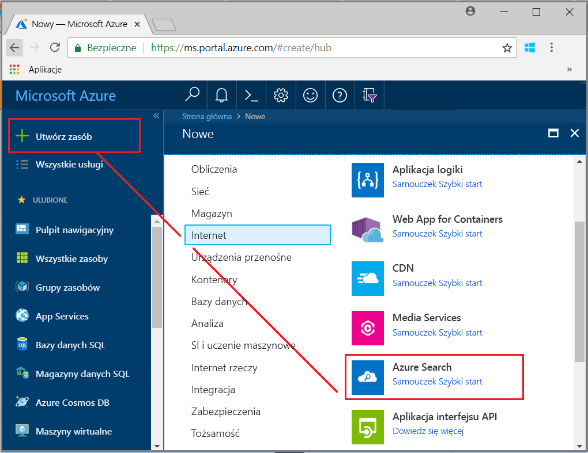
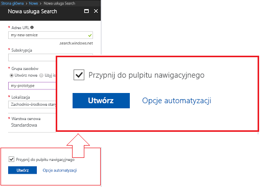
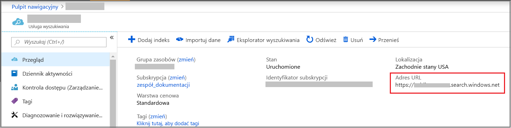
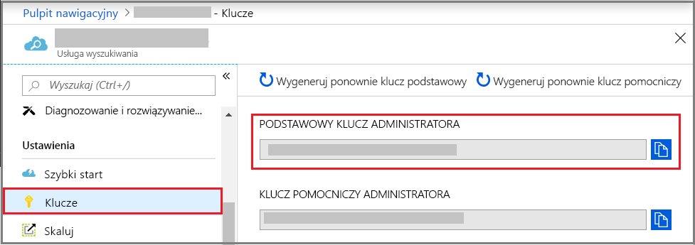
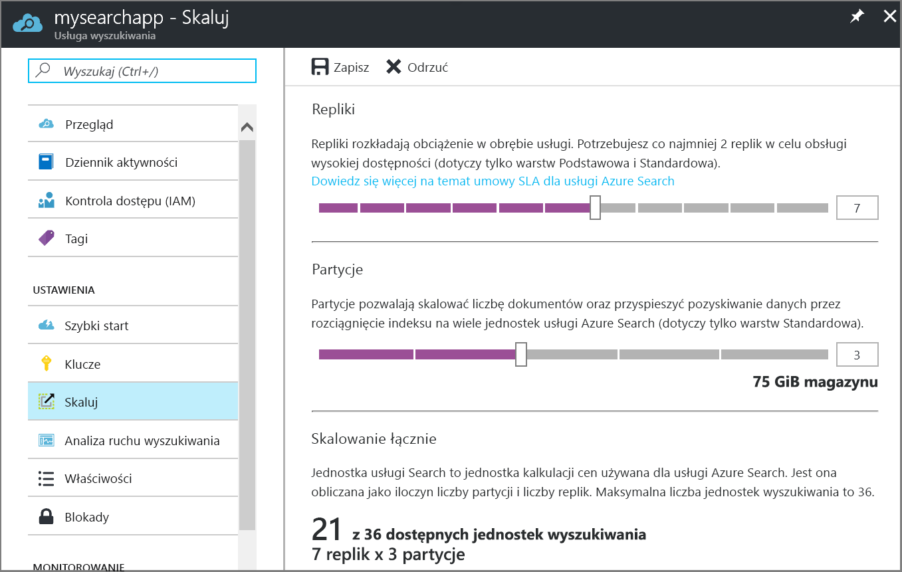

# Tworzenie usługi Azure Search w portalu

Usługa Azure Search jest zasobem autonomicznym służącym do dołączania funkcji wyszukiwania do aplikacji niestandardowych. Można ją łatwo zintegrować z wieloma innymi usługami platformy Azure lub korzystać z niej z aplikacjami na serwerach sieciowych lub oprogramowaniem działającym na innych platformach w chmurze.

Ten artykuł zawiera informacje dotyczące tworzenia zasobu usługi Azure Search w [portalu Azure](https://portal.azure.com/).

Preferujesz program PowerShell? Użyj [szablonu usługi](https://azure.microsoft.com/resources/templates/101-azure-search-create/) Azure Resource Manager. Aby uzyskać pomoc dotyczącą rozpoczynania pracy, zobacz [Zarządzanie usługą Azure Search przy użyciu programu PowerShell](search-manage-powershell.md).

## Subskrypcja (bezpłatna lub płatna)

[Utwórz bezpłatne konto platformy Azure](https://azure.microsoft.com/pricing/free-trial/?WT.mc_id=A261C142F) i skorzystaj z bezpłatnych środków, aby wypróbować płatne usługi platformy Azure. Po wyczerpaniu środków zachowaj konto i nadal korzystaj z bezpłatnych usług platformy Azure, takich jak Websites. Karta kredytowa nie zostanie obciążona, chyba że jawnie zmienisz ustawienia i poprosisz o jej obciążenie.

Możesz również [aktywować korzyści dla subskrybentów MSDN](https://azure.microsoft.com/pricing/member-offers/msdn-benefits-details/?WT.mc_id=A261C142F). W ramach subskrypcji MSDN co miesiąc otrzymasz środki, które możesz przeznaczyć na płatne usługi platformy Azure. 

## Znajdowanie usługi Azure Search

1. Zaloguj się w witrynie [Azure Portal](https://portal.azure.com/).
2. Kliknij znak plus („+ Utwórz zasób”) w lewym górnym rogu.
3. Za pomocą paska wyszukiwania znajdź ciąg „Azure Search” lub przejdź do zasobu, wybierając opcje **Sieć Web** > **Azure Search**.

## Tworzenie nazwy usługi i punktu końcowego adresu URL

Nazwa usługi jest częścią punktu końcowego adresu URL, względem którego interfejs API wywołuje polecenia: `https://your-service-name.search.windows.net`. Wprowadź nazwę usługi w polu **Adres URL**.

Na przykład jeśli chcesz, aby punkt końcowy znajdował się pod adresem `https://my-app-name-01.search.windows.net`, wpisz `my-app-name-01`.

Wymagania dotyczące nazwy usługi:

* Musi być unikatowa w obrębie przestrzeni nazw search.windows.net
* Długość musi zawierać się w przedziale od 2 do 60 znaków
* Musi składać się z małych liter, cyfr lub łączników („-”)
* Nie może zawierać łączników („-”) na pierwszych dwóch miejscach ani na ostatnim miejscu
* Nie może zawierać następujących po sobie łączników („--”)

## Wybieranie subskrypcji

Jeśli masz więcej niż jedną subskrypcję, wybierz tę, która obejmuje usługi magazynu danych lub plików. Usługa Azure Search może automatycznie wykrywać magazyn tabel i obiektów blob platformy Azure, usługę SQL Database i usługę Azure Cosmos DB na potrzeby indeksowania za pośrednictwem [*indeksatorów*](search-indexer-overview.md), ale wyłącznie w ramach usług w tej samej subskrypcji.

## Wybieranie grupy zasobów

Grupa zasobów jest kolekcją używanych razem usług i zasobów platformy Azure. Jeśli na przykład używasz usługi Azure Search do indeksowania bazy danych SQL, obie usługi powinny należeć do tej samej grupy zasobów.

Jeśli nie łączysz zasobów w pojedynczą grupę lub jeśli istniejące grupy zasobów zawierają zasoby używane w niezwiązanych ze sobą rozwiązaniach, utwórz nową grupę zasobów specjalnie na potrzeby usługi Azure Search.

> [!TIP]
> Usunięcie grupy zasobów powoduje usunięcie zawartych w niej usług. Umieszczenie w tej samej grupie zasobów wszystkich projektów będących prototypami korzystającymi z wielu usług ułatwia proces czyszczenia po zakończeniu projektu.

## Wybieranie lokalizacji hostowania

W związku z tym, że usługa Azure Search należy do usług platformy Azure, może być hostowana w centrach danych na całym świecie. [Ceny mogą się różnić](https://azure.microsoft.com/pricing/details/search/) w zależności od lokalizacji geograficznej.

Jeśli indeksujesz zawartości znajdującej się na platformie Azure service (usługa Azure storage, Azure Cosmos DB, Azure SQL Database), tworzenie usługi Azure Search w tym samym regionie, co dane, aby uniknąć naliczania opłat za przepustowość. Istnieją nie opłaty za dane wychodzące, gdy usługi są w tym samym regionie.

## Wybieranie warstwy cenowej (jednostek SKU)

[Usługa Azure Search jest obecnie dostępna w wielu warstwach cenowych](https://azure.microsoft.com/pricing/details/search/): bezpłatnej, podstawowej i standardowej. Poszczególne warstwy różnią się między sobą [pojemnością i limitami](search-limits-quotas-capacity.md). Aby uzyskać wskazówki, zobacz [Choose a pricing tier or SKU](search-sku-tier.md) (Wybieranie warstwy cenowej lub jednostek SKU).

Dla obciążeń produkcyjnych zwykle wybierana jest warstwa Standardowa, ale większość klientów zaczyna od bezpłatnej usługi.

Po utworzeniu usługi nie można zmienić warstwy cenowej. W razie konieczności przejścia do warstwy wyższej lub niższej należy ponownie utworzyć usługę.

## Tworzenie usługi

Należy pamiętać o przypięciu usługi do pulpitu nawigacyjnego, aby mieć do niej łatwy dostęp po każdym zalogowaniu.

## Pobieranie klucza i punktu końcowego adresu URL

Poza pewnymi wyjątkami, używanie nowej usługi wymaga podania punktu końcowego adresu URL i klucza interfejsu API autoryzacji. Przewodniki Szybki start, samouczki, takie jak [Poznaj interfejs API REST usługi Azure Search (Postman)](search-fiddler.md) i [Jak używać usługi Azure Search z platformy .NET](search-howto-dotnet-sdk.md), przykłady i kod niestandardowy — wszystkie te zasoby wymagają punktu końcowego i klucza, aby można je było uruchomić w określonym zasobie.

1. W prawej części strony przeglądu usługi zlokalizuj punkt końcowy adresu URL i skopiuj go.

   

2. W okienku nawigacji po lewej stronie wybierz pozycję **Klucze**, a następnie skopiuj jeden z kluczy administratora (są one równoważne). Klucze interfejsu API administratora są wymagane do tworzenia, aktualizowania i usuwania obiektów w usłudze.

   

Klucz i punkt końcowy nie są wymagane do zadań wykonywanych w portalu. Portal jest już połączony z zasobem usługi Azure Search przy użyciu uprawnień administratora. Aby zapoznać się z samouczkiem portalu, zobacz [Samouczek: importowanie, indeksowanie i wysyłanie zapytań w usłudze Azure Search](search-get-started-portal.md).

## Skalowanie usługi

Tworzenie usługi może potrwać kilka minut (15 minut lub dłużej w zależności od warstwy). Po aprowizacji usługi można ją skalować stosownie do potrzeb. Ponieważ dla usługi Azure Search wybrano warstwę standardową, można ją skalować w dwóch wymiarach: replik i partycji. Wybór warstwy podstawowej oznaczałby, że można dodawać wyłącznie repliki. W razie aprowizacji bezpłatnej usługi skalowanie nie jest dostępne.

***Partycje*** umożliwiają usłudze przechowywanie i przeszukiwanie większej liczby dokumentów.

***Repliki*** umożliwiają usłudze obsługę większego obciążenia zapytaniami wyszukiwania.

Dodawanie zasobów wiąże się z dodaniem opłat do rachunku miesięcznego. [Kalkulator cen](https://azure.microsoft.com/pricing/calculator/) pomaga w określeniu, jaki wpływ na rozliczenia będzie miało dodanie zasobów. Pamiętaj, że możesz też dostosowywać zasoby do obciążenia. Możesz na przykład zwiększyć ilość zasobów na czas początkowego tworzenia pełnego indeksu, a następnie zmniejszyć ją do poziomu dostosowanego do potrzeb indeksowania przyrostowego.

> [!Important]
> Usługa musi mieć [2 repliki w ramach umowy SLA tylko do odczytu oraz 3 repliki w ramach umowy SLA do odczytu/zapisu](https://azure.microsoft.com/support/legal/sla/search/v1_0/).

1. Przejdź do strony usługi wyszukiwania w witrynie Azure Portal.
2. W okienku nawigacji po lewej wybierz kolejno pozycje **Ustawienia** > **Skalowanie**.
3. Użyj suwaka, aby dodać zasoby wybranego typu.

> [!Note]
> Każda warstwa ma inne [limity](search-limits-quotas-capacity.md) całkowitej liczby jednostek wyszukiwania dozwolonych w ramach jednej usługi (repliki * partycje = suma jednostek wyszukiwania).

## Kiedy należy dodać drugą usługę

Większość klientów używa tylko jednej usługi aprowizowanej dla danej warstwy, która zapewnia [właściwe rozmieszczenie zasobów](search-sku-tier.md). Jedna usługa może obsługiwać wiele indeksów, z zastrzeżeniem [maksymalnych limitów wybranej warstwy](search-capacity-planning.md), przy czym każdy indeks jest odizolowany od innych. W usłudze Azure Search żądania mogą być kierowane tylko do jednego indeksu, minimalizując tym samym ryzyko przypadkowego lub zamierzonego pobierania danych z innych indeksów tej samej usługi.

Chociaż większość klientów używa tylko jednej usługi, nadmiarowość usług może być konieczna, jeśli wymagania operacyjne są następujące:

* Odzyskiwanie po awarii (awaria centrum danych). Usługa Azure Search nie zapewnia natychmiastowego przejścia do trybu failover w przypadku awarii. Aby uzyskać wskazówki i zalecenia, zobacz [Service administration](search-manage.md) (Administrowanie usługą).
* W trakcie badania modelowania wielodostępnego ustalono, że dodatkowe usługi stanowią optymalne rozwiązanie dla danego projektu. Aby uzyskać więcej informacji, zobacz [Design for multi-tenancy](search-modeling-multitenant-saas-applications.md) (Projektowanie na potrzeby wielodostępu).
* Aplikacje wdrażane globalnie mogą wymagać wystąpienia usługi Azure Search w wielu regionach w celu zminimalizowania opóźnienia w ruchu międzynarodowym aplikacji.

> [!NOTE]
> W usłudze Azure Search nie można oddzielić obciążeń indeksujących i wykonujących zapytania, dlatego nie ma możliwości utworzenia wielu usług dla segregowanych obciążeń. Zapytania względem indeksu zawsze dotyczą usługi, w której został utworzony (nie można utworzyć indeksu w jednej usłudze, by następnie skopiować go do innej).

Druga usługa nie jest wymagana w celu zapewnienia wysokiej dostępności. Wysoka dostępność zapytań ma miejsce wtedy, gdy używane są co najmniej 2 repliki w tej samej usłudze. Repliki są aktualizowane w odpowiedniej kolejności, co oznacza, że podczas wdrażania aktualizacji usługi działa co najmniej jedna replika. Aby uzyskać więcej informacji na temat czasu pracy, zobacz [Umowy dotyczące poziomu usług](https://azure.microsoft.com/support/legal/sla/search/v1_0/).

## Kolejne kroki

Po aprowizacji usługi Azure Search możesz utworzyć w portalu swój pierwszy indeks.

> [!div class="nextstepaction"]
> [Samouczek: importowanie danych, indeksu i uruchamianie zapytań w portalu](search-get-started-portal.md)
