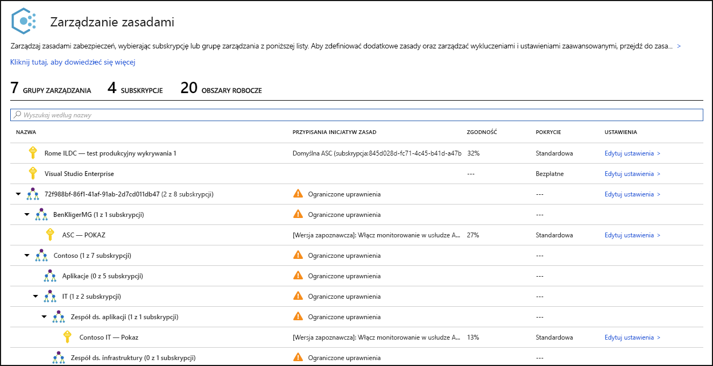
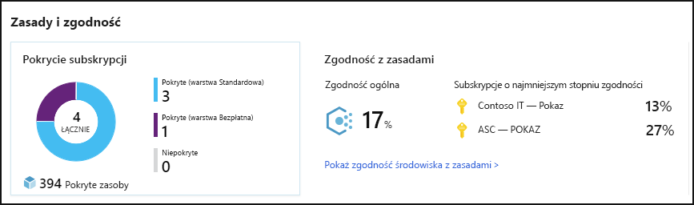
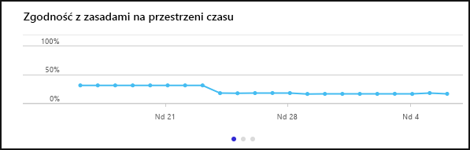
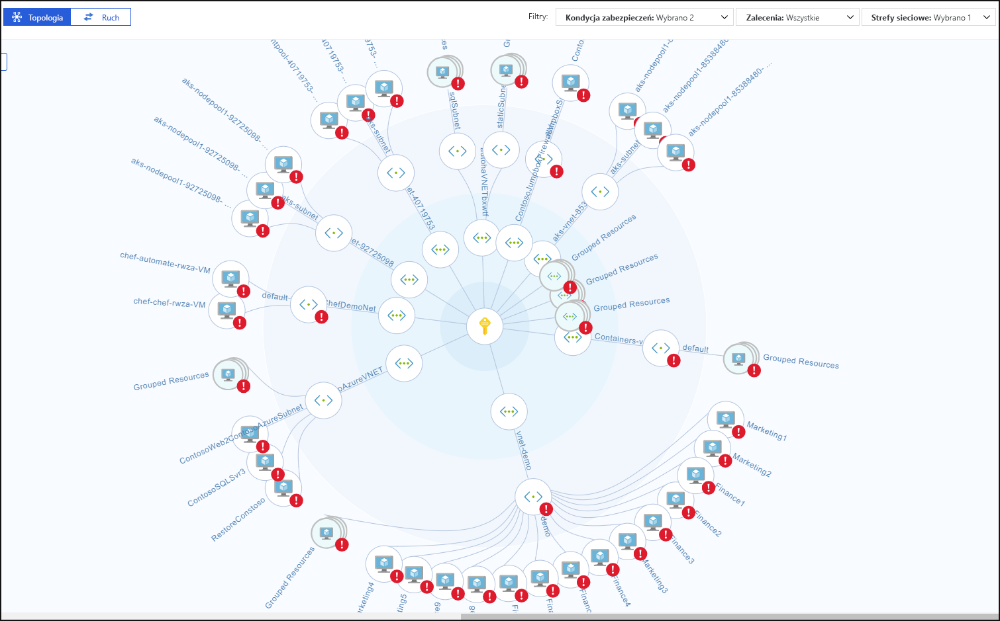
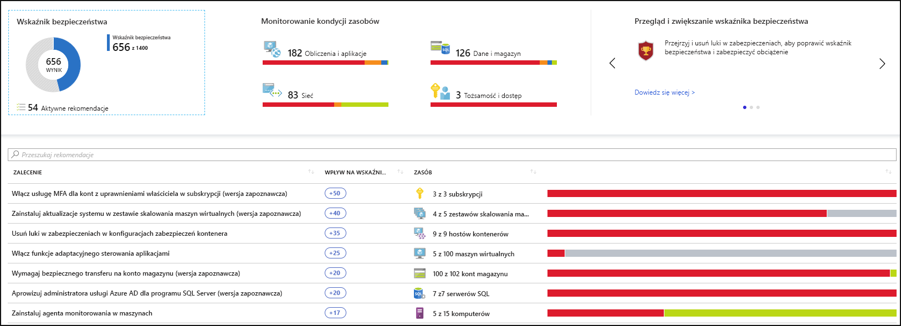
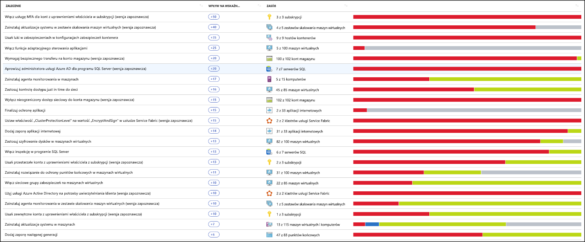
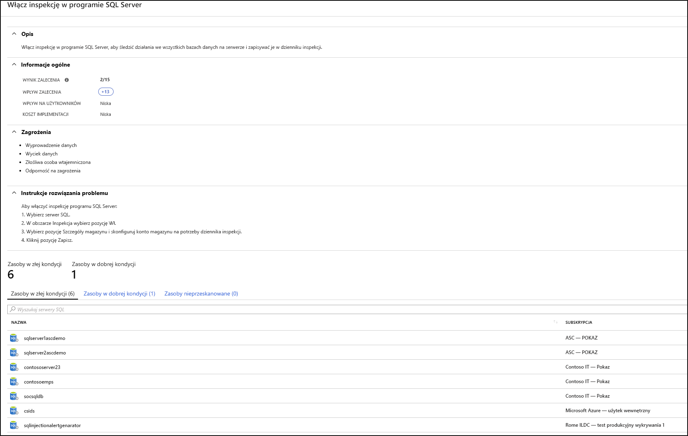
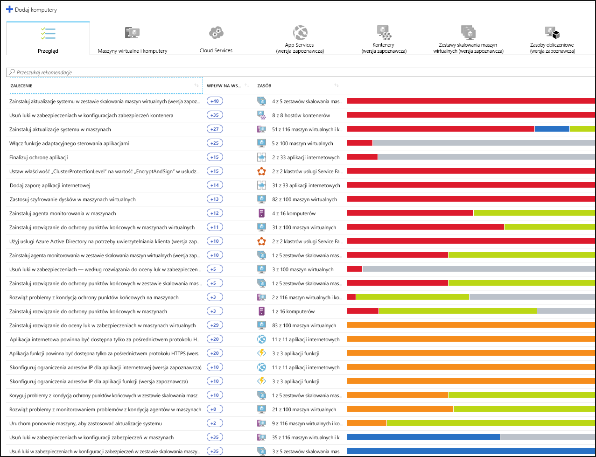
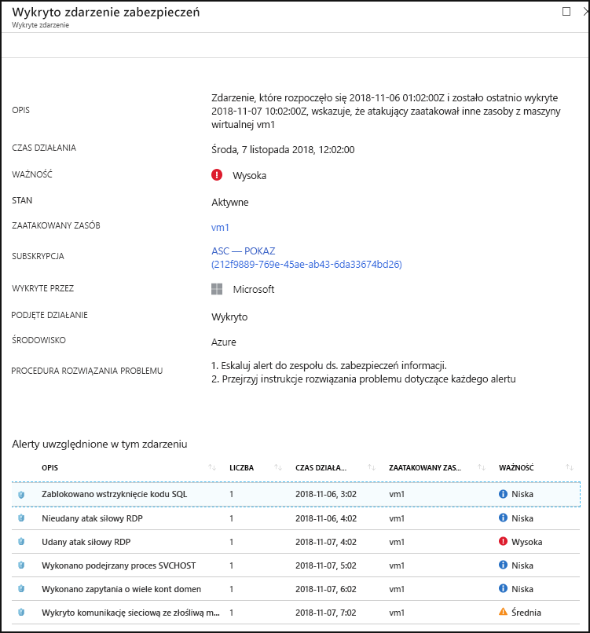

# Co to jest Centrum zabezpieczeń Azure?

Usługa Azure Security Center to ujednolicony system zarządzania bezpieczeństwem infrastruktury. Ma on za zadanie zwiększenie poziomu bezpieczeństwa centrów danych i zapewnienie zaawansowanej ochrony przed zagrożeniami w przypadku obciążeń hybrydowych w chmurze (zarówno na platformie Azure, jak i poza nią) oraz w środowisku lokalnym.

Utrzymywanie bezpieczeństwa zasobów to wspólna odpowiedzialność dostawcy usług w chmurze, platformy Azure i klienta. Podczas przechodzenia do chmury trzeba upewnić się, że obciążenia będą bezpieczne. Trzeba też pamiętać, że przejście na model IaaS (infrastruktura jako usługa) to większa odpowiedzialność po stronie klienta niż w przypadku korzystania z modeli PaaS (platforma jako usługa) i SaaS (oprogramowanie jako usługa). Usługa Azure Security Center zapewnia narzędzia potrzebne do zwiększenia bezpieczeństwa sieci, zabezpieczenia usług i zapewnienia maksymalnego poziomu bezpieczeństwa.

Azure Security Center rozwiązuje trzy najbardziej pilne problemy związane z zabezpieczeniami:

-   **Szybko zmieniające się obciążenia** — jest to mocna strona rozwiązań chmurowych, a jednocześnie wyzwanie. Z jednej strony przed użytkownikami końcowymi otwiera się więcej możliwości. Z drugiej jednak pojawia się problem — jak sprawić, by ciągle zmieniające się usługi, które tworzą i wykorzystują użytkownicy, spełniały standardy bezpieczeństwa i były zgodne z najlepszymi rozwiązaniami dotyczącymi bezpieczeństwa?

-   **Coraz bardziej zaawansowane ataki** — wszędzie tam, gdzie pracujesz, ataki stają się coraz bardziej wyrafinowane. Trzeba zabezpieczyć pracę w chmurze publicznej, która jest połączona z Internetem, co sprawia, że jest jeszcze bardziej narażona na ataki w przypadku braku zastosowania najlepszych zabezpieczeń.

-   **Trudno jest znaleźć pracowników mających odpowiednie umiejętności w zakresie zabezpieczeń** — liczba alertów bezpieczeństwa i systemów zgłaszania alertów przewyższa liczbę administratorów z umiejętnościami i doświadczeniem koniecznymi do zapewniania bezpieczeństwa takiemu środowisku. Bycie na bieżąco z najnowszymi atakami jest dużym wyzwaniem. Nie można stać w miejscu, gdy sytuacja w zakresie zabezpieczeń ciągle się zmienia.

Aby sprostać tym wyzwaniom, Security Center oferuje narzędzia umożliwiające:

-   **Wzmocnienie postawy zabezpieczeń:** Centrum zabezpieczeń ocenia środowisko i pozwala zrozumieć stan zasobów oraz ich bezpieczeństwo.

-   **Ochrona przed zagrożeniami:** Centrum zabezpieczeń ocenia obciążenia i podnosi zalecenia dotyczące zapobiegania zagrożeniom i alerty zabezpieczeń.

-   **Uzyskaj bezpieczeństwo szybciej:** w Centrum zabezpieczeń wszystko odbywa się w chmurze. Dzięki natywnej integracji wdrożenie usługi Security Center jest łatwe i zapewnia automatyczne aprowizowanie i ochronę w ramach usług platformy Azure.

[!INCLUDE [azure-lighthouse-supported-service](../../includes/azure-lighthouse-supported-service.md)]

## Architektura

Ponieważ usługa Security Center jest częścią platformy Azure, usługi PaaS na platformie Azure — w tym Service Fabric, bazy danych SQL i konta magazynu — są monitorowane i chronione przez usługę Security Center bez konieczności każdorazowego wdrażania.

Ponadto usługa Security Center chroni serwery i maszyny wirtualne platformy innych niż platformy Azure w chmurze lub lokalnie, zarówno dla serwerów Windows, jak i Linux, instalując na nich agenta usługi Log Analytics. Maszyny wirtualne Azure są automatycznie aprowizowane w usłudze Security Center.

Zdarzenia zebrane z agentów i platformy Azure są skorelowane w aparat analizy zabezpieczeń, aby zapewnić dostosowane zalecenia (zadania hartowania), które należy wykonać, aby upewnić się, że obciążenia są bezpieczne i alerty zabezpieczeń. Alerty należy badać jak najszybciej, aby upewnić się, że nie dochodzi do złośliwych ataków na działające obciążenia.

Po włączeniu usługi Security Center zasady zabezpieczeń wbudowane w usługę Security Center są odzwierciedlane w usłudze Azure Policy jako wbudowana inicjatywa w kategorii Security Center. Wbudowana inicjatywa jest automatycznie przypisywana do wszystkich subskrypcji zarejestrowanych w usłudze Security Center (w warstwach Bezpłatna lub Standardowa). Wbudowana inicjatywa zawiera tylko zasady inspekcji. Aby uzyskać więcej informacji na temat zasad usługi Security Center w usłudze Azure Policy, zobacz [Praca z zasadami zabezpieczeń](tutorial-security-policy.md).

## Zwiększanie poziomu bezpieczeństwa

Usługa Azure Security Center umożliwia zwiększanie poziomu bezpieczeństwa. Oznacza to, że będzie ona pomagać w identyfikowaniu i wykonywaniu zalecanych jako najlepsze rozwiązania zadań polegających na zwiększaniu poziomu zabezpieczeń, a także we wdrażaniu tych zadań na maszynach, w usługach związanych z danymi i w aplikacjach. Obejmuje to zarządzanie zasadami zabezpieczeń i ich wymuszanie oraz upewnienie się, że maszyny wirtualne na platformie Azure, serwery spoza Azure oraz usługi PaaS platformy Azure je spełniają. Security Center zapewnia narzędzia dające syntetyczne informacje na temat obciążeń ze szczególnym uwzględnieniem stanu zabezpieczeń sieci. 

### Zarządzanie zasadami zabezpieczeń oraz zgodnością w organizacji

Podstawową sprawą jest zapewnienie, że działające obciążenia są bezpieczne. Aby to osiągnąć, trzeba wdrożyć dostosowane zasady zabezpieczeń. Ponieważ wszystkie zasady w usłudze Security Center są oparte na formantach zasad platformy Azure, otrzymujesz pełny zakres i elastyczność **światowej klasy rozwiązania zasad.** W usłudze Security Center można ustawić uruchamianie zasad bezpieczeństwa na poziomie grupy zarządzania, subskrypcji lub nawet dla jednego dzierżawcy.

Usługa Security Center ułatwia **identyfikację subskrypcji it w tle**. Sprawdzając subskrypcje oznaczone na pulpicie nawigacyjnym etykietą **Nieobjęte**, można dowiedzieć się natychmiast, że zostały utworzone nowe subskrypcje, i upewnić się, że są objęte zasadami oraz chronione przez usługę Azure Security Center.

Zaawansowane funkcje monitorowania w umykarze zabezpieczeń umożliwiają również **śledzenie zgodności i zarządzania nimi w czasie.** **Ogólna zgodność** zapewnia miarę, jak bardzo subskrypcje są zgodne z zasadami skojarzonymi z obciążeniem. 

### Ciągłe oceny

Usługa Security Center ciągle wykrywa nowe zasoby wdrażane w różnych obciążeniach i ocenia, czy są one skonfigurowane zgodnie z najlepszymi rozwiązaniami w zakresie zabezpieczeń. Zasoby, które nie spełniają tego wymogu, są oznaczane, a przy tym generowana jest lista zaleceń z określonymi priorytetami. Zalecenia wskazują, co należy zrobić, aby chronić maszyny.

Jednym z najpotężniejszych narzędzi Security Center zapewnia ciągłe monitorowanie stanu zabezpieczeń sieci jest **mapa sieci**. Mapa umożliwia wyświetlenie topologii obciążeń, aby sprawdzić, czy każdy węzeł jest odpowiednio skonfigurowany. Można zobaczyć, jak węzły są połączone, co pomaga blokować niechciane połączenia, które mogą potencjalnie ułatwić osobie atakującej dostanie się do sieci.

Usługa Security Center ułatwia ograniczanie alertów zabezpieczeń o jeden krok, dodając **wynik secure.** Bezpieczne wyniki są teraz skojarzone z każdym zaleceniem, które otrzymujesz, aby pomóc Ci zrozumieć, jak ważne jest każde zalecenie dla ogólnej postawy zabezpieczeń. Ma to kluczowe znaczenie dla umożliwienia **priorytetowego określania priorytetów prac nad bezpieczeństwem.**

### Optymalizacja i zwiększanie bezpieczeństwa dzięki konfigurowaniu zalecanych środków kontroli

Główną wartość usługi Azure Security Center stanowią zalecenia. Zalecenia są dostosowane do określonych problemów z bezpieczeństwem wykrytych w obciążeniach klienta. Usługa Security Center wykonuje pracę administratora zabezpieczeń, nie tylko znajdując luki w zabezpieczeniach, ale też udostępniając szczegółowe instrukcje na temat sposobu ich usunięcia.

W ten sposób usługa Security Center umożliwia nie tylko ustanawianie zasad zabezpieczeń, ale też zastosowanie bezpiecznych standardów konfiguracji we wszystkich zasobach.

Zalecenia pomagają zmniejszyć obszar ataków w każdym z zasobów. Obejmują one maszyny wirtualne platformy Azure, serwery spoza platformy Azure oraz usługi PaaS platformy Azure takie jak konta SQL i konta magazynu. Każdy rodzaj zasobu jest oceniany oddzielnie i ma swoje własne standardy.

## Ochrona przed zagrożeniami

Ochrona przed zagrożeniami w usłudze Security Center umożliwia wykrywanie zagrożeń i zapobieganie im w warstwie infrastruktury jako usługi (IaaS), na serwerach spoza platformy Azure, jak również w przypadku platform działających jako usługa (PaaS) na platformie Azure.

Ochrona przed zagrożeniami w usłudze Security Center obejmuje kompleksową analizę łańcucha ataku, która automatycznie koreluje alerty w danym środowisku na podstawie modelu łańcucha ataku cybernetycznego. Dzięki temu uzyskujesz lepszy wgląd we wszystkie etapy ataku, jego punkt początkowy oraz wpływ na zasoby.

### Integracja z zaawansowaną ochroną przed zagrożeniami w usłudze Microsoft Defender

Usługa Security Center obejmuje automatyczną, natywną integrację z zaawansowaną ochroną przed zagrożeniami w usłudze Microsoft Defender. Oznacza to, że bez żadnej konfiguracji komputery z systemem Windows i Linux są w pełni zintegrowane z zaleceniami i ocenami usługi Security Center.

Ponadto usługa Security Center pozwala zautomatyzować zasady kontroli aplikacji w środowisku serwera. Funkcje adaptacyjnego sterowania aplikacjami w usłudze Security Center umożliwiają włączenie kompleksowego tworzenia listy dozwolonych aplikacji na serwerach z systemem Windows. Nie musisz tworzyć reguł i sprawdzać naruszeń, ponieważ wszystko odbywa się automatycznie.

### Ochrona usług PaaS

Usługa Security Center ułatwia wykrywanie zagrożeń w usługach PaaS platformy Azure. Możesz wykrywać zagrożenia dotyczące usług platformy Azure, w tym usługi Azure App Service, Azure SQL, konta usługi Azure Storage i innych usług danych. Możesz również korzystać z natywnej integracji z funkcją analizy zachowań użytkowników i jednostek (UEBA) dostępną w usłudze Microsoft Cloud App Security w celu wykrywania anomalii w dziennikach aktywności platformy Azure.

### Blokowanie ataków siłowych

Usługa Security Center pomaga ograniczyć narażenie na ataki siłowe. Ograniczenie dostępu do portów maszyny wirtualnej i korzystanie z dostępu just-in-time do maszyny wirtualnej umożliwia zwiększenie bezpieczeństwa sieci dzięki zapobieganiu niepotrzebnemu dostępowi. Można ustawić zasady bezpiecznego dostępu na wybranych portach tylko dla autoryzowanych użytkowników, dozwolonych zakresów źródłowych adresów IP lub określonych adresów IP oraz przez określony czas.

### Ochrona usług danych

Usługa Security Center obejmuje funkcje, które ułatwiają wykonywanie automatycznej klasyfikacji danych w Azure SQL. Możesz także uzyskać oceny potencjalnych luk w zabezpieczeniach w usługach Azure SQL i Storage oraz zalecenia dotyczące sposobu rozwiązania tych problemów.

### Ochrona obciążeń IoT i chmury hybrydowej

Usługa Azure Security Center for IoT (Internet of Things) upraszcza ochronę obciążenia hybrydowego, zapewniając ujednoliconą widoczność i kontrolę, adaptacyjną ochronę przed zagrożeniami oraz inteligentną ochronę przed zagrożeniami i reagowanie między obciążeniami działającymi na platformie edge, lokalnie, na platformie Azure i w innych chmurach. Aby uzyskać więcej informacji, zobacz [Centrum zabezpieczeń platformy Azure dla IoT](https://docs.microsoft.com/azure/asc-for-iot/).

## Szybsze osiągnięcie bezpieczeństwa

Natywna integracja z platformą Azure (w tym usługi Azure Policy i dzienniki usługi Azure Monitor) w połączeniu z bezproblemową integracją z innymi rozwiązaniami zabezpieczeń firmy Microsoft, takimi jak Microsoft Cloud App Security i Windows Defender Advanced Threat Protection, zapewnia kompleksowe rozwiązanie zabezpieczające, a także proste wdrażanie i wdrażanie.

Ponadto można rozszerzyć pełne rozwiązanie poza platformę Azure na obciążenia działające w innych chmurach, jak i w lokalnych centrach danych.

### Automatyczne wykrywanie i dodawanie zasobów platformy Azure

Usługa Security Center zapewnia bezproblemową natywną integrację z platformą Azure i z zasobami Azure. Oznacza to, że można zebrać wszystkie ustawienia zabezpieczeń obejmujące zasady usługi Azure Policy i wbudowane zasady usługi Security Center we wszystkich zasobach Azure oraz mieć pewność, że w przypadku nowych zasobów od razu po ich utworzeniu na platformie Azure te zasady są automatycznie stosowane.

Rozbudowane kolekcje dzienników — dzienniki z systemów Windows i Linux są wykorzystywane przez aparat analizy zabezpieczeń i używane do tworzenia zaleceń i alertów.

## Następne kroki

- Do rozpoczęcia pracy z usługą Security Center jest wymagana subskrypcja platformy Microsoft Azure. Jeśli nie masz subskrypcji, możesz zarejestrować się, aby uzyskać dostęp do [bezpłatnej wersji próbnej](https://azure.microsoft.com/free/).
- Bezpłatna warstwa cenowa usługi Security Center jest włączona w ramach subskrypcji platformy Azure. Aby korzystać z zaawansowanych funkcji zarządzania zabezpieczeniami i ochrony przed zagrożeniami, należy uaktualnić do standardowej warstwy cenowej. Warstwa standardowa może być wypróbowana za darmo przez 30 dni. Aby uzyskać więcej informacji, zobacz [stronę cennika usługi Security Center](https://azure.microsoft.com/pricing/details/security-center/).
- Jeśli chcesz teraz włączyć standard usługi Security Center, przewodnik [Szybki start: Dołączanie subskrypcji platformy Azure do standardu Usługi Security Center](security-center-get-started.md) przeprowadzi Cię przez te kroki.