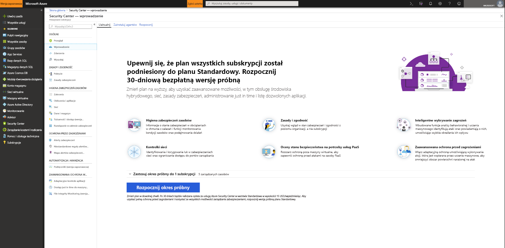
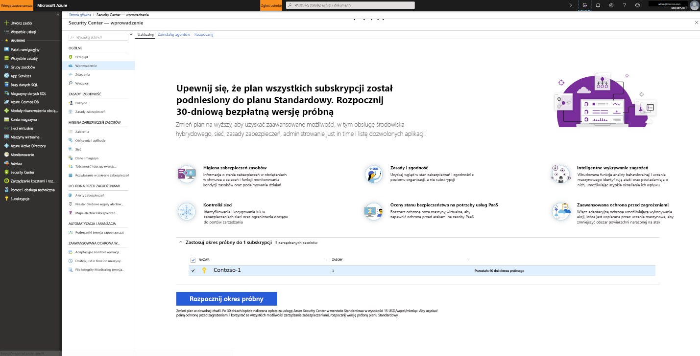

# Dołączanie do standardu usługi Azure Security Center w celu zapewnienia większego bezpieczeństwa
Uaktualnij system Security Center Standard, aby korzystać z ulepszonego zarządzania zabezpieczeniami i ochrony przed zagrożeniami dla obciążeń chmury hybrydowej. Możesz wypróbować Standard za darmo. Więcej informacji można znaleźć na [stronie cennika](https://azure.microsoft.com/pricing/details/security-center/) usługi Security Center.

Warstwa standardowa centrum zabezpieczeń obejmuje:

- **Zabezpieczenia hybrydowe** — uzyskaj ujednolicony widok zabezpieczeń we wszystkich obciążeniach lokalnych i chmurowych. Zastosuj zasady zabezpieczeń i stale oceniaj bezpieczeństwo obciążeń chmury hybrydowej, aby zapewnić zgodność ze standardami zabezpieczeń. Zbieraj, wyszukuj i analizuj dane zabezpieczeń z różnych źródeł, w tym z zapór i innych rozwiązań partnerskich.
- **Alerty zabezpieczeń** — skorzystaj z zaawansowanej analizy i inteligentnego wykresu zabezpieczeń firmy Microsoft, aby uzyskać przewagę nad ewoluującymi atakami cybernetycznymi. Wykorzystaj wbudowaną analizę behawioralną i uczenie maszynowe, aby identyfikować ataki i exploity typu zero-day. Monitoruj sieci, maszyny i usługi w chmurze pod kątem ataków przychodzących i działań po naruszeniu. Usprawnij dochodzenie za pomocą interaktywnych narzędzi i kontekstowej analizy zagrożeń.
- **Kontrola dostępu i aplikacji** — blokowanie złośliwego oprogramowania i innych niechcianych aplikacji przez zastosowanie rekomendacji z białej listy dostosowanych do określonych obciążeń i opartych na uczeniu maszynowym. Zmniejsz obszar ataków sieciowych dzięki kontrolowanemu dostępowi do portów zarządzania na maszynach wirtualnych platformy Azure, co znacznie zmniejsza narażenie na brutalne ataki sieciowe i ataki sieciowe.

## Wykrywanie niechronionych zasobów
Usługa Security Center automatycznie wykrywa wszelkie subskrypcje i obszary robocze platformy Azure nie włączone do standardu usługi Security Center. Obejmuje to subskrypcje platformy Azure korzystające z usługi Security Center w warstwie bezpłatnej oraz obszary robocze, które nie mają włączonego rozwiązania w zakresie zabezpieczeń.

Można uaktualnić całą subskrypcję platformy Azure do warstwy standardowej, która jest dziedziczona przez wszystkie obsługiwane zasoby w ramach subskrypcji. Zastosowanie warstwy Standardowa do obszaru roboczego ma zastosowanie do wszystkich zasobów raportowania do obszaru roboczego.

> [!NOTE]
> Można zarządzać kosztami i ograniczyć ilość danych zebranych dla rozwiązania, ograniczając je do określonego zestawu agentów. [Kierowanie rozwiązania](../operations-management-suite/operations-management-suite-solution-targeting.md) umożliwia zastosowanie zakresu do rozwiązania i kierowanie podzbiór komputerów w obszarze roboczym. Jeśli używasz kierowania rozwiązania, Usługa Security Center wyświetla listę obszaru roboczego jako nie mającego rozwiązania.
>
>

## Uaktualnianie subskrypcji lub obszaru roboczego platformy Azure
Aby uaktualnić subskrypcję lub obszar roboczy do poziomu:
1. W menu głównym usługi Security Center wybierz pozycję **Wprowadzenie**.
  
2. W obszarze **Uaktualnienie** usługa Security Center wyświetla listę subskrypcji i obszarów roboczych, które kwalifikują się do dołączenia. 
   - Możesz kliknąć listę rozwijaną **Zastosuj wersję próbną**, aby wyświetlić listę wszystkich subskrypcji i obszarów roboczych ze stanem kwalifikacji do korzystania z wersji próbnej.
   -    Możesz uaktualnić subskrypcje i obszary robocze, które nie kwalifikują się do korzystania z wersji próbnej.
   -    Możesz wybrać kwalifikujące się obszary robocze i subskrypcje i rozpocząć korzystanie z wersji próbnej.
3.  Kliknij przycisk **Rozpocznij okres próbny**, aby rozpocząć okres próbny w ramach wybranych subskrypcji.
  

   > [!NOTE]
   > Bezpłatne funkcje usługi Security Center są stosowane tylko do maszyn wirtualnych platformy Azure i maszyn wirtualnych. Bezpłatne funkcje nie są stosowane do komputerów innych niż platformy Azure. Jeśli wybierzesz standard, standardowe funkcje są stosowane do wszystkich maszyn wirtualnych platformy Azure, zestawów skalowania maszyn wirtualnych i komputerów innych niż Platformy Azure raportowania do obszaru roboczego. Zaleca się zastosowanie standardu w celu zapewnienia zaawansowanych zabezpieczeń dla zasobów platformy Azure i innych niż platforma Azure.
   >

## Komputery dołączane do platformy Azure
Usługa Security Center może monitorować stan bezpieczeństwa komputerów nienależących do platformy Azure, ale musisz najpierw dołączyć te zasoby. Można dodać komputery spoza platformy Azure z **wprowadzenie bloku** lub z **obliczeń** bloku. Przejdziemy obiema metodami.

### Dodawanie nowych komputerów innych niż platforma Azure z **wprowadzeniem**

1. Powrót do **wprowadzenie**.
2. Wybierz kartę **Rozpoczęcie pracy**.

   

3. Kliknij przycisk **Konfiguruj** w obszarze **Dodaj nowe komputery spoza platformy Azure**. Zostanie wyświetlona lista obszarów roboczych usługi Log Analytics. Jeśli ma to zastosowanie, lista zawiera domyślny obszar roboczy utworzony przez usługę Security Center po włączeniu automatycznej aprowizacji. Wybierz ten obszar roboczy lub inny obszar roboczy, którego chcesz użyć.

   ![Dodawanie komputera spoza platformy Azure][7]

Jeśli masz istniejące obszary robocze, są one wymienione w obszarze **Dodaj nowe komputery nienaukowe**. Można dodać komputery do istniejącego obszaru roboczego lub utworzyć nowy obszar roboczy. Aby utworzyć nowy obszar roboczy, zaznacz łącze **dodaj nowy obszar roboczy**.

### Dodawanie nowych komputerów innych niż platforma Azure z **obliczeń**

**Tworzenie nowego obszaru roboczego i dodawanie komputera**

1. W obszarze **Dodawanie nowych komputerów innych niż platformy Azure**wybierz pozycję Dodaj nowy obszar **roboczy**.

   ![Dodawanie nowego obszaru roboczego][4]

2. W obszarze **Zabezpieczenia i inspekcje**wybierz **obszar roboczy systemu OMS,** aby utworzyć nowy obszar roboczy.
   > [!NOTE]
   > Obszary robocze OMS są teraz nazywane obszarami roboczymi usługi Log Analytics.
3. W **obszarze Obszar roboczy usługi OMS**wprowadź informacje dotyczące obszaru roboczego.
4. W **obszarze Obszar roboczy systemu OMS**wybierz pozycję **OK**. Po wybraniu przycisku OK otrzymasz łącze do pobrania agenta systemu Windows lub Linux oraz klucze identyfikatora obszaru roboczego używane do konfigurowania agenta.
5. W obszarze **Zabezpieczenia i inspekcje**wybierz pozycję **OK**.

**Wybieranie istniejącego obszaru roboczego i dodawanie komputera**

Komputer można dodać, wykonując przepływ pracy z **funkcji Dołączanie**, jak pokazano powyżej. Komputer można również dodać, wykonując przepływ pracy z **pliku Compute**. W tym przykładzie używamy **Compute**.

1. Wróć do menu głównego centrum zabezpieczeń i **pulpitu nawigacyjnego Przegląd.**

   ![Omówienie][5]

2. Wybierz **pozycję Oblicz & aplikacje**.
3. W obszarze **Obliczenia & aplikacji**wybierz pozycję Dodaj **komputery**.

   ![Blok Obliczanie][6]

4. W obszarze **Dodawanie nowych komputerów innych niż platforma Azure**wybierz obszar roboczy do połączenia komputera i kliknij pozycję Dodaj **komputery**.

   ![Dodawanie komputerów][7]

   **Blok agenta bezpośredniego** zawiera łącze do pobierania agenta systemu Windows lub Linux, a także identyfikator obszaru roboczego i klucze używane do konfigurowania agenta.

## Następne kroki
W tym artykule dowiesz się, jak dołączać zasoby platformy Azure i innych niż azure, aby korzystać z zaawansowanych zabezpieczeń usługi Security Center. Aby zrobić więcej z wbudowanymi zasobami, zobacz

- [Włączanie zbierania danych](security-center-enable-data-collection.md)
- [Raport analizy zagrożeń](security-center-threat-report.md)
- [Dostęp just in time do maszyny wirtualnej](security-center-just-in-time.md)

<!--Image references-->
[1]: ./media/security-center-onboarding/onboard.png
[2]: ./media/security-center-onboarding/onboard-subscription.png
[3]: ./media/security-center-onboarding/get-started.png
[4]: ./media/security-center-onboarding/create-workspace.png
[5]: ./media/security-center-onboarding/overview.png
[6]: ./media/security-center-onboarding/compute-blade.png
[7]: ./media/security-center-onboarding/add-computer.png
[8]: ./media/security-center-onboarding/onboard-workspace.png
