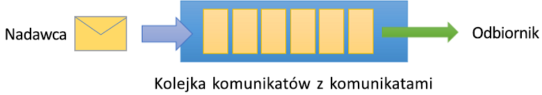

# Co to jest Azure Service Bus?

Usługa Microsoft Azure Service Bus jest w pełni zarządzanym brokerem komunikatów do [integracji](https://azure.com/integration) przedsiębiorstw. Usługa Service Bus jest najczęściej używana do rozdzielania aplikacji i usług oraz jest niezawodną i bezpieczną platformą do asynchronicznego przesyłania danych i stanu. Dane są przesyłane między różnymi aplikacjami i usługami przy użyciu *komunikatów*. Komunikat jest w formacie binarnym, który może zawierać kod JSON, XML lub po prostu tekst. 

Niektóre typowe scenariusze obsługi komunikatów:

* Obsługa komunikatów: przesyłanie danych biznesowych, takich jak zamówienia sprzedaży lub zakupu, dzienniki i przesunięcia magazynowe.
* Oddzielanie aplikacji: zwiększanie niezawodności i skalowalności aplikacji i usług (klient i usługa nie muszą być w tym samym czasie w trybie online).
* Tematy i subskrypcje: włączanie relacji 1:*n* między wydawcami i subskrybentami.
* Sesje komunikatów: wdrażanie przepływów pracy, które wymagają porządkowania lub odraczania komunikatów.

## Przestrzenie nazw

Przestrzeń nazw jest kontenerem określania zakresu dla wszystkich składników służących do obsługi komunikatów. W jednej przestrzeni nazw może znajdować się wiele kolejek i tematów, a przestrzenie nazw często pełnią rolę kontenerów aplikacji.

## Kolejki

Komunikaty są wysyłane do *kolejek* i odbierane z nich. Kolejki umożliwiają przechowywanie komunikatów tak długo, aż aplikacja odbierająca stanie się dostępna, pobierze je i rozpocznie ich przetwarzanie.

Komunikaty w kolejkach są uporządkowane i oznaczony sygnaturą czasową po przybyciu. Po zaakceptowaniu komunikat jest bezpiecznie przechowywany w magazynie nadmiarowym. Komunikaty są dostarczane w *ściągnięcia* trybu, który dostarcza komunikaty na żądanie.

## Tematy

Do wysyłania i odbierania komunikatów można również używać *tematów*. Kolejka jest często używana do komunikacji typu punkt-punkt, natomiast tematy są przydatne w scenariuszach publikowania/subskrypcji.

Tematy mogą mieć wiele niezależnych subskrypcji. Subskrybent tematu może otrzymywać kopie wszystkich komunikatów wysłanych do tego tematu. Subskrypcje to nazywane jednostki, które są tworzone na stałe, ale mogą opcjonalnie wygasać lub być automatycznie usuwane.

W niektórych scenariuszach odbieranie przez subskrypcje wszystkich komunikatów wysłanych do tematu może być niepożądane. W takim przypadku możesz użyć [reguł i filtrów](topic-filters.md), aby określić warunki, które wyzwalają opcjonalne [akcje](topic-filters.md#actions), przefiltrować określone komunikaty i ustawić lub zmodyfikować właściwości komunikatów.

## Funkcje zaawansowane

Usługa Service Bus ma również zaawansowane funkcje, które umożliwiają rozwiązywanie bardziej złożonych problemów z obsługą komunikatów. Te kluczowe funkcje zostały opisane w sekcjach poniżej:

### Sesje komunikatów

Aby zrealizować w usłudze Service Bus metodę FIFO („pierwszy na wejściu, pierwszy na wyjściu”), użyj sesji. [Sesje komunikatów](message-sessions.md) umożliwiają wspólną i uporządkowaną obsługę niepowiązanych sekwencji powiązanych komunikatów. 

### Automatyczne przekazywanie

Funkcja [automatycznego przekazywania](service-bus-auto-forwarding.md) służy do łączenia kolejki lub subskrypcji z inną kolejką lub innym tematem, które należą do tej samej przestrzeni nazw. Gdy funkcja automatycznego przekazywania jest włączona, usługa Service Bus automatycznie usuwa komunikaty znajdujące się w pierwszej kolejce lub subskrypcji (źródle) i umieszcza je w drugiej kolejce lub drugim temacie (celu).

### Obsługa utraconych komunikatów

Usługa Service Bus obsługuje [kolejkę utraconych komunikatów](service-bus-dead-letter-queues.md) (DLQ) na potrzeby przechowywania komunikatów, których nie można dostarczyć do żadnego odbiorcy lub których nie można przetworzyć. Te komunikaty można usunąć z kolejki DLQ lub zbadać.

### Zaplanowane dostarczanie

Komunikaty można przesyłać do kolejki lub tematu [w celu wykonania opóźnionego przetwarzania](message-sequencing.md#scheduled-messages), na przykład aby zaplanować udostępnienie zadania do przetwarzania przez system w określonym czasie.

### Odraczanie komunikatów

Gdy klient kolejki lub subskrypcji odbiera komunikat, który chce przetworzyć, ale w przypadku którego przetwarzanie nie jest obecnie możliwe ze względu na określone okoliczności w aplikacji, obiekt ma możliwość [odroczenia pobrania komunikatu](message-deferral.md) i pobrania go później. Komunikat pozostanie w kolejce lub subskrypcji, ale zostanie odłożony.

### Tworzenie partii

[Dzielenie na partie po stronie klienta](service-bus-performance-improvements.md#client-side-batching) umożliwia klientowi kolejki lub tematu opóźnienie wysłania komunikatu na pewien czas. Jeśli klient wysyła dodatkowe komunikaty w tym okresie, przesyła komunikaty w jednej partii. 

### Transakcje

[Transakcja](service-bus-transactions.md) grupuje razem co najmniej dwie operacje w zakresie wykonania. Usługa Service Bus obsługuje grupowanie operacji względem jednej jednostki obsługi komunikatów (kolejki, tematu, subskrypcji) w zakresie transakcji.

### Filtrowanie i akcje

Subskrybenci mogą zdefiniować, które komunikaty chcą odbierać z tematu. Komunikaty te są określone w formie co najmniej jednej [nazwanej reguły subskrypcji](topic-filters.md). Dla każdego pasującego warunku reguły subskrypcja tworzy kopię komunikatu, która może być inaczej adnotowana dla każdej pasującej reguły.

### Automatyczne usuwanie w stanie bezczynności

[Automatyczne usuwanie w stanie bezczynności](/dotnet/api/microsoft.servicebus.messaging.queuedescription.autodeleteonidle) służy do określania interwału bezczynności, po którym kolejka zostanie automatycznie usunięta. Minimalny czas trwania wynosi 5 minut.

### Wykrywanie duplikatów

Jeśli wystąpi błąd, który powoduje, że klient ma wątpliwości dotyczące wyniku operacji wysyłania, funkcja [wykrywania duplikatów](duplicate-detection.md) eliminuje te wątpliwości, umożliwiając wysyłającemu ponowne wysłanie tego samego komunikatu, a kolejka lub temat odrzuca wszystkie duplikaty.

### Sygnatura SAS, kontrola RBAC i tożsamości zarządzane dla zasobów platformy Azure

Usługa Service Bus obsługuje protokoły zabezpieczeń, np. [sygnatury dostępu współdzielonego](service-bus-sas.md) (SAS), [kontrolę dostępu na podstawie ról](service-bus-role-based-access-control.md) (RBAC) i [tożsamości zarządzane dla zasobów platformy Azure](service-bus-managed-service-identity.md).

### Geograficzne odzyskiwanie po awarii

Jeśli w regionach lub centrach danych Azure dojdzie do przestoju, [geograficzne odzyskiwanie po awarii](service-bus-geo-dr.md) umożliwia kontynuowanie przetwarzania danych w innym regionie lub centrum danych.

### Bezpieczeństwo

Usługa Service Bus obsługuje standardowe protokoły [AMQP 1.0](service-bus-amqp-overview.md) i [HTTP/REST](/rest/api/servicebus/).

## Biblioteki klienta

Usługa Service Bus obsługuje biblioteki klienckie środowisk [.NET](https://github.com/Azure/azure-service-bus-dotnet/tree/master), [Java](https://github.com/Azure/azure-service-bus-java/tree/master) i [JMS](https://github.com/Azure/azure-service-bus/tree/master/samples/Java/qpid-jms-client).

## Integracja

Usługa Service Bus w pełni integruje się z następującymi usługami platformy Azure:

- [Event Grid](https://azure.microsoft.com/services/event-grid/) 
- [Logic Apps](https://azure.microsoft.com/services/logic-apps/) 
- [Funkcje](https://azure.microsoft.com/services/functions/) 
- [Dynamics 365](https://dynamics.microsoft.com)
- [Stream Analytics](https://azure.microsoft.com/services/stream-analytics/)
 
## Kolejne kroki

Aby rozpocząć korzystanie z obsługi komunikatów usługi Service Bus, zobacz następujące artykuły:

* [Porównanie usług obsługi komunikatów platformy Azure](../event-grid/compare-messaging-services.md?toc=%2fazure%2fservice-bus-messaging%2ftoc.json&bc=%2fazure%2fservice-bus-messaging%2fbreadcrumb%2ftoc.json)
* Dodatkowe informacje na temat warstw [Standardowej i Premium](https://azure.microsoft.com/pricing/details/service-bus/) usługi Azure Service Bus oraz ich cen
* [Performance and Latency of Azure Service Bus Premium tier](https://blogs.msdn.microsoft.com/servicebus/2016/07/18/premium-messaging-how-fast-is-it/) (Wydajność i opóźnienie usługi Azure Service Bus w warstwie Premium)
* Wypróbuj przewodniki Szybki start dla technologii [.NET](service-bus-dotnet-get-started-with-queues.md), [Java](service-bus-java-how-to-use-queues.md) lub [JMS](service-bus-java-how-to-use-jms-api-amqp.md)
