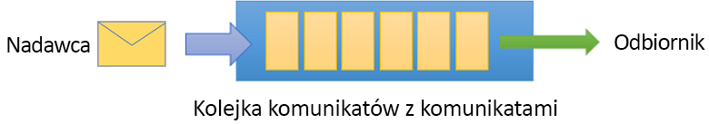
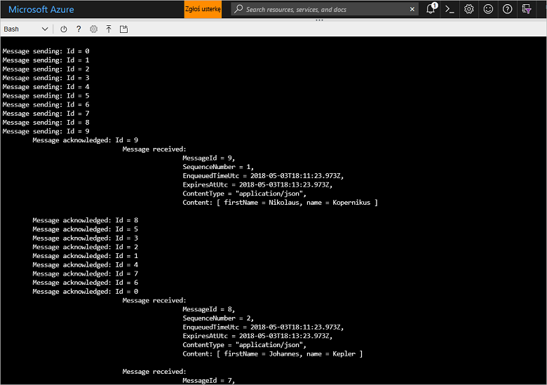

# <a name="quickstart-send-and-receive-messages-using-azure-cli-and-java"></a>Szybki start: wysyłanie i odbieranie komunikatów przy użyciu interfejsu wiersza polecenia Azure i środowiska Java

Microsoft Azure Service Bus jest brokerem komunikatów integracji przedsiębiorstwa, który zapewnia bezpieczne przesyłanie komunikatów oraz niezawodność. Typowy scenariusz usługi Service Bus obejmuje zwykle rozdzielanie od siebie co najmniej dwóch aplikacji, usług lub procesów (aplikacje nie muszą być w tym samym czasie w trybie online), przesyłanie zmian stanu lub danych oraz wysyłanie komunikatów między aplikacjami. 

Na przykład firma handlowa może wysłać dane z punktu sprzedaży na zaplecze biura lub do regionalnego centrum dystrybucji w celu uzupełnienia zapasów oraz aktualizacji zapasów magazynowych. W tym przypadku aplikacja kliencka wysyła i odbiera komunikaty z kolejki usługi Service Bus:



W tym przewodniku Szybki start opisano, jak wysyłać i odbierać komunikaty za pomocą usługi Service Bus przy użyciu interfejsu wiersza polecenia Azure oraz biblioteki Java usługi Service Bus. Jeśli interesują Cię inne szczegóły techniczne, możesz [przeczytać wyjaśnienie](#understand-the-sample-code) dotyczące kluczowych elementów przykładowego kodu.

Jeśli nie masz subskrypcji platformy Azure, przed rozpoczęciem możesz utworzyć [bezpłatne konto][].

[!INCLUDE [cloud-shell-try-it.md](../../includes/cloud-shell-try-it.md)]

## <a name="log-in-to-azure"></a>Zaloguj się do platformy Azure.

Kliknij przycisk Cloud Shell w prawym górnym rogu menu w witrynie Azure Portal i z listy rozwijanej **Wybierz środowisko** wybierz opcję **Bash**. 

## <a name="use-cli-to-create-resources"></a>Używanie interfejsu wiersza polecenia do utworzenia zasobów

W usłudze Cloud Shell w wierszu polecenia programu Bash wydaj następujące polecenia w celu zainicjowania zasobów usługi Service Bus. Pamiętaj, aby zastąpić wszystkie elementy zastępcze odpowiednimi wartościami:

```azurecli-interactive
# Create a resource group
az group create --name myResourceGroup --location eastus

# Create a Service Bus messaging namespace with a unique name
namespaceName=myNameSpace$RANDOM
az servicebus namespace create \
   --resource-group myResourceGroup \
   --name $namespaceName \
   --location eastus

# Create a Service Bus queue
az servicebus queue create --resource-group myResourceGroup \
   --namespace-name $namespaceName \
   --name myQueue

# Get the connection string for the namespace
connectionString=$(az servicebus namespace authorization-rule keys list \
   --resource-group myResourceGroup \
   --namespace-name  $namespaceName \
   --name RootManageSharedAccessKey \
   --query primaryConnectionString --output tsv)
```

Po uruchomieniu ostatniego polecenia skopiuj i wklej parametry połączenia oraz nazwę wybranej kolejki do lokalizacji tymczasowej, np. Notatnika. Będą one potrzebne w kolejnym kroku.

## <a name="send-and-receive-messages"></a>Wysyłanie i odbieranie komunikatów

Po utworzeniu przestrzeni nazw i kolejki (i jeśli użytkownik ma wszystkie niezbędne poświadczenia) można wysyłać i odbierać komunikaty. Kod można przeanalizować w [tym folderze przykładów usługi GitHub](https://github.com/Azure/azure-service-bus/tree/master/samples/Java/quickstarts-and-tutorials/quickstart-java/src/main/java/samples/quickstart/SendAndReceiveMessages.java).

1. Upewnij się, że usługa Cloud Shell jest uruchomiona i wyświetla wiersz polecenia Bash.

2. Sklonuj [repozytorium GitHub usługi Service Bus](https://github.com/Azure/azure-service-bus/), wpisując następujące polecenie:

   ```bash
   git clone https://github.com/Azure/azure-service-bus.git
   ```

2. Zmień bieżący katalog na przykładowy folder przy użyciu ukośników jako separatorów ścieżek:

   ```bash
   cd azure-service-bus/samples/Java/quickstarts-and-tutorials/quickstart-java 
   ```

3. Wydaj następujące polecenie, aby skompilować aplikację:
   
   ```bash
   mvn clean package -DskipTests
   ```

4. Aby uruchomić program, wpisz następujące polecenie. Dopóki powłoka Bash nie zostanie ponownie uruchomiona, zmienna zawierająca wartość parametrów połączenia będzie automatycznie zastępowana:

   ```bash
   java -jar ./target/samples.quickstart-1.0.0-jar-with-dependencies.jar -c $connectionString -q myQueue
   ```

6. Zobacz, że do kolejki jest wysyłanych 10 komunikatów. Zauważ, że kolejność komunikatów nie jest gwarantowana, ale widać wysłane komunikaty, które następnie są potwierdzane i odbierane razem z danymi ładunku:

   

## <a name="clean-up-resources"></a>Oczyszczanie zasobów

Uruchom następujące polecenie, aby usunąć grupę zasobów, przestrzeń nazw i wszystkie powiązane zasoby:

```azurecli-interactive
az group delete --resource-group myResourceGroup
```

## <a name="understand-the-sample-code"></a>Omówienie przykładowego kodu

Ta sekcja zawiera więcej szczegółów na temat kluczowych sekcji przykładowego kodu. Kod znajdujący się w repozytorium GitHub można przeglądać [tutaj](https://github.com/Azure/azure-service-bus/blob/master/samples/Java/quickstarts-and-tutorials/quickstart-java/src/main/java/samples/quickstart/SendAndReceiveMessages.java).

### <a name="get-connection-string-and-queue"></a>Pobieranie kolejki i parametrów połączenia

Najpierw w kodzie są deklarowane dwie zmienne łańcuchowe, które są przekazywane do programu jako argumenty wiersza polecenia:

```java
String ConnectionString = null;
String QueueName = null;
```

Te wartości zostają dodane za pomocą parametrów i przydzielone w metodzie `runApp()`:

```java
public static void main(String[] args) {
    SendAndReceiveMessages app = new SendAndReceiveMessages();
    try {
        app.runApp(args);
        app.run();
    } catch (Exception e) {
        System.out.printf("%s", e.toString());
    }
    System.exit(0);
}

public void runApp(String[] args) {
    try {
        // parse connection string from command line             
        Options options = new Options();
        options.addOption(new Option("c", true, "Connection string"));
        options.addOption(new Option("q", true, "Queue Name"));
        CommandLineParser clp = new DefaultParser();
        CommandLine cl = clp.parse(options, args);
        if (cl.getOptionValue("c") != null && cl.getOptionValue("q") != null) {
            ConnectionString = cl.getOptionValue("c");
            QueueName =  cl.getOptionValue("q");
        }
        else
        {
            HelpFormatter formatter = new HelpFormatter();
            formatter.printHelp("run jar with", "", options, "", true);
        }

    } catch (Exception e) {
        System.out.printf("%s", e.toString());
    }
}
```

### <a name="create-queue-clients-to-send-and-receive"></a>Tworzenie klientów kolejek do wysyłania i odbierania

Aby wysyłać i odbierać komunikaty, metoda `run()` tworzy wystąpienia klientów kolejek, które zawierają parametry połączenia oraz nazwę kolejki. Ten kod służy do utworzenia dwóch klientów kolejek, po jednym do wysyłania i odbierania:

```java
public void run() throws Exception {
// Create a QueueClient instance for receiving using the connection string builder
// We set the receive mode to "PeekLock", meaning the message is delivered
// under a lock and must be acknowledged ("completed") to be removed from the queue
QueueClient receiveClient = new QueueClient(new ConnectionStringBuilder(ConnectionString, QueueName), ReceiveMode.PEEKLOCK);
this.registerReceiver(receiveClient);

// Create a QueueClient instance for sending and then asynchronously send messages.
QueueClient sendClient = new QueueClient(new ConnectionStringBuilder(ConnectionString, QueueName), ReceiveMode.PEEKLOCK);
```

Metoda `run()` rozpoczyna również operację asynchronicznego wysyłania komunikatów i zamyka kolejkę wysyłającą po zakończeniu operacji wysyłania:

```java
this.sendMessagesAsync(sendClient).thenRunAsync(() -> sendClient.closeAsync());
``` 

### <a name="construct-and-send-messages"></a>Tworzenie i wysyłanie komunikatów

Metoda `sendMessagesAsync()` tworzy zestaw 10 komunikatów i wysyła je asynchronicznie przy użyciu klienta kolejek:

```java
CompletableFuture<Void> sendMessagesAsync(QueueClient sendClient) {
List<HashMap<String, String>> data =
        GSON.fromJson(
                "[" +
                        "{'name' = 'Einstein', 'firstName' = 'Albert'}," +
                        "{'name' = 'Heisenberg', 'firstName' = 'Werner'}," +
                        "{'name' = 'Curie', 'firstName' = 'Marie'}," +
                        "{'name' = 'Hawking', 'firstName' = 'Steven'}," +
                        "{'name' = 'Newton', 'firstName' = 'Isaac'}," +
                        "{'name' = 'Bohr', 'firstName' = 'Niels'}," +
                        "{'name' = 'Faraday', 'firstName' = 'Michael'}," +
                        "{'name' = 'Galilei', 'firstName' = 'Galileo'}," +
                        "{'name' = 'Kepler', 'firstName' = 'Johannes'}," +
                        "{'name' = 'Kopernikus', 'firstName' = 'Nikolaus'}" +
                        "]",
                new TypeToken<List<HashMap<String, String>>>() {}.getType());

List<CompletableFuture> tasks = new ArrayList<>();
for (int i = 0; i < data.size(); i++) {
    final String messageId = Integer.toString(i);
    Message message = new Message(GSON.toJson(data.get(i), Map.class).getBytes(UTF_8));
    message.setContentType("application/json");
    message.setLabel("Scientist");
    message.setMessageId(messageId);
    message.setTimeToLive(Duration.ofMinutes(2));
    System.out.printf("\nMessage sending: Id = %s", message.getMessageId());
    tasks.add(
            sendClient.sendAsync(message).thenRunAsync(() -> {
                System.out.printf("\n\tMessage acknowledged: Id = %s", message.getMessageId());
            }));
}
return CompletableFuture.allOf(tasks.toArray(new CompletableFuture<?>[tasks.size()]));
```

### <a name="receive-messages"></a>Odbieranie komunikatów

Metoda `registerReceiver()` rejestruje wywołanie `RegisterMessageHandler` oraz ustawia niektóre opcje obsługi komunikatów:

```java
void registerReceiver(QueueClient queueClient) throws Exception {
    // register the RegisterMessageHandler callback
    queueClient.registerMessageHandler(new IMessageHandler() {
                           // callback invoked when the message handler loop has obtained a message
                           public CompletableFuture<Void> onMessageAsync(IMessage message) {
                               // receives message is passed to callback
                               if (message.getLabel() != null &&
                                       message.getContentType() != null &&
                                       message.getLabel().contentEquals("Scientist") &&
                                       message.getContentType().contentEquals("application/json")) {
                                    byte[] body = message.getBody();
                                   Map scientist = GSON.fromJson(new String(body, UTF_8), Map.class);

                                   System.out.printf(
                                           "\n\t\t\t\tMessage received: \n\t\t\t\t\t\tMessageId = %s, \n\t\t\t\t\t\tSequenceNumber = %s, \n\t\t\t\t\t\tEnqueuedTimeUtc = %s," +
                                                   "\n\t\t\t\t\t\tExpiresAtUtc = %s, \n\t\t\t\t\t\tContentType = \"%s\",  \n\t\t\t\t\t\tContent: [ firstName = %s, name = %s ]\n",
                                           message.getMessageId(),
                                           message.getSequenceNumber(),
                                           message.getEnqueuedTimeUtc(),
                                           message.getExpiresAtUtc(),
                                           message.getContentType(),
                                           scientist != null ? scientist.get("firstName") : "",
                                           scientist != null ? scientist.get("name") : "");
                               }
                               return CompletableFuture.completedFuture(null);
                           }

                           // callback invoked when the message handler has an exception to report
                           public void notifyException(Throwable throwable, ExceptionPhase exceptionPhase) {
                               System.out.printf(exceptionPhase + "-" + throwable.getMessage());
                           }
                       },
    // 1 concurrent call, messages are auto-completed, auto-renew duration
    new MessageHandlerOptions(1, true, Duration.ofMinutes(1)));

}
```

## <a name="next-steps"></a>Następne kroki

W tym artykule utworzono przestrzeń nazw usługi Service Bus oraz inne zasoby wymagane do wysyłania i odbierania komunikatów z kolejki. Aby dowiedzieć się więcej na temat pisania kodu w celu wysyłania i odbierania komunikatów, kontynuuj pracę z następującym samouczkiem dotyczącym usługi Service Bus:

> [!div class="nextstepaction"]
> [Aktualizuj magazyn przy użyciu interfejsu wiersza polecenia i środowiska Java](./service-bus-tutorial-topics-subscriptions-cli.md)

[bezpłatne konto]: https://azure.microsoft.com/free/?ref=microsoft.com&utm_source=microsoft.com&utm_medium=docs&utm_campaign=visualstudio
[fully qualified domain name]: https://wikipedia.org/wiki/Fully_qualified_domain_name
[Install the Azure CLI]: /cli/azure/install-azure-cli
[az group create]: /cli/azure/group#az_group_create