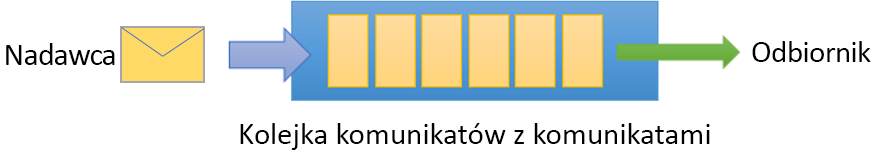
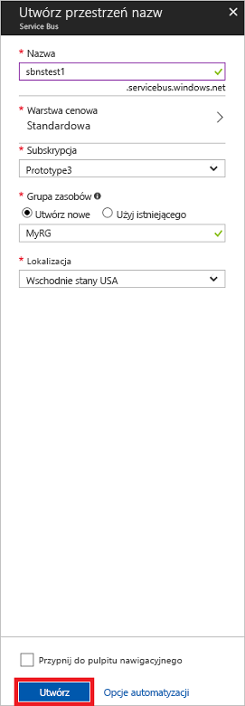

# <a name="quickstart-send-and-receive-messages-using-the-azure-portal-and-net"></a>Szybki start: wysyłanie i odbieranie komunikatów przy użyciu witryny Azure Portal i platformy .NET

Microsoft Azure Service Bus jest brokerem komunikatów integracji przedsiębiorstwa, który zapewnia bezpieczne przesyłanie komunikatów oraz całkowitą niezawodność. Typowy scenariusz usługi Service Bus zwykle wiąże się z rozdzieleniem co najmniej dwóch aplikacji, usług lub procesów oraz przesłaniem zmian stanu lub danych. Takie scenariusze mogą obejmować planowanie wielu zadań wsadowych w innej aplikacji lub innych usługach bądź wyzwalanie realizacji zamówienia. Na przykład firma handlowa może wysłać dane z punktu sprzedaży na zaplecze biura lub do regionalnego centrum dystrybucji w celu uzupełnienia zapasów oraz aktualizacji spisu inwentarza. W tym scenariuszu aplikacja kliencka wysyła komunikaty do kolejki usługi Service Bus i je z niej odbiera.  



W tym przewodniku Szybki start opisano, jak wysyłać i odbierać komunikaty do i z kolejki usługi Service Bus, używając witryny [Azure Portal][Azure portal] do utworzenia przestrzeni nazw do przesyłania komunikatów oraz kolejki w ramach tej przestrzeni nazw, a także uzyskać poświadczenia autoryzacji do tej przestrzeni nazw. Następnie w procedurze przedstawiono, jak wysyłać i odbierać komunikaty z tej kolejki przy użyciu [biblioteki platformy .NET Standard](https://www.nuget.org/packages/Microsoft.Azure.ServiceBus).

Jeśli nie masz subskrypcji platformy Azure, przed rozpoczęciem możesz utworzyć [bezpłatne konto][].

## <a name="prerequisites"></a>Wymagania wstępne

Aby ukończyć kroki tego samouczka, upewnij się, że zainstalowano następujące elementy:

- [Program Visual Studio 2017 Update 3 (wersja 15.3, 26730.01)](http://www.visualstudio.com/vs) lub nowszy.
- [Zestaw NET Core SDK](https://www.microsoft.com/net/download/windows), wersja 2.0 lub nowsza.

## <a name="log-on-to-the-azure-portal"></a>Logowanie w witrynie Azure Portal

Przejdź do witryny [Azure Portal][Azure portal] i zaloguj się przy użyciu subskrypcji platformy Azure. Pierwszym krokiem jest utworzenie przestrzeni nazw usługi Service Bus typu **Komunikaty**.

## <a name="create-a-service-bus-namespace"></a>Tworzenie przestrzeni nazw usługi Service Bus

Przestrzeń nazw obsługi komunikatów usługi Service Bus oferuje unikatowy kontener zakresu przywoływany przy użyciu jego [w pełni kwalifikowanej nazwy domeny][], w którym można utworzyć co najmniej jedną kolejkę, temat i subskrypcję. W poniższym przykładzie jest tworzona przestrzeń nazw obsługi komunikatów usługi Service Bus w nowej lub istniejącej [grupie zasobów](/azure/azure-resource-manager/resource-group-portal):

1. W lewym okienku nawigacji portalu kliknij kolejno pozycje **+ Utwórz zasób**, **Integracja w przedsiębiorstwie** i **Service Bus**.
2. W oknie dialogowym **Tworzenie przestrzeni nazw** wprowadź nazwę przestrzeni nazw. System od razu sprawdza, czy nazwa jest dostępna.
3. Po upewnieniu się, że nazwa przestrzeni nazw jest dostępna, wybierz warstwę cenową (Standardowa lub Premium).
4. W polu **Subskrypcja** wybierz subskrypcję platformy Azure, w której ma zostać utworzona przestrzeń nazw.
5. W polu **Grupa zasobów** wybierz istniejącą grupę zasobów, w której znajdzie się przestrzeń nazw, lub utwórz nową.      
6. W polu **Lokalizacja** wybierz kraj lub region, w którym powinna być hostowana przestrzeń nazw.
7. Kliknij przycisk **Utwórz**. W systemie zostanie utworzona i włączona przestrzeń nazw. Proces aprowizacji zasobów dla konta w systemie może potrwać kilka minut.



### <a name="obtain-the-management-credentials"></a>Uzyskiwanie poświadczeń zarządzania

Utworzenie nowej przestrzeni nazw powoduje automatyczne wygenerowanie początkowej reguły sygnatury dostępu współdzielonego ze skojarzoną parą kluczy podstawowego i pomocniczego, która przyznaje pełną kontrolę nad wszystkimi aspektami przestrzeni nazw. Aby skopiować początkową regułę, wykonaj następujące kroki: 

1.  Kliknij pozycję **Wszystkie zasoby**, a następnie kliknij nowo utworzoną nazwę przestrzeni nazw.
2. W oknie przestrzeni nazw kliknij pozycję **Zasady dostępu współdzielonego**.
3. Na ekranie **Zasady dostępu współdzielonego** kliknij pozycję **RootManageSharedAccessKey**.
4. W oknie **Zasady: RootManageSharedAccessKey** kliknij przycisk **Kopiuj** obok pozycji **Podstawowe parametry połączenia**, aby skopiować parametry połączenia do schowka w celu późniejszego użycia. Wklej tę wartość do Notatnika lub innej tymczasowej lokalizacji. 

    ![connection-string][connection-string]
5. Powtórz poprzedni krok, kopiując i wklejając wartość pozycji **Klucz podstawowy** w lokalizacji tymczasowej do późniejszego użycia.

## <a name="create-a-queue"></a>Tworzenie kolejki

Aby utworzyć kolejkę usługi Service Bus, określ przestrzeń nazw, w ramach której chcesz ją utworzyć. Poniższy przykład pokazuje, jak utworzyć kolejkę w portalu:

1. W lewym okienku nawigacji portalu kliknij pozycję **Service Bus** (jeśli pozycja **Service Bus** nie jest widoczna, kliknij pozycję **Więcej usług**).
2. Kliknij przestrzeń nazw, w której chcesz utworzyć kolejkę.
3. W oknie przestrzeni nazw kliknij pozycję **Kolejki**, a następnie w oknie **Kolejki** kliknij pozycję **+ Kolejka**.
4. W polu **Nazwa** wprowadź nazwę kolejki, a pozostałe wartości pozostaw domyślne.
5. W dolnej części okna kliknij pozycję **Utwórz**.
6. Zanotuj nazwę kolejki.

## <a name="send-and-receive-messages"></a>Wysyłanie i odbieranie komunikatów

Po aprowizowaniu przestrzeni nazw i kolejki i w przypadku posiadania niezbędnych poświadczeń można już wysyłać i odbierać komunikaty. Kod można zbadać w [tym folderze przykładów usługi GitHub](https://github.com/Azure/azure-service-bus/tree/master/samples/Java/quickstarts-and-tutorials/quickstart-jms).

Aby uruchomić kod, wykonaj następujące czynności:

1. Sklonuj [repozytorium GitHub usługi Service Bus](https://github.com/Azure/azure-service-bus/), wydając następujące polecenie:

   ```shell
   git clone https://github.com/Azure/azure-service-bus.git
   ```

3. Przejdź do folderu przykładów `azure-service-bus\samples\DotNet\GettingStarted\BasicSendReceiveQuickStart\BasicSendReceiveQuickStart`.

4. Skopiuj parametry połączenia i nazwę kolejki uzyskane w sekcji [Uzyskiwanie poświadczeń zarządzania](#obtain-the-management-credentials).

5.  W wierszu polecenia wpisz następujące polecenie:

   ```shell
   dotnet build
   ```

6.  Przejdź do folderu `bin\Debug\netcoreapp2.0`.

7.  Wpisz następujące polecenie, aby uruchomić program. Pamiętaj, aby zastąpić `myConnectionString` wcześniej uzyskaną wartością, a `myQueueName` nazwą utworzonej przez siebie kolejki:

   ```shell
   dotnet BasicSendReceiveQuickStart.dll -ConnectionString "myConnectionString" -QueueName "myQueueName"
   ``` 

8. Obserwuj 10 komunikatów wysłanych do kolejki, a następnie odebranych z kolejki:

   

## <a name="clean-up-resources"></a>Oczyszczanie zasobów

W portalu można usunąć grupę zasobów, przestrzeń nazw i kolejkę.

## <a name="understand-the-sample-code"></a>Omówienie przykładowego kodu

Ta sekcja zawiera więcej szczegółów na temat operacji wykonywanych przez przykładowy kod. 

### <a name="get-connection-string-and-queue"></a>Pobieranie kolejki i parametrów połączenia

Parametry połączenia i nazwa kolejki są przekazywane do metody `Main()` jako argumenty wiersza polecenia. Element `Main()` deklaruje dwie zmienne ciągu do przechowywania tych wartości:

```csharp
static void Main(string[] args)
{
    string ServiceBusConnectionString = "";
    string QueueName = "";

    for (int i = 0; i < args.Length; i++)
    {
        var p = new Program();
        if (args[i] == "-ConnectionString")
        {
            Console.WriteLine($"ConnectionString: {args[i+1]}");
            ServiceBusConnectionString = args[i + 1]; 
        }
        else if(args[i] == "-QueueName")
        {
            Console.WriteLine($"QueueName: {args[i+1]}");
            QueueName = args[i + 1];
        }                
    }

    if (ServiceBusConnectionString != "" && QueueName != "")
        MainAsync(ServiceBusConnectionString, QueueName).GetAwaiter().GetResult();
    else
    {
        Console.WriteLine("Specify -Connectionstring and -QueueName to execute the example.");
        Console.ReadKey();
    }                            
}
```
 
Metoda `Main()` następnie rozpoczyna asynchroniczną pętlę komunikatów, `MainAsync()`.

### <a name="message-loop"></a>Pętla komunikatów

Metoda MainAsync() tworzy klienta kolejki z argumentami wiersza polecenia, wywołuje procedurę obsługi komunikatów o nazwie `RegisterOnMessageHandlerAndReceiveMessages()` i wysyła zestaw komunikatów:

```csharp
static async Task MainAsync(string ServiceBusConnectionString, string QueueName)
{
    const int numberOfMessages = 10;
    queueClient = new QueueClient(ServiceBusConnectionString, QueueName);

    Console.WriteLine("======================================================");
    Console.WriteLine("Press any key to exit after receiving all the messages.");
    Console.WriteLine("======================================================");

    // Register QueueClient's MessageHandler and receive messages in a loop
    RegisterOnMessageHandlerAndReceiveMessages();

    // Send Messages
    await SendMessagesAsync(numberOfMessages);

    Console.ReadKey();

    await queueClient.CloseAsync();
}
```

Metoda `RegisterOnMessageHandlerAndReceiveMessages()` po prostu ustawia kilka opcji procedury obsługi komunikatów, a następnie wywołuje metodę `RegisterMessageHandler()` klienta kolejki, która rozpoczyna odbieranie:

```csharp
static void RegisterOnMessageHandlerAndReceiveMessages()
{
    // Configure the MessageHandler Options in terms of exception handling, number of concurrent messages to deliver etc.
    var messageHandlerOptions = new MessageHandlerOptions(ExceptionReceivedHandler)
    {
        // Maximum number of Concurrent calls to the callback `ProcessMessagesAsync`, set to 1 for simplicity.
        // Set it according to how many messages the application wants to process in parallel.
        MaxConcurrentCalls = 1,

        // Indicates whether MessagePump should automatically complete the messages after returning from User Callback.
        // False below indicates the Complete will be handled by the User Callback as in `ProcessMessagesAsync` below.
        AutoComplete = false
    };

    // Register the function that will process messages
    queueClient.RegisterMessageHandler(ProcessMessagesAsync, messageHandlerOptions);
} 
```

### <a name="send-messages"></a>Wysyłanie komunikatów

Operacje tworzenia i wysyłania komunikatów są wykonywane w ramach metody `SendMessagesAsync()`:

```csharp
static async Task SendMessagesAsync(int numberOfMessagesToSend)
{
    try
    {
        for (var i = 0; i < numberOfMessagesToSend; i++)
        {
            // Create a new message to send to the queue
            string messageBody = $"Message {i}";
            var message = new Message(Encoding.UTF8.GetBytes(messageBody));

            // Write the body of the message to the console
            Console.WriteLine($"Sending message: {messageBody}");

            // Send the message to the queue
            await queueClient.SendAsync(message);
        }
    }
    catch (Exception exception)
    {
        Console.WriteLine($"{DateTime.Now} :: Exception: {exception.Message}");
    }
}
```

### <a name="process-messages"></a>Przetwarzanie komunikatów

Metoda `ProcessMessagesAsync()` potwierdza, przetwarza i kończy odbieranie komunikatów:

```csharp
static async Task ProcessMessagesAsync(Message message, CancellationToken token)
{
    // Process the message
    Console.WriteLine($"Received message: SequenceNumber:{message.SystemProperties.SequenceNumber} Body:{Encoding.UTF8.GetString(message.Body)}");

    // Complete the message so that it is not received again.
    await queueClient.CompleteAsync(message.SystemProperties.LockToken);
}
```

## <a name="next-steps"></a>Następne kroki

W tym artykule utworzono przestrzeń nazw usługi Service Bus oraz inne zasoby wymagane do wysyłania i odbierania komunikatów z kolejki. Aby dowiedzieć się więcej na temat pisania kodu w celu wysyłania i odbierania komunikatów, kontynuuj pracę z następującym samouczkiem dotyczącym usługi Service Bus:

> [!div class="nextstepaction"]
> [Aktualizowanie spisu przy użyciu witryny Azure Portal](./service-bus-tutorial-topics-subscriptions-portal.md)


[bezpłatne konto]: https://azure.microsoft.com/free/?ref=microsoft.com&utm_source=microsoft.com&utm_medium=docs&utm_campaign=visualstudio
[w pełni kwalifikowanej nazwy domeny]: https://wikipedia.org/wiki/Fully_qualified_domain_name
[Azure portal]: https://portal.azure.com/

[connection-string]: ./media/service-bus-quickstart-portal/connection-string.png
[service-bus-flow]: ./media/service-bus-quickstart-portal/service-bus-flow.png
