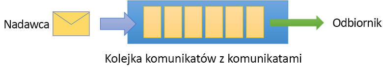

# <a name="quickstart-use-azure-powershell-to-create-a-service-bus-queue"></a>Szybki start: używanie programu Azure PowerShell do tworzenia kolejki usługi Service Bus
Microsoft Azure Service Bus jest brokerem komunikatów integracji przedsiębiorstwa, który zapewnia bezpieczne przesyłanie komunikatów oraz całkowitą niezawodność. Typowy scenariusz usługi Service Bus zwykle wiąże się z rozdzieleniem co najmniej dwóch aplikacji, usług lub procesów oraz przesłaniem zmian stanu lub danych. Takie scenariusze mogą obejmować planowanie wielu zadań wsadowych w innej aplikacji lub innych usługach bądź wyzwalanie realizacji zamówienia. Na przykład firma handlowa może wysłać dane z punktu sprzedaży na zaplecze biura lub do regionalnego centrum dystrybucji w celu uzupełnienia zapasów oraz aktualizacji spisu inwentarza. W tym scenariuszu aplikacja kliencka wysyła komunikaty do kolejki usługi Service Bus i je z niej odbiera.



W tym przewodniku Szybki start opisano, jak wysyłać i odbierać komunikaty z i do kolejki usługi Service Bus, używając programu PowerShell do utworzenia przestrzeni nazw na potrzeby przesyłania komunikatów i kolejki w ramach tej przestrzeni nazw, a także jak uzyskać poświadczenia autoryzacji do tej przestrzeni nazw. Następnie w procedurze przedstawiono, jak wysyłać i odbierać komunikaty z tej kolejki przy użyciu [biblioteki platformy .NET Standard](https://www.nuget.org/packages/Microsoft.Azure.ServiceBus).

Jeśli nie masz subskrypcji platformy Azure, przed rozpoczęciem utwórz [bezpłatne konto][].

[!INCLUDE [updated-for-az](../../includes/updated-for-az.md)]

## <a name="prerequisites"></a>Wymagania wstępne

Aby ukończyć kroki tego samouczka, upewnij się, że zainstalowano następujące elementy:

- [Program Visual Studio 2017 Update 3 (wersja 15.3, 26730.01)](https://www.visualstudio.com/vs) lub nowszy.
- [Zestaw NET Core SDK](https://www.microsoft.com/net/download/windows), wersja 2.0 lub nowsza.

Ten przewodnik Szybki start wymaga używania najnowszej wersji programu Azure PowerShell. Jeśli konieczna będzie instalacja lub uaktualnienie, zobacz [Instalowanie i konfigurowanie programu Azure PowerShell][].

## <a name="log-in-to-azure"></a>Zaloguj się do platformy Azure.

1. Najpierw, o ile ta czynność nie została jeszcze wykonana, należy zainstalować moduł programu PowerShell usługi Service Bus:

   ```azurepowershell-interactive
   Install-Module Az.ServiceBus
   ```

2. Uruchom następujące polecenie, aby zalogować się do platformy Azure:

   ```azurepowershell-interactive
   Login-AzAccount
   ```

3. Uruchom następujące polecenia, aby ustawić kontekst bieżącej subskrypcji lub wyświetlić aktualnie aktywną subskrypcję:

   ```azurepowershell-interactive
   Select-AzSubscription -SubscriptionName "MyAzureSubName" 
   Get-AzContext
   ```

## <a name="provision-resources"></a>Inicjowanie zasobów

W wierszu polecenia programu PowerShell uruchom następujące polecenia w celu zainicjowania zasobów usługi Service Bus. Pamiętaj, aby zastąpić wszystkie elementy zastępcze odpowiednimi wartościami:

```azurepowershell-interactive
# Create a resource group 
New-AzResourceGroup –Name my-resourcegroup –Location eastus

# Create a Messaging namespace
New-AzServiceBusNamespace -ResourceGroupName my-resourcegroup -NamespaceName namespace-name -Location eastus

# Create a queue 
New-AzServiceBusQueue -ResourceGroupName my-resourcegroup -NamespaceName namespace-name -Name queue-name -EnablePartitioning $False

# Get primary connection string (required in next step)
Get-AzServiceBusKey -ResourceGroupName my-resourcegroup -Namespace namespace-name -Name RootManageSharedAccessKey
```

Po uruchomieniu polecenia cmdlet `Get-AzServiceBusKey` skopiuj i wklej parametry połączenia oraz nazwę wybranej kolejki do lokalizacji tymczasowej, np. Notatnika. Będą one potrzebne w kolejnym kroku.

## <a name="send-and-receive-messages"></a>Wysyłanie i odbieranie komunikatów

Po utworzeniu przestrzeni nazw i kolejki (i jeśli masz niezbędne poświadczenia) możesz wysyłać i odbierać komunikaty. Kod można zbadać w [tym folderze przykładów usługi GitHub](https://github.com/Azure/azure-service-bus/tree/master/samples/DotNet/GettingStarted/BasicSendReceiveQuickStart).

Aby uruchomić kod, wykonaj następujące czynności:

1. Sklonuj [repozytorium GitHub usługi Service Bus](https://github.com/Azure/azure-service-bus/), wydając następujące polecenie:

   ```shell
   git clone https://github.com/Azure/azure-service-bus.git
   ```

3. Przejdź do folderu przykładów `azure-service-bus\samples\DotNet\GettingStarted\BasicSendReceiveQuickStart\BasicSendReceiveQuickStart`.

4. Jeśli ta czynność nie została jeszcze wykonana, uzyskaj parametry połączenia przy użyciu następującego polecenia cmdlet programu PowerShell. Koniecznie Zastąp `my-resourcegroup` i `namespace-name` przy użyciu określonych wartości: 

   ```azurepowershell-interactive
   Get-AzServiceBusKey -ResourceGroupName my-resourcegroup -Namespace namespace-name -Name RootManageSharedAccessKey
   ```

5. W wierszu polecenia programu PowerShell wpisz następujące polecenie:

   ```shell
   dotnet build
   ```

6. Przejdź do folderu `bin\Debug\netcoreapp2.0`.

7. Wpisz następujące polecenie, aby uruchomić program. Pamiętaj, aby zastąpić `myConnectionString` wcześniej uzyskaną wartością, a `myQueueName` nazwą utworzonej przez siebie kolejki:

   ```shell
   dotnet BasicSendReceiveQuickStart.dll -ConnectionString "myConnectionString" -QueueName "myQueueName"
   ``` 

8. Obserwuj 10 komunikatów wysłanych do kolejki, a następnie odebranych z niej:

   

## <a name="clean-up-resources"></a>Oczyszczanie zasobów

Uruchom następujące polecenie, aby usunąć grupę zasobów, przestrzeń nazw i wszystkie powiązane zasoby:

```powershell-interactive
Remove-AzResourceGroup -Name my-resourcegroup
```

## <a name="understand-the-sample-code"></a>Omówienie przykładowego kodu

Ta sekcja zawiera więcej szczegółów na temat operacji wykonywanych przez przykładowy kod. 

### <a name="get-connection-string-and-queue"></a>Pobieranie kolejki i parametrów połączenia

Parametry połączenia i nazwa kolejki są przekazywane do metody `Main()` jako argumenty wiersza polecenia. `Main()` deklaruje dwie zmienne ciągu do przechowywania tych wartości:

```csharp
static void Main(string[] args)
{
    string ServiceBusConnectionString = "";
    string QueueName = "";

    for (int i = 0; i < args.Length; i++)
    {
        var p = new Program();
        if (args[i] == "-ConnectionString")
        {
            Console.WriteLine($"ConnectionString: {args[i+1]}");
            ServiceBusConnectionString = args[i + 1]; 
        }
        else if(args[i] == "-QueueName")
        {
            Console.WriteLine($"QueueName: {args[i+1]}");
            QueueName = args[i + 1];
        }                
    }

    if (ServiceBusConnectionString != "" && QueueName != "")
        MainAsync(ServiceBusConnectionString, QueueName).GetAwaiter().GetResult();
    else
    {
        Console.WriteLine("Specify -Connectionstring and -QueueName to execute the example.");
        Console.ReadKey();
    }                            
}
```
 
Metoda `Main()` następnie rozpoczyna asynchroniczną pętlę komunikatów, `MainAsync()`.

### <a name="message-loop"></a>Pętla komunikatów

Metoda MainAsync() tworzy klienta kolejki z argumentami wiersza polecenia, wywołuje procedurę obsługi komunikatów o nazwie `RegisterOnMessageHandlerAndReceiveMessages()` i wysyła zestaw komunikatów:

```csharp
static async Task MainAsync(string ServiceBusConnectionString, string QueueName)
{
    const int numberOfMessages = 10;
    queueClient = new QueueClient(ServiceBusConnectionString, QueueName);

    Console.WriteLine("======================================================");
    Console.WriteLine("Press any key to exit after receiving all the messages.");
    Console.WriteLine("======================================================");

    // Register QueueClient's MessageHandler and receive messages in a loop
    RegisterOnMessageHandlerAndReceiveMessages();

    // Send Messages
    await SendMessagesAsync(numberOfMessages);

    Console.ReadKey();

    await queueClient.CloseAsync();
}
```

Metoda `RegisterOnMessageHandlerAndReceiveMessages()` po prostu ustawia kilka opcji procedury obsługi komunikatów, a następnie wywołuje metodę `RegisterMessageHandler()` klienta kolejki, która rozpoczyna odbieranie:

```csharp
static void RegisterOnMessageHandlerAndReceiveMessages()
{
    // Configure the MessageHandler Options in terms of exception handling, number of concurrent messages to deliver etc.
    var messageHandlerOptions = new MessageHandlerOptions(ExceptionReceivedHandler)
    {
        // Maximum number of Concurrent calls to the callback `ProcessMessagesAsync`, set to 1 for simplicity.
        // Set it according to how many messages the application wants to process in parallel.
        MaxConcurrentCalls = 1,

        // Indicates whether MessagePump should automatically complete the messages after returning from User Callback.
        // False below indicates the Complete will be handled by the User Callback as in `ProcessMessagesAsync` below.
        AutoComplete = false
    };

    // Register the function that will process messages
    queueClient.RegisterMessageHandler(ProcessMessagesAsync, messageHandlerOptions);
} 
```

### <a name="send-messages"></a>Wysyłanie komunikatów

Operacje tworzenia i wysyłania komunikatów są wykonywane w metodzie `SendMessagesAsync()`:

```csharp
static async Task SendMessagesAsync(int numberOfMessagesToSend)
{
    try
    {
        for (var i = 0; i < numberOfMessagesToSend; i++)
        {
            // Create a new message to send to the queue
            string messageBody = $"Message {i}";
            var message = new Message(Encoding.UTF8.GetBytes(messageBody));

            // Write the body of the message to the console
            Console.WriteLine($"Sending message: {messageBody}");

            // Send the message to the queue
            await queueClient.SendAsync(message);
        }
    }
    catch (Exception exception)
    {
        Console.WriteLine($"{DateTime.Now} :: Exception: {exception.Message}");
    }
}
```

### <a name="process-messages"></a>Przetwarzanie komunikatów

Metoda `ProcessMessagesAsync()` potwierdza, przetwarza i kończy odbieranie komunikatów:

```csharp
static async Task ProcessMessagesAsync(Message message, CancellationToken token)
{
    // Process the message
    Console.WriteLine($"Received message: SequenceNumber:{message.SystemProperties.SequenceNumber} Body:{Encoding.UTF8.GetString(message.Body)}");

    // Complete the message so that it is not received again.
    await queueClient.CompleteAsync(message.SystemProperties.LockToken);
}
```

## <a name="next-steps"></a>Kolejne kroki

W tym artykule utworzono przestrzeń nazw usługi Service Bus oraz inne zasoby wymagane do wysyłania i odbierania komunikatów z kolejki. Aby dowiedzieć się więcej na temat pisania kodu w celu wysyłania i odbierania komunikatów, kontynuuj pracę z następującym samouczkiem dotyczącym usługi Service Bus:

> [!div class="nextstepaction"]
> [Aktualizowanie spisu przy użyciu programu Azure PowerShell](./service-bus-tutorial-topics-subscriptions-powershell.md)

[bezpłatne konto na platformie Azure]: https://azure.microsoft.com/free/?ref=microsoft.com&utm_source=microsoft.com&utm_medium=docs&utm_campaign=visualstudio
[Instalowanie i konfigurowanie programu Azure PowerShell]: /powershell/azure/install-Az-ps
