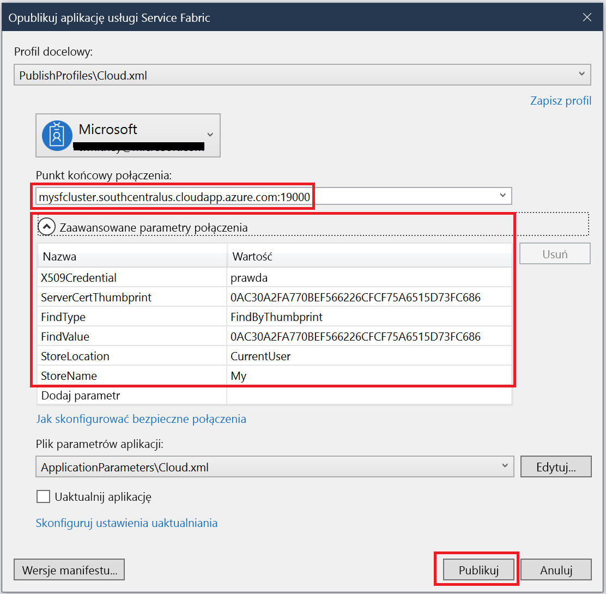

# <a name="quickstart-deploy-windows-containers-to-service-fabric"></a>Szybki start: Wdrażanie kontenerów systemu Windows w usłudze Service Fabric

Usługa Azure Service Fabric to platforma systemów rozproszonych ułatwiająca pakowanie i wdrażanie skalowalnych oraz niezawodnych mikrousług i kontenerów, a także zarządzanie nimi.

Uruchomienie istniejącej aplikacji w kontenerze systemu Windows w klastrze usługi Service Fabric nie wymaga dokonywania żadnych zmian w aplikacji. W tym przewodniku Szybki start przedstawiono sposób wdrażania wstępnie skompilowanego obrazu kontenera platformy Docker w aplikacji usługi Service Fabric. Po zakończeniu będziesz mieć uruchomiony serwer z systemem Windows Server Core 2016 i usługi IIS. W tym przewodniku szybki start opisano wdrażanie kontenera systemu Windows. Przeczytaj [ten przewodnik Szybki Start](service-fabric-quickstart-containers-linux.md) , aby wdrożyć kontener systemu Linux.

![Domyślna strona internetowa usług IIS][iis-default]

W tym przewodniku Szybki start zawarto informacje na temat wykonywania następujących czynności:

* Pakowanie kontenera obrazu platformy Docker
* Konfigurowanie komunikacji
* Kompilowanie i tworzenie pakietu aplikacji usługi Service Fabric
* Wdrażanie aplikacji kontenera na platformie Azure


[!INCLUDE [updated-for-az](../../includes/updated-for-az.md)]

## <a name="prerequisites"></a>Wymagania wstępne

* Subskrypcja platformy Azure (można utworzyć [bezpłatne konto](https://azure.microsoft.com/free/?WT.mc_id=A261C142F)).
* Komputer dewelopera z następującym oprogramowaniem:
  * Visual Studio 2019 lub Windows 2019.
  * [Zestaw SDK usługi Service Fabric oraz narzędzia](service-fabric-get-started.md).

## <a name="package-a-docker-image-container-with-visual-studio"></a>Pakowanie kontenera obrazu platformy Docker przy użyciu programu Visual Studio

Zestaw SDK usługi Service Fabric oraz narzędzia udostępniają szablon usługi ułatwiający wdrażanie kontenera w klastrze usługi Service Fabric.

Uruchom program Visual Studio jako administrator.  Wybierz kolejno pozycje **Plik** > **Nowy** > **Projekt**.

Wybierz **Service Fabric aplikację**, nadaj jej nazwę "MyFirstContainer", a następnie kliknij pozycję **Utwórz**.

Wybierz pozycję **Kontener** z szablonów **Hostowane kontenery i aplikacje**.

W polu **Nazwa obrazu**wprowadź wartość "MCR.Microsoft.com/Windows/ServerCore/IIS:windowsservercore-ltsc2016", podstawowy [obraz serwera Windows Server Core i usług IIS](https://hub.docker.com/_/microsoft-windows-servercore-iis).

Skonfiguruj mapowanie portów kontenera typu „port do hosta” w taki sposób, aby żądania przychodzące do usługi na porcie 80 były mapowane na port 80 w kontenerze.  Ustaw wartość „80” dla pozycji **Port kontenera** i **Port hosta**.  

Nazwij usługę „MyContainerService”, a następnie kliknij przycisk **OK**.

![Okno dialogowe nowej usługi][new-service]

## <a name="specify-the-os-build-for-your-container-image"></a>Określanie kompilacji systemu operacyjnego dla obrazu kontenera

Kontenery utworzone za pomocą określonej wersji systemu Windows Server mogą nie działać na hoście z uruchomioną inną wersją tego systemu. Na przykład kontenery utworzone przy użyciu systemu Windows Server w wersji 1709 nie są uruchamiane na hostach z systemem Windows Server 2016. Aby dowiedzieć się więcej, zobacz temat [Windows Server container OS and host OS compatibility](service-fabric-get-started-containers.md#windows-server-container-os-and-host-os-compatibility) (Zgodność między systemami operacyjnymi Windows Server kontenera i hosta). 

W przypadku środowiska uruchomieniowego usługi Service Fabric w wersji 6.1 i nowszych można określić wiele obrazów systemu operacyjnego dla kontenera i oznaczyć każdy z nich wersją kompilacji systemu operacyjnego, na którym powinien zostać wdrożony. Ułatwia to zapewnienie, że aplikację będzie można uruchomić na hostach z różnymi wersjami systemu operacyjnego Windows. Aby dowiedzieć się więcej, zobacz temat [Określanie obrazów kontenera dla kompilacji systemu operacyjnego](service-fabric-get-started-containers.md#specify-os-build-specific-container-images). 

Firma Microsoft publikuje różne obrazy dla wersji oprogramowania IIS opartych na różnych wersjach systemu Windows Serwer. Aby się upewnić, że usługa Service Fabric wdraża kontener zgodny z wersją systemu Windows Server uruchomionego na węzłach klastra, na których wdraża aplikację, dodaj następujące wiersze do pliku *ApplicationManifest.xml*. Wersja kompilacji dla systemu Windows Server 2016 to 14393, a dla systemu Windows Server w wersji 1709 — 16299.

```xml
    <ContainerHostPolicies CodePackageRef="Code"> 
      <ImageOverrides> 
        ...
          <Image Name="mcr.microsoft.com/windows/servercore/iis:windowsservercore-1803" /> 
          <Image Name= "mcr.microsoft.com/windows/servercore/iis:windowsservercore-ltsc2016" Os="14393" /> 
          <Image Name="mcr.microsoft.com/windows/servercore/iis:windowsservercore-1709" Os="16299" /> 
      </ImageOverrides> 
    </ContainerHostPolicies> 
```

Manifest usługi nadal określa tylko jeden obraz dla nanoserwera, `mcr.microsoft.com/windows/servercore/iis:windowsservercore-ltsc2016`.

Ponadto w pliku *ApplicationManifest.xml* zmień wartość ustawienia **PasswordEncrypted** na **false**. W przypadku obrazu kontenera publicznego znajdującego się w usłudze Docker Hub konto i hasło są puste, dlatego wyłączamy szyfrowanie, ponieważ szyfrowanie pustego hasła spowoduje wygenerowanie błędu kompilacji.

```xml
<RepositoryCredentials AccountName="" Password="" PasswordEncrypted="false" />
```

## <a name="create-a-cluster"></a>Tworzenie klastra

Następujący przykładowy skrypt tworzy klaster usługi Service Fabric z pięcioma węzłami zabezpieczony za pomocą certyfikatu X.509. Polecenie tworzy certyfikat z podpisem własnym i przekazuje go do nowego magazynu kluczy. Certyfikat jest też kopiowany do katalogu lokalnego. Dowiedz się więcej na temat tworzenia klastra przy użyciu tego skryptu w temacie [Tworzenie klastra usługi Service Fabric](scripts/service-fabric-powershell-create-secure-cluster-cert.md).

W razie potrzeby zainstaluj program Azure PowerShell przy użyciu instrukcji dostępnych w [przewodniku programu Azure PowerShell](/powershell/azure/overview).

Przed uruchomieniem poniższego skryptu programu PowerShell uruchom polecenie `Connect-AzAccount` w celu utworzenia połączenia z platformą Azure.

Skopiuj poniższy skrypt do Schowka i otwórz program **Windows PowerShell ISE**.  Wklej tę zawartość w pustym oknie pliku Untitled1.ps1. Następnie podaj wartości zmiennych w skrypcie: `subscriptionId` `certfolder`, `certpwd` `adminuser` `adminpwd`,,, i tak dalej.  Katalog określony w zmiennej `certfolder` musi istnieć przed uruchomieniem skryptu.

[!code-powershell[main](../../powershell_scripts/service-fabric/create-secure-cluster/create-secure-cluster.ps1 "Create a Service Fabric cluster")]

Po podaniu wartości dla zmiennych naciśnij klawisz **F5** , aby uruchomić skrypt.

Po uruchomieniu skryptu i utworzeniu klastra znajdź w danych wyjściowych pozycję `ClusterEndpoint`. Na przykład:

```powershell
...
ClusterEndpoint : https://southcentralus.servicefabric.azure.com/runtime/clusters/b76e757d-0b97-4037-a184-9046a7c818c0
```

### <a name="install-the-certificate-for-the-cluster"></a>Instalowanie certyfikatu dla klastra

Teraz zainstalujemy plik PFX w magazynie certyfikatów *CurrentUser\My* . Plik PFX będzie znajdować się w katalogu określonym za pomocą zmiennej środowiskowej `certfolder` w przedstawionym powyżej skrypcie programu PowerShell.

Przejdź do tego katalogu, a następnie uruchom następujące polecenie programu PowerShell, zastępując nazwę pliku PFX znajdującego się w `certfolder` katalogu i hasło określone `certpwd` w zmiennej. W tym przykładzie jako bieżący katalog jest ustawiony katalog określony przez zmienną `certfolder` w skrypcie programu PowerShell. Z jego poziomu uruchamiane jest polecenie `Import-PfxCertificate`:

```powershell
PS C:\mycertificates> Import-PfxCertificate -FilePath .\mysfclustergroup20190130193456.pfx -CertStoreLocation Cert:\CurrentUser\My -Password (ConvertTo-SecureString Password#1234 -AsPlainText -Force)
```

Polecenie zwraca odcisk palca:

```powershell
  ...
  PSParentPath: Microsoft.PowerShell.Security\Certificate::CurrentUser\My

Thumbprint                                Subject
----------                                -------
0AC30A2FA770BEF566226CFCF75A6515D73FC686  CN=mysfcluster.SouthCentralUS.cloudapp.azure.com
```

Zapamiętaj wartość odcisku palca na potrzeby następnego kroku.

## <a name="deploy-the-application-to-azure-using-visual-studio"></a>Wdrażanie aplikacji na platformie Azure przy użyciu programu Visual Studio

Kiedy aplikacja jest gotowa, można wdrożyć ją w klastrze bezpośrednio z programu Visual Studio.

Kliknij prawym przyciskiem myszy pozycję **MyFirstContainer** w Eksploratorze rozwiązań i wybierz polecenie **Publikuj**. Zostanie wyświetlone okno dialogowe Publikowanie.

Skopiuj zawartość występującą po **CN=** w oknie programu PowerShell po uruchomieniu polecenia `Import-PfxCertificate` powyżej, a następnie dodaj do niej port `19000`. Na przykład `mysfcluster.SouthCentralUS.cloudapp.azure.com:19000`. Skopiuj tę zawartość do pola **Punkt końcowy połączenia**. Pamiętaj tę wartość, ponieważ będzie ona potrzebna w przyszłym kroku.

Kliknij pozycję **Zaawansowane parametry połączenia**, a następnie zweryfikuj informacje dotyczące parametru połączenia.  Wartości *FindValue* i *ServerCertThumbprint* muszą być zgodne z odciskiem palca certyfikatu zainstalowanego za pomocą polecenia `Import-PfxCertificate` w poprzednim kroku.



Kliknij przycisk **publikowania**.

Każda aplikacja w klastrze musi mieć unikatową nazwę. W przypadku konfliktu nazw Zmień nazwę projektu programu Visual Studio i Wdróż go ponownie.

Otwórz przeglądarkę i przejdź do adresu, który został umieszczony w polu **Punkt końcowy połączenia** w poprzednim kroku. Adres URL można opcjonalnie poprzedzić identyfikatorem schematu `http://` i dołączyć port `:80`. Na przykład http:\//mysfcluster.SouthCentralUS.cloudapp.Azure.com:80.

 Powinna zostać wyświetlona domyślna strona internetowa usług IIS: ![Domyślna strona internetowa usług IIS][iis-default]

## <a name="clean-up"></a>Czyszczenie

Podczas działania klastra nadal są naliczane opłaty. Rozważ [usunięcie klastra](service-fabric-cluster-delete.md).

## <a name="next-steps"></a>Kolejne kroki

W tym przewodniku Szybki start zawarto informacje na temat wykonywania następujących czynności:

* Pakowanie kontenera obrazu platformy Docker
* Konfigurowanie komunikacji
* Kompilowanie i tworzenie pakietu aplikacji usługi Service Fabric
* Wdrażanie aplikacji kontenera na platformie Azure

Aby dowiedzieć się więcej na temat pracy z kontenerami systemu Windows w usłudze Service Fabric, przejdź do samouczka dotyczącego aplikacji kontenerów systemu Windows.

> [!div class="nextstepaction"]
> [Tworzenie aplikacji kontenerów systemu Windows](./service-fabric-host-app-in-a-container.md)

[iis-default]: ./media/service-fabric-quickstart-containers/iis-default.png
[publish-dialog]: ./media/service-fabric-quickstart-containers/publish-dialog.png
[new-service]: ./media/service-fabric-quickstart-containers/NewService.png
