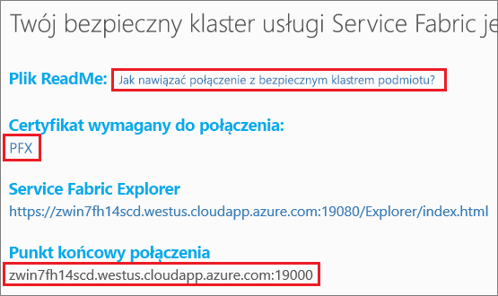

# <a name="quickstart-deploy-windows-containers-to-service-fabric"></a>Szybki start: wdrażanie kontenerów systemu Windows do usługi Service Fabric

Usługa Azure Service Fabric to platforma systemów rozproszonych ułatwiająca pakowanie i wdrażanie skalowalnych oraz niezawodnych mikrousług i kontenerów, a także zarządzanie nimi.

Uruchomienie istniejącej aplikacji w kontenerze systemu Windows w klastrze usługi Service Fabric nie wymaga dokonywania żadnych zmian w aplikacji. W tym przewodniku Szybki start przedstawiono sposób wdrażania wstępnie skompilowanego obrazu kontenera platformy Docker w aplikacji usługi Service Fabric. Po zakończeniu będziesz mieć uruchomiony kontener systemu Windows Server 2016 Nano Server i usług IIS. W tym przewodniku Szybki start opisano wdrażanie kontenera dla systemu Windows. Aby wdrożyć kontener dla systemu Linux, zapoznaj się z [tym przewodnikiem Szybki start](service-fabric-quickstart-containers-linux.md).

![Domyślna strona internetowa usług IIS][iis-default]

W tym przewodniku Szybki start zawarto informacje na temat wykonywania następujących czynności:

* Pakowanie kontenera obrazu platformy Docker
* Konfigurowanie komunikacji
* Kompilowanie i tworzenie pakietu aplikacji usługi Service Fabric
* Wdrażanie aplikacji kontenera na platformie Azure

## <a name="prerequisites"></a>Wymagania wstępne

* Subskrypcja platformy Azure (można utworzyć [bezpłatne konto](https://azure.microsoft.com/free/?WT.mc_id=A261C142F)).
* Komputer dewelopera z następującym oprogramowaniem:
  * Program Visual Studio 2015 lub Visual Studio 2017.
  * [Zestaw SDK usługi Service Fabric oraz narzędzia](service-fabric-get-started.md).

## <a name="package-a-docker-image-container-with-visual-studio"></a>Pakowanie kontenera obrazu platformy Docker przy użyciu programu Visual Studio

Zestaw SDK usługi Service Fabric oraz narzędzia udostępniają szablon usługi ułatwiający wdrażanie kontenera w klastrze usługi Service Fabric.

Uruchom program Visual Studio jako administrator.  Wybierz kolejno pozycje **Plik** > **Nowy** > **Projekt**.

Wybierz pozycję **Aplikacja usługi Service Fabric**, nadaj jej nazwę „MyFirstContainer” i kliknij przycisk **OK**.

Wybierz pozycję **Kontener** z szablonów **Hostowane kontenery i aplikacje**.

W polu **Nazwa obrazu** wprowadź wartość „microsoft/iis:nanoserver”, [podstawowy obraz serwera Nano Server systemu Windows Server i usług IIS](https://hub.docker.com/r/microsoft/iis/).

Skonfiguruj mapowanie portów kontenera typu „port do hosta” w taki sposób, aby żądania przychodzące do usługi na porcie 80 były mapowane na port 80 w kontenerze.  Ustaw wartość „80” dla pozycji **Port kontenera** i **Port hosta**.  

Nazwij usługę „MyContainerService”, a następnie kliknij przycisk **OK**.

<<<<<<< Zaktualizowano elementy nadrzędne ![Okno dialogowe nowej usługi][new-service]
=======
## <a name="configure-communication-and-container-port-to-host-port-mapping"></a>Konfigurowanie komunikacji i mapowania portów kontenera typu „port do hosta”

Usługa wymaga punktu końcowego na potrzeby komunikacji.  W tym przewodniku Szybki start konteneryzowana usługa nasłuchuje na porcie 80.  W eksploratorze rozwiązań otwórz plik *MyFirstContainer/ApplicationPackageRoot/MyContainerServicePkg/ServiceManifest.xml*.  Zaktualizuj istniejący element `Endpoint` w pliku ServiceManifest.xml, a następnie dodaj protokół, port i schemat identyfikatora URI:

```xml
<Resources>
    <Endpoints>
        <Endpoint Name="MyContainerServiceTypeEndpoint" UriScheme="http" Port="80" Protocol="http"/>
   </Endpoints>
</Resources>
```

Jeśli zostanie określony parametr `UriScheme`, punkt końcowy kontenera zostanie automatycznie zarejestrowany w usłudze Service Fabric Naming, aby można go było odnaleźć. Pełny przykładowy plik ServiceManifest.xml znajduje się na końcu tego artykułu.

Skonfiguruj mapowanie portów kontenera typu „port do hosta” w taki sposób, aby żądania przychodzące do usługi na porcie 80 były mapowane na port 80 w kontenerze.  W eksploratorze rozwiązań otwórz plik *MyFirstContainer/ApplicationPackageRoot/ApplicationManifest.xml*, a następnie określ zasady `PortBinding` w elemencie `ContainerHostPolicies`.  W tym przewodniku Szybki start wartością parametru `ContainerPort` jest 80, a wartością parametru `EndpointRef` jest „MyContainerServiceTypeEndpoint” (punkt końcowy zdefiniowany w manifeście usługi).

```xml
<ServiceManifestImport>
...
  <ConfigOverrides />
  <Policies>
    <ContainerHostPolicies CodePackageRef="Code">
      <PortBinding ContainerPort="80" EndpointRef="MyContainerServiceTypeEndpoint"/>
    </ContainerHostPolicies>
  </Policies>
</ServiceManifestImport>
```

Pełny przykładowy plik ApplicationManifest.xml znajduje się na końcu tego artykułu.
>>>>>>> Tymczasowe zmiany

## <a name="specify-the-os-build-for-your-container-image"></a>Określanie kompilacji systemu operacyjnego dla obrazu kontenera
Kontenery utworzone za pomocą określonej wersji systemu Windows Server mogą nie działać na hoście z uruchomioną inną wersją tego systemu. Na przykład kontenery utworzone przy użyciu systemu Windows Server w wersji 1709 nie działają na hostach z systemem Windows Server w wersji 2016. Aby dowiedzieć się więcej, zobacz temat [Windows Server container OS and host OS compatibility](service-fabric-get-started-containers.md#windows-server-container-os-and-host-os-compatibility) (Zgodność między systemami operacyjnymi Windows Server kontenera i hosta). 

W przypadku środowiska uruchomieniowego usługi Service Fabric w wersji 6.1 i nowszych można określić wiele obrazów systemu operacyjnego dla kontenera i oznaczyć każdy z nich wersją kompilacji systemu operacyjnego, na którym powinien zostać wdrożony. Ułatwia to zapewnienie, że aplikację będzie można uruchomić na hostach z różnymi wersjami systemu operacyjnego Windows. Aby dowiedzieć się więcej, zobacz temat [Określanie obrazów kontenera dla kompilacji systemu operacyjnego](service-fabric-get-started-containers.md#specify-os-build-specific-container-images). 

Firma Microsoft publikuje różne obrazy dla wersji oprogramowania IIS opartych na różnych wersjach systemu Windows Serwer. Aby się upewnić, że usługa Service Fabric wdraża kontener zgodny z wersją systemu Windows Server uruchomionego na węzłach klastra, na których wdraża aplikację, dodaj następujące wiersze do pliku *ApplicationManifest.xml*. Wersja kompilacji dla systemu Windows Server 2016 to 14393, a dla systemu Windows Server w wersji 1709 — 16299. 

```xml
    <ContainerHostPolicies CodePackageRef="Code"> 
      <ImageOverrides> 
        ...
          <Image Name="microsoft/iis:nanoserverDefault" /> 
          <Image Name= "microsoft/iis:nanoserver" Os="14393" /> 
          <Image Name="microsoft/iis:windowsservercore-1709" Os="16299" /> 
      </ImageOverrides> 
    </ContainerHostPolicies> 
```

Manifest usługi nadal określa tylko jeden obraz dla nanoserwera, `microsoft/iis:nanoserver`. 

## <a name="create-a-cluster"></a>Tworzenie klastra

Aby wdrożyć aplikację w klastrze na platformie Azure, możesz dołączyć do klastra testowego. Klastry testowe to bezpłatne, ograniczone czasowo klastry usługi Service Fabric hostowane na platformie Azure i uruchamiane przez zespół usługi Service Fabric, w których każdy może wdrażać aplikacje i poznawać platformę.  Klaster używa jednego certyfikatu z podpisem własnym w przypadku zabezpieczeń między węzłami, jak i zabezpieczeń między klientem i węzłem. Klastry testowe obsługują kontenery. Jeśli zdecydujesz się skonfigurować własny klaster i używać go, musi on działać w jednostce SKU obsługującej kontenery (np. Windows Server Datacenter 2016 z kontenerami).

Zaloguj się i [dołącz do klastra z systemem Windows](http://aka.ms/tryservicefabric). Pobierz certyfikat PFX na komputer, klikając link **PFX**. Kliknij link **Jak nawiązać połączenie z zabezpieczonym klastrem testowym?** i skopiuj hasło certyfikatu. Certyfikat, hasło certyfikatu oraz wartość pola **Punkt końcowy połączenia** będą używane w kolejnych krokach.



> [!Note]
> Liczba klastrów testowych dostępnych przez godzinę jest ograniczona. Jeśli wystąpi błąd podczas próby tworzenia konta umożliwiającego korzystanie z klastra testowego, możesz poczekać, a następnie spróbować ponownie. Możesz też wykonać kroki opisane w samouczku [Wdrażanie aplikacji .NET](https://docs.microsoft.com/azure/service-fabric/service-fabric-tutorial-deploy-app-to-party-cluster#deploy-the-sample-application), aby utworzyć klaster usługi Service Fabric w subskrypcji platformy Azure i wdrożyć w nim aplikację. Klaster utworzony za pomocą programu Visual Studio obsługuje kontenery. Po wdrożeniu i zweryfikowaniu aplikacji w klastrze możesz przejść od razu do sekcji [Kompletny przykład aplikacji i manifestów usługi Service Fabric](#complete-example-service-fabric-application-and-service-manifests) w tym przewodniku Szybki start.
>

Na komputerze z systemem Windows zainstaluj plik PFX w magazynie certyfikatów *CurrentUser\My*.

```powershell
PS C:\mycertificates> Import-PfxCertificate -FilePath .\party-cluster-873689604-client-cert.pfx -CertStoreLocation Cert:\CurrentUser\My -Password (ConvertTo-SecureString 873689604 -AsPlainText -Force)


  PSParentPath: Microsoft.PowerShell.Security\Certificate::CurrentUser\My

Thumbprint                                Subject
----------                                -------
3B138D84C077C292579BA35E4410634E164075CD  CN=zwin7fh14scd.westus.cloudapp.azure.com
<<<<<<< Updated upstream
``` 
=======
```

Remember the thumbprint for the following step.
>>>>>>> Stashed changes

## Deploy the application to Azure using Visual Studio

Now that the application is ready, you can deploy it to a cluster directly from Visual Studio.

Right-click **MyFirstContainer** in the Solution Explorer and choose **Publish**. The Publish dialog appears.

<<<<<<< Updated upstream
Copy the **Connection Endpoint** from the Party cluster page into the **Connection Endpoint** field. For example, `zwin7fh14scd.westus.cloudapp.azure.com:19000`. 
=======
Copy the **Connection Endpoint** from the Party cluster page into the **Connection Endpoint** field. For example, `zwin7fh14scd.westus.cloudapp.azure.com:19000`. Click **Advanced Connection Parameters** and verify the connection parameter information.  *FindValue* and *ServerCertThumbprint* values must match the thumbprint of the certificate installed in the previous step.


>>>>>>> Stashed changes

Click **Publish**.

Each application in the cluster must have a unique name.  Party clusters are a public, shared environment however and there may be a conflict with an existing application.  If there is a name conflict, rename the Visual Studio project and deploy again.

Open a browser and navigate to the **Connection endpoint** specified in the Party cluster page. You can optionally prepend the scheme identifier, `http://`, and append the port, `:80`, to the URL. For example, http://zwin7fh14scd.westus.cloudapp.azure.com:80. You should see the IIS default web page:
![IIS default web page][iis-default]

<<<<<<< Updated upstream
=======
## Complete example Service Fabric application and service manifests

Here are the complete service and application manifests used in this quickstart.

### ServiceManifest.xml

```xml
<?xml version="1.0" encoding="utf-8"?>
<ServiceManifest Name="MyContainerServicePkg"
                 Version="1.0.0"
                 xmlns="http://schemas.microsoft.com/2011/01/fabric"
                 xmlns:xsd="http://www.w3.org/2001/XMLSchema"
                 xmlns:xsi="http://www.w3.org/2001/XMLSchema-instance">
  <ServiceTypes>
    <!-- This is the name of your ServiceType.
         The UseImplicitHost attribute indicates this is a guest service. -->
    <StatelessServiceType ServiceTypeName="MyContainerServiceType" UseImplicitHost="true" />
  </ServiceTypes>

  <!-- Code package is your service executable. -->
  <CodePackage Name="Code" Version="1.0.0">
    <EntryPoint>
      <!-- Follow this link for more information about deploying Windows containers to Service Fabric: https://aka.ms/sfguestcontainers -->
      <ContainerHost>
        <ImageName>microsoft/iis:nanoserver</ImageName>
      </ContainerHost>
    </EntryPoint>
    <!-- Pass environment variables to your container: -->
    <!--
    <EnvironmentVariables>
      <EnvironmentVariable Name="VariableName" Value="VariableValue"/>
    </EnvironmentVariables>
    -->
  </CodePackage>

  <!-- Config package is the contents of the Config directoy under PackageRoot that contains an 
       independently-updateable and versioned set of custom configuration settings for your service. -->
  <ConfigPackage Name="Config" Version="1.0.0" />

  <Resources>
    <Endpoints>
      <!-- This endpoint is used by the communication listener to obtain the port on which to 
           listen. Please note that if your service is partitioned, this port is shared with 
           replicas of different partitions that are placed in your code. -->
      <Endpoint Name="MyContainerServiceTypeEndpoint" UriScheme="http" Port="80" Protocol="http"/>
    </Endpoints>
  </Resources>
</ServiceManifest>
```

### <a name="applicationmanifestxml"></a>ApplicationManifest.xml

```xml
<?xml version="1.0" encoding="utf-8"?>
<ApplicationManifest ApplicationTypeName="MyFirstContainerType"
                     ApplicationTypeVersion="1.0.0"
                     xmlns="http://schemas.microsoft.com/2011/01/fabric"
                     xmlns:xsd="http://www.w3.org/2001/XMLSchema"
                     xmlns:xsi="http://www.w3.org/2001/XMLSchema-instance">
  <Parameters>
    <Parameter Name="MyContainerService_InstanceCount" DefaultValue="-1" />
  </Parameters>
  <!-- Import the ServiceManifest from the ServicePackage. The ServiceManifestName and ServiceManifestVersion 
       should match the Name and Version attributes of the ServiceManifest element defined in the 
       ServiceManifest.xml file. -->
  <ServiceManifestImport>
    <ServiceManifestRef ServiceManifestName="MyContainerServicePkg" ServiceManifestVersion="1.0.0" />
    <ConfigOverrides />
    <Policies>
      <ContainerHostPolicies CodePackageRef="Code">
        <PortBinding ContainerPort="80" EndpointRef="MyContainerServiceTypeEndpoint"/>
      </ContainerHostPolicies>
    </Policies>
  </ServiceManifestImport>
  <DefaultServices>
    <!-- The section below creates instances of service types, when an instance of this 
         application type is created. You can also create one or more instances of service type using the 
         ServiceFabric PowerShell module.
         
         The attribute ServiceTypeName below must match the name defined in the imported ServiceManifest.xml file. -->
    <Service Name="MyContainerService" ServicePackageActivationMode="ExclusiveProcess">
      <StatelessService ServiceTypeName="MyContainerServiceType" InstanceCount="[MyContainerService_InstanceCount]">
        <SingletonPartition />
      </StatelessService>
    </Service>
  </DefaultServices>
</ApplicationManifest>
```

>>>>>>> Tymczasowe zmiany
## <a name="next-steps"></a>Następne kroki

W tym przewodniku Szybki start zawarto informacje na temat wykonywania następujących czynności:

* Pakowanie kontenera obrazu platformy Docker
* Konfigurowanie komunikacji
* Kompilowanie i tworzenie pakietu aplikacji usługi Service Fabric
* Wdrażanie aplikacji kontenera na platformie Azure

Aby dowiedzieć się więcej na temat pracy z kontenerami systemu Windows w usłudze Service Fabric, przejdź do samouczka dotyczącego aplikacji kontenerów systemu Windows.

> [!div class="nextstepaction"]
> [Tworzenie aplikacji kontenerów systemu Windows](./service-fabric-host-app-in-a-container.md)

[iis-default]: ./media/service-fabric-quickstart-containers/iis-default.png
[publish-dialog]: ./media/service-fabric-quickstart-containers/publish-dialog.png
[new-service]: ./media/service-fabric-quickstart-containers/NewService.png
