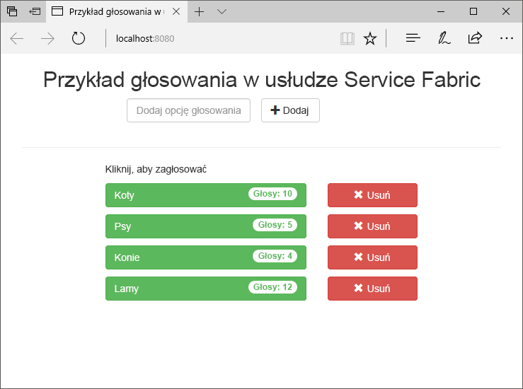
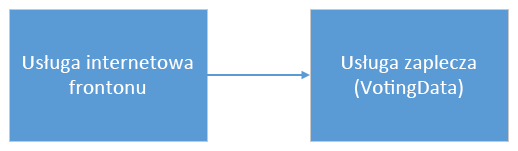
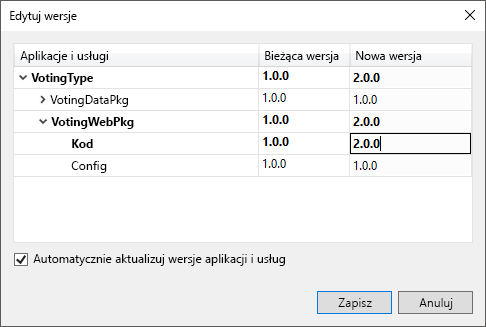
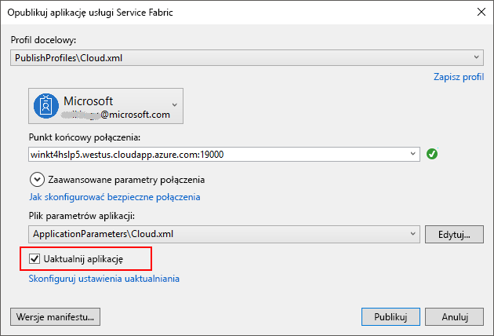
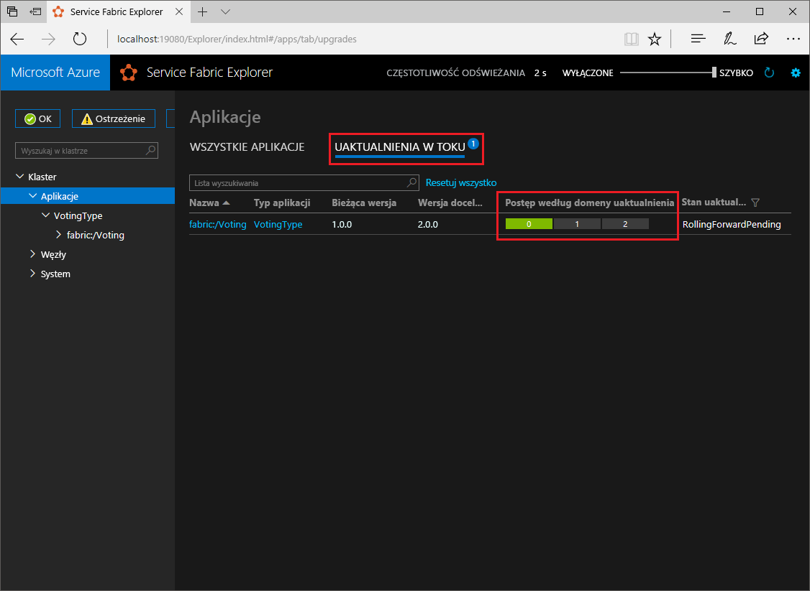

# <a name="quickstart-deploy-a-net-reliable-services-application-to-service-fabric"></a>Szybki start: wdrażanie aplikacji niezawodnych usług .NET w usłudze Service Fabric

Usługa Azure Service Fabric to platforma systemów rozproszonych ułatwiająca pakowanie i wdrażanie skalowalnych oraz niezawodnych mikrousług i kontenerów, a także zarządzanie nimi.

W tym przewodniku Szybki start pokazano, jak wdrożyć pierwszą aplikację platformy .NET w usłudze Service Fabric. Po zakończeniu będziesz mieć aplikację do głosowania z usługą internetową frontonu ASP.NET Core, która zapisuje wyniki głosowania w stanowej usłudze zaplecza w klastrze.



Korzystając z tej aplikacji, nauczysz się wykonywać następujące czynności:

* Tworzenie aplikacji przy użyciu platformy .NET i usługi Service Fabric
* Korzystanie z ASP.NET rdzeń jako frontonu sieci Web
* Przechowywanie danych aplikacji w usłudze stanowej
* Debugowanie aplikacji lokalnie
* Skalowanie aplikacji w poziomie na wiele węzłów
* Przeprowadzanie stopniowego uaktualnienia aplikacji

## <a name="prerequisites"></a>Wymagania wstępne

Aby ukończyć ten przewodnik Szybki start:

1. [Zainstaluj program Visual Studio 2019](https://www.visualstudio.com/) z obciążeniami deweloperskimi i **ASP.NET** na **platformie Azure** .
2. [Zainstaluj oprogramowanie Git](https://git-scm.com/)
3. [Zainstaluj zestaw SDK usługi Microsoft Azure Service Fabric](https://www.microsoft.com/web/handlers/webpi.ashx?command=getinstallerredirect&appid=MicrosoftAzure-ServiceFabric-CoreSDK)
4. Uruchom następujące polecenie, aby umożliwić programowi Visual Studio wdrażanie w lokalnym klastrze usługi Service Fabric:

   ```powershell
   Set-ExecutionPolicy -ExecutionPolicy Unrestricted -Force -Scope CurrentUser
   ```
    
## <a name="build-a-cluster"></a>Tworzenie klastra

Po zainstalowaniu środowiska uruchomieniowego, zestawów SDK, narzędzi programu Visual Studio i platformy Docker oraz uruchomieniu platformy Docker utwórz pięciowęzłowy lokalny klaster projektowy.

> [!Note]
> Powodem uruchamiania platformy Docker podczas tworzenia klastra jest utworzenie klastra z włączonymi funkcjami kontenerów. Jeśli platforma Docker nie będzie uruchomiona, konieczne będzie ponowne utworzenie klastra w celu włączenia funkcji kontenerów.
> Mimo iż nie jest to konieczne w przypadku tego przewodnika Szybki Start, instrukcja dotycząca uruchamiania platformy Docker podczas tworzenia klastra jest uwzględniona jako najlepsze rozwiązanie.
> Aby sprawdzić, czy platforma Docker jest uruchomiona, otwórz okno terminalu i uruchom polecenie `docker ps`. Jeśli odpowiedź nie wskazuje na wystąpienie błędu, oznacza to, że platforma Docker jest uruchomiona i można przystąpić do tworzenia klastra.

1. Otwórz nowe okno programu PowerShell jako administrator.
2. Utwórz klaster projektowy za pomocą następującego polecenia programu PowerShell:

   ```powershell
   . "C:\Program Files\Microsoft SDKs\Service Fabric\ClusterSetup\DevClusterSetup.ps1"
   ```
3. Uruchom menedżera klastra lokalnego za pomocą następującego polecenia:

   ```powershell
   . "C:\Program Files\Microsoft SDKs\Service Fabric\Tools\ServiceFabricLocalClusterManager\ServiceFabricLocalClusterManager.exe"
   ```

>[!NOTE]
> Przykładowa aplikacja w tym przewodniku Szybki start korzysta z funkcji, które nie są dostępne w systemie Windows 7.
>

## <a name="download-the-sample"></a>Pobierz przykład

W oknie polecenia uruchom następujące polecenie, aby sklonować przykładowe repozytorium aplikacji na komputer lokalny.

```git
git clone https://github.com/Azure-Samples/service-fabric-dotnet-quickstart
```

## <a name="run-the-application-locally"></a>Uruchamianie aplikacji lokalnie

Kliknij prawym przyciskiem myszy ikonę programu Visual Studio w menu Start i wybierz polecenie **Uruchom jako administrator**. Aby dołączyć debuger do usług, musisz uruchomić program Visual Studio jako administrator.

Otwórz rozwiązanie **Voting.sln** programu Visual Studio ze sklonowanego repozytorium.

Domyślnie aplikacja do głosowania nasłuchuje na porcie 8080.  Port aplikacji jest ustawiony w pliku */VotingWeb/PackageRoot/ServiceManifest.xml*.  Port aplikacji możesz zmienić, aktualizując atrybut **Port** elementu **Punkt końcowy**.  Aby wdrożyć i uruchomić aplikację lokalnie, port aplikacji musi być otwarty i dostępny na komputerze.  W przypadku zmiany portu aplikacji należy zastąpić nową wartość portu aplikacji dla "8080" w tym artykule.

Aby wdrożyć aplikację, naciśnij klawisz **F5**.

> [!NOTE]
> W oknie danych wyjściowych programu Visual Studio zostanie wyświetlony komunikat „Adres URL aplikacji nie jest ustawiony lub nie jest adresem URL określającym protokół HTTP/HTTPS, więc aplikacja nie zostanie otwarta przez przeglądarkę”.  Ten komunikat nie wskazuje błędu, ale oznacza, że przeglądarka nie zostanie automatyczne uruchomiona.

Po zakończeniu wdrażania uruchom przeglądarkę i otwórz stronę `http://localhost:8080`, aby wyświetlić fronton internetowy aplikacji.


Teraz możesz dodać zestaw opcji głosowania i rozpocząć obsługę głosów. Aplikacja zostanie uruchomiona i będzie przechować wszystkie dane w klastrze usługi Service Fabric, bez konieczności używania oddzielnej bazy danych.

## <a name="walk-through-the-voting-sample-application"></a>Szczegółowe omówienie przykładowej aplikacji do głosowania

Aplikacja do głosowania składa się z dwóch usług:

* Usługa internetowa frontonu (VotingWeb) — usługa internetowa frontonu platformy ASP.NET Core, obsługująca stronę internetową i ujawniająca interfejsy API sieci Web na potrzeby komunikacji z usługą zaplecza.
* Usługi zaplecza (VotingData) — usługa internetowa platformy ASP.NET Core, która uwidacznia interfejs API do przechowywania wyników głosowania w niezawodnym słowniku utrwalonym na dysku.



Podczas głosowania w aplikacji wystąpią następujące zdarzenia:

1. Plik JavaScript wysyła żądanie głosowania do internetowego interfejsu API w usłudze internetowej frontonu jako żądanie HTTP PUT.

2. Usługa internetowa frontonu używa serwera proxy w celu zlokalizowania i przesłania żądania HTTP PUT do usługi zaplecza.

3. Usługa zaplecza przyjmuje żądanie przychodzące i przechowuje zaktualizowany wynik w niezawodnym słowniku, który jest replikowany do wielu węzłów w klastrze i utrwalany na dysku. Wszystkie dane aplikacji są przechowywane w klastrze, więc baza danych nie jest wymagana.

## <a name="debug-in-visual-studio"></a>Debugowanie w programie Visual Studio

Aplikacja powinna być uruchomiona, ale przy użyciu debugera można zobaczyć, jak działają kluczowe części aplikacji. Podczas debugowania aplikacji w programie Visual Studio używany jest lokalny klaster projektowy Service Fabric. Możesz dostosować środowisko debugowania do swojego scenariusza. W tej aplikacji dane są przechowywane w usłudze zaplecza przy użyciu niezawodnego słownika. Program Visual Studio domyślnie usuwa aplikację po zatrzymaniu debugera. Usunięcie aplikacji spowoduje, że dane w usłudze zaplecza także zostaną usunięte. Aby zachować dane między sesjami debugowania, możesz zmienić **Tryb debugowania aplikacji** jako właściwość w projekcie **Voting (Głosowanie)** w programie Visual Studio.

Aby zobaczyć, co się stanie w kodzie, wykonaj następujące kroki:

1. Otwórz plik **/VotingWeb/Controllers/VotesController.cs** i ustaw punkt przerwania w metodzie **Put** internetowego interfejsu API (wiersz 69) — możesz wyszukać ten plik w Eksploratorze rozwiązań w programie Visual Studio.

2. Otwórz plik **/VotingData/Controllers/VoteDataController.cs** i ustaw punkt przerwania w metodzie **Put** tego internetowego interfejsu API (wiersz 54).

3. Wróć do przeglądarki i kliknij opcję głosowania lub dodaj nową opcję głosowania. Zostanie trafiony pierwszy punkt przerwania w kontrolerze interfejsu API frontonu internetowego.
   * Ten krok polega na tym, że JavaScript w przeglądarce wysyła żądanie do kontrolera internetowego interfejsu API w usłudze frontonu.

     

   * Najpierw skonstruuj adres URL do elementu ReverseProxy dla naszej usługi zaplecza **(1)** .
   * Następnie wyślij żądanie HTTP PUT do elementu ReverseProxy **(2)** .
   * Na koniec zwróć odpowiedź z usługi zaplecza do klienta **(3)** .

4. Naciśnij klawisz **F5**, aby kontynuować
   - Jeśli przeglądarka wyświetli monit, przyznaj grupie ServiceFabricAllowedUsers uprawnienia do odczytu i wykonywania dla trybu debugowania.
   - Jesteś teraz w punkcie przerwania w usłudze zaplecza.

     

   - W pierwszym wierszu metody **(1)** element `StateManager` pobiera lub dodaje niezawodny słownik o nazwie `counts`.
   - Wszystkie interakcje z wartościami w niezawodnym słowniku wymagają transakcji — ta instrukcja using **(2)** tworzy tę transakcję.
   - W transakcji zaktualizuj wartość odpowiedniego klucza dla opcji głosowania i zatwierdź operację **(3)** . Po powrocie z metody zatwierdzania dane są aktualizowane w słowniku i replikowane do innych węzłów w klastrze. Dane są bezpiecznie przechowywane w klastrze, a usługa zaplecza może zostać przełączona w tryb failover do innych węzłów, które nadal mają dostępne dane.
5. Naciśnij klawisz **F5**, aby kontynuować

Aby zatrzymać sesję debugowania, naciśnij klawisze **Shift+F5**.

## <a name="perform-a-rolling-application-upgrade"></a>Przeprowadzanie stopniowego uaktualnienia aplikacji

Podczas wdrażania nowych aktualizacji aplikacji usługa Service Fabric wprowadza aktualizację w bezpieczny sposób. Uaktualnienia stopniowe zapewniają brak przestojów podczas uaktualniania, a także automatyczne wycofywanie w razie wystąpienia błędów.

Aby uaktualnić aplikację, wykonaj następujące czynności:

1. Otwórz plik **/VotingWeb/Views/Home/Index.cshtml** w programie Visual Studio.
2. Zmień nagłówek na stronie przez dodanie lub zaktualizowanie tekstu. Na przykład zmień nagłówek na „Service Fabric Voting Sample v2”.
3. Zapisz plik.
4. W Eksploratorze rozwiązań kliknij prawym przyciskiem myszy pozycję **Voting (Głosowanie)** i wybierz polecenie **Publikuj**. Zostanie wyświetlone okno dialogowe Publikowanie.
5. Kliknij przycisk **Wersja manifestu**, aby zmienić wersję usługi i aplikacji.
6. Zmień wersję elementu **Kod** w obszarze **VotingWebPkg** na „2.0.0” (na przykład), a następnie kliknij przycisk **Zapisz**.

    
7. W oknie dialogowym **Publikowanie aplikacji usługi Service Fabric** zaznacz pole wyboru **Uaktualnij aplikację**.
8.  Zmień **profil docelowy** na **PublishProfiles\Local.5Node.xml** i upewnij się, że jako **punkt końcowy połączenia** ustawiono wartość **Klaster lokalny**. 
9. Wybierz pozycję **Uaktualnij aplikację**.

    

10. Kliknij przycisk **Opublikuj**.

    Podczas uaktualniania można nadal korzystać z aplikacji. Ponieważ masz dwa wystąpienia usługi uruchomione w klastrze, niektóre żądania mogą trafiać do uaktualnionej wersji aplikacji, podczas gdy inne mogą nadal otrzymywać starą wersję.

11. Otwórz przeglądarkę i przejdź do adresu klastra na porcie 19080. Na przykład `http://localhost:19080/`.
12. W widoku drzewa kliknij węzeł **Aplikacje**, a następnie kliknij pozycję **Uaktualnienia w toku** w okienku po prawej stronie. Możesz zobaczyć, jak uaktualnienie jest wprowadzane w domenach uaktualnienia w klastrze, upewniając się, że każda domena jest w dobrej kondycji przed przejściem do następnej. Domena uaktualnienia na pasku postępu będzie wyświetlana w kolorze zielonym po zweryfikowaniu kondycji domeny.
    

    Usługa Service Fabric zapewnia bezpieczeństwo uaktualnień dzięki oczekiwaniu przez dwie minuty po uaktualnieniu usługi na każdym węźle w klastrze. Całe uaktualnienie zajmuje około ośmiu minut.

## <a name="next-steps"></a>Następne kroki

W tym przewodniku Szybki start zawarto informacje na temat wykonywania następujących czynności:

* Tworzenie aplikacji przy użyciu platformy .NET i usługi Service Fabric
* Korzystanie z ASP.NET rdzeń jako frontonu sieci Web
* Przechowywanie danych aplikacji w usłudze stanowej
* Debugowanie aplikacji lokalnie
* Skalowanie aplikacji w poziomie na wiele węzłów
* Przeprowadzanie stopniowego uaktualnienia aplikacji

Aby dowiedzieć się więcej o usłudze Service Fabric i platformie .NET, zapoznaj się z tym samouczkiem:
> [!div class="nextstepaction"]
> [Aplikacja platformy .NET w usłudze Service Fabric](service-fabric-tutorial-create-dotnet-app.md)
