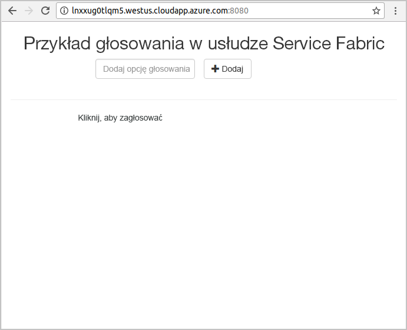

# <a name="quickstart-deploy-a-java-reliable-services-application-to-service-fabric"></a>Szybki start: wdrażanie aplikacji niezawodnych usług Java w usłudze Service Fabric

Usługa Azure Service Fabric to platforma systemów rozproszonych umożliwiająca wdrażanie mikrousług i kontenerów, a także zarządzanie nimi.

W tym przewodniku Szybki start przedstawiono wdrażanie pierwszej aplikacji Java w usłudze Service Fabric za pomocą środowiska Eclipse IDE na komputerze programistycznym z systemem Linux. Po zakończeniu pracy będziesz mieć aplikację do głosowania z frontonem internetowym w języku Java, która zapisuje wyniki głosowania w stanowej usłudze zaplecza w klastrze.


W tym przewodniku Szybki start zawarto informacje na temat wykonywania następujących czynności:

* Używanie programu Eclipse jako narzędzia dla aplikacji Java usługi Service Fabric
* Wdrażanie aplikacji w klastrze lokalnym
* Wdrażanie aplikacji w klastrze na platformie Azure
* Skalowanie aplikacji w poziomie na wiele węzłów

## <a name="prerequisites"></a>Wymagania wstępne

Aby ukończyć ten przewodnik Szybki start:

1. [Zainstaluj zestaw SDK usługi Service Fabric i interfejs wiersza polecenia (CLI) usługi Service Fabric](https://docs.microsoft.com/azure/service-fabric/service-fabric-get-started-linux#installation-methods)
2. [Zainstaluj oprogramowanie Git](https://git-scm.com/)
3. [Zainstaluj program Eclipse](https://www.eclipse.org/downloads/)
4. [Skonfiguruj środowisko Java](https://docs.microsoft.com/azure/service-fabric/service-fabric-get-started-linux#set-up-java-development) i wykonaj opcjonalne kroki instalowania wtyczki programu Eclipse

## <a name="download-the-sample"></a>Pobierz przykład

W oknie polecenia uruchom następujące polecenie, aby sklonować przykładowe repozytorium aplikacji na komputer lokalny.

```git
git clone https://github.com/Azure-Samples/service-fabric-java-quickstart.git
```

## <a name="run-the-application-locally"></a>Uruchamianie aplikacji lokalnie

1. Uruchom klaster lokalny, uruchamiając następujące polecenie:

    ```bash
    sudo /opt/microsoft/sdk/servicefabric/common/clustersetup/devclustersetup.sh
    ```
    Uruchamianie klastra lokalnego zajmuje nieco czasu. Aby potwierdzić, że klaster jest w pełni uruchomiony, otwórz narzędzie Service Fabric Explorer dostępne pod adresem **http://localhost:19080**. Pięć węzłów w dobrej kondycji oznacza, że klaster lokalny jest uruchomiony.

    

2. Otwórz program Eclipse.
3. Kliknij pozycję Plik -> Otwórz projekty z systemu plików.
4. Kliknij pozycję Katalog i wybierz katalog `Voting` z folderu `service-fabric-java-quickstart` sklonowanego z usługi GitHub. Kliknij przycisk Zakończ.

    

5. Teraz projekt `Voting` będzie dostępny w widoku Eksplorator pakietów programu Eclipse.
6. Kliknij projekt prawym przyciskiem myszy i wybierz polecenie **Publikuj aplikację** z menu rozwijanego **Service Fabric**. Jako profil docelowy wybierz wartość **PublishProfiles/Local.json** i kliknij polecenie Publikuj.

    

7. Uruchom przeglądarkę internetową i uzyskaj dostęp do aplikacji, przechodząc do adresu **http://localhost:8080**.

    

Teraz możesz dodać zestaw opcji głosowania i rozpocząć obsługę głosów. Aplikacja zostanie uruchomiona i będzie przechować wszystkie dane w klastrze usługi Service Fabric, bez konieczności używania oddzielnej bazy danych.

## <a name="deploy-the-application-to-azure"></a>Wdrażanie aplikacji na platformie Azure

### <a name="set-up-your-azure-service-fabric-cluster"></a>Konfigurowanie klastra usługi Azure Service Fabric

Aby wdrożyć aplikację w klastrze na platformie Azure, utwórz własny klaster.

Klastry testowe to bezpłatne, ograniczone czasowo klastry usługi Service Fabric hostowane na platformie Azure i obsługiwane przez zespół usługi Service Fabric. Klastry testowe pozwalają wdrażać aplikacje i uzyskiwać informacje o platformie. Klaster używa jednego certyfikatu z podpisem własnym na potrzeby zabezpieczeń między węzłami oraz między klientem a węzłem.

Zaloguj się i dołącz do [klastra systemu Linux](http://aka.ms/tryservicefabric). Pobierz certyfikat PFX na komputer, klikając link **PFX**. Kliknij link **ReadMe**, aby znaleźć hasło certyfikatu i instrukcje dotyczące konfigurowania różnych środowisk do użycia certyfikatu. Pozostaw otwarte strony **Powitalna** i **ReadMe**, ponieważ będziesz korzystać z niektórych instrukcji w poniższej procedurze.

> [!Note]
> Liczba klastrów testowych dostępnych na godzinę jest ograniczona. Jeśli wystąpi błąd podczas próby tworzenia konta umożliwiającego korzystanie z klastra testowego, możesz poczekać, a następnie spróbować ponownie. Możesz też wykonać kroki opisane w artykule [Create a Service Fabric cluster on Azure](service-fabric-tutorial-create-vnet-and-linux-cluster.md) (Tworzenie klastra usługi Service Fabric na platformie Azure), aby utworzyć klaster usługi w swojej subskrypcji.
>
> Usługa Spring Boot została skonfigurowana do nasłuchiwania ruchu przychodzącego na porcie 8080. Upewnij się, że port w klastrze został otwarty. Jeśli używasz klastra testowego, ten port jest otwarty.
>

Usługa Service Fabric udostępnia kilka narzędzi, których możesz używać do zarządzania klastrem i jego aplikacjami:

* Service Fabric Explorer — narzędzie oparte na przeglądarce.
* Interfejs wiersza polecenia (CLI) usługi Service Fabric, który korzysta z interfejsu wiersza polecenia platformy Azure 2.0.
* Polecenia programu PowerShell.

W tym przewodniku Szybki start jest używany interfejs wiersza polecenia usługi Service Fabric i narzędzie Service Fabric Explorer.

Aby korzystać z interfejsu wiersza polecenia, musisz utworzyć plik PEM na podstawie pobranego pliku PFX. Aby przekonwertować plik, użyj następującego polecenia. (W przypadku klastrów testowych możesz skopiować polecenie specyficzne dla Twojego pliku PFX z instrukcji na stronie **ReadMe**).

    ```bash
    openssl pkcs12 -in party-cluster-1486790479-client-cert.pfx -out party-cluster-1486790479-client-cert.pem -nodes -passin pass:1486790479
    ```

Aby użyć narzędzia Service Fabric Explorer, musisz zaimportować plik PFX certyfikatu pobrany z witryny internetowej klastra testowego do swojego magazynu certyfikatów (w systemie Windows lub Mac) lub do samej przeglądarki (w systemie Ubuntu). Będzie potrzebne hasło klucza prywatnego PFX, które możesz pobrać ze strony **ReadMe**.

Aby zaimportować certyfikat w swoim systemie, użyj dowolnej, preferowanej przez siebie metody. Na przykład:

* W systemie Windows: kliknij dwukrotnie plik PFX i postępuj zgodnie z monitami, aby zainstalować certyfikat w magazynie osobistym `Certificates - Current User\Personal\Certificates`. Alternatywnie możesz użyć polecenia programu PowerShell podanego w instrukcjach na stronie **ReadMe**.
* Na komputerach Mac: kliknij dwukrotnie plik PFX, a następnie postępuj zgodnie z monitami, aby zainstalować certyfikat w pęku kluczy.
* W systemie Ubuntu: domyślną przeglądarką w systemie Ubuntu 16.04 jest Mozilla Firefox. Aby zaimportować certyfikat w przeglądarce Firefox, kliknij przycisk menu w prawym górnym rogu przeglądarki, a następnie kliknij pozycję **Opcje**. Na stronie **Preferencje** użyj pola wyszukiwania, aby wyszukać ciąg „certyfikaty”. Kliknij przycisk **Wyświetl certyfikaty**, wybierz kartę **Twoje certyfikaty**, kliknij pozycję **Importuj** i postępuj zgodnie z monitami, aby zaimportować certyfikat.

   

### <a name="add-certificate-information-to-your-application"></a>Dodawanie do aplikacji informacji o certyfikacie

Do aplikacji należy dodać odcisk palca certyfikatu, ponieważ korzysta ona z modeli programowania usługi Service Fabric.

1. Podczas pracy w zabezpieczonym klastrze potrzebny będzie odcisk palca certyfikatu w pliku `Voting/VotingApplication/ApplicationManifest.xml`. Uruchom następujące polecenie, aby wyodrębnić odcisk palca certyfikatu.

    ```bash
    openssl x509 -in [CERTIFICATE_PEM_FILE] -fingerprint -noout
    ```

2. W pliku `Voting/VotingApplication/ApplicationManifest.xml` dodaj następujący fragment kodu w obszarze tagu **ApplicationManifest**. Odciskiem palca z poprzedniego kroku powinien być element **X509FindValue** (bez średników). 

    ```xml
    <Certificates>
        <SecretsCertificate X509FindType="FindByThumbprint" X509FindValue="0A00AA0AAAA0AAA00A000000A0AA00A0AAAA00" />
    </Certificates>
    ```

### <a name="deploy-the-application-using-eclipse"></a>Wdrażanie aplikacji przy użyciu programu Eclipse

Kiedy aplikacja i klaster są gotowe, możesz wdrożyć aplikację w klastrze bezpośrednio z programu Eclipse.

1. Otwórz plik **Cloud.json** w katalogu **PublishProfiles** i wypełnij odpowiednio pola `ConnectionIPOrURL` i `ConnectionPort`. Dostępny jest przykład:

    ```bash
    {
         "ClusterConnectionParameters":
         {
            "ConnectionIPOrURL": "lnxxug0tlqm5.westus.cloudapp.azure.com",
            "ConnectionPort": "19080",
            "ClientKey": "[path_to_your_pem_file_on_local_machine]",
            "ClientCert": "[path_to_your_pem_file_on_local_machine]"
         }
    }
    ```

2. Kliknij projekt prawym przyciskiem myszy i wybierz polecenie **Publikuj aplikację** z menu rozwijanego **Service Fabric**. Jako profil docelowy wybierz wartość **PublishProfiles/Cloud.json** i kliknij polecenie Publikuj.

    

3. Uruchom przeglądarkę internetową i uzyskaj dostęp do aplikacji, przechodząc do adresu **http://\<ConnectionIPOrURL>:8080**.

    

## <a name="scale-applications-and-services-in-a-cluster"></a>Skalowanie aplikacji i usług w klastrze

Usługi można skalować na klaster w celu dostosowania ich do zmiany obciążenia. Skalowanie usługi odbywa się przez zmienianie liczby wystąpień uruchomionych w klastrze. Istnieje wiele sposobów skalowania usług. Na przykład można użyć skryptów lub poleceń interfejsu wiersza polecenia usługi Service Fabric (sfctl). W poniższych krokach będzie używane narzędzie Service Fabric Explorer.

Narzędzie Service Fabric Explorer działa we wszystkich klastrach usługi Service Fabric i można uzyskać do niego dostęp z przeglądarki, przechodząc do portu HTTP zarządzania klastrami (19080), na przykład `http://lnxxug0tlqm5.westus.cloudapp.azure.com:19080`.

Aby skalować usługę internetową frontonu, wykonaj następujące czynności:

1. Otwórz narzędzie Service Fabric Explorer w klastrze — na przykład `https://lnxxug0tlqm5.westus.cloudapp.azure.com:19080`.
2. Kliknij wielokropek (trzy kropki) obok węzła **fabric:/Voting/VotingWeb** w widoku drzewa i wybierz pozycję **Skaluj usługę**.

    

    Teraz możesz skalować liczbę wystąpień usługi internetowej frontonu.

3. Zmień liczbę na **2** i kliknij pozycję **Skaluj usługę**.
4. Kliknij węzeł **fabric:/Voting/VotingWeb** w widoku drzewa i rozwiń węzeł partycji (reprezentowany przez identyfikator GUID).

    

    Teraz widać, że usługa ma dwa wystąpienia, a w widoku drzewa można dostrzec węzły, w których są one uruchomione.

Za pomocą tego prostego zadania zarządzania zostały podwojone zasoby dostępne dla usługi frontonu na potrzeby przetwarzania obciążenia użytkownika. Pamiętaj, że nie musisz mieć wielu wystąpień usługi, aby działała ona niezawodnie. W przypadku awarii usługa Service Fabric gwarantuje uruchomienie nowego wystąpienie usługi w klastrze.

## <a name="next-steps"></a>Następne kroki

W tym przewodniku Szybki start zawarto informacje na temat wykonywania następujących czynności:

* Używanie programu Eclipse jako narzędzia dla aplikacji Java usługi Service Fabric
* Wdrażanie aplikacji Java w klastrze lokalnym
* Wdrażanie aplikacji Java w klastrze na platformie Azure
* Skalowanie aplikacji w poziomie na wiele węzłów

Aby dowiedzieć się więcej o pracy z aplikacjami Java w usłudze Service Fabric, przejdź do samouczka dotyczącego aplikacji Java.

> [!div class="nextstepaction"]
> [Wdrażanie aplikacji Java](./service-fabric-tutorial-create-java-app.md)