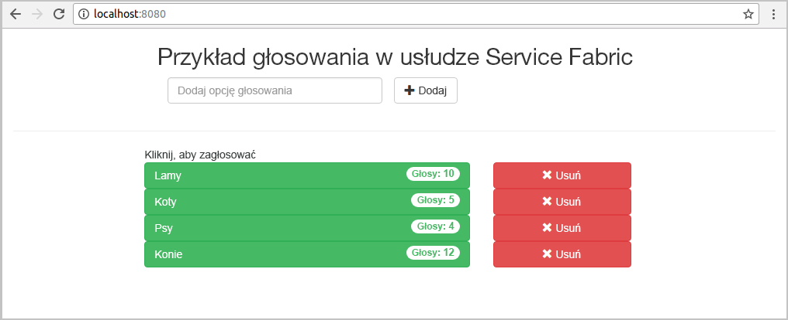
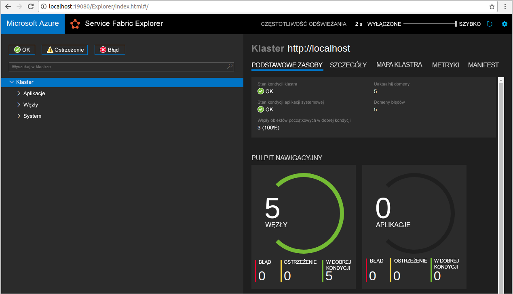
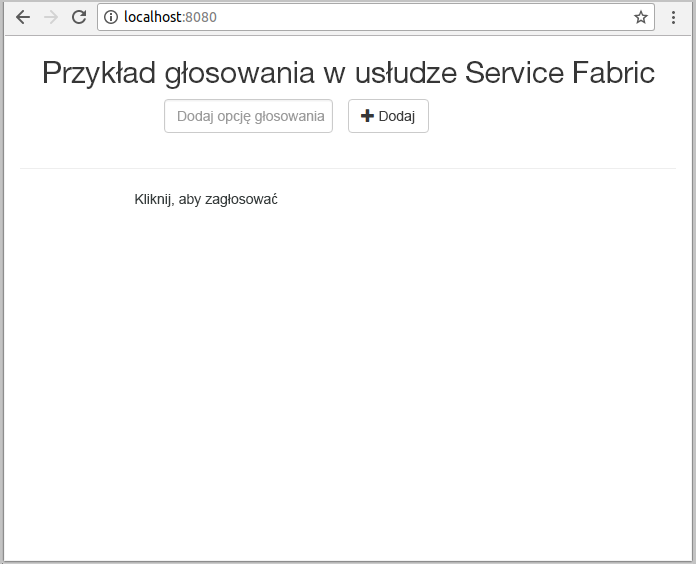
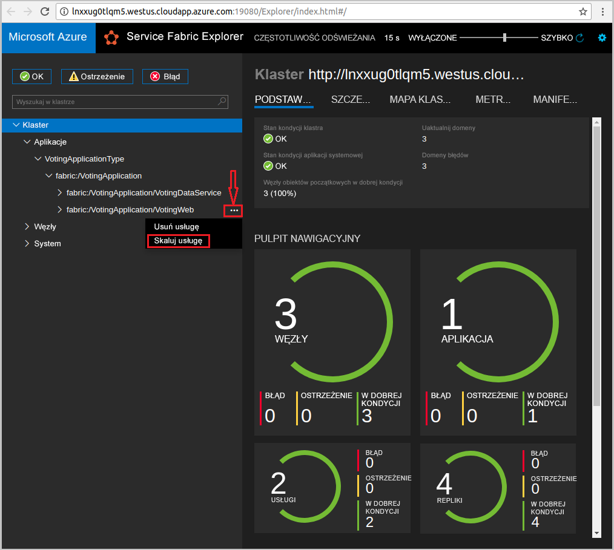
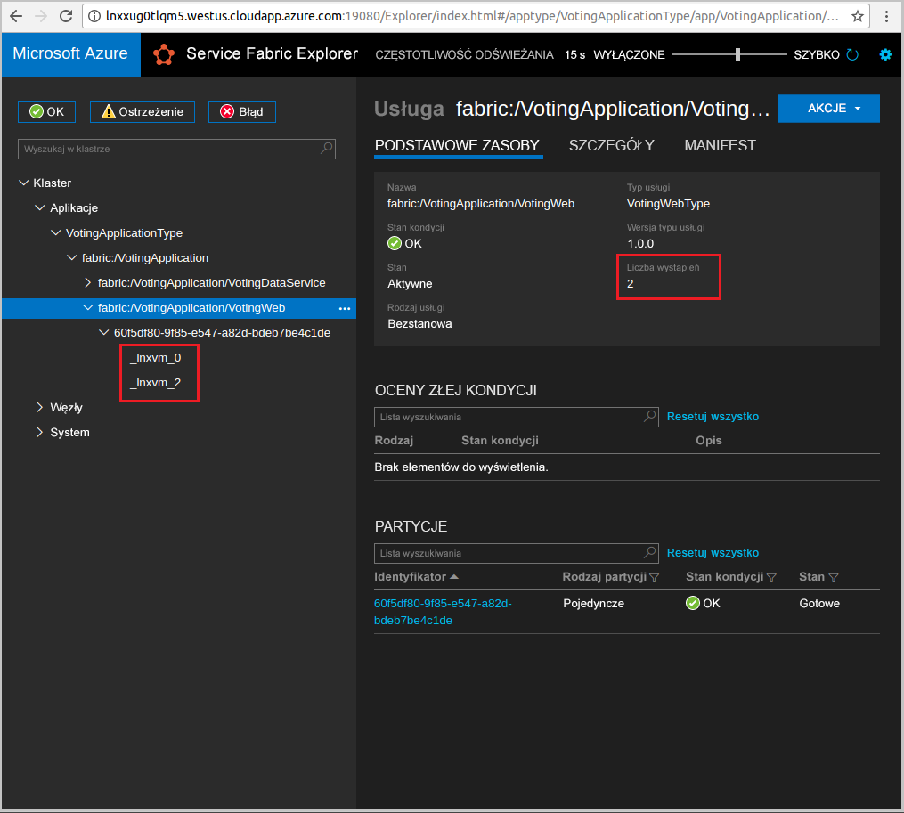

# <a name="quickstart--deploy-a-java-app-to-azure-service-fabric-on-linux"></a>Szybki start:  Wdrażanie aplikacji Java na platformie Azure Service Fabric w systemie Linux

W tym przewodniku szybki start pokazano, jak wdrożyć pierwszą aplikację w języku Java na platformie Azure Service Fabric przy użyciu IDE na komputerze dewelopera systemu Linux. Po zakończeniu pracy będziesz mieć aplikację do głosowania z frontonem internetowym w języku Java, która zapisuje wyniki głosowania w stanowej usłudze zaplecza w klastrze.

Usługa Azure Service Fabric to platforma systemów rozproszonych umożliwiająca wdrażanie mikrousług i kontenerów, a także zarządzanie nimi.



W tym przewodniku Szybki start zawarto informacje na temat wykonywania następujących czynności:

* Używanie programu Eclipse jako narzędzia dla aplikacji Java usługi Service Fabric
* Wdrażanie aplikacji w klastrze lokalnym
* Skalowanie aplikacji w poziomie na wiele węzłów

## <a name="prerequisites"></a>Wymagania wstępne

Aby ukończyć ten przewodnik Szybki start:

1. [Zainstaluj zestaw SDK usługi Service Fabric i interfejs wiersza polecenia (CLI) usługi Service Fabric](https://docs.microsoft.com/azure/service-fabric/service-fabric-get-started-linux#installation-methods)
2. [Zainstaluj oprogramowanie Git](https://git-scm.com/)
3. [Zainstaluj program Eclipse](https://www.eclipse.org/downloads/)
4. [Skonfiguruj środowisko Java](https://docs.microsoft.com/azure/service-fabric/service-fabric-get-started-linux#set-up-java-development) i wykonaj opcjonalne kroki instalowania wtyczki programu Eclipse

## <a name="download-the-sample"></a>Pobierz przykład

W oknie polecenia uruchom następujące polecenie, aby sklonować przykładowe repozytorium aplikacji na komputer lokalny.

```git
git clone https://github.com/Azure-Samples/service-fabric-java-quickstart.git
```

## <a name="run-the-application-locally"></a>Uruchamianie aplikacji lokalnie

1. Uruchom klaster lokalny, uruchamiając następujące polecenie:

    ```bash
    sudo /opt/microsoft/sdk/servicefabric/common/clustersetup/devclustersetup.sh
    ```
    Uruchamianie klastra lokalnego zajmuje nieco czasu. Aby potwierdzić, że klaster jest w pełni uruchomiony, otwórz narzędzie Service Fabric Explorer dostępne pod adresem **http://localhost:19080** . Pięć węzłów w dobrej kondycji oznacza, że klaster lokalny jest uruchomiony.

    

2. Otwórz program Eclipse.
3. Wybierz **pozycję plik** > **Import** > Gradleistniejący > **projekt Gradle** i postępuj zgodnie z instrukcjami kreatora.
4. Wybierz pozycję **katalog** i wybierz `Voting` katalog z `service-fabric-java-quickstart` folderu sklonowanego z witryny GitHub. Wybierz pozycję **Finish** (Zakończ).

    

5. Teraz projekt `Voting` będzie dostępny w widoku Eksplorator pakietów programu Eclipse.
6. Kliknij prawym przyciskiem myszy projekt i wybierz pozycję **Opublikuj aplikację** na liście rozwijanej **Service Fabric** . Wybierz pozycję **PublishProfiles/Local. JSON** jako profil docelowy, a następnie wybierz pozycję **Publikuj**.

    

7. Otwórz ulubioną przeglądarkę internetową i uzyskaj dostęp do aplikacji `http://localhost:8080`przez uzyskanie dostępu do programu.

    

Teraz możesz dodać zestaw opcji głosowania i rozpocząć obsługę głosów. Aplikacja zostanie uruchomiona i będzie przechować wszystkie dane w klastrze usługi Service Fabric, bez konieczności używania oddzielnej bazy danych.

## <a name="scale-applications-and-services-in-a-cluster"></a>Skalowanie aplikacji i usług w klastrze

Usługi można skalować na klaster w celu dostosowania ich do zmiany obciążenia. Skalowanie usługi odbywa się przez zmienianie liczby wystąpień uruchomionych w klastrze. Istnieje wiele sposobów skalowania usług. Na przykład można użyć skryptów lub poleceń interfejsu wiersza polecenia usługi Service Fabric (sfctl). W poniższych krokach będzie używane narzędzie Service Fabric Explorer.

Narzędzie Service Fabric Explorer działa we wszystkich klastrach usługi Service Fabric i można uzyskać do niego dostęp z przeglądarki, przechodząc do portu HTTP zarządzania klastrami (19080), na przykład `http://localhost:19080`.

Aby skalować usługę internetową frontonu, wykonaj następujące czynności:

1. Otwórz narzędzie Service Fabric Explorer w klastrze — na przykład `https://localhost:19080`.
2. Wybierz wielokropek ( **...** ) obok węzła **Sieć szkieletowa:/głosu/VotingWeb** w elemencie TreeView i wybierz pozycję **Skaluj usługę**.

    

    Teraz możesz skalować liczbę wystąpień usługi internetowej frontonu.

3. Zmień liczbę na **2** i wybierz pozycję **Skaluj usługę**.
4. Wybierz węzeł **Sieć szkieletowa:/głosowania/VotingWeb** w widoku drzewa i rozwiń węzeł partycji (reprezentowany przez identyfikator GUID).

    

    Teraz widać, że usługa ma dwa wystąpienia, a w widoku drzewa można dostrzec węzły, w których są one uruchomione.

Za pomocą tego prostego zadania zarządzania zostały podwojone zasoby dostępne dla usługi frontonu na potrzeby przetwarzania obciążenia użytkownika. Pamiętaj, że nie musisz mieć wielu wystąpień usługi, aby działała ona niezawodnie. W przypadku awarii usługa Service Fabric gwarantuje uruchomienie nowego wystąpienie usługi w klastrze.

## <a name="next-steps"></a>Następne kroki

W tym przewodniku Szybki start zawarto informacje na temat wykonywania następujących czynności:

* Używanie programu Eclipse jako narzędzia dla aplikacji Java usługi Service Fabric
* Wdrażanie aplikacji Java w klastrze lokalnym
* Skalowanie aplikacji w poziomie na wiele węzłów

Aby dowiedzieć się więcej o pracy z aplikacjami Java w usłudze Service Fabric, przejdź do samouczka dotyczącego aplikacji Java.

> [!div class="nextstepaction"]
> [Wdrażanie aplikacji Java](./service-fabric-tutorial-create-java-app.md)
