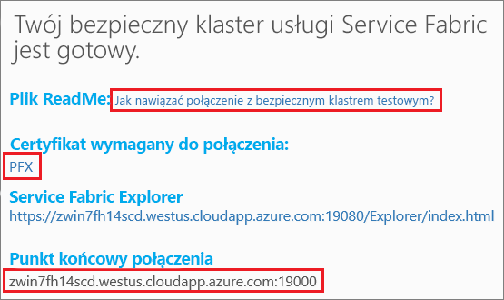
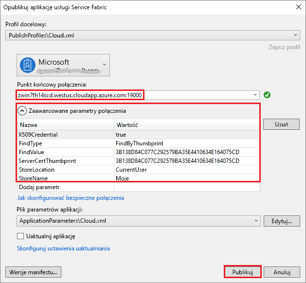

# <a name="tutorial-deploy-a-service-fabric-application-to-a-cluster-in-azure"></a>Samouczek: wdrażanie aplikacji usługi Service Fabric w klastrze na platformie Azure

Ten samouczek jest drugą częścią serii. Przedstawiono w nim sposób wdrażania aplikacji usługi Azure Service Fabric w nowym klastrze na platformie Azure.

Ten samouczek zawiera informacje na temat wykonywania następujących czynności:
> [!div class="checklist"]
> * Tworzenie klastra testowego.
> * Wdrażanie aplikacji w klastrze zdalnym przy użyciu programu Visual Studio.

Ta seria samouczków zawiera informacje na temat wykonywania następujących czynności:
> [!div class="checklist"]
> * [Kompilowanie aplikacji platformy .NET w usłudze Service Fabric](service-fabric-tutorial-create-dotnet-app.md).
> * Wdrażanie aplikacji w klastrze zdalnym.
> * [Dodawanie punktu końcowego HTTPS do usługi frontonu platformy ASP.NET Core](service-fabric-tutorial-dotnet-app-enable-https-endpoint.md).
> * [Konfigurowanie ciągłej integracji/ciągłego wdrażania za pomocą usługi Azure Pipelines](service-fabric-tutorial-deploy-app-with-cicd-vsts.md).
> * [Konfigurowanie monitorowania i diagnostyki dla aplikacji](service-fabric-tutorial-monitoring-aspnet.md).

## <a name="prerequisites"></a>Wymagania wstępne

Przed rozpoczęciem tego samouczka:

* Jeśli nie masz subskrypcji platformy Azure, utwórz [bezpłatne konto](https://azure.microsoft.com/free/?WT.mc_id=A261C142F).
* [Zainstaluj program Visual Studio 2017](https://www.visualstudio.com/) i zainstaluj obciążenia **Programowanie na platformie Azure** i **Tworzenie aplikacji na platformie ASP.NET i tworzenie aplikacji internetowych**.
* [Zainstaluj zestaw SDK usługi Service Fabric](service-fabric-get-started.md).

## <a name="download-the-voting-sample-application"></a>Pobieranie przykładowej aplikacji do głosowania

Jeśli nie skompilowano przykładowej aplikacji do głosowania w [pierwszej części tej serii samouczków](service-fabric-tutorial-create-dotnet-app.md), można ją pobrać. W oknie polecenia uruchom następujący kod, aby sklonować przykładowe repozytorium aplikacji na komputer lokalny.

```git
git clone https://github.com/Azure-Samples/service-fabric-dotnet-quickstart 
```

## <a name="publish-to-a-service-fabric-cluster"></a>Publikowanie w klastrze usługi Service Fabric

Kiedy aplikacja jest gotowa, można wdrożyć ją w klastrze bezpośrednio z programu Visual Studio. [Klaster usługi Service Fabric](https://docs.microsoft.com/en-gb/azure/service-fabric/service-fabric-deploy-anywhere) jest połączonym z siecią zestawem maszyn wirtualnych lub fizycznych, w którym wdraża się mikrousługi i nimi zarządza.

W tym samouczku przedstawiono dwie opcje wdrażania aplikacji do głosowania w klastrze usługi Service Fabric przy użyciu programu Visual Studio:

* Publikowanie w klastrze testowym (próbnym). 
* Opublikuj w istniejącym klastrze w ramach subskrypcji. Klastry usługi Service Fabric można utworzyć za pośrednictwem [witryny Azure Portal](https://portal.azure.com), przy użyciu skryptów programu [PowerShell](./scripts/service-fabric-powershell-create-secure-cluster-cert.md) lub [interfejsu wiersza polecenia platformy Azure](./scripts/cli-create-cluster.md), albo za pomocą [szablonu usługi Azure Resource Manager](service-fabric-tutorial-create-vnet-and-windows-cluster.md).

> [!NOTE]
> Wiele usług korzysta ze zwrotnego serwera proxy, aby się ze sobą komunikować. Klastry utworzone z poziomu programu Visual Studio i klastry testowe mają domyślnie włączoną opcję korzystania ze zwrotnego serwera proxy. Jeśli używasz istniejącego klastra, musisz najpierw [włączyć zwrotny serwer proxy w klastrze](service-fabric-reverseproxy-setup.md).


### <a name="find-the-voting-web-service-endpoint-for-your-azure-subscription"></a>Znajdowanie punktu końcowego usługi VotingWeb dla subskrypcji platformy Azure

Aby opublikować aplikację do głosowania w swojej własnej subskrypcji platformy Azure, znajdź punkt końcowy usługi internetowej frontonu. Jeśli używasz klastra testowego, nawiąż połączenie z portem 8080 przy użyciu automatycznie otwieranego przykładu głosowania. Nie musisz konfigurować go w module równoważenia obciążenia klastra testowego.

Usługa internetowa frontonu nasłuchuje na określonym porcie. Gdy aplikacja jest wdrażana w klastrze na platformie Azure, klaster i aplikacja są uruchamiane za modułem równoważenia obciążenia platformy Azure. Port aplikacji musi być otwarty przy użyciu reguły w module równoważenia obciążenia platformy Azure dla klastra. Otwarty port wysyła ruch przychodzący do usługi internetowej. Port znajduje się w pliku **VotingWeb/PackageRoot/ServiceManifest.xml** w elemencie **Endpoint**. Może to być na przykład 8080.

```xml
<Endpoint Protocol="http" Name="ServiceEndpoint" Type="Input" Port="8080" />
```

W przypadku subskrypcji platformy Azure otwórz ten port za pomocą reguły modułu równoważenia obciążenia na platformie Azure za pośrednictwem [skryptu programu PowerShell](./scripts/service-fabric-powershell-open-port-in-load-balancer.md) lub za pośrednictwem modułu równoważenia obciążenia dla tego klastra w witrynie [Azure Portal](https://portal.azure.com).

### <a name="join-a-party-cluster"></a>Dołączanie do klastra testowego

> [!NOTE]
>  Aby opublikować aplikację we własnym klastrze w ramach subskrypcji platformy Azure, przejdź do sekcji [Publikowanie aplikacji przy użyciu programu Visual Studio](#publish-the-application-by-using-visual-studio). 

Klastry testowe to bezpłatne, ograniczone czasowo klastry usługi Service Fabric hostowane na platformie Azure i obsługiwane przez zespół usługi Service Fabric. Za ich pomocą każdy może wdrażać aplikacje i poznawać platformę. Klaster używa jednego certyfikatu z podpisem własnym na potrzeby zabezpieczeń między węzłami oraz między klientem a węzłem.

Zaloguj się i [dołącz do klastra z systemem Windows](http://aka.ms/tryservicefabric). Aby pobrać certyfikat PFX na komputer, wybierz link **PFX**. Wybierz link **Jak nawiązać połączenie z zabezpieczonym klastrem testowym?** i skopiuj hasło certyfikatu. Certyfikat, hasło certyfikatu oraz wartość pola **Punkt końcowy połączenia** będą używane w kolejnych krokach.



> [!Note]
> Liczba klastrów testowych dostępnych na godzinę jest ograniczona. Jeśli podczas próby rejestracji w celu korzystania z klastra testowego wystąpi błąd, zaczekaj i spróbuj ponownie. Możesz także wykonać te kroki w samouczku [Wdrażanie aplikacji .NET](https://docs.microsoft.com/azure/service-fabric/service-fabric-tutorial-deploy-app-to-party-cluster#deploy-the-sample-application), aby utworzyć klaster usługi Service Fabric w ramach subskrypcji platformy Azure i wdrożyć w nim aplikację. Jeśli nie masz jeszcze subskrypcji platformy Azure, możesz utworzyć [bezpłatne konto](https://azure.microsoft.com/free/?WT.mc_id=A261C142F).
>

Na komputerze z systemem Windows zainstaluj plik PFX w magazynie certyfikatów **CurrentUser\My**.

```powershell
PS C:\mycertificates> Import-PfxCertificate -FilePath .\party-cluster-873689604-client-cert.pfx -CertStoreLocation Cert:\CurrentUser\My -Password (ConvertTo-SecureString 873689604 -AsPlainText -Force)


   PSParentPath: Microsoft.PowerShell.Security\Certificate::CurrentUser\My

Thumbprint                                Subject
----------                                -------
3B138D84C077C292579BA35E4410634E164075CD  CN=zwin7fh14scd.westus.cloudapp.azure.com
```

Zapamiętaj odcisk palca na potrzeby następnego kroku.

> [!Note]
> Domyślnie usługa internetowa frontonu jest skonfigurowana do nasłuchiwania ruchu przychodzącego na porcie 8080. Port 8080 jest otwarty w klastrze testowym. Jeśli musisz zmienić port aplikacji, zmień go na jeden z portów, które są otwarte w klastrze testowym.
>

### <a name="publish-the-application-by-using-visual-studio"></a>Publikowanie aplikacji przy użyciu programu Visual Studio

Kiedy aplikacja jest gotowa, można wdrożyć ją w klastrze bezpośrednio z programu Visual Studio.

1. W Eksploratorze rozwiązań kliknij prawym przyciskiem myszy pozycję **Voting (Głosowanie)**. Wybierz polecenie **Publikuj**. Zostanie wyświetlone okno dialogowe **Publikowanie**.

2. Skopiuj **punkt końcowy połączenia** ze strony klastra testowego lub subskrypcji platformy Azure do pola **Punkt końcowy połączenia**. Może to być na przykład `zwin7fh14scd.westus.cloudapp.azure.com:19000`. Wybierz pozycję **Zaawansowane parametry połączenia**.  Upewnij się, że wartości **FindValue** i **ServerCertThumbprint** są zgodne z odciskiem palca certyfikatu zainstalowanego w poprzednim kroku dla klastra testowego lub certyfikatu pasującego do subskrypcji platformy Azure.

    

    Każda aplikacja w klastrze musi mieć unikatową nazwę. Klastry testowe są publicznym, udostępnionym środowiskiem, a więc może wystąpić konflikt z istniejącą aplikacją. Jeśli występuje konflikt nazw, zmień nazwę projektu programu Visual Studio i wdróż go ponownie.

3. Wybierz pozycję **Publikuj**.

4. Aby uzyskać dostęp do swojej aplikacji do głosowania w klastrze, otwórz przeglądarkę i wprowadź adres klastra, a po nim ciąg **:8080**. Ewentualnie wpisz inny numer portu, jeśli został skonfigurowany. Może to być na przykład `http://zwin7fh14scd.westus.cloudapp.azure.com:8080`. Aplikacja zostanie teraz wyświetlona jako uruchomiona w klastrze na platformie Azure. Na stronie internetowej aplikacji do głosowania spróbuj dodać lub usunąć opcje głosowania oraz zagłosować na co najmniej jedną z tych opcji.

    


## <a name="next-steps"></a>Następne kroki

Przejdź do następnego samouczka:
> [!div class="nextstepaction"]
> [Włączanie protokołu HTTPS](service-fabric-tutorial-dotnet-app-enable-https-endpoint.md)
