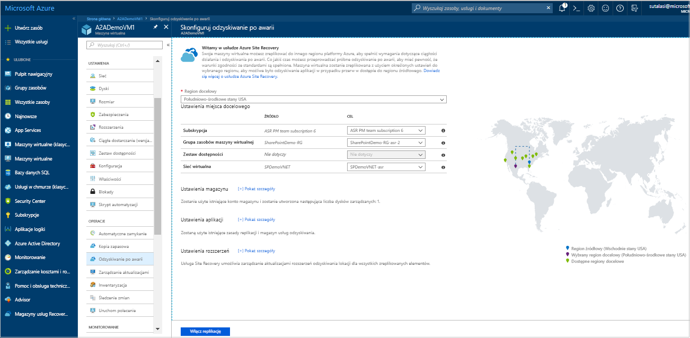
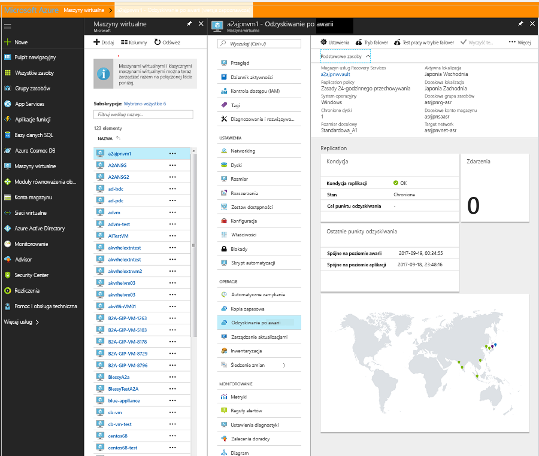
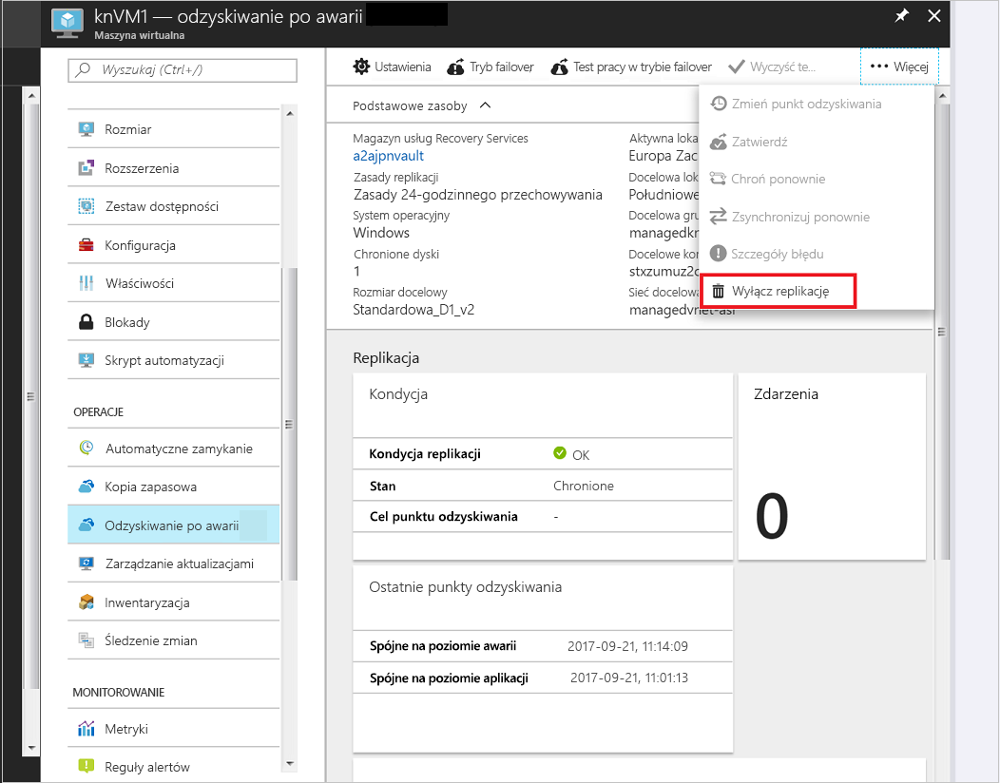

# Konfigurowanie odzyskiwania po awarii do regionu pomocniczego platformy Azure dla maszyny wirtualnej platformy Azure        

Usługa [Azure Site Recovery](site-recovery-overview.md) stanowi część strategii związanej z ciągłością biznesową i odzyskiwaniem po awarii przez zapewnienie niezawodnego działania aplikacji biznesowych podczas planowanych i nieplanowanych przestojów. Usługa Site Recovery zarządza odzyskiwaniem po awarii maszyn lokalnych i maszyn wirtualnych platformy Azure, a także organizuje to odzyskiwanie. Obejmuje to replikację, przechodzenie w tryb failover i odzyskiwanie.

Ten przewodnik Szybki Start opisano, jak skonfigurować odzyskiwanie po awarii dla maszyny Wirtualnej platformy Azure, replikując je do innego regionu platformy Azure.

Jeśli nie masz subskrypcji platformy Azure, przed rozpoczęciem utwórz [bezpłatne konto](https://azure.microsoft.com/free/?WT.mc_id=A261C142F).

> [!NOTE]
> Ten artykuł stanowi jako szybki przewodnik dla nowych użytkowników. Za pomocą to najprostsza ścieżka domyślna dostosowywania opcji i co najmniej.  Dla pełniejszego Przejrzyj wskazówki [Nasz samouczek dotyczący](azure-to-azure-tutorial-enable-replication.md).

## Zaloguj się do platformy Azure.

Zaloguj się do witryny Azure Portal na stronie https://portal.azure.com.

## Włączanie replikacji maszyny wirtualnej platformy Azure

1. W witrynie Azure Portal kliknij pozycję **Maszyny wirtualne** i wybierz tę, którą chcesz zreplikować.
2. W obszarze **Operacje** kliknij pozycję **Odzyskiwanie po awarii**.
3. W obszarze **Konfigurowanie odzyskiwania po awarii** > **Region docelowy** wybierz region docelowy, w którym maszyna będzie replikowana.
4. W przypadku tego przewodnika Szybki Start należy zaakceptować ustawienia domyślne.
5. Kliknij pozycję **Włącz replikację**. Spowoduje to uruchomienie zadania włączającego replikację dla maszyny wirtualnej.

    

## Weryfikowanie ustawień

Po zakończeniu zadania replikacji można sprawdzić stan replikacji, zmodyfikować ustawienia replikacji i przetestować wdrożenie.

1. W obszarze **Operacje** kliknij pozycję **Odzyskiwanie po awarii**.
2. Można sprawdzić kondycję replikacji, utworzone punkty odzyskiwania oraz regiony źródłowy i docelowy na mapie.

   

## Oczyszczanie zasobów

Replikowanie maszyny wirtualnej w regionie podstawowym jest zatrzymywane w przypadku wyłączenia dla niej replikacji:

- Ustawienia replikacji źródła są automatycznie czyszczone. Rozszerzenie usługi Site Recovery zainstalowana na maszynie Wirtualnej w ramach replikacji nie są usuwane i muszą zostać usunięte ręcznie. 
- Powoduje zatrzymanie naliczania opłat za Site Recovery dla maszyny Wirtualnej.

Zatrzymaj replikację w następujący sposób

1. Wybierz maszynę wirtualną.
2. W obszarze **Odzyskiwanie po awarii** kliknij pozycję **Wyłącz replikację**.

   

## Następne kroki

W tym samouczku Szybki start zreplikowano pojedynczą maszynę wirtualną w regionie pomocniczym. Teraz spróbuj replikowania wielu maszyn wirtualnych platformy Azure przy użyciu planu odzyskiwania.

> [!div class="nextstepaction"]
> [Konfigurowanie odzyskiwania po awarii dla maszyn wirtualnych platformy Azure](azure-to-azure-tutorial-enable-replication.md)
