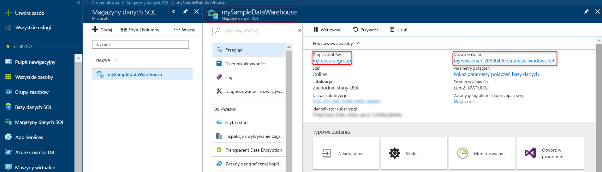

# <a name="quickstart-pause-and-resume-compute-in-azure-sql-data-warehouse-with-powershell"></a>Szybki start: Wstrzymywanie i wznawianie zasobów obliczeniowych w usłudze Azure SQL Data Warehouse przy użyciu programu PowerShell

Użyj programu PowerShell wstrzymywanie zasobów obliczeniowych, w usłudze Azure SQL Data Warehouse w celu obniżenia kosztów. [Wznowić operacje obliczeniowe](sql-data-warehouse-manage-compute-overview.md) gdy wszystko będzie gotowe do użycia w magazynie danych.

Jeśli nie masz subskrypcji platformy Azure, przed rozpoczęciem utwórz [bezpłatne](https://azure.microsoft.com/free/) konto.

## <a name="before-you-begin"></a>Przed rozpoczęciem

[!INCLUDE [updated-for-az](../../includes/updated-for-az.md)]

Ten przewodnik Szybki Start założono, że masz już magazyn danych SQL, który można wstrzymywać i wznawiać. Jeśli potrzebujesz go utworzyć, możesz użyć [tworzenie i łączenie — portal](create-data-warehouse-portal.md) Aby utworzyć magazyn danych o nazwie **mySampleDataWarehouse**.

## <a name="log-in-to-azure"></a>Zaloguj się do platformy Azure.

Zaloguj się do swojej subskrypcji platformy Azure za pomocą [Connect AzAccount](/powershell/module/az.accounts/connect-azaccount) polecenia i postępuj zgodnie z wyświetlanymi na ekranie instrukcjami.

```powershell
Connect-AzAccount
```

Aby zobaczyć, której subskrypcji używasz, uruchom [Get AzSubscription](/powershell/module/az.accounts/get-azsubscription).

```powershell
Get-AzSubscription
```

Jeśli musisz użyć innej subskrypcji niż domyślna, uruchom [AzContext zestaw](/powershell/module/az.accounts/set-azcontext).

```powershell
Set-AzContext -SubscriptionName "MySubscription"
```

## <a name="look-up-data-warehouse-information"></a>Wyszukiwanie informacji w magazynie danych

Znajdź nazwę bazy danych, nazwę serwera oraz grupę zasobów magazynu danych, który chcesz wstrzymać i wznowić.

Wykonaj następujące kroki, aby znaleźć informacje o lokalizacji dla magazynu danych.

1. Zaloguj się w witrynie [Azure Portal](https://portal.azure.com/).
2. Kliknij opcję **Bazy danych SQL** po lewej stronie witryny Azure Portal.
3. Wybierz opcję **mySampleDataWarehouse** ze strony **Bazy danych SQL**. Zostanie otwarty magazyn danych.

    

4. Zanotuj nazwę magazynu danych, która jest nazwą bazy danych. Ponadto zanotuj nazwę serwera i grupy zasobów.
6. Jeśli serwer to foo.database.windows.net, użyj tylko pierwszej części nazwy serwera w poleceniach cmdlet programu PowerShell. Na poprzedniej ilustracji pełną nazwą serwera jest newserver-20171113.database.windows.net. Usuń sufiks, a następnie użyć **newserver-20171113** jako nazwy serwera w poleceniu cmdlet programu PowerShell.

## <a name="pause-compute"></a>Wstrzymaj obliczeń

W celu obniżenia kosztów, można wstrzymywać i wznawiać obliczeniowego zasoby na żądanie. Na przykład jeśli nie używasz bazy danych w nocy i w weekendy, można wstrzymywać je w tych godzinach i wznowić ją w ciągu dnia. Nie ma opłat za zasoby obliczeniowe, gdy baza danych jest wstrzymany. Jednak nadal naliczane za magazyn.

Aby wstrzymać bazy danych, należy użyć [AzSqlDatabase Wstrzymaj](/powershell/module/az.sql/suspend-azsqldatabase) polecenia cmdlet. Poniższy przykład powoduje wstrzymanie magazynu danych o nazwie **mySampleDataWarehouse** znajdującej się na serwerze o nazwie **newserver-20171113**. Serwer znajduje się w grupie zasobów platformy Azure o nazwie **myResourceGroup**.


```Powershell
Suspend-AzSqlDatabase –ResourceGroupName "myResourceGroup" `
–ServerName "newserver-20171113" –DatabaseName "mySampleDataWarehouse"
```

Odmiana, w tym przykładzie dalej pobiera bazy danych do obiektu $database. Następnie przekazuje obiekt do [AzSqlDatabase Wstrzymaj](/powershell/module/az.sql/suspend-azsqldatabase). Wyniki są przechowywane w resultDatabase obiektu. Końcowe polecenie wyświetla wyniki.

```Powershell
$database = Get-AzSqlDatabase –ResourceGroupName "myResourceGroup" `
–ServerName "newserver-20171113" –DatabaseName "mySampleDataWarehouse"
$resultDatabase = $database | Suspend-AzSqlDatabase
$resultDatabase
```


## <a name="resume-compute"></a>Wznawianie obliczeń

Aby utworzyć bazę danych, należy użyć [AzSqlDatabase Wznów](/powershell/module/az.sql/resume-azsqldatabase) polecenia cmdlet. Poniższy przykład rozpoczyna się bazy danych o nazwie mySampleDataWarehouse znajdującej się na serwerze o nazwie newserver-20171113. Serwer jest w grupie zasobów platformy Azure o nazwie myResourceGroup.

```Powershell
Resume-AzSqlDatabase –ResourceGroupName "myResourceGroup" `
–ServerName "newserver-20171113" -DatabaseName "mySampleDataWarehouse"
```

Odmiana, w tym przykładzie dalej pobiera bazy danych do obiektu $database. Następnie przekazuje obiekt do [AzSqlDatabase Wznów](/powershell/module/az.sql/resume-azsqldatabase) i zapisuje wyniki w $resultDatabase. Końcowe polecenie wyświetla wyniki.

```Powershell
$database = Get-AzSqlDatabase –ResourceGroupName "ResourceGroup1" `
–ServerName "Server01" –DatabaseName "Database02"
$resultDatabase = $database | Resume-AzSqlDatabase
$resultDatabase
```

## <a name="check-status-of-your-data-warehouse-operation"></a>Sprawdź stan operacji magazynu danych

Aby sprawdzić stan magazynu danych, należy użyć [Get AzSqlDatabaseActivity](https://docs.microsoft.com/powershell/module/az.sql/Get-AzSqlDatabaseActivity#description) polecenia cmdlet.

```
Get-AzSqlDatabaseActivity -ResourceGroupName "ResourceGroup01" -ServerName "Server01" -DatabaseName "Database02"
```

## <a name="clean-up-resources"></a>Oczyszczanie zasobów

Płacisz za jednostki magazynu danych i dane przechowywane w Twoim magazynie danych. Opłaty za te zasoby obliczeniowe i magazynowe są naliczane osobno.

- Jeśli chcesz przechowywać dane w magazynie wstrzymać obliczenia.
- Aby uniknąć opłat w przyszłości, możesz usunąć magazyn danych.

Wykonaj następujące kroki, aby wyczyścić zasoby zgodnie z potrzebami.

1. Zaloguj się do [witryny Azure portal](https://portal.azure.com)i kliknij swój magazyn danych.

    

2. Aby wstrzymać obliczenia, kliknij przycisk **Wstrzymaj**. Gdy magazyn danych jest wstrzymany, zobaczysz przycisk **Uruchom**.  Aby wznowić obliczenia, kliknij przycisk **Uruchom**.

3. Aby usunąć magazyn danych i nie płacić za obliczenia oraz magazynowanie, kliknij przycisk **Usuń**.

4. Aby usunąć utworzony serwer SQL, kliknij **mynewserver-20171113.database.windows.net**, a następnie kliknij przycisk **Usuń**.  Należy zachować ostrożność podczas usuwania, ponieważ usunięcie serwera spowoduje również usunięcie wszystkich baz danych przypisanych do tego serwera.

5. Aby usunąć grupę zasobów, kliknij pozycję **myResourceGroup**, a następnie kliknij pozycję **Usuń grupę zasobów**.


## <a name="next-steps"></a>Kolejne kroki

Masz teraz wstrzymywanie i wznawianie obliczeń dla magazynu danych. Aby dowiedzieć się więcej na temat usługi Azure SQL Data Warehouse, przejdź do samouczka na temat ładowania danych.

> [!div class="nextstepaction"]
> [Ładowanie danych do magazynu danych SQL Data Warehouse](load-data-from-azure-blob-storage-using-polybase.md)
