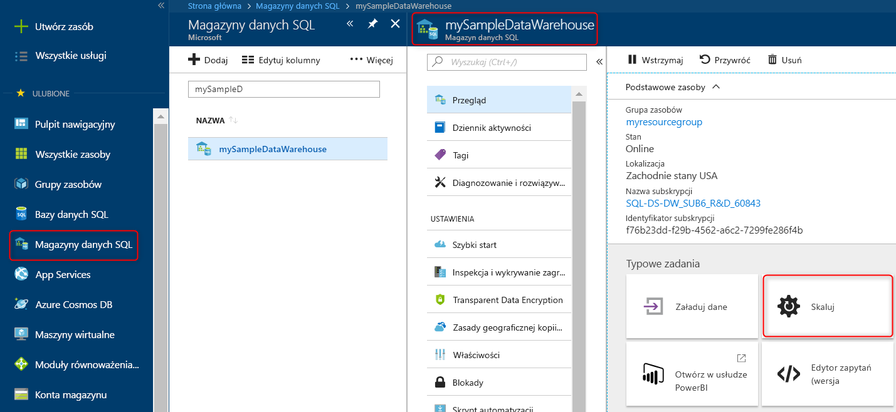

# Szybki Start: skalowanie zasobów obliczeniowych w puli SQL usługi Azure Synapse Analytics w Azure Portal

Skalowanie obliczeń w puli SQL w Azure Portal. [Skalowanie zasobów obliczeniowych w poziomie](sql-data-warehouse-manage-compute-overview.md) zapewnia lepszą wydajność, a ich ponowne przeskalowanie pozwala ograniczyć koszty. 

Jeśli nie masz subskrypcji platformy Azure, przed rozpoczęciem utwórz [bezpłatne](https://azure.microsoft.com/free/) konto.

## Logowanie się do witryny Azure Portal

Zaloguj się do [Azure portal](https://portal.azure.com/).

## Przed rozpoczęciem

Możesz skalować pulę SQL, która już istnieje, lub użyć [szybkiego startu: Tworzenie i łączenie — Portal](create-data-warehouse-portal.md) , aby utworzyć pulę SQL o nazwie **mySampleDataWarehouse**.  W tym przewodniku Szybki start jest skalowana baza danych **mySampleDataWarehouse**.

>[!Note]
>Pula SQL musi być w trybie online, aby można było skalować ją. 

## Skalowanie zasobów obliczeniowych

Zasoby obliczeniowe puli SQL można skalować przez zwiększenie lub zmniejszenie liczby jednostek magazynu danych. W ramach przewodnika Szybki start tworzenia i łączenia za pomocą portalu utworzono bazę danych **mySampleDataWarehouse** i zainicjowano ją z 400 jednostkami DWU. Poniższe kroki umożliwiają dostosowanie liczby jednostek DWU dla bazy danych **mySampleDataWarehouse**.

Aby zmienić jednostki magazynu danych:

1. Kliknij pozycję **Azure Synapse Analytics (wcześniej SQL DW)** na lewej stronie Azure Portal.
2. Wybierz pozycję **mySampleDataWarehouse** na stronie **usługi Azure Synapse Analytics (dawniej SQL DW)** . Zostanie otwarta Pula SQL.
3. Kliknij przycisk **Skaluj**.

    

2. Na panelu Skalowanie przesuń suwak w lewo lub w prawo, aby zmienić ustawienie jednostek DWU. Następnie wybierz pozycję Skala.

    

## Następne kroki
Teraz wiesz już, jak skalować obliczenia dla puli SQL. Aby dowiedzieć się więcej o puli SQL, przejdź do samouczka dotyczącego ładowania danych.

> [!div class="nextstepaction"]
>[Ładowanie danych do puli SQL](load-data-from-azure-blob-storage-using-polybase.md)
