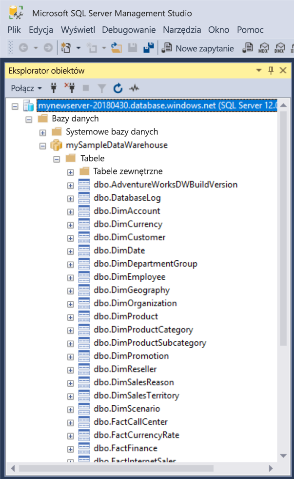

# <a name="quickstart-scale-compute-in-azure-sql-data-warehouse-using-t-sql"></a>Szybki start: Skalowanie zasobów obliczeniowych w usłudze Azure SQL Data Warehouse przy użyciu języka T-SQL

Skalowanie zasobów obliczeniowych w usłudze Azure SQL Data Warehouse przy użyciu języka T-SQL i programu SQL Server Management Studio (SSMS). [Skalowanie zasobów obliczeniowych w poziomie](sql-data-warehouse-manage-compute-overview.md) zapewnia lepszą wydajność, a zmniejszenie ich skali pozwala ograniczyć koszty. 

Jeśli nie masz subskrypcji platformy Azure, przed rozpoczęciem utwórz [bezpłatne](https://azure.microsoft.com/free/) konto.

## <a name="before-you-begin"></a>Przed rozpoczęciem

Pobierz i zainstaluj najnowszą wersję programu [SQL Server Management Studio](/sql/ssms/download-sql-server-management-studio-ssms) (SSMS).
 
## <a name="create-a-data-warehouse"></a>Tworzenie magazynu danych

Wykonaj czynności opisane w przewodniku [Szybki start: tworzenie i łączenie — portal](create-data-warehouse-portal.md), aby utworzyć magazyn danych o nazwie **mySampleDataWarehouse**. Ukończ przewodnik Szybki start, aby mieć pewność, że masz regułę zapory i możesz połączyć się z magazynem danych z poziomu programu SQL Server Management Studio.

## <a name="connect-to-the-server-as-server-admin"></a>Nawiąż połączenie z serwerem jako administrator serwera

W tej sekcji używany jest program [SQL Server Management Studio](/sql/ssms/download-sql-server-management-studio-ssms) (SSMS) do nawiązywania połączenia z serwerem SQL platformy Azure.

1. Otwórz program SQL Server Management Studio.

2. W oknie dialogowym **Połącz z serwerem** wprowadź następujące informacje:

   | Ustawienie       | Sugerowana wartość | Opis | 
   | ------------ | ------------------ | ------------------------------------------------- | 
   | Typ serwera | Aparat bazy danych | Ta wartość jest wymagana |
   | Nazwa serwera | W pełni kwalifikowana nazwa serwera | Oto przykład: **mynewserver-20171113.database.windows.net**. |
   | Authentication | Uwierzytelnianie serwera SQL | Uwierzytelnianie SQL to jedyny typ uwierzytelniania skonfigurowany w tym samouczku. |
   | Zaloguj | Konto administratora serwera | Konto określone podczas tworzenia serwera. |
   | Hasło | Hasło konta administratora serwera | To hasło określono podczas tworzenia serwera. |

    

4. Kliknij przycisk **Połącz**. W programie SSMS zostanie otwarte okno Eksplorator obiektów. 

5. W Eksploratorze obiektów rozwiń pozycję **Bazy danych**. Następnie rozwiń pozycję **mySampleDatabase**, aby wyświetlić obiekty w nowej bazy danych.

     

## <a name="view-service-objective"></a>Wyświetlanie celu usługi
Ustawienie dotyczące celu usługi zawiera liczbę jednostek magazynu danych dla magazynu danych. 

Aby wyświetlić bieżące jednostki magazynu danych dla magazynu danych:

1. W obszarze połączenia z serwerem **mynewserver-20171113.database.windows.net** rozwiń węzeł **Systemowe bazy danych**.
2. Kliknij prawym przyciskiem myszy pozycję **master**, a następnie wybierz pozycję **Nowe zapytanie**. Otworzy się okno nowego zapytania.
3. Uruchom następujące zapytanie, aby wybrać odpowiedni element z dynamicznego widoku zarządzania sys.database_service_objectives. 

    ```sql
    SELECT
        db.name [Database]
    ,   ds.edition [Edition]
    ,   ds.service_objective [Service Objective]
    FROM
        sys.database_service_objectives ds
    JOIN
        sys.databases db ON ds.database_id = db.database_id
    WHERE 
        db.name = 'mySampleDataWarehouse'
    ```

4. Następujące wyniki wskazują, że cel usługi dla bazy danych **mySampleDataWarehouse** przyjmuje wartość DW400. 

    


## <a name="scale-compute"></a>Skalowanie zasobów obliczeniowych
W usłudze SQL Data Warehouse można zwiększyć lub zmniejszyć ilość zasobów obliczeniowych przez odpowiednie dostosowanie jednostek magazynu danych. Postępując według czynności opisanych w artykule [Tworzenie i łączenie — portal](create-data-warehouse-portal.md) utworzono bazę danych **mySampleDataWarehouse** z 400 jednostkami DWU. Poniższe kroki umożliwiają dostosowanie liczby jednostek DWU dla bazy danych **mySampleDataWarehouse**.

Aby zmienić jednostki magazynu danych:

1. Kliknij prawym przyciskiem myszy pozycję **master**, a następnie wybierz pozycję **Nowe zapytanie**.
2. Użyj instrukcji języka T-SQL [ALTER DATABASE](/sql/t-sql/statements/alter-database-azure-sql-database), aby zmodyfikować cel usługi. Uruchom następujące zapytanie, aby zmienić celu usługi na wartość DW300. 

    ```Sql
    ALTER DATABASE mySampleDataWarehouse
    MODIFY (SERVICE_OBJECTIVE = 'DW300c')
    ;
    ```

## <a name="monitor-scale-change-request"></a>Monitorowanie żądania zmiany skali
Aby wyświetlić postęp poprzedniego żądania zmiany, możesz użyć składni T-SQL `WAITFORDELAY` do sondowania dynamicznego widoku zarządzania (DMV, dynamic management view) sys.dm_operation_status.

Aby sondować stan zmiany obiektu usługi:

1. Kliknij prawym przyciskiem myszy pozycję **master**, a następnie wybierz pozycję **Nowe zapytanie**.
2. Uruchom następujące zapytanie, aby sondować widok DMV sys.dm_operation_status.

    ```sql
    WHILE 
    (
        SELECT TOP 1 state_desc
        FROM sys.dm_operation_status
        WHERE 
            1=1
            AND resource_type_desc = 'Database'
            AND major_resource_id = 'MySampleDataWarehouse'
            AND operation = 'ALTER DATABASE'
        ORDER BY
            start_time DESC
    ) = 'IN_PROGRESS'
    BEGIN
        RAISERROR('Scale operation in progress',0,0) WITH NOWAIT;
        WAITFOR DELAY '00:00:05';
    END
    PRINT 'Complete';
    ```
3. Dane wyjściowe pokazują dziennik sondowania stanu.

    

## <a name="check-data-warehouse-state"></a>Sprawdzanie stanu magazynu danych

Gdy magazyn danych jest wstrzymany, nawiązanie z nim połączenia za pomocą języka T-SQL nie jest możliwe. Aby wyświetlić bieżący stan magazynu danych, można użyć polecenia cmdlet programu PowerShell. Przykład zawiera sekcja [Sprawdzanie stanu magazynu danych — program Powershell](quickstart-scale-compute-powershell.md#check-data-warehouse-state). 

## <a name="check-operation-status"></a>Sprawdzanie stanu operacji

Aby zostały zwrócone informacje na temat różnych operacji zarządzania w usłudze SQL Data Warehouse, uruchom następujące zapytanie w dynamicznym widoku zarządzania (DMV) [sys.dm_operation_status](/sql/relational-databases/system-dynamic-management-views/sys-dm-operation-status-azure-sql-database). Na przykład zwraca operację i typ stanu operacji: IN_PROGRESS (W toku) lub COMPLETED (Ukończono).

```sql
SELECT *
FROM
    sys.dm_operation_status
WHERE
    resource_type_desc = 'Database'
AND 
    major_resource_id = 'MySampleDataWarehouse'
```


## <a name="next-steps"></a>Następne kroki
Teraz już wiesz, jak skalować zasoby obliczeniowe na potrzeby magazynu danych. Aby dowiedzieć się więcej na temat usługi Azure SQL Data Warehouse, przejdź do samouczka na temat ładowania danych.

> [!div class="nextstepaction"]
>[Ładowanie danych do SQL Data Warehouse](load-data-from-azure-blob-storage-using-polybase.md)
