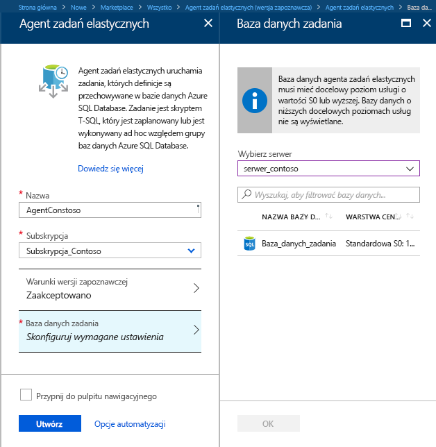
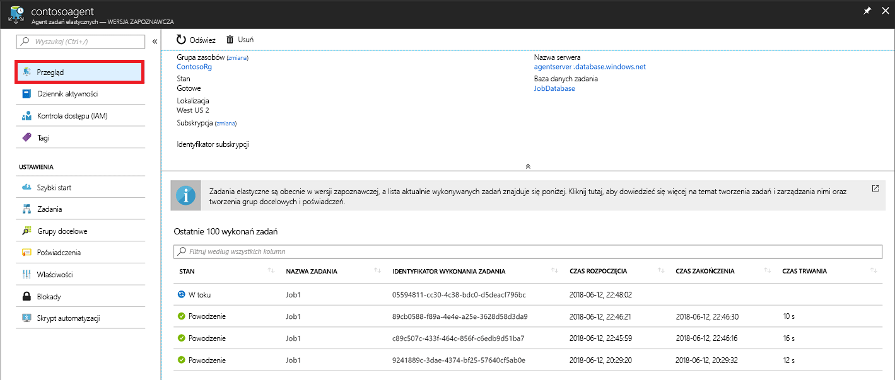

# <a name="create-configure-and-manage-elastic-jobs"></a>Tworzenie, konfigurowanie i zarządzanie zadań elastycznych

W tym artykule dowiesz się, jak tworzenie, konfigurowanie i zarządzanie zadań elastycznych. Jeśli nie używasz zadań elastycznych [Dowiedz się więcej o pojęcia dotyczące automatyzacji zadań w usłudze Azure SQL Database](sql-database-job-automation-overview.md).

## <a name="create-and-configure-the-agent"></a>Tworzenie i konfigurowanie agenta

1. Utwórz lub zidentyfikuj pustą bazę danych SQL w warstwie S0 lub wyższej. Ta baza danych będzie służyć jako *bazy danych zadania* podczas tworzenia agenta elastycznych zadań.
2. Utwórz agenta zadań elastycznych w witrynie [Azure Portal](https://portal.azure.com/#create/Microsoft.SQLElasticJobAgent) lub za pomocą programu [PowerShell](elastic-jobs-powershell.md#create-the-elastic-job-agent).

   

## <a name="create-run-and-manage-jobs"></a>Tworzenie i uruchamianie zadań oraz zarządzanie nimi

1. Utwórz poświadczenia służące do wykonywania zadań w *bazie danych zadań* za pomocą programu [PowerShell](elastic-jobs-powershell.md#create-job-credentials-so-that-jobs-can-execute-scripts-on-its-targets) lub języka [T-SQL](elastic-jobs-tsql.md#create-a-credential-for-job-execution).
2. Zdefiniuj grupę docelową (bazy danych, względem których ma być uruchamiane zadanie) za pomocą programu [PowerShell](elastic-jobs-powershell.md#define-the-target-databases-you-want-to-run-the-job-against) lub języka [T-SQL](elastic-jobs-tsql.md#create-a-target-group-servers).
3. Utwórz poświadczenia agenta zadań w każdej bazie danych, w której będzie wykonywane zadanie [(dodaj użytkownika lub rolę do każdej bazy danych w grupie)](sql-database-control-access.md). Aby uzyskać przykład, zobacz [samouczek programu PowerShell](elastic-jobs-powershell.md#create-job-credentials-so-that-jobs-can-execute-scripts-on-its-targets).
4. Utwórz zadanie za pomocą programu [PowerShell](elastic-jobs-powershell.md#create-a-job) lub języka [T-SQL](elastic-jobs-tsql.md#deploy-new-schema-to-many-databases).
5. Dodaj kroki zadania za pomocą programu [PowerShell](elastic-jobs-powershell.md#create-a-job-step) lub języka [T-SQL](elastic-jobs-tsql.md#deploy-new-schema-to-many-databases).
6. Uruchom zadanie za pomocą programu [PowerShell](elastic-jobs-powershell.md#run-the-job) lub języka [T-SQL](elastic-jobs-tsql.md#begin-ad-hoc-execution-of-a-job).
7. Monitoruj stan wykonywania zadania za pomocą witryny Azure Portal, programu [PowerShell](elastic-jobs-powershell.md#monitor-status-of-job-executions) lub języka [T-SQL](elastic-jobs-tsql.md#monitor-job-execution-status).

   

## <a name="credentials-for-running-jobs"></a>Poświadczenia na potrzeby uruchamiania zadań

Za pomocą [poświadczeń o zakresie bazy danych](/sql/t-sql/statements/create-database-scoped-credential-transact-sql) zadania łączą się z bazami danych określonymi przez grupę docelową w momencie wykonania. Jeśli grupa docelowa obejmuje serwery lub pule, te poświadczenia o zakresie bazy danych są używane do łączenia się z bazą danych master w celu wyliczenia dostępnych baz danych.

Konfigurowanie odpowiednich poświadczeń służących do uruchamiania zadania może wydawać się nieco mylące, więc należy mieć na uwadze następujące kwestie:

- Poświadczenia o zakresie bazy danych należy utworzyć w *bazie danych zadań*.
- **Wszystkie docelowe bazy danych musi mieć logowanie przy użyciu [wystarczające uprawnienia](https://docs.microsoft.com/sql/relational-databases/security/permissions-database-engine) zadania do pomyślnego ukończenia** (`jobuser` na poniższym diagramie).
- Poświadczenia mogą zostać ponownie użyte w zadaniach i hasła poświadczeń są szyfrowane, chronione od użytkowników, którzy mają dostęp tylko do odczytu do obiektów zadań.

Poniższa ilustracja ułatwia zrozumienie i ustawienie odpowiednich poświadczeń zadań. **Pamiętaj, aby utworzyć użytkownika w każdej bazie danych (wszystkie *docelowe bazy danych użytkowników*), w której ma być uruchamiane zadanie**.


## <a name="security-best-practices"></a>Najlepsze rozwiązania dotyczące zabezpieczeń

Kilka uwag dotyczących najlepszych rozwiązań podczas pracy z zadaniami elastycznymi:

- Ogranicz użycie interfejsów API do tych zaufanych.
- Poświadczenia powinny mieć możliwie najmniejsze uprawnienia niezbędne do wykonania kroku zadania. Aby uzyskać więcej informacji, zobacz [autoryzacji i uprawnień programu SQL Server](https://docs.microsoft.com/dotnet/framework/data/adonet/sql/authorization-and-permissions-in-sql-server).
- Korzystając z serwera i/lub członka grupy docelowej puli, zdecydowanie zaleca się tworzenie oddzielnych poświadczeń z uprawnieniami na bazie danych master, do widoku/listy baz danych, które służy do rozwijania listy bazy danych, serwery i/lub pule przed wykonaniem zadania.

## <a name="agent-performance-capacity-and-limitations"></a>Wydajność agenta, pojemność i ograniczenia

Zadania elastyczne używają minimalnych zasobów obliczeniowych podczas oczekiwania na zakończenie długotrwałych zadań.

W zależności od rozmiaru grupy docelowej baz danych i żądanego czasu wykonywania zadania (liczba równoczesnych procesów roboczych) agent wymaga różnej ilości zasobów obliczeniowych i wydajności *bazy danych zadań* (im więcej elementów docelowych i większa liczba zadań, tym wymagana jest większa ilość zasobów obliczeniowych).

Wersja zapoznawcza jest obecnie ograniczona do 100 współbieżnych zadań.

### <a name="prevent-jobs-from-reducing-target-database-performance"></a>Zapobieganie zmniejszania wydajności docelowej bazy danych przez zadania

Aby zapewnić, że zasoby nie będą przeciążone podczas uruchamiania zadań w ramach baz danych w elastycznej puli SQL, możliwe jest skonfigurowanie zadań w taki sposób, aby ograniczana była liczba baz danych, w ramach których mogą one być jednocześnie uruchamiane.

Ustaw liczbę równoczesnych baz danych, wykonywania zadania, ustawiając `sp_add_jobstep` przez procedurę składowaną `@max_parallelism` parametr języka T-SQL lub `Add-AzSqlElasticJobStep -MaxParallelism` w programie PowerShell.

## <a name="best-practices-for-creating-jobs"></a>Najlepsze rozwiązania dotyczące tworzenia zadań

### <a name="idempotent-scripts"></a>Skrypty idempotentne
Skrypty T-SQL zadania muszą być [idempotentne](https://en.wikipedia.org/wiki/Idempotence). **Idempotentność** oznacza, że jeśli skrypt zakończy się pomyślnie i zostanie uruchomiony ponownie, da to taki sam wynik. Skrypt może zakończyć się niepowodzeniem z powodu przejściowych problemów z siecią. W takim przypadku zadanie automatycznie ponowi próbę uruchomienia skryptu wstępnie zdefiniowaną liczbę razy przed zaniechaniem. Wynik działania skryptu idempotentnego będzie taki sam, nawet jeśli zostanie pomyślnie uruchomiony dwukrotnie (lub większą liczbę razy).

Prostym sposobem jest sprawdzenie istnienia obiektu przed jego utworzeniem.


```sql
IF NOT EXIST (some_object)
    -- Create the object
    -- If it exists, drop the object before recreating it.
```

Podobnie musi być możliwe pomyślne wykonanie skryptu przez logiczne testowanie wszystkich znalezionych warunków i reagowanie na nie.


## <a name="next-steps"></a>Następne kroki

- [Tworzenie zadań elastycznych i zarządzanie nimi za pomocą programu PowerShell](elastic-jobs-powershell.md)
- [Tworzenie zadań elastycznych i zarządzanie nimi za pomocą języka Transact-SQL (T-SQL)](elastic-jobs-tsql.md)
