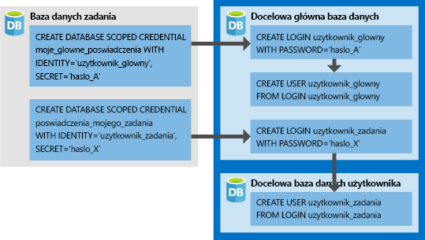

# <a name="create-an-elastic-job-agent-using-powershell"></a>Tworzenie agenta zadań elastycznych za pomocą programu PowerShell

[Zadania elastyczne](sql-database-job-automation-overview.md#elastic-database-jobs-preview) umożliwiają uruchamianie jednego lub większej liczby skryptów języka Transact-SQL (T-SQL) równolegle w wielu bazach danych.

W tym samouczku przedstawiono kroki wymagane do uruchomienia zapytania w wielu bazach danych:

> [!div class="checklist"]
> * Tworzenie agenta zadań elastycznych
> * Tworzenie poświadczeń zadań, aby umożliwić wykonywanie przez zadania skryptów na ich elementach docelowych
> * Definiowanie elementów docelowych (serwerów, puli elastycznych, baz danych, map fragmentów), względem których ma być uruchamiane zadanie
> * Tworzenie poświadczeń o zakresie bazy danych w docelowych bazach danych, aby umożliwić agentowi łączenie i wykonywanie zadań
> * Tworzenie zadania
> * Dodawanie kroków zadania do zadania
> * Rozpoczynanie wykonywania zadania
> * Monitorowanie zadania

## <a name="prerequisites"></a>Wymagania wstępne

Uaktualniona wersja zadania Elastic Database ma nowy zestaw poleceń cmdlet programu PowerShell do użycia podczas migracji. Te nowe polecenia cmdlet przenoszą wszystkie istniejące poświadczenia zadania, cele (w tym bazy danych, serwery, kolekcje niestandardowe), Wyzwalacze zadań, harmonogramy zadań, zawartość zadania i zadania do nowego agenta zadań elastycznych.

### <a name="install-the-latest-elastic-jobs-cmdlets"></a>Zainstaluj najnowsze polecenia cmdlet zadań elastycznych

Jeśli nie masz jeszcze subskrypcji platformy Azure, przed rozpoczęciem utwórz [bezpłatne konto](https://azure.microsoft.com/free/).

Zainstaluj moduł **AZ. SQL** , aby uzyskać najnowsze polecenia cmdlet Elastic Job. Uruchom następujące polecenia w programie PowerShell z dostępem administracyjnym.

```powershell
# installs the latest PackageManagement and PowerShellGet packages
Find-Package PackageManagement | Install-Package -Force
Find-Package PowerShellGet | Install-Package -Force

# Restart your powershell session with administrative access

# Install and import the Az.Sql module, then confirm
Install-Module -Name Az.Sql
Import-Module Az.Sql

Get-Module Az.Sql
```

Oprócz modułu **AZ. SQL** , ten samouczek wymaga również modułu *SqlServer* PowerShell. Aby uzyskać szczegółowe informacje, zobacz [Install SQL Server PowerShell module (Instalowanie modułu usługi SQL Server dla programu PowerShell)](/sql/powershell/download-sql-server-ps-module).

## <a name="create-required-resources"></a>Tworzenie wymaganych zasobów

Do utworzenia agenta zadań elastycznych wymagana jest baza danych (S0 lub wyższego poziomu) używana jako [baza danych zadań](sql-database-job-automation-overview.md#job-database).

Poniższy skrypt tworzy nową grupę zasobów, serwer i bazę danych do użycia jako baza danych zadań. Drugi skrypt tworzy drugi serwer z dwiema pustymi bazami danych, względem których wykonywane są zadania.

Dla zadań elastycznych nie ma określonych wymagań dotyczących nazewnictwa, można więc zastosować dowolne, o ile są one zgodne z [wymaganiami platformy Azure](/azure/architecture/best-practices/resource-naming).

```powershell
# sign in to Azure account
Connect-AzAccount

# create a resource group
Write-Output "Creating a resource group..."
$resourceGroupName = Read-Host "Please enter a resource group name"
$location = Read-Host "Please enter an Azure Region"
$rg = New-AzResourceGroup -Name $resourceGroupName -Location $location
$rg

# create a server
Write-Output "Creating a server..."
$agentServerName = Read-Host "Please enter an agent server name"
$agentServerName = $agentServerName + "-" + [guid]::NewGuid()
$adminLogin = Read-Host "Please enter the server admin name"
$adminPassword = Read-Host "Please enter the server admin password"
$adminPasswordSecure = ConvertTo-SecureString -String $AdminPassword -AsPlainText -Force
$adminCred = New-Object -TypeName "System.Management.Automation.PSCredential" -ArgumentList $adminLogin, $adminPasswordSecure
$agentServer = New-AzSqlServer -ResourceGroupName $resourceGroupName -Location $location `
    -ServerName $agentServerName -ServerVersion "12.0" -SqlAdministratorCredentials ($adminCred)

# set server firewall rules to allow all Azure IPs
Write-Output "Creating a server firewall rule..."
$agentServer | New-AzSqlServerFirewallRule -AllowAllAzureIPs
$agentServer

# create the job database
Write-Output "Creating a blank SQL database to be used as the Job Database..."
$jobDatabaseName = "JobDatabase"
$jobDatabase = New-AzSqlDatabase -ResourceGroupName $resourceGroupName -ServerName $agentServerName -DatabaseName $jobDatabaseName -RequestedServiceObjectiveName "S0"
$jobDatabase
```

```powershell
# create a target server and sample databases - uses the same credentials
Write-Output "Creating target server..."
$targetServerName = Read-Host "Please enter a target server name"
$targetServerName = $targetServerName + "-" + [guid]::NewGuid()
$targetServer = New-AzSqlServer -ResourceGroupName $resourceGroupName -Location $location `
    -ServerName $targetServerName -ServerVersion "12.0" -SqlAdministratorCredentials ($adminCred)

# set target server firewall rules to allow all Azure IPs
$targetServer | New-AzSqlServerFirewallRule -AllowAllAzureIPs
$targetServer | New-AzSqlServerFirewallRule -StartIpAddress 0.0.0.0 -EndIpAddress 255.255.255.255 -FirewallRuleName AllowAll
$targetServer

# create sample databases to execute jobs against
$db1 = New-AzSqlDatabase -ResourceGroupName $resourceGroupName -ServerName $targetServerName -DatabaseName "database1"
$db1
$db2 = New-AzSqlDatabase -ResourceGroupName $resourceGroupName -ServerName $targetServerName -DatabaseName "database2"
$db2
```

## <a name="use-elastic-jobs"></a>Korzystanie z zadań elastycznych

Aby korzystać z zadań elastycznych, zarejestruj funkcję w subskrypcji platformy Azure, uruchamiając następujące polecenie. Uruchom to polecenie raz dla subskrypcji, w ramach której zamierzasz udostępnić Agent zadań elastycznych. Subskrypcje, które zawierają tylko bazy danych, które są obiektami docelowymi, nie muszą być rejestrowane.

```powershell
Register-AzProviderFeature -FeatureName sqldb-JobAccounts -ProviderNamespace Microsoft.Sql
```

### <a name="create-the-elastic-job-agent"></a>Tworzenie agenta zadań elastycznych

Agent zadań elastycznych jest zasobem platformy Azure służącym do tworzenia i uruchamiania zadań oraz do zarządzania nimi. Agent wykonuje zadania na podstawie harmonogramu lub jako zadania jednorazowe.

Polecenie cmdlet **New-AzSqlElasticJobAgent** wymaga, aby baza danych Azure SQL Database już istnieje, dlatego parametry *resourceGroupName*, *servername*i *DatabaseName* muszą wskazywać istniejące zasoby.

```powershell
Write-Output "Creating job agent..."
$agentName = Read-Host "Please enter a name for your new Elastic Job agent"
$jobAgent = $jobDatabase | New-AzSqlElasticJobAgent -Name $agentName
$jobAgent
```

### <a name="create-the-job-credentials"></a>Utwórz poświadczenia zadania

Zadania używają poświadczeń o zakresie bazy danych do łączenia się z docelowymi bazami danych określonymi przez grupę docelową po wykonaniu i wykonaniu skryptów. Te poświadczenia o zakresie bazy danych są również używane do łączenia się z bazą danych master w celu wyliczenia wszystkich baz danych na serwerze lub w puli elastycznej, gdy któryś z tych elementów jest używany jako typ elementu członkowskiego grupy docelowej.

Poświadczenia o zakresie bazy danych należy utworzyć w bazie danych zadań. Dla wszystkich docelowych baz danych muszą istnieć poświadczenia o uprawnieniach wystarczających do pomyślnego wykonania zadania.



Oprócz poświadczeń w obrazie zwróć uwagę na dodanie poleceń **GRANT** w poniższym skrypcie. Te uprawnienia są wymagane dla skryptu, który wybrano dla tego przykładowego zadania. Ponieważ przykład tworzy nową tabelę w docelowych bazach danych, każda docelowa baza danych musi mieć odpowiednie uprawnienia, aby pomyślnie uruchomić.

Aby utworzyć wymagane poświadczenia zadania (w bazie danych zadań), uruchom następujący skrypt:

```powershell
# in the master database (target server)
# create the master user login, master user, and job user login
$params = @{
  'database' = 'master'
  'serverInstance' =  $targetServer.ServerName + '.database.windows.net'
  'username' = $adminLogin
  'password' = $adminPassword
  'outputSqlErrors' = $true
  'query' = "CREATE LOGIN masteruser WITH PASSWORD='password!123'"
}
Invoke-SqlCmd @params
$params.query = "CREATE USER masteruser FROM LOGIN masteruser"
Invoke-SqlCmd @params
$params.query = "CREATE LOGIN jobuser WITH PASSWORD='password!123'"
Invoke-SqlCmd @params

# for each target database
# create the jobuser from jobuser login and check permission for script execution
$targetDatabases = @( $db1.DatabaseName, $Db2.DatabaseName )
$createJobUserScript =  "CREATE USER jobuser FROM LOGIN jobuser"
$grantAlterSchemaScript = "GRANT ALTER ON SCHEMA::dbo TO jobuser"
$grantCreateScript = "GRANT CREATE TABLE TO jobuser"

$targetDatabases | % {
  $params.database = $_
  $params.query = $createJobUserScript
  Invoke-SqlCmd @params
  $params.query = $grantAlterSchemaScript
  Invoke-SqlCmd @params
  $params.query = $grantCreateScript
  Invoke-SqlCmd @params
}

# create job credential in Job database for master user
Write-Output "Creating job credentials..."
$loginPasswordSecure = (ConvertTo-SecureString -String "password!123" -AsPlainText -Force)

$masterCred = New-Object -TypeName "System.Management.Automation.PSCredential" -ArgumentList "masteruser", $loginPasswordSecure
$masterCred = $jobAgent | New-AzSqlElasticJobCredential -Name "masteruser" -Credential $masterCred

$jobCred = New-Object -TypeName "System.Management.Automation.PSCredential" -ArgumentList "jobuser", $loginPasswordSecure
$jobCred = $jobAgent | New-AzSqlElasticJobCredential -Name "jobuser" -Credential $jobCred
```

### <a name="define-the-target-databases-to-run-the-job-against"></a>Zdefiniuj docelowe bazy danych, względem których ma zostać uruchomione zadanie

[Grupa docelowa](sql-database-job-automation-overview.md#target-group) definiuje zestaw zawierający co najmniej jedną bazę danych, względem której będzie wykonywane zadanie.

Poniższy fragment kodu tworzy dwie grupy docelowe: Grupa *serwerów*i *serverGroupExcludingDb2*. *obiekt klasy* jest przeznaczony dla wszystkich baz danych, które istnieją na serwerze w czasie wykonywania, i *serverGroupExcludingDb2* są przeznaczone dla wszystkich baz danych na serwerze, z wyjątkiem *targetDb2*:

```powershell
Write-Output "Creating test target groups..."
# create ServerGroup target group
$serverGroup = $jobAgent | New-AzSqlElasticJobTargetGroup -Name 'ServerGroup'
$serverGroup | Add-AzSqlElasticJobTarget -ServerName $targetServerName -RefreshCredentialName $masterCred.CredentialName

# create ServerGroup with an exclusion of db2
$serverGroupExcludingDb2 = $jobAgent | New-AzSqlElasticJobTargetGroup -Name 'ServerGroupExcludingDb2'
$serverGroupExcludingDb2 | Add-AzSqlElasticJobTarget -ServerName $targetServerName -RefreshCredentialName $masterCred.CredentialName
$serverGroupExcludingDb2 | Add-AzSqlElasticJobTarget -ServerName $targetServerName -Database $db2.DatabaseName -Exclude
```

### <a name="create-a-job-and-steps"></a>Tworzenie zadania i kroków

Ten przykład definiuje zadanie i dwa etapy zadania, aby zadanie zostało uruchomione. W pierwszym kroku zadania (*step1*) zostaje utworzona nowa tabela (*Step1Table*) w każdej bazie danych w grupie docelowej *ServerGroup*. Drugi krok zadania (*step2*) tworzy nową tabelę (*Step2Table*) w każdej bazie danych (z wyjątkiem *TargetDb2*), ponieważ Grupa docelowa zdefiniowana wcześniej do wykluczenia.

```powershell
Write-Output "Creating a new job..."
$jobName = "Job1"
$job = $jobAgent | New-AzSqlElasticJob -Name $jobName -RunOnce
$job

Write-Output "Creating job steps..."
$sqlText1 = "IF NOT EXISTS (SELECT * FROM sys.tables WHERE object_id = object_id('Step1Table')) CREATE TABLE [dbo].[Step1Table]([TestId] [int] NOT NULL);"
$sqlText2 = "IF NOT EXISTS (SELECT * FROM sys.tables WHERE object_id = object_id('Step2Table')) CREATE TABLE [dbo].[Step2Table]([TestId] [int] NOT NULL);"

$job | Add-AzSqlElasticJobStep -Name "step1" -TargetGroupName $serverGroup.TargetGroupName -CredentialName $jobCred.CredentialName -CommandText $sqlText1
$job | Add-AzSqlElasticJobStep -Name "step2" -TargetGroupName $serverGroupExcludingDb2.TargetGroupName -CredentialName $jobCred.CredentialName -CommandText $sqlText2
```

### <a name="run-the-job"></a>Uruchamianie zadania

Aby natychmiast uruchomić zadanie, uruchom następujące polecenie:

```powershell
Write-Output "Start a new execution of the job..."
$jobExecution = $job | Start-AzSqlElasticJob
$jobExecution
```

Po pomyślnym ukończeniu powinny być widoczne dwie nowe tabele w bazie danych TargetDb1 i tylko jedna nowa tabela w bazie danych TargetDb2:

   

Możesz również zaplanować uruchomienie zadania później. Aby zaplanować uruchomienie zadania w określonym czasie, uruchom następujące polecenie:

```powershell
# run every hour starting from now
$job | Set-AzSqlElasticJob -IntervalType Hour -IntervalCount 1 -StartTime (Get-Date) -Enable
```

### <a name="monitor-status-of-job-executions"></a>Monitorowanie stanu wykonania zadania

Poniższe fragmenty kodu pobierają szczegóły wykonania zadania:

```powershell
# get the latest 10 executions run
$jobAgent | Get-AzSqlElasticJobExecution -Count 10

# get the job step execution details
$jobExecution | Get-AzSqlElasticJobStepExecution

# get the job target execution details
$jobExecution | Get-AzSqlElasticJobTargetExecution -Count 2
```

W poniższej tabeli wymieniono możliwe Stany wykonania zadania:

|State|Opis|
|:---|:---|
|**Utworzony** | Wykonywanie zadania zostało właśnie utworzone i nie jest jeszcze w toku.|
|**Toku** | Wykonywanie zadania jest obecnie w toku.|
|**WaitingForRetry** | Wykonanie zadania nie mogło wykonać akcji i oczekuje na ponowienie próby.|
|**Powodzenie** | Wykonywanie zadania zakończyło się pomyślnie.|
|**SucceededWithSkipped** | Wykonywanie zadania zakończyło się pomyślnie, ale niektóre z jego elementów podrzędnych zostały pominięte.|
|**Niepowodzenie** | Wykonanie zadania nie powiodło się i wystąpiła ponowna próba.|
|**TimedOut** | Przekroczono limit czasu wykonywania zadania.|
|**Anulowano** | Wykonywanie zadania zostało anulowane.|
|**Pominięto** | Wykonywanie zadania zostało pominięte, ponieważ inne wykonanie tego samego kroku zadania zostało już uruchomione na tym samym elemencie docelowym.|
|**WaitingForChildJobExecutions** | Wykonywanie zadania oczekuje na ukończenie wykonania elementu podrzędnego.|

## <a name="clean-up-resources"></a>Oczyszczanie zasobów

Usuń zasoby platformy Azure utworzone w tym samouczku, usuwając grupę zasobów.

> [!TIP]
> Jeśli planujesz kontynuować pracę z tymi zadaniami, nie czyść zasobów utworzonych w tym artykule.

```powershell
Remove-AzResourceGroup -ResourceGroupName $resourceGroupName
```

## <a name="next-steps"></a>Następne kroki

W tym samouczku został uruchomiony skrypt języka Transact-SQL na zestawie baz danych. Przedstawiono sposób wykonywania następujących zadań:

> [!div class="checklist"]
> * Tworzenie agenta zadań elastycznych
> * Tworzenie poświadczeń zadań, aby umożliwić wykonywanie przez zadania skryptów na ich elementach docelowych
> * Definiowanie elementów docelowych (serwerów, puli elastycznych, baz danych, map fragmentów), względem których ma być uruchamiane zadanie
> * Tworzenie poświadczeń o zakresie bazy danych w docelowych bazach danych, aby umożliwić agentowi łączenie i wykonywanie zadań
> * Tworzenie zadania
> * Dodawanie kroku zadania do zadania
> * Rozpoczynanie wykonywania zadania
> * Monitorowanie zadania

> [!div class="nextstepaction"]
> [Zarządzanie zadaniami elastycznymi za pomocą języka Transact-SQL](elastic-jobs-tsql.md)
