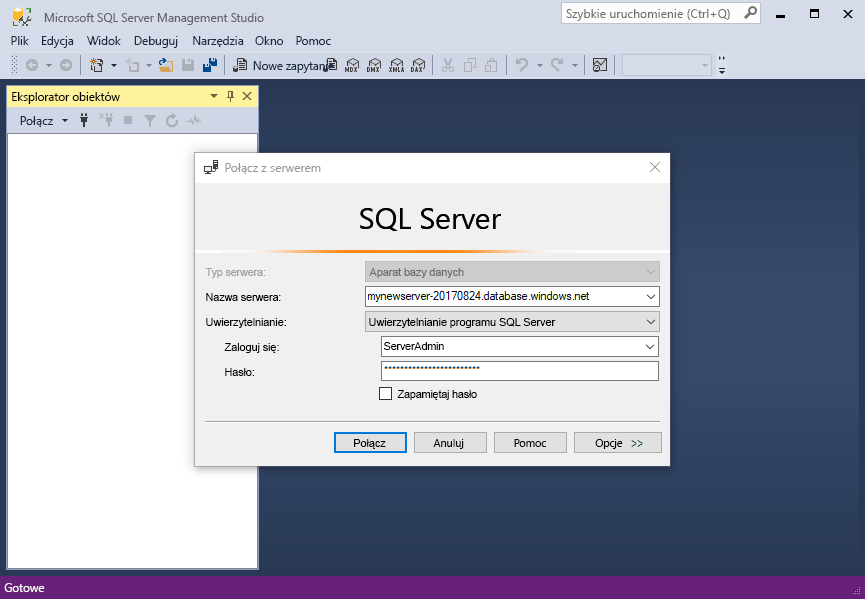
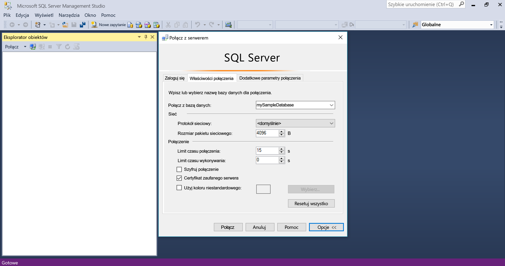
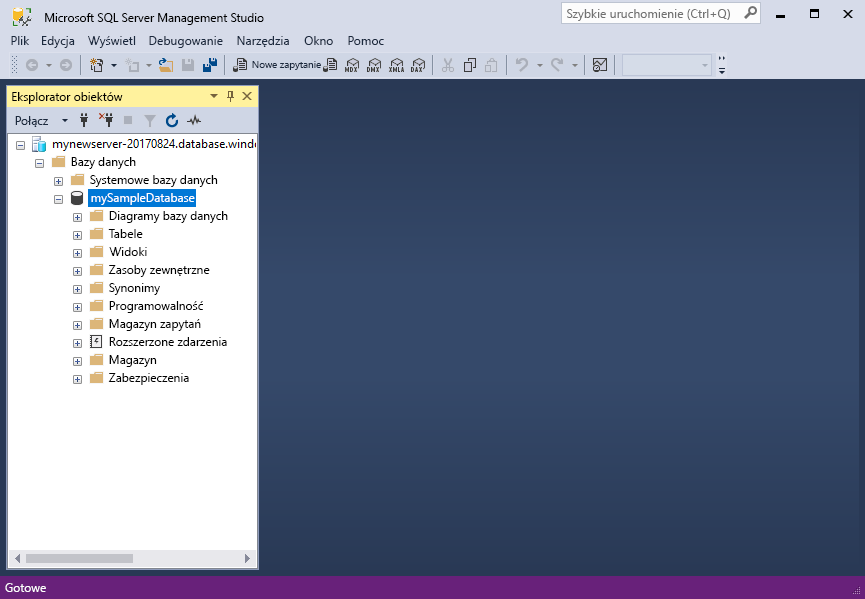
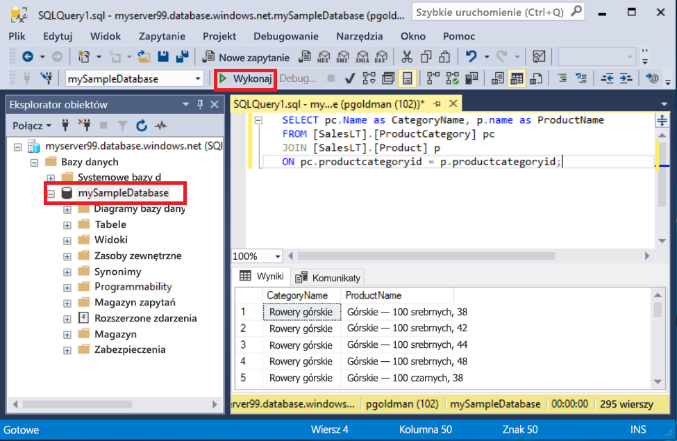
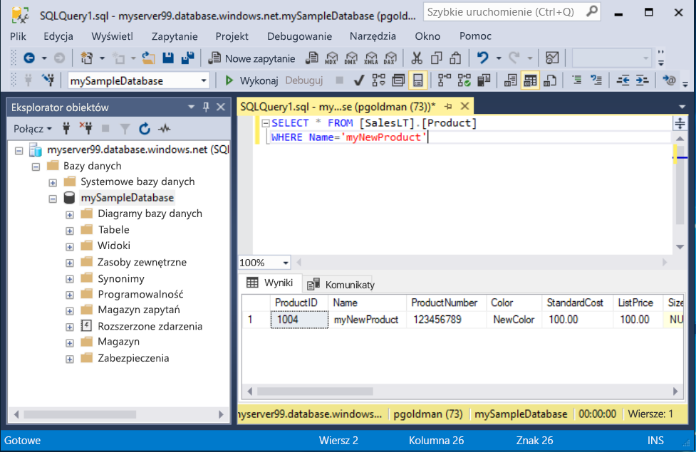

# <a name="quickstart-use-sql-server-management-studio-to-connect-and-query-an-azure-sql-database"></a>Szybki Start: używanie SQL Server Management Studio do nawiązywania połączenia i wysyłania zapytań do bazy danych Azure SQL Database

W tym przewodniku szybki start użyjesz [SQL Server Management Studio][ssms-install-latest-84g] (SSMS), aby nawiązać połączenie z bazą danych Azure SQL. Następnie uruchomisz instrukcje języka Transact-SQL w celu wykonywania zapytań, wstawiania, aktualizowania i usuwania danych. Program SQL Server Management Studio możesz wykorzystać do zarządzania dowolną infrastrukturą SQL — od programu SQL Server po usługę SQL Database dla systemu Microsoft Windows.  

## <a name="prerequisites"></a>Wymagania wstępne

Baza danych Azure SQL Database. Aby utworzyć, a następnie skonfigurować bazę danych w usłudze Azure SQL Database, można użyć instrukcji z jednego z tych przewodników Szybki start:

  || Pojedyncza baza danych | Wystąpienie zarządzane |
  |:--- |:--- |:---|
  | Przycisk Utwórz| [Portal](sql-database-single-database-get-started.md) | [Portal](sql-database-managed-instance-get-started.md) |
  || [Interfejs wiersza polecenia](scripts/sql-database-create-and-configure-database-cli.md) | [Interfejs wiersza polecenia](https://medium.com/azure-sqldb-managed-instance/working-with-sql-managed-instance-using-azure-cli-611795fe0b44) |
  || [Program PowerShell](scripts/sql-database-create-and-configure-database-powershell.md) | [Program PowerShell](scripts/sql-database-create-configure-managed-instance-powershell.md) |
  | Konfigurowanie | [Reguła zapory bazująca na adresach IP na poziomie serwera](sql-database-server-level-firewall-rule.md)| [Łączność z maszyny wirtualnej](sql-database-managed-instance-configure-vm.md)|
  |||[Łączność ze środowiska lokalnego](sql-database-managed-instance-configure-p2s.md)
  |Ładowanie danych|Ładowanie bazy danych Adventure Works na potrzeby samouczka Szybki start|[Przywracanie bazy danych Wide World Importers](sql-database-managed-instance-get-started-restore.md)
  |||Przywróć lub zaimportuj Adventure Works z pliku [BACPAC](sql-database-import.md) z usługi [GitHub](https://github.com/Microsoft/sql-server-samples/tree/master/samples/databases/adventure-works)|

  > [!IMPORTANT]
  > Skrypty zamieszczone w tym artykule korzystają z bazy danych Adventure Works. Za pomocą wystąpienia zarządzanego należy zaimportować bazę danych Adventure Works do bazy danych wystąpienia lub zmodyfikować skrypty znajdujące się w tym artykule, aby korzystały z bazy danych Wide World Importers.

## <a name="install-the-latest-ssms"></a>Instalowanie najnowszej wersji środowiska SSMS

Przed rozpoczęciem upewnij się, że zainstalowano najnowszy program [SSMS][ssms-install-latest-84g].

## <a name="get-sql-server-connection-information"></a>Uzyskiwanie informacji o połączeniu z serwerem SQL

Uzyskaj parametry połączenia potrzebne do nawiązania połączenia z bazą danych Azure SQL Database. W następnych procedurach będą potrzebne w pełni kwalifikowana nazwa serwera lub nazwa hosta, nazwa bazy danych i informacje logowania.

1. Zaloguj się w witrynie [Azure Portal](https://portal.azure.com/).

2. Otwórz stronę **Bazy danych SQL** lub **Wystąpienia zarządzane SQL**.

3. Na stronie **Przegląd** znajdź w pełni kwalifikowaną nazwę serwera obok pola **Nazwa serwera** (w przypadku pojedynczej bazy danych) lub w pełni kwalifikowaną nazwę serwera obok pola **Host** (w przypadku wystąpienia zarządzanego). Aby skopiować nazwę serwera lub hosta, umieść na niej wskaźnik myszy i wybierz ikonę **Kopiuj**.

## <a name="connect-to-your-database"></a>Nawiązywanie połączenia z bazą danych

W środowisku SMSS połącz się z serwerem usługi Azure SQL Database.

> [!IMPORTANT]
> Serwer usługi Azure SQL Database nasłuchuje na porcie 1433. Aby można było nawiązać połączenie z serwerem usługi SQL Database spoza firmowej zapory, ten port w zaporze musi być otwarty.
>

1. Otwórz program SSMS. Zostanie wyświetlone okno dialogowe **Nawiązywanie połączenia z serwerem**.

2. Wprowadź następujące informacje:

   | Ustawienie      | Sugerowana wartość    | Opis |
   | ------------ | ------------------ | ----------- |
   | **Typ serwera** | Aparat bazy danych | Wartość wymagana. |
   | **Nazwa serwera** | W pełni kwalifikowana nazwa serwera | Na przykład: **mojnowyserwer20170313.database.windows.net**. |
   | **Uwierzytelnianie** | Uwierzytelnianie programu SQL Server | W tym samouczku używane jest uwierzytelnianie SQL. |
   | **Logowanie** | Identyfikator użytkownika konta administratora serwera | Identyfikator użytkownika konta administratora serwera, którego użyto do utworzenia serwera. |
   | **Hasło** | Hasło konta administratora serwera | Hasło użytkownika konta administratora serwera, którego użyto do utworzenia serwera. |
   ||||

     

3. Wybierz pozycję **Opcje** w oknie dialogowym **Połącz z serwerem**. W menu rozwijanym **Połącz z bazą danych** wybierz pozycję **mySampleDatabase**. Jeśli pozostawisz listę rozwijaną domyślną, połączenie zostanie nawiązane z bazą danych **Master** .

     

4. Wybierz przycisk **Połącz**. Zostanie otwarte okno Eksplorator obiektów.

5. Aby wyświetlić obiekty bazy danych, rozwiń listę **Bazy danych**, a następnie rozwiń węzeł **mojaPrzykladowaBazaDanych**.

     

## <a name="query-data"></a>Zapytania o dane

Uruchom następujący kod z instrukcją [SELECT](https://msdn.microsoft.com/library/ms189499.aspx) języka Transact-SQL, aby wykonać zapytanie o 20 najpopularniejszych produktów według kategorii.

1. W Eksploratorze obiektów kliknij prawym przyciskiem myszy pozycję **mojaPrzykladowaBazaDanych** i wybierz opcję **Nowe zapytanie**. Zostanie otwarte nowe okno zapytania połączone z Twoją bazą danych.

2. Wklej w oknie zapytania to zapytanie SQL.

   ```sql
   SELECT pc.Name as CategoryName, p.name as ProductName
   FROM [SalesLT].[ProductCategory] pc
   JOIN [SalesLT].[Product] p
   ON pc.productcategoryid = p.productcategoryid;
   ```

3. Na pasku narzędzi wybierz pozycję **Wykonaj**, aby pobrać dane z tabel `Product` i `ProductCategory`.

    

## <a name="insert-data"></a>Wstawianie danych

Uruchom następujący kod z instrukcją [INSERT](https://msdn.microsoft.com/library/ms174335.aspx) języka Transact-SQL, aby utworzyć nowy produkt w tabeli `SalesLT.Product`.

1. Wpisz to zapytanie w miejsce poprzedniego.

   ```sql
   INSERT INTO [SalesLT].[Product]
           ( [Name]
           , [ProductNumber]
           , [Color]
           , [ProductCategoryID]
           , [StandardCost]
           , [ListPrice]
           , [SellStartDate] )
     VALUES
           ('myNewProduct'
           ,123456789
           ,'NewColor'
           ,1
           ,100
           ,100
           ,GETDATE() );
   ```

2. Wybierz polecenie **Wykonaj**, aby wstawić nowy wiersz do tabeli `Product`. W okienku **Komunikaty** zostanie wyświetlony komunikat **(dotyczy 1 wiersza)** .

## <a name="view-the-result"></a>Wyświetlanie wyniku

1. Wpisz to zapytanie w miejsce poprzedniego.

   ```sql
   SELECT * FROM [SalesLT].[Product]
   WHERE Name='myNewProduct'
   ```

2. Wybierz pozycję **Wykonaj**. Zostanie wyświetlony następujący wynik.

   

## <a name="update-data"></a>Aktualizowanie danych

Uruchom ten kod [aktualizacji](https://msdn.microsoft.com/library/ms177523.aspx) Transact-SQL, aby zmodyfikować nowy produkt.

1. Wpisz to zapytanie w miejsce poprzedniego.

   ```sql
   UPDATE [SalesLT].[Product]
   SET [ListPrice] = 125
   WHERE Name = 'myNewProduct';
   ```

2. Wybierz polecenie **Wykonaj**, aby zaktualizować określony wiersz w tabeli `Product`. W okienku **Komunikaty** zostanie wyświetlony komunikat **(dotyczy 1 wiersza)** .

## <a name="delete-data"></a>Usuwanie danych

Uruchom następujący kod z instrukcją [DELETE](https://msdn.microsoft.com/library/ms189835.aspx) języka Transact-SQL, aby usunąć nowy produkt.

1. Wpisz to zapytanie w miejsce poprzedniego.

   ```sql
   DELETE FROM [SalesLT].[Product]
   WHERE Name = 'myNewProduct';
   ```

2. Wybierz polecenie **Wykonaj**, aby usunąć określony wiersz z tabeli `Product`. W okienku **Komunikaty** zostanie wyświetlony komunikat **(dotyczy 1 wiersza)** .

## <a name="next-steps"></a>Następne kroki

- Aby uzyskać więcej informacji o programie SSMS, zobacz [SQL Server Management Studio](https://msdn.microsoft.com/library/ms174173.aspx) (Program SQL Server Management Studio).
- Aby połączyć się i wykonać zapytanie za pomocą witryny Azure Portal, zobacz [Connect and query with the Azure portal SQL Query editor (Nawiązywanie połączeń i wykonywanie zapytań za pomocą edytora zapytań SQL w witrynie Azure Portal)](sql-database-connect-query-portal.md).
- Aby nawiązywać połączenia i wykonywać zapytania za pomocą programu Visual Studio Code, zobacz [Connect and query with Visual Studio Code](sql-database-connect-query-vscode.md) (Nawiązywanie połączeń i wykonywanie zapytań za pomocą programu Visual Studio Code).
- Aby nawiązywać połączenia i wykonywać zapytania za pomocą platformy .NET, zobacz [Connect and query with .NET](sql-database-connect-query-dotnet.md) (Nawiązywanie połączeń i wykonywanie zapytań za pomocą platformy .NET).
- Aby nawiązywać połączenia i wykonywać zapytania za pomocą języka PHP, zobacz [Connect and query with PHP](sql-database-connect-query-php.md) (Nawiązywanie połączeń i wykonywanie zapytań za pomocą języka PHP).
- Aby nawiązywać połączenia i wykonywać zapytania za pomocą oprogramowania Node.js, zobacz [Connect and query with Node.js](sql-database-connect-query-nodejs.md) (Nawiązywanie połączeń i wykonywanie zapytań za pomocą oprogramowania Node.js).
- Aby nawiązywać połączenia i wykonywać zapytania za pomocą języka Java, zobacz [Connect and query with Java](sql-database-connect-query-java.md) (Nawiązywanie połączeń i wykonywanie zapytań za pomocą języka Java).
- Aby nawiązywać połączenia i wykonywać zapytania za pomocą języka Python, zobacz [Connect and query with Python](sql-database-connect-query-python.md) (Nawiązywanie połączeń i wykonywanie zapytań za pomocą języka Python).
- Aby nawiązywać połączenia i wykonywać zapytania za pomocą języka Ruby, zobacz [Connect and query with Ruby](sql-database-connect-query-ruby.md) (Nawiązywanie połączeń i wykonywanie zapytań za pomocą języka Ruby).

<!-- Article link references. -->

[ssms-install-latest-84g]: https://docs.microsoft.com/sql/ssms/sql-server-management-studio-ssms
