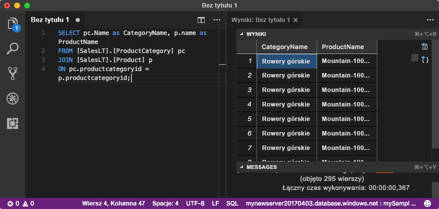

# <a name="quickstart-use-visual-studio-code-to-connect-and-query-an-azure-sql-database"></a>Szybki start: używanie programu Visual Studio Code do nawiązywania połączenia i wysyłania zapytań dotyczących danych w bazie danych Azure SQL Database

[Visual Studio Code](https://code.visualstudio.com/docs) jest graficznym edytorem kodu dla systemów Linux, macOS i Windows. Obsługuje rozszerzenia, w tym [rozszerzenie mssql](https://aka.ms/mssql-marketplace), używane do wysyłania zapytań do programów Microsoft SQL Server oraz usług Azure SQL Database i SQL Data Warehouse. W tym przewodniku Szybki start pokazano, jak używać edytora Visual Studio Code w celu nawiązywania połączenia z usługą Azure SQL Database, a następnie uruchamiać instrukcje Transact-SQL, aby wysyłać zapytania o dane, a także wstawiać, aktualizować i usuwać dane.

## <a name="prerequisites"></a>Wymagania wstępne

Do ukończenia tego samouczka niezbędne są następujące elementy:

[!INCLUDE [prerequisites-create-db](../../includes/sql-database-connect-query-prerequisites-create-db-includes.md)]

#### <a name="install-visual-studio-code"></a>Instalowanie programu Visual Studio Code

Upewnij się, że masz zainstalowaną najnowszą wersję programu [Visual Studio Code](https://code.visualstudio.com/Download) i załadowane [rozszerzenie mssql](https://aka.ms/mssql-marketplace). Aby uzyskać wskazówki dotyczące instalacji rozszerzenia mssql, zobacz artykuły [Install VS Code](https://docs.microsoft.com/sql/linux/sql-server-linux-develop-use-vscode#install-vs-code) (Instalacja programu VS Code) i [mssql for Visual Studio Code](https://marketplace.visualstudio.com/items?itemName=ms-mssql.mssql) (Rozszerzenie mssql dla programu Visual Studio Code). 

## <a name="configure-visual-studio-code"></a>Konfigurowanie programu Visual Studio Code 

### <a name="mac-os"></a>**Mac OS**
W systemie macOS należy zainstalować protokół OpenSSL, który jest wymaganiem wstępnym dla narzędzi .Net Core używanych przez rozszerzenie mssql. Otwórz terminal i wprowadź następujące polecenia, aby zainstalować rozwiązania **brew** i **OpenSSL**. 

```bash
ruby -e "$(curl -fsSL https://raw.githubusercontent.com/Homebrew/install/master/install)"
brew update
brew install openssl
mkdir -p /usr/local/lib
ln -s /usr/local/opt/openssl/lib/libcrypto.1.0.0.dylib /usr/local/lib/
ln -s /usr/local/opt/openssl/lib/libssl.1.0.0.dylib /usr/local/lib/
```

### <a name="linux-ubuntu"></a>**Linux (Ubuntu)**

Nie jest potrzebna specjalna konfiguracja.

### <a name="windows"></a>**Windows**

Nie jest potrzebna specjalna konfiguracja.

## <a name="sql-server-connection-information"></a>Informacje o połączeniu z serwerem SQL

[!INCLUDE [prerequisites-server-connection-info](../../includes/sql-database-connect-query-prerequisites-server-connection-info-includes.md)]

## <a name="set-language-mode-to-sql"></a>Ustawianie trybu języka na SQL

W programie Visual Studio Code ustaw tryb języka na **SQL**, aby włączyć polecenia mssql i T-SQL IntelliSense.

1. Otwórz nowe okno programu Visual Studio Code. 

2. Naciśnij klawisze **CTRL**+**N**. Zostanie otwarty nowy plik w formacie zwykłego tekstu. 

3. Wybierz pozycję **Zwykły tekst** w prawym dolnym rogu paska stanu.

4. Z menu rozwijanego **Wybierz tryb języka**, które zostanie otwarte, wybierz pozycję **SQL**. 

## <a name="connect-to-your-database"></a>Nawiązywanie połączenia z bazą danych

Użyj programu Visual Studio Code, aby nawiązać połączenie z serwerem Azure SQL Database.

> [!IMPORTANT]
> Przed kontynuowaniem upewnij się, że masz przygotowany serwer i informacje logowania. Jeśli zmienisz fokus z programu Visual Studio Code po rozpoczęciu wprowadzania informacji o profilu połączenia, konieczne będzie ponowne rozpoczęcie procesu tworzenia profilu.
>

1. W programie Visual Studio Code naciśnij klawisze **Ctrl + Shift + P** (lub klawisz **F1**), aby otworzyć paletę poleceń.

2. Wybierz pozycję **MS SQL:Connect** (MS SQL: Połącz) i naciśnij klawisz **Enter**.

3. Wybierz pozycję **Utwórz profil połączenia**.

4. Postępuj zgodnie z monitami, aby określić właściwości nowego profilu. Po określeniu każdej wartości naciśnij klawisz **Enter**, aby kontynuować. 

   | Właściwość       | Sugerowana wartość | Opis |
   | ------------ | ------------------ | ------------------------------------------------- | 
   | **Nazwa serwera** | W pełni kwalifikowana nazwa serwera | Na przykład: **mojnowyserwer20170313.database.windows.net**. |
   | **Nazwa bazy danych** | mySampleDatabase | Baza danych, z którą ma zostać nawiązane połączenie. |
   | **Uwierzytelnianie** | Identyfikator logowania SQL| W tym samouczku używane jest uwierzytelnianie SQL. |
   | **Nazwa użytkownika** | Nazwa użytkownika | Nazwa użytkownika konta administratora serwera, którego użyto do utworzenia serwera. |
   | **Hasło (identyfikator logowania SQL)** | Hasło | Hasło użytkownika konta administratora serwera, którego użyto do utworzenia serwera. |
   | **Zapisać hasło?** | Tak lub Nie | Wybierz opcję **Tak**, jeśli nie chcesz wprowadzać hasła za każdym razem. |
   | **Wprowadź nazwę dla tego profilu** | Nazwa profilu, np. **mojPrzykladowyProfil** | Zapisany profil przyspiesza połączenie podczas kolejnych logowań. | 

   W przypadku powodzenia zostanie wyświetlone powiadomienie z informacją o utworzeniu i połączeniu profilu.

## <a name="query-data"></a>Zapytania o dane

Użyj następującej instrukcji [SELECT](https://msdn.microsoft.com/library/ms189499.aspx) języka Transact-SQL, aby wykonać zapytanie o 20 najpopularniejszych produktów według kategorii.

1. W oknie edytora wklej następujące zapytanie SQL.

   ```sql
   SELECT pc.Name as CategoryName, p.name as ProductName
   FROM [SalesLT].[ProductCategory] pc
   JOIN [SalesLT].[Product] p
   ON pc.productcategoryid = p.productcategoryid;
   ```

2. Naciśnij klawisze **Ctrl**+**Shift**+**E**, aby wykonać zapytanie i wyświetlić wyniki z tabel `Product` i `ProductCategory`.

    

## <a name="insert-data"></a>Wstawianie danych

Użyj następującej instrukcji [INSERT](https://msdn.microsoft.com/library/ms174335.aspx) języka Transact-SQL, aby dodać nowy produkt do tabeli `SalesLT.Product`.

1. Wpisz to zapytanie w miejsce poprzedniego.

   ```sql
   INSERT INTO [SalesLT].[Product]
           ( [Name]
           , [ProductNumber]
           , [Color]
           , [ProductCategoryID]
           , [StandardCost]
           , [ListPrice]
           , [SellStartDate]
           )
     VALUES
           ('myNewProduct'
           ,123456789
           ,'NewColor'
           ,1
           ,100
           ,100
           ,GETDATE() );
   ```

2. Naciśnij klawisze **Ctrl**+**Shift**+**E**, aby wstawić nowy wiersz w tabeli `Product`.

## <a name="update-data"></a>Aktualizowanie danych

Użyj następującej instrukcji [UPDATE](https://msdn.microsoft.com/library/ms177523.aspx) języka Transact-SQL, aby zaktualizować dodany produkt.

1. Zastąp poprzednie zapytanie następującym:

   ```sql
   UPDATE [SalesLT].[Product]
   SET [ListPrice] = 125
   WHERE Name = 'myNewProduct';
   ```

2. Naciśnij klawisze **Ctrl**+**Shift**+**E**, aby zaktualizować określony wiersz w tabeli `Product`.

## <a name="delete-data"></a>Usuwanie danych

Użyj następującej instrukcji [DELETE](https://docs.microsoft.com/sql/t-sql/statements/delete-transact-sql) języka Transact-SQL, aby usunąć nowy produkt.

1. Zastąp poprzednie zapytanie następującym:

   ```sql
   DELETE FROM [SalesLT].[Product]
   WHERE Name = 'myNewProduct';
   ```

2. Naciśnij klawisze **Ctrl**+**Shift**+**E**, aby usunąć określony wiersz w tabeli `Product`.

## <a name="next-steps"></a>Następne kroki

- Aby nawiązywać połączenia i wykonywać zapytania przy użyciu programu SQL Server Management Studio, zobacz [Szybki start: Azure SQL Database: używanie programu SQL Server Management Studio do nawiązywania połączenia i wykonywania zapytań dotyczących danych](sql-database-connect-query-ssms.md).
- Aby nawiązywać połączenia i wykonywać zapytania przy użyciu witryny Azure Portal, zobacz [Szybki start: witryna Azure Portal: używanie edytora zapytań SQL do nawiązywania połączenia i wykonywania zapytań o dane](sql-database-connect-query-portal.md).
- Aby zapoznać się z artykułem w magazynie MSDN dotyczącym programu Visual Studio Code, zobacz temat [Create a database IDE with MSSQL extension blog post](https://msdn.microsoft.com/magazine/mt809115) (Tworzenie bazy danych w środowisku IDE, korzystając z wpisu na blogu dotyczącym rozszerzenia MSSQL).
