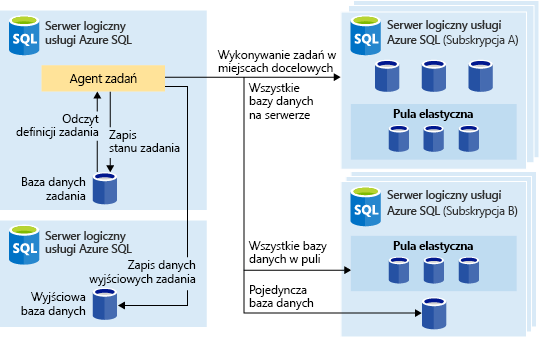
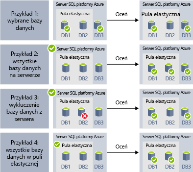
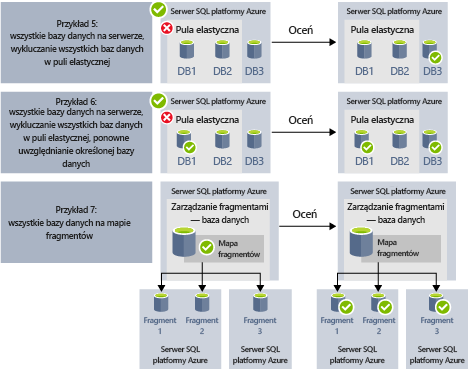

# <a name="automate-management-tasks-using-database-jobs"></a>Automatyzowanie zadań zarządzania za pomocą zadań bazy danych

Usługa Azure SQL Database umożliwia tworzenie i planowanie zadań, które mogą być wykonywane okresowo w jednej lub wielu bazach danych w celu uruchamiania zapytań T-SQL i wykonywania zadań konserwacji.
Każde zadanie rejestruje stan wykonania, a także automatycznie ponawia próbę wykonania operacji w przypadku awarii.
Można określić docelową bazę danych lub grupy baz danych Azure SQL Database, w których zadania będą wykonywane, oraz zdefiniować harmonogramy uruchamiania zadania.
Zadanie obsługuje zadanie logowania do docelowej bazy danych. Możesz również definiować, obsługiwać i utrwalać skrypty języka Transact-SQL do wykonania w ramach grupy baz danych Azure SQL Database.

## <a name="when-to-use-automated-jobs"></a>Kiedy korzystać z zadań zautomatyzowanych

Istnieje kilka scenariuszy, w których można używać funkcji automatyzacji zadań:

- Zautomatyzuj zadania zarządzania i planuj je do uruchamiania w każdy dzień powszedni, po godzinach itp.
  - Wdrażanie zmian schematu, zarządzanie poświadczeniami i zbieranie danych o wydajności lub danych telemetrycznych dotyczących dzierżaw (klientów).
  - Aktualizowanie danych referencyjnych (informacje wspólne dla wszystkich baz danych) i ładowanie danych z usługi Azure Blob Storage.
  - Odbudowywanie indeksów w celu zwiększenia wydajności zapytań. Konfigurowanie zadań w celu cyklicznego wykonywania w kolekcji baz danych, na przykład poza godzinami szczytu.
  - Zbieranie na bieżąco wyników zapytań z zestawu baz danych w centralnej tabeli. Zapytania dotyczące wydajności mogą być nieprzerwanie wykonywane i skonfigurowane do wyzwalania dodatkowych zadań do wykonania.
- Zbieranie danych na potrzeby raportowania
  - Agregowanie danych z kolekcji baz danych Azure SQL Database w pojedynczej tabeli docelowej.
  - Wykonywanie dłużej działających zapytań dotyczących przetwarzania danych w ramach dużego zestawu baz danych, na przykład w celu zbierania telemetrii klienta. Wyniki są zbierane w pojedynczej tabeli docelowej na potrzeby dalszej analizy.
- Operacje przenoszenia danych
  - Tworzenie zadań, które replikują zmiany wprowadzone w bazach danych do innych baz danych lub zbierać aktualizacje wprowadzone w zdalnych bazach danych i stosować zmiany w bazie danych.
  - Tworzenie zadań polegających na ładowaniu zadań z lub do baz danych przy użyciu usług SQL Server Integration Services (SSIS).

## <a name="overview"></a>Omówienie

W usłudze Azure SQL Database są dostępne następujące technologie planowania zadań:

- **Zadania agenta SQL** to klasyczny i przetestowany w wielu sytuacjach składnik służący do planowania zadań programu SQL Server, który jest dostępny w wystąpieniu zarządzanym. Zadania programu SQL Agent nie są dostępne w pojedynczych bazach danych usługi Azure SQL.
- **Zadania elastycznej bazy danych (wersja zapoznawcza)** to usługi planowania zadań, które wykonują niestandardowe zadania w jednej lub wielu bazach danych SQL platformy Azure.

Warto zauważyć kilka różnic między agentem SQL (dostępnym lokalnie i w ramach wystąpienia zarządzanego usługi SQL Database) i agentem zadań elastycznej bazy danych (dostępnym na potrzeby pojedynczych baz danych Azure SQL Database i baz danych w usłudze SQL Data Warehouse).

| |Zadania elastyczne |Agent SQL |
|---------|---------|---------|
|Zakres | Dowolna liczba baz danych Azure SQL Database i/lub magazynów danych w tej samej chmurze platformy Azure jako agent zadań. Elementy docelowe mogą znajdować się na różnych serwerach usługi SQL Database oraz w różnych subskrypcjach i/lub regionach. <br><br>Grupy docelowe mogą składać się z pojedynczych baz danych lub hurtowni danych albo wszystkich baz danych na serwerze, w puli lub w mapie fragmentów (wyliczanych dynamicznie w czasie wykonywania zadania). | Dowolna pojedyncza baza danych w tym samym wystąpieniu programu SQL Server jako agent SQL. |
|Obsługiwane interfejsy API i narzędzia | Witryna Azure Portal, program PowerShell, język T-SQL, usługa Azure Resource Manager | Język T-SQL, program SQL Server Management Studio (SSMS) |

## <a name="sql-agent-jobs"></a>Zadania agenta SQL

Zadania programu SQL Agent to określona seria skryptów T-SQL w bazie danych. Zadania pozwalają na zdefiniowanie zadania administracyjnego, które można uruchomić jeden lub więcej razy i monitorować pod kątem powodzenia lub niepowodzenia.
Zadanie można uruchomić na jednym serwerze lokalnym lub na wielu serwerach zdalnych. Zadania agenta SQL są wewnętrznym składnikiem aparatu baz danych, który jest wykonywany w ramach usługi wystąpienia zarządzanego.
Istnieje kilka podstawowych pojęć dotyczących zadań agenta SQL:

- **Kroki zadania** ustawiają co najmniej jeden krok, który ma zostać wykonany w ramach zadania. Dla każdego kroku zadania można zdefiniować strategię ponawiania próby i akcję do wykonania, gdy krok zadania zakończy się powodzeniem lub niepowodzeniem.
- **Harmonogramy** definiują, kiedy należy wykonać zadanie.
- **Powiadomienia** umożliwiają definiowanie reguł, które będą używane do powiadamiania operatorów za pośrednictwem poczty e-mail po zakończeniu zadania.

### <a name="job-steps"></a>Kroki zdania

Kroki zadania agenta SQL to sekwencje akcji, które mają być wykonywane przez agenta SQL. Każdy krok ma następny krok, który ma zostać wykonany, jeśli krok zakończy się pomyślnie lub nie powiedzie się. W razie niepowodzenia jest określana liczba ponownych prób.
Sql Agent umożliwia tworzenie różnych typów kroków zadania, takich jak krok zadania Transact-SQL, który wykonuje pojedynczą partię Transact-SQL względem bazy danych, lub kroki polecenia systemu operacyjnego/programu PowerShell, które można wykonać niestandardowy skrypt systemu operacyjnego, kroki zadania SSIS umożliwiają ładowanie danych przy użyciu środowiska wykonawczego SSIS lub kroki [replikacji,](sql-database-managed-instance-transactional-replication.md) które mogą publikować zmiany z bazy danych do innych baz danych.

[Replikacja transakcyjna](sql-database-managed-instance-transactional-replication.md) to funkcja aparatu bazy danych, która umożliwia publikowanie zmian wprowadzonych w jednej lub wielu tabelach w jednej bazie danych oraz publikowanie/dystrybuowanie ich do zestawu baz danych subskrybenta. Publikowanie zmian jest implementowane za pomocą następujących typów kroków zadania agenta SQL:

- Czytnik dziennika transakcji.
- Migawka.
- Dystrybutor.

Inne typy kroków zadania nie są obecnie obsługiwane, w tym:

- Krok zadania replikacji scalającej nie jest obsługiwany.
- Czytnik danych kolejki nie jest obsługiwany.
- Usługi Analysis Services nie są obsługiwane.

### <a name="job-schedules"></a>Harmonogramy zadań

Harmonogram określa moment uruchomienia zadania. W ramach tego samego harmonogramu można uruchomić więcej niż jedno zadanie, a do tego samego zadania można zastosować więcej niż jeden harmonogram.
W harmonogramie można zdefiniować następujące warunki związane z czasem wykonywania zadania:

- Po każdym ponownym uruchomieniu wystąpienia (lub po uruchomieniu agenta programu SQL Server). Zadanie jest aktywowane po każdym przejściu w tryb failover.
- Jeden raz w określonym dniu i o określonej godzinie — ta opcja jest przydatna w przypadku opóźnionego wykonywania zadania.
- Zgodnie z harmonogramem cyklicznym.

> [!Note]
> Wystąpienie zarządzane obecnie nie umożliwia uruchamiania zadania, gdy wystąpienie jest "bezczynne".

### <a name="job-notifications"></a>Powiadomienia dotyczące zadań

Zadania programu SQL Agent umożliwiają otrzymywanie powiadomień po pomyślnym zakończeniu lub pomyślnym zakończeniu zadania. Możesz otrzymywać powiadomienia za pośrednictwem poczty e-mail.

Najpierw musisz skonfigurować konto e-mail, które będzie służyć do wysyłania powiadomień e-mail, i przypisać konto do profilu poczty e-mail o nazwie `AzureManagedInstance_dbmail_profile`, jak pokazano w następującym przykładzie:

```sql
-- Create a Database Mail account
EXECUTE msdb.dbo.sysmail_add_account_sp
    @account_name = 'SQL Agent Account',
    @description = 'Mail account for Azure SQL Managed Instance SQL Agent system.',
    @email_address = '$(loginEmail)',
    @display_name = 'SQL Agent Account',
    @mailserver_name = '$(mailserver)' ,
    @username = '$(loginEmail)' ,
    @password = '$(password)'

-- Create a Database Mail profile
EXECUTE msdb.dbo.sysmail_add_profile_sp
    @profile_name = 'AzureManagedInstance_dbmail_profile',
    @description = 'E-mail profile used for messages sent by Managed Instance SQL Agent.' ;

-- Add the account to the profile
EXECUTE msdb.dbo.sysmail_add_profileaccount_sp
    @profile_name = 'AzureManagedInstance_dbmail_profile',
    @account_name = 'SQL Agent Account',
    @sequence_number = 1;
```

Trzeba będzie również włączyć funkcję Poczta bazy danych w wystąpieniu zarządzanym:

```sql
GO
EXEC sp_configure 'show advanced options', 1;
GO
RECONFIGURE;
GO
EXEC sp_configure 'Database Mail XPs', 1;
GO
RECONFIGURE
```

Można powiadomić operatora, że coś się stało z zadaniami programu SQL Agent. Operator definiuje informacje kontaktowe dla osoby odpowiedzialnej za utrzymanie jednego lub więcej wystąpień zarządzanych. Czasami obowiązki operatora są przypisywane jednej osobie.
W systemach z wieloma wystąpieniami zarządzanymi lub serwerami programu SQL Server wiele osób współdzielić obowiązki operatora. Operator nie zawiera informacji o zabezpieczeniach i nie definiuje podmiotu zabezpieczeń.

Operatory można tworzyć przy użyciu usługi SSMS lub skryptu Transact-SQL pokazanego w poniższym przykładzie:

```sql
EXEC msdb.dbo.sp_add_operator
    @name=N'Mihajlo Pupun',
    @enabled=1,
    @email_address=N'mihajlo.pupin@contoso.com'
```

Można zmodyfikować dowolne zadanie i przypisać operatory, które zostaną powiadomione pocztą e-mail, jeśli zadanie zakończy się, zakończy, zakończy się niepowodzeniem lub zakończy się pomyślnie przy użyciu SSMS lub następującego skryptu Transact-SQL:

```sql
EXEC msdb.dbo.sp_update_job @job_name=N'Load data using SSIS',
    @notify_level_email=3, -- Options are: 1 on succeed, 2 on failure, 3 on complete
    @notify_email_operator_name=N'Mihajlo Pupun'
```

### <a name="sql-agent-job-limitations"></a>Ograniczenia zadania agenta SQL

Niektóre funkcje agenta SQL dostępne w programie SQL Server nie są obsługiwane w wystąpieniu zarządzanym:

- Ustawienia agenta SQL są tylko do odczytu. Procedura `sp_set_agent_properties` nie jest obsługiwana w wystąpieniu zarządzanym.
- Włączanie/wyłączanie agenta SQL nie jest obecnie obsługiwane w wystąpieniu zarządzanym. Agent SQL zawsze działa.
- Powiadomienia są obsługiwane częściowo.
  - Pager nie jest obsługiwany.
  - Polecenie NetSend nie jest obsługiwane.
  - Alerty nie są obsługiwane.
- Serwery proxy nie są obsługiwane.
- Dziennik zdarzeń nie jest obsługiwany.

Aby uzyskać informacje na temat agenta programu SQL Server, zobacz [SQL Server Agent (Agent programu SQL Server)](https://docs.microsoft.com/sql/ssms/agent/sql-server-agent).

## <a name="elastic-database-jobs-preview"></a>Zadania elastycznej bazy danych (wersja zapoznawcza)

**Zadania Elastic Database** umożliwiają równoległe uruchamianie wielu skryptów T-SQL względem wielu baz danych na podstawie harmonogramu lub na żądanie.

**Uruchamianie zadań w ramach dowolnej kombinacji baz danych**: co najmniej jedna pojedyncza baza danych, wszystkie bazy danych na serwerze, wszystkie bazy danych w elastycznej puli lub mapa fragmentów ze zwiększoną elastycznością umożliwiającą dołączanie lub wykluczanie dowolnej określonej bazy danych. **Zadania można wykonywać na wielu serwerach, w wielu pulach, a nawet w obrębie baz danych w ramach różnych subskrypcji.** Serwery i pule są dynamicznie wyliczane w czasie wykonywania, więc zadania są uruchamiane względem wszystkich baz danych, które istnieją w docelowej grupie w czasie wykonywania.

Na poniższej ilustracji przedstawiono agenta zadań wykonującego zadania w ramach różnych typów grup docelowych:



### <a name="elastic-job-components"></a>Składniki zadań elastycznych

|Składnik | Opis (dodatkowe szczegóły znajdują się pod tabelą) |
|---------|---------|
|[**Agent zadań elastycznych**](#elastic-job-agent) | Zasób platformy Azure tworzony w celu uruchamiania zadań i zarządzania nimi. |
|[**Baza danych zadań**](#job-database) | Baza danych Azure SQL Database używana przez agenta zadań do przechowywania zadań powiązanych z danymi, definicji zadań itp. |
|[**Grupa docelowa**](#target-group) | Zestaw serwerów, pul, baz danych i map fragmentów, względem których ma być uruchamiane zadanie. |
|[**Zadanie**](#job) | Zadanie to jednostka pracy, która składa się z co najmniej jednego [kroku zadania](#job-step). Kroki zadania określają skrypty T-SQL do uruchomienia, a także inne szczegóły wymagane do wykonania skryptu. |

#### <a name="elastic-job-agent"></a>Agent zadań elastycznych

Agent zadań elastycznych jest zasobem platformy Azure służącym do tworzenia i uruchamiania zadań oraz do zarządzania nimi. Agent zadań elastycznych jest zasobem platformy Azure tworzonym w witrynie Azure Portal (obsługiwany jest również program [PowerShell](elastic-jobs-powershell.md) i interfejs REST).

Tworzenie **agenta zadań elastycznych** wymaga istniejącej bazy danych SQL Database. Agent konfiguruje tę istniejącą bazę danych jako [*bazę danych zadań*](#job-database).

Agent zadań elastycznych jest bezpłatny. Baza danych zadań jest rozliczana z taką samą szybkością jak dowolna baza danych SQL.

#### <a name="job-database"></a>Baza danych zadań

*Baza danych zadań* służy do definiowania zadań oraz śledzenia stanu i historii wykonywania zadań. *Baza danych zadania* jest również używana do przechowywania metadanych agenta, dzienników, wyników, definicji zadań, a także zawiera wiele przydatnych procedur przechowywanych i innych obiektów bazy danych do tworzenia, uruchamiania i zarządzania zadaniami przy użyciu języka T-SQL.

W ramach bieżącej wersji zapoznawczej do utworzenia agenta zadań elastycznych jest wymagana istniejąca baza danych Azure SQL Database (w warstwie S0 lub wyższej).

*Baza danych zadania* nie musi być dosłownie nowy, ale powinny być czyste, puste, S0 lub wyższy cel usługi. Zalecanym celem usługi *w bazie danych zadań* jest S1 lub wyższy, ale optymalny wybór zależy od potrzeb wydajności zadań: liczby kroków zadania, liczby celów zadań i często uruchamiania zadań. Na przykład baza danych S0 może być wystarczająca dla agenta zadania, który uruchamia kilka zadań na godzinę, kierując mniej niż dziesięć baz danych, ale uruchamianie zadania co minutę może nie być wystarczająco szybkie z bazą danych S0, a wyższa warstwa usług może być lepsza.

Jeśli operacje w bazie danych zadań są wolniejsze niż oczekiwano, [monitoruj](sql-database-monitor-tune-overview.md#sql-database-resource-monitoring) wydajność bazy danych i wykorzystanie zasobów w bazie danych zadań w okresach spowolnienia przy użyciu witryny Azure portal lub [sys.dm_db_resource_stats](https://docs.microsoft.com/sql/relational-databases/system-dynamic-management-views/sys-dm-db-resource-stats-azure-sql-database) DMV. Jeśli wykorzystanie zasobu, takiego jak PROCESOR CPU, Data IO lub Log Write zbliża się 100% i koreluje z okresami spowolnienia, należy rozważyć stopniowe skalowanie bazy danych do wyższych celów usługi (w [modelu jednostki DTU](sql-database-service-tiers-dtu.md) lub w [modelu rdzeni wirtualnych),](sql-database-service-tiers-vcore.md)dopóki wydajność bazy danych zadań jest wystarczająco zwiększona.

##### <a name="job-database-permissions"></a>Uprawnienia dotyczące bazy danych zadań

Podczas tworzenia agenta zadań ma miejsce tworzenie schematu, tabel i roli o nazwie *jobs_reader* w *bazie danych zadań*. Ta rola jest tworzona z następującymi uprawnieniami i została zaprojektowana w celu umożliwienia administratorom bardziej precyzyjnej kontroli dostępu na potrzeby monitorowania zadań:

|Nazwa roli |Uprawnienia do schematu „jobs” |Uprawnienia do schematu „jobs_internal” |
|---------|---------|---------|
|**jobs_reader** | SELECT | Brak |

> [!IMPORTANT]
> Przed udzieleniem dostępu do *bazy danych zadań* na poziomie administratora bazy danych rozważ konsekwencje takiego działania w zakresie zabezpieczeń. Złośliwy użytkownik z uprawnieniami do tworzenia lub edytowania zadań może utworzyć lub edytować zadanie korzystające z przechowywanych poświadczeń do nawiązywania połączenia z kontrolowaną przez niego bazą danych, co może mu umożliwić określenie hasła poświadczeń.

#### <a name="target-group"></a>Grupa docelowa

*Grupa docelowa* definiuje zestaw baz danych, względem którego będzie wykonywany krok zadania. Grupa docelowa może zawierać dowolną liczbę i kombinację następujących elementów:

- **Serwer usługi SQL Database** — jeśli serwer jest określony, wszystkie bazy danych istniejące na nim w czasie wykonywania zadania są częścią grupy. Konieczne jest podanie poświadczeń bazy danych master, aby możliwe było wyliczenie i zaktualizowanie grupy przed wykonaniem zadania.
- **Elastyczna pula** — jeśli elastyczna pula jest określona, wszystkie bazy danych istniejące w niej w czasie wykonywania zadania są częścią grupy. Podobnie jak w przypadku serwera, konieczne jest podanie poświadczeń bazy danych master, aby możliwe było wyliczenie i zaktualizowanie grupy przed wykonaniem zadania.
- **Pojedyncza baza danych** — określ co najmniej jedną pojedynczą bazę danych, która będzie należeć do grupy.
- **Mapa fragmentów** — bazy danych mapy fragmentów.

> [!TIP]
> W momencie wykonywania zadania za pomocą *dynamicznego wyliczania* ma miejsce ponowne obliczenie zestawu baz danych w grupach docelowych, które zawierają serwery lub pule. Pozwala to zapewnić, że **zadania są uruchamiane we wszystkich bazach danych, które istnieją na serwerze lub w puli w czasie wykonywania zadania**. Ponowne obliczanie listy baz danych w czasie wykonywania jest szczególnie przydatne w scenariuszach, w których często zmienia się członkostwo w puli lub na serwerze.

Pule i pojedyncze bazy danych można określić jako uwzględnione lub wykluczone z grupy. Umożliwia to tworzenie grupy docelowej z dowolną kombinacją baz danych. Na przykład możesz dodać serwer do grupy docelowej, ale wykluczyć określone bazy danych znajdujące się w elastycznej puli (lub wykluczyć całą pulę).

Grupa docelowa może zawierać bazy danych znajdujące się w wielu subskrypcjach i regionach. Należy pamiętać, że operacje wykonywane między regionami mają większe opóźnienia niż te wykonywane w tym samym regionie.

W poniższych przykładach pokazano, jak różne definicje grup docelowych są dynamicznie wyliczane w momencie wykonania zadania w celu określenia baz danych do uruchomienia w ramach zadania:



**Przykład 1** przedstawia grupę docelową, która zawiera listę poszczególnych baz danych. Gdy krok zadania jest wykonywany przy użyciu tej grupy docelowej, akcja kroku zadania zostanie wykonana w każdej z tych baz danych.<br>
**Przykład 2** przedstawia grupę docelową, która zawiera serwer Azure SQL Server jako obiekt docelowy. Gdy krok zadania jest wykonywany przy użyciu tej grupy docelowej, serwer jest dynamicznie wyliczany w celu określenia listy baz danych, które obecnie znajdują się na serwerze. Akcja kroku zadania zostanie wykonana w każdej z tych baz danych.<br>
**Przykład 3** zawiera grupę docelową podobną do *przykładu 2* z wykluczeniem pojedynczej bazy danych. Akcja kroku zadania *nie* zostanie wykonana w wykluczonej bazie danych.<br>
**Przykład 4** przedstawia grupę docelową, która zawiera elastyczną pulę jako obiekt docelowy. Podobnie jak w *przykładzie 2*, pula będzie dynamicznie wyliczana w momencie uruchomienia zadania w celu określenia listy baz danych w puli.
<br><br>



**Przykład 5** i **przykład 6** pokazują zaawansowane scenariusze, w których serwery SQL platformy Azure, puli elastycznych i baz danych można łączyć przy użyciu reguł dołączania i wykluczania.<br>
**Przykład 7** pokazuje, że w trakcie uruchamiania zadania można również wyliczać fragmenty na mapie fragmentów.

> [!NOTE]
> Sama baza danych zadania może być celem zadania. W tym scenariuszu baza danych zadania jest traktowana tak samo jak każda inna docelowa baza danych. Użytkownik zadania musi zostać utworzony i uzyskał wystarczające uprawnienia w bazie danych zadania, a poświadczenia o zakresie bazy danych dla użytkownika zadania muszą również istnieć w bazie danych zadania, podobnie jak w przypadku każdej innej docelowej bazy danych.
>

#### <a name="job"></a>Zadanie

*Zadanie* to jednostka pracy, która jest wykonywana na podstawie harmonogramu lub jako zadanie jednorazowe. Zadanie składa się z co najmniej jednego *kroku zadania*.

##### <a name="job-step"></a>Krok zadania

Każdy krok zadania określa skrypt T-SQL do wykonania, co najmniej jedną grupę docelową, względem której ten skrypt będzie uruchamiany, oraz poświadczenia wymagane dla agenta zadań do nawiązania połączenia z docelową bazą danych. Każdy krok zadania posiada możliwy do dostosowania limit czasu i zasady ponawiania oraz pozwala na opcjonalne określenie parametrów wyjściowych.

#### <a name="job-output"></a>Dane wyjściowe zadania

Wyniki wykonywania kroków zadania w każdej docelowej bazie danych są szczegółowo rejestrowane, a dane wyjściowe skryptu mogą zostać przechwycone w określonej tabeli. Możesz określić bazę danych, aby zapisać wszystkie dane zwrócone z zadania.

#### <a name="job-history"></a>Historia zadania

Historia wykonywania zadań jest przechowywana w *bazie danych zadań*. Zadanie oczyszczania systemu czyści historię wykonywania, która jest starsza niż 45 dni. Aby usunąć historię, która ma mniej niż 45 dni, wywołaj procedurę składowaną **sp_purge_history** w *bazie danych zadań*.

### <a name="agent-performance-capacity-and-limitations"></a>Wydajność agenta, pojemność i ograniczenia

Zadania elastyczne używają minimalnych zasobów obliczeniowych podczas oczekiwania na zakończenie długotrwałych zadań.

W zależności od rozmiaru grupy docelowej baz danych i żądanego czasu wykonywania zadania (liczba równoczesnych procesów roboczych) agent wymaga różnej ilości zasobów obliczeniowych i wydajności *bazy danych zadań* (im więcej elementów docelowych i większa liczba zadań, tym wymagana jest większa ilość zasobów obliczeniowych).

Wersja zapoznawcza jest obecnie ograniczona do 100 współbieżnych zadań.

#### <a name="prevent-jobs-from-reducing-target-database-performance"></a>Zapobieganie zmniejszania wydajności docelowej bazy danych przez zadania

Aby zapewnić, że zasoby nie będą przeciążone podczas uruchamiania zadań w ramach baz danych w elastycznej puli SQL, możliwe jest skonfigurowanie zadań w taki sposób, aby ograniczana była liczba baz danych, w ramach których mogą one być jednocześnie uruchamiane.

## <a name="next-steps"></a>Następne kroki

- [What is SQL Server Agent (Co to jest agent programu SQL Server)](https://docs.microsoft.com/sql/ssms/agent/sql-server-agent)
- [How to create and manage elastic jobs (Jak tworzyć zadania elastyczne i zarządzać nimi)](elastic-jobs-overview.md)
- [Tworzenie zadań elastycznych i zarządzanie nimi przy użyciu programu PowerShell](elastic-jobs-powershell.md)
- [Tworzenie zadań elastycznych i zarządzanie nimi za pomocą języka Transact-SQL (T-SQL)](elastic-jobs-tsql.md)
