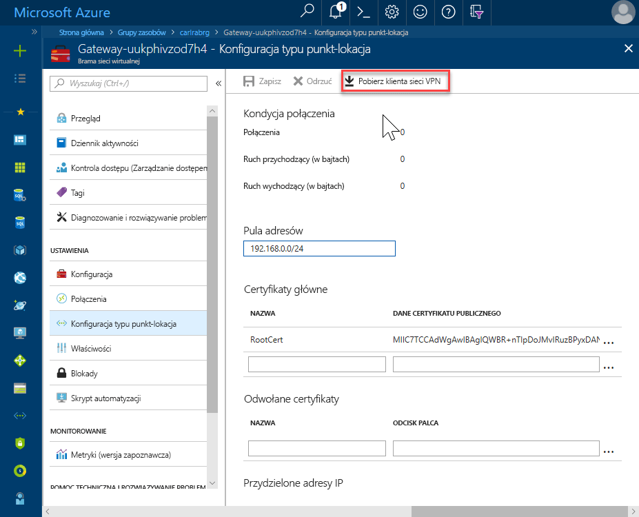
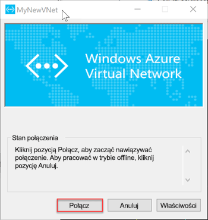

# <a name="quickstart-configure-a-point-to-site-connection-to-an-azure-sql-database-managed-instance-from-on-premises"></a>Szybki Start: Konfigurowanie połączenia typu punkt-lokacja z wystąpieniem zarządzanym Azure SQL Database z lokalnego

Ten przewodnik Szybki Start przedstawia sposób nawiązywania połączenia z Azure SQL Database wystąpieniem zarządzanym przy użyciu [SQL Server Management Studio](https://docs.microsoft.com/sql/ssms/sql-server-management-studio-ssms) (SSMS) z lokalnego komputera klienckiego w ramach połączenia typu punkt-lokacja. Informacje o połączeniach typu punkt-lokacja można znaleźć w temacie [about the Point-to-site VPN](../vpn-gateway/point-to-site-about.md)

## <a name="prerequisites"></a>Wymagania wstępne

Ten przewodnik Szybki start:

- Używa utworzonych zasobów [Tworzenie wystąpienia zarządzanego](sql-database-managed-instance-get-started.md) jako punktu początkowego.
- Program wymaga programu PowerShell 5,1 i AZ PowerShell 1.4.0 lub nowszego na lokalnym komputerze klienckim. W razie potrzeby zapoznaj się z instrukcjami dotyczącymi [instalowania modułu Azure PowerShell](https://docs.microsoft.com/powershell/azure/install-az-ps#install-the-azure-powershell-module).
- Wymaga najnowszej wersji programu [SQL Server Management Studio](https://docs.microsoft.com/sql/ssms/sql-server-management-studio-ssms) (SSMS) na lokalnym komputerze klienckim.

## <a name="attach-a-vpn-gateway-to-your-managed-instance-virtual-network"></a>Dołączanie bramy sieci VPN do sieci wirtualnej wystąpienia zarządzanego

1. Otwórz program PowerShell na lokalnym komputerze klienckim.

2. Skopiuj ten skrypt programu PowerShell. Ten skrypt dołącza VPN Gateway do sieci wirtualnej wystąpienia zarządzanego, która została utworzona w temacie [Tworzenie wystąpienia zarządzanego](sql-database-managed-instance-get-started.md) — Szybki Start. Ten skrypt używa Azure PowerShell AZ module i wykona następujące czynności dla hostów opartych na systemie Windows lub Linux:

   - Tworzy i instaluje certyfikaty na komputerze klienckim
   - Oblicza zakres adresów IP przyszłych VPN Gateway podsieci
   - Tworzy GatewaySubnet
   - Wdraża szablon Azure Resource Manager, który dołącza VPN Gateway do podsieci sieci VPN

     ```powershell
     $scriptUrlBase = 'https://raw.githubusercontent.com/Microsoft/sql-server-samples/master/samples/manage/azure-sql-db-managed-instance/attach-vpn-gateway'

     $parameters = @{
       subscriptionId = '<subscriptionId>'
       resourceGroupName = '<resourceGroupName>'
       virtualNetworkName = '<virtualNetworkName>'
       certificateNamePrefix  = '<certificateNamePrefix>'
       }

     Invoke-Command -ScriptBlock ([Scriptblock]::Create((iwr ($scriptUrlBase+'/attachVPNGateway.ps1?t='+ [DateTime]::Now.Ticks)).Content)) -ArgumentList $parameters, $scriptUrlBase
     ```

3. Wklej skrypt w oknie programu PowerShell i podaj wymagane parametry. Wartości `<subscriptionId>`, `<resourceGroup>`i `<virtualNetworkName>` powinny być zgodne z tymi, które były używane dla szybkiego startu [tworzenia wystąpienia zarządzanego](sql-database-managed-instance-get-started.md) . Wartość `<certificateNamePrefix>` może być ciągiem wybranym przez użytkownika.

4. Wykonaj skrypt programu PowerShell.

> [!IMPORTANT]
> Nie Kontynuuj do momentu zakończenia działania skryptu programu PowerShell.

## <a name="create-a-vpn-connection-to-your-managed-instance"></a>Utwórz połączenie sieci VPN z wystąpieniem zarządzanym

1. Zaloguj się do [Azure portal](https://portal.azure.com/).
2. Otwórz grupę zasobów, w której została utworzona Brama sieci wirtualnej, a następnie otwórz zasób bramy sieci wirtualnej.
3. Wybierz pozycję **Konfiguracja punktu do lokacji** , a następnie wybierz pozycję **Pobierz klienta sieci VPN**.

      
4. Na lokalnym komputerze klienckim Wyodrębnij pliki z pliku zip, a następnie otwórz folder przy użyciu wyodrębnionych plików.
5. Otwórz folder "**WindowsAmd64** " i Otwórz plik **VpnClientSetupAmd64. exe** .
6. Jeśli otrzymasz **chroniony komputer z systemem Windows** , kliknij pozycję **więcej informacji** , a następnie kliknij pozycję **Uruchom mimo to**.

    \
7. W oknie dialogowym Kontrola konta użytkownika kliknij przycisk **tak** , aby kontynuować.
8. W oknie dialogowym odwołującym się do sieci wirtualnej wybierz pozycję **tak** , aby zainstalować klienta sieci VPN dla sieci wirtualnej.

## <a name="connect-to-the-vpn-connection"></a>Nawiązywanie połączenia z siecią VPN

1. Przejdź do sieci **VPN** w **sieci & Internet** na lokalnym komputerze klienckim i wybierz swoją sieć wirtualną wystąpienia zarządzanego, aby nawiązać połączenie z tą wirtualną. Na poniższej ilustracji Sieć wirtualna ma nazwę **MyNewVNet**.

      
2. Wybierz przycisk **Połącz**.
3. W oknie dialogowym wybierz pozycję **Połącz**.

      
4. Po wyświetleniu monitu, że Menedżer połączeń potrzebuje podwyższonego poziomu uprawnień do aktualizowania tabeli tras, wybierz pozycję **Kontynuuj**.
5. Aby kontynuować, wybierz pozycję **tak** w oknie dialogowym Kontrola konta użytkownika.

   Nawiązano połączenie sieci VPN z siecią wirtualną wystąpienia zarządzanego.

      

## <a name="use-ssms-to-connect-to-the-managed-instance"></a>Nawiązywanie połączenia z wystąpieniem zarządzanym za pomocą programu SSMS

1. Na lokalnym komputerze klienckim Otwórz SQL Server Management Studio (SSMS).
2. W oknie dialogowym **łączenie z serwerem** wprowadź w pełni kwalifikowaną **nazwę hosta** dla wystąpienia zarządzanego w polu **Nazwa serwera** .
3. Wybierz pozycję **uwierzytelnianie SQL Server**, podaj nazwę użytkownika i hasło, a następnie wybierz pozycję **Połącz**.

      

Po nawiązaniu połączenia możesz wyświetlić bazy danych systemu i użytkownika w węźle bazy danych. Można również wyświetlać różne obiekty w węzłach zabezpieczenia, obiekty serwera, replikacja, zarządzanie, Agent SQL Server i Profiler systemu XEvent.

## <a name="next-steps"></a>Następne kroki

- Aby zapoznać się z przewodnikiem Szybki Start pokazujący, jak nawiązać połączenie z maszyny wirtualnej platformy Azure, zobacz [Konfigurowanie połączenia punkt-lokacja](sql-database-managed-instance-configure-p2s.md).
- Aby uzyskać omówienie opcji połączenia dla aplikacji, zobacz artykuł [Connect your applications to Managed Instance](sql-database-managed-instance-connect-app.md) (Łączenie aplikacji z wystąpieniem zarządzanym).
- Aby przywrócić istniejącą bazę danych SQL Server z lokalnego do wystąpienia zarządzanego, można użyć [Azure Database Migration Service (DMS) do migracji](../dms/tutorial-sql-server-to-managed-instance.md) lub [polecenia przywracania T-SQL](sql-database-managed-instance-get-started-restore.md) , aby przywrócić plik kopii zapasowej bazy danych.
