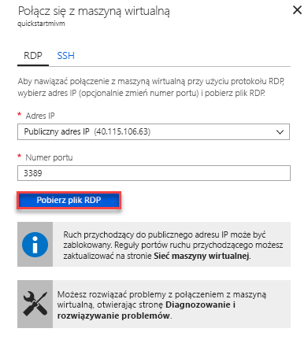

# Szybki Start: Konfigurowanie maszyny wirtualnej platformy Azure do nawiązywania połączenia z wystąpieniem zarządzanym Azure SQL Database

W tym przewodniku szybki start pokazano, jak skonfigurować maszynę wirtualną platformy Azure w celu nawiązania połączenia z wystąpieniem zarządzanym Azure SQL Database przy użyciu SQL Server Management Studio (SSMS). Aby zapoznać się z przewodnikiem Szybki Start pokazujący, jak nawiązać połączenie z lokalnego komputera klienckiego przy użyciu połączenia typu punkt-lokacja, zobacz [Konfigurowanie połączenia typu punkt-lokacja](sql-database-managed-instance-configure-p2s.md)

## Wymagania wstępne

Ten przewodnik Szybki Start używa zasobów utworzonych w ramach [tworzenia wystąpienia zarządzanego](sql-database-managed-instance-get-started.md) jako punktu początkowego.

## Logowanie się do witryny Azure Portal

Zaloguj się w witrynie [Azure Portal](https://portal.azure.com/).

## Utwórz nową podsieć w sieci wirtualnej wystąpienia zarządzanego

Poniższe kroki tworzą nową podsieć w sieci wirtualnej wystąpienia zarządzanego, aby maszyna wirtualna platformy Azure mogła połączyć się z wystąpieniem zarządzanym. Podsieć wystąpienia zarządzanego jest przeznaczona dla wystąpień zarządzanych. W tej podsieci nie można tworzyć żadnych innych zasobów, takich jak maszyny wirtualne platformy Azure.

1. Otwórz grupę zasobów dla wystąpienia zarządzanego utworzonego w temacie [Tworzenie wystąpienia zarządzanego](sql-database-managed-instance-get-started.md) — Szybki Start. Wybierz sieć wirtualną dla wystąpienia zarządzanego.

   

2. Wybierz pozycję **podsieci** , a następnie wybierz pozycję **+ podsieć** , aby utworzyć nową podsieć.

   

3. Wypełnij formularz, korzystając z informacji podanych w tej tabeli:

   | Ustawienie| Sugerowana wartość | Opis |
   | ---------------- | ----------------- | ----------- |
   | **Nazwa** | Dowolna prawidłowa nazwa|Prawidłowe nazwy opisano w artykule [Ograniczenia i reguły nazewnictwa](/azure/cloud-adoption-framework/ready/azure-best-practices/naming-and-tagging).|
   | **Zakres adresów (blok CIDR)** | Prawidłowy zakres | Wartość domyślna jest dobra dla tego przewodnika Szybki Start.|
   | **Sieciowa grupa zabezpieczeń** | Brak | Wartość domyślna jest dobra dla tego przewodnika Szybki Start.|
   | **Tabela tras** | Brak | Wartość domyślna jest dobra dla tego przewodnika Szybki Start.|
   | **Punkty końcowe usługi** | wybrano 0 | Wartość domyślna jest dobra dla tego przewodnika Szybki Start.|
   | **Delegowanie podsieci** | Brak | Wartość domyślna jest dobra dla tego przewodnika Szybki Start.|

   

4. Wybierz **przycisk OK** , aby utworzyć tę dodatkową podsieć w sieci wirtualnej wystąpienia zarządzanego.

## Tworzenie maszyny wirtualnej w nowej podsieci w sieci wirtualnej

Poniższe kroki pokazują, jak utworzyć maszynę wirtualną w nowej podsieci w celu nawiązania połączenia z wystąpieniem zarządzanym.

## Przygotowywanie maszyny wirtualnej platformy Azure

Ponieważ wystąpienie zarządzane SQL jest umieszczane w Virtual Network prywatnym, należy utworzyć maszynę wirtualną platformy Azure przy użyciu zainstalowanego narzędzia klienta SQL, takiego jak SQL Server Management Studio lub Azure Data Studio. To narzędzie umożliwia łączenie się z wystąpieniem zarządzanym i wykonywanie zapytań. Ten przewodnik Szybki Start używa SQL Server Management Studio.

Najprostszym sposobem utworzenia klienckiej maszyny wirtualnej przy użyciu wszystkich niezbędnych narzędzi jest użycie szablonów Azure Resource Manager.

1. Upewnij się, że zalogowano się do Azure Portal na innej karcie przeglądarki. Następnie wybierz poniższy przycisk, aby utworzyć maszynę wirtualną klienta i zainstalować SQL Server Management Studio:

    

2. Wypełnij formularz, korzystając z informacji podanych w poniższej tabeli:

   | Ustawienie| Sugerowana wartość | Opis |
   | ---------------- | ----------------- | ----------- |
   | **Subskrypcja** | Prawidłowa subskrypcja | Musi być subskrypcją, w której masz uprawnienia do tworzenia nowych zasobów. |
   | **Grupa zasobów** |Grupa zasobów określona w ramach [tworzenia wystąpienia zarządzanego](sql-database-managed-instance-get-started.md) — Szybki Start.|Ta grupa zasobów musi być tą, w której istnieje sieć wirtualna.|
   | **Lokalizacja** | Lokalizacja grupy zasobów | Ta wartość jest wypełniana na podstawie wybranej grupy zasobów. |
   | **Nazwa maszyny wirtualnej**  | Dowolna prawidłowa nazwa | Prawidłowe nazwy opisano w artykule [Ograniczenia i reguły nazewnictwa](/azure/cloud-adoption-framework/ready/azure-best-practices/naming-and-tagging).|
   |**Nazwa użytkownika administratora**|Dowolna prawidłowa nazwa użytkownika|Prawidłowe nazwy opisano w artykule [Ograniczenia i reguły nazewnictwa](/azure/cloud-adoption-framework/ready/azure-best-practices/naming-and-tagging). Nie używaj nazwy „serveradmin”, gdyż jest ona zarezerwowana dla roli poziomu serwera. Ta nazwa użytkownika jest używana przy każdej próbie [połączenia z maszyną wirtualną](#connect-to-virtual-machine).|
   |**Hasło**|Dowolne prawidłowe hasło|Hasło musi mieć co najmniej 12 znaków i spełniać [zdefiniowane wymagania dotyczące złożoności](../virtual-machines/windows/faq.md#what-are-the-password-requirements-when-creating-a-vm). To hasło jest używane podczas [nawiązywania połączenia z maszyną wirtualną](#connect-to-virtual-machine).|
   | **Rozmiar maszyny wirtualnej** | Dowolny prawidłowy rozmiar | Wartość domyślna w tym szablonie **Standard_B2s** jest wystarczająca dla tego przewodnika Szybki Start. |
   | **Lokalizacja**|[resourceing (). Location].| Nie zmieniaj tej wartości. |
   | **Nazwa Virtual Network**|Sieć wirtualna, w której utworzono wystąpienie zarządzane.|
   | **Nazwa podsieci**|Nazwa podsieci, która została utworzona w poprzedniej procedurze| Nie wybieraj podsieci, w której utworzono wystąpienie zarządzane.|
   | **Lokalizacja artefaktów** | [Deployment (). Properties. templateLink. URI] | Nie zmieniaj tej wartości. |
   | **token SAS lokalizacji artefaktów** | Pozostaw puste | Nie zmieniaj tej wartości. |

   

   Jeśli podczas [tworzenia wystąpienia zarządzanego](sql-database-managed-instance-get-started.md)użyto sugerowanej nazwy sieci wirtualnej i domyślnej podsieci, nie trzeba zmieniać ostatnich dwóch parametrów. W przeciwnym razie należy zmienić te wartości na wartości wprowadzone podczas konfigurowania środowiska sieciowego.

3. Zaznacz pole wyboru **Wyrażam zgodę na powyższe warunki i postanowienia** .
4. Wybierz pozycję **Kup** , aby wdrożyć maszynę wirtualną platformy Azure w sieci.
5. Wybierz ikonę **Powiadomienia**, aby wyświetlić stan wdrożenia.

> [!IMPORTANT]
> Nie należy kontynuować do 15 minut po utworzeniu maszyny wirtualnej, aby zapewnić czas na zainstalowanie SQL Server Management Studio skryptów po utworzeniu.

## Nawiązywanie połączenia z maszyną wirtualną

Poniższe kroki pokazują, jak nawiązać połączenie z nowo utworzoną maszyną wirtualną przy użyciu połączenia pulpitu zdalnego.

1. Po zakończeniu wdrażania przejdź do zasobu maszyny wirtualnej.

      

2. Wybierz przycisk **Połącz**.

   Zostanie wyświetlony formularz Remote Desktop Protocol pliku (RDP) z publicznym adresem IP i numerem portu dla maszyny wirtualnej.

     

3. Wybierz opcję **Pobierz plik RDP**.

   > [!NOTE]
   > Do nawiązania połączenia z maszyną wirtualną można także użyć protokołu SSH.

4. Zamknij formularz **Połącz z maszyną wirtualną** .
5. Aby połączyć się z maszyną wirtualną, otwórz pobrany plik RDP.
6. Po wyświetleniu monitu wybierz pozycję **Połącz**. Na komputerze Mac należy skorzystać z klienta RDP, takiego jak ten [klient pulpitu zdalnego](https://itunes.apple.com/us/app/microsoft-remote-desktop/id715768417?mt=12) ze sklepu Mac App Store.

7. Wprowadź nazwę użytkownika i hasło określone podczas tworzenia maszyny wirtualnej, a następnie wybierz przycisk **OK**.

8. Podczas procesu logowania może pojawić się ostrzeżenie o certyfikacie. Wybierz opcję **tak** lub **Kontynuuj** , aby kontynuować połączenie.

Nawiązano połączenie z maszyną wirtualną na pulpicie nawigacyjnym Menedżer serwera.

## Łączenie się z wystąpieniem zarządzanym przy użyciu programu SSMS

1. Na maszynie wirtualnej Otwórz SQL Server Management Studio (SSMS).

   Otwarcie programu może chwilę potrwać, ponieważ jest to konieczne po raz pierwszy.
2. W oknie dialogowym **łączenie z serwerem** wprowadź w pełni kwalifikowaną **nazwę hosta** dla wystąpienia zarządzanego w polu **Nazwa serwera** . Wybierz pozycję **uwierzytelnianie SQL Server**, podaj nazwę użytkownika i hasło, a następnie wybierz pozycję **Połącz**.

      

Po nawiązaniu połączenia możesz wyświetlić systemowe bazy danych oraz bazy danych użytkownika w węźle Bazy danych, a także różne obiekty w węzłach Zabezpieczenia, Obiekty serwera, Replikacja, Zarządzanie, Agent programu SQL Server oraz Profiler systemu XEvent.

## Następne kroki

- Przewodnik Szybki Start przedstawiający sposób łączenia się z lokalnego komputera klienckiego przy użyciu połączenia typu punkt-lokacja znajduje się w temacie [Konfigurowanie połączenia punkt-lokacja](sql-database-managed-instance-configure-p2s.md).
- Aby uzyskać omówienie opcji połączenia dla aplikacji, zobacz artykuł [Łączenie aplikacji z wystąpieniem zarządzanym](sql-database-managed-instance-connect-app.md).
- Aby przywrócić istniejącą bazę danych SQL Server z lokalnego do wystąpienia zarządzanego, można użyć [Azure Database Migration Service (DMS) do migracji](../dms/tutorial-sql-server-to-managed-instance.md) lub [polecenia przywracania T-SQL](sql-database-managed-instance-get-started-restore.md) , aby przywrócić plik kopii zapasowej bazy danych.
