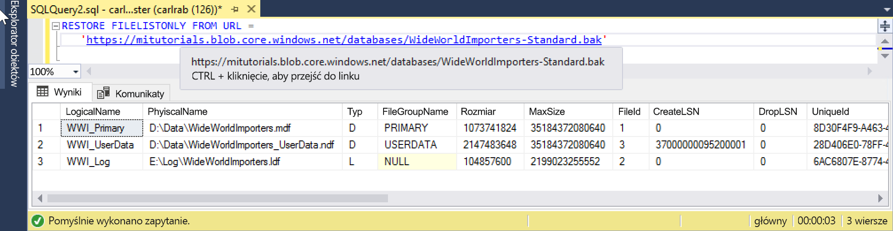

# <a name="quickstart-restore-a-database-to-a-managed-instance"></a>Szybki start: Przywracanie bazy danych do wystąpienia zarządzanego

W tym przewodniku Szybki start użyjesz programu SQL Server Management Studio (SSMS), aby przywrócić bazę danych (plik kopii zapasowej Wide World Importers — Standard) z usługi Azure Blob Storage do [wystąpienia zarządzanego](sql-database-managed-instance.md) usługi Azure SQL Database.

> [!VIDEO https://www.youtube.com/embed/RxWYojo_Y3Q]

> [!NOTE]
> Aby uzyskać więcej informacji na temat migracji przy użyciu usługi Azure Database Migration Service (DMS), zobacz artykuł [Managed Instance migration using DMS](../dms/tutorial-sql-server-to-managed-instance.md) (Migracja wystąpień zarządzanych przy użyciu usługi DMS).
> Aby uzyskać więcej informacji dotyczących różnych metod migracji, zobacz artykuł [SQL Server instance migration to Azure SQL Database Managed Instance](sql-database-managed-instance-migrate.md) (Migracja wystąpienia programu SQL Server do wystąpienia zarządzanego usługi Azure SQL Database).

## <a name="prerequisites"></a>Wymagania wstępne

Ten przewodnik Szybki start:

- Wykorzystuje zasoby z przewodnika Szybki start [Tworzenie wystąpienia zarządzanego](sql-database-managed-instance-get-started.md).
- Wymaga komputera z zainstalowanym najnowszym programem [SQL Server Management Studio](https://docs.microsoft.com/sql/ssms/sql-server-management-studio-ssms).
- Wymaga użycia programu SSMS do połączenia z wystąpieniem zarządzanym. Zobacz te przewodniki Szybki start dotyczące nawiązywania połączenia:
  - [Nawiązywanie połączenia wystąpienia zarządzanego Azure SQL Database z maszyny Wirtualnej platformy Azure](sql-database-managed-instance-configure-vm.md)
  - [Configure a point-to-site connection to an Azure SQL Database Managed Instance from on-premises](sql-database-managed-instance-configure-p2s.md) (Konfigurowanie połączenia punkt-lokacja z wystąpieniem zarządzanym usługi Azure SQL Database ze środowiska lokalnego).

> [!NOTE]
> Aby uzyskać więcej informacji na temat tworzenia kopii zapasowych i przywracania bazy danych programu SQL Server przy użyciu usługi Azure Blob Storage i [klucza sygnatury dostępu współdzielonego (SAS)](https://docs.microsoft.com/azure/storage/common/storage-dotnet-shared-access-signature-part-1), zobacz artykuł [SQL Server Backup to URL (Tworzenie kopii zapasowej programu SQL Server pod określonym adresem URL)](sql-database-managed-instance-get-started-restore.md).

## <a name="restore-the-database-from-a-backup-file"></a>Przywracanie bazy danych z pliku kopii zapasowej

W programie SSMS użyj następujących kroków, aby przywrócić bazę danych Wide World Importers do wystąpienia zarządzanego. Plik kopii zapasowej bazy danych znajduje na wstępnie skonfigurowanym koncie usługi Azure Blob Storage.

1. Otwórz program SMSS i nawiąż połączenie z wystąpieniem zarządzanym.
2. W menu po lewej stronie, kliknij prawym przyciskiem myszy wystąpienie zarządzane i wybierz pozycję **Nowe zapytanie**, aby otworzyć okno nowego zapytania.
3. Uruchom poniższy skrypt SQL wykorzystujący wstępnie skonfigurowane konto magazynu i klucz SAS, aby [utworzyć poświadczenie](https://docs.microsoft.com/sql/t-sql/statements/create-credential-transact-sql) w wystąpieniu zarządzanym.

   ```sql
   CREATE CREDENTIAL [https://mitutorials.blob.core.windows.net/databases]
   WITH IDENTITY = 'SHARED ACCESS SIGNATURE'
   , SECRET = 'sv=2017-11-09&ss=bfqt&srt=sco&sp=rwdlacup&se=2028-09-06T02:52:55Z&st=2018-09-04T18:52:55Z&spr=https&sig=WOTiM%2FS4GVF%2FEEs9DGQR9Im0W%2BwndxW2CQ7%2B5fHd7Is%3D'
   ```

    

4. Aby sprawdzić swoje poświadczenie, uruchom następujący skrypt, który używa adresu URL [kontenera](https://azure.microsoft.com/services/container-instances/), aby uzyskać listę plików kopii zapasowej.

   ```sql
   RESTORE FILELISTONLY FROM URL =
      'https://mitutorials.blob.core.windows.net/databases/WideWorldImporters-Standard.bak'
   ```

    

5. Uruchom następujący skrypt, aby przywrócić bazę danych Wide World Importers.

   ```sql
   RESTORE DATABASE [Wide World Importers] FROM URL =
     'https://mitutorials.blob.core.windows.net/databases/WideWorldImporters-Standard.bak'
   ```

    

6. Uruchom następujący skrypt, aby śledzić stan przywracania.

   ```sql
   SELECT session_id as SPID, command, a.text AS Query, start_time, percent_complete
      , dateadd(second,estimated_completion_time/1000, getdate()) as estimated_completion_time
   FROM sys.dm_exec_requests r
   CROSS APPLY sys.dm_exec_sql_text(r.sql_handle) a
   WHERE r.command in ('BACKUP DATABASE','RESTORE DATABASE')
   ```

7. Po zakończeniu operacji przywracania wyświetl ją w Eksploratorze obiektów.

## <a name="next-steps"></a>Kolejne kroki

- W celu rozwiązywania problemów dotyczących tworzenia kopii zapasowej do adresu URL, zobacz artykuł [SQL Server Backup to URL Best Practices and Troubleshooting](https://docs.microsoft.com/sql/relational-databases/backup-restore/sql-server-backup-to-url-best-practices-and-troubleshooting) (Kopia zapasowa programu SQL Server do adresu URL — najlepsze rozwiązania i rozwiązywanie problemów).
- Aby uzyskać omówienie opcji połączenia aplikacji, zobacz artykuł [Connect your applications to Managed Instance](sql-database-managed-instance-connect-app.md) (Łączenie aplikacji z wystąpieniem zarządzanym).
- Aby wykonywać zapytania przy użyciu ulubionych narzędzi lub języków, zobacz przewodnik [Szybki start: Azure SQL Database Connect and Query](sql-database-connect-query.md) (Nawiązywanie połączeń z usługą Azure SQL Database i wykonywanie zapytań).
