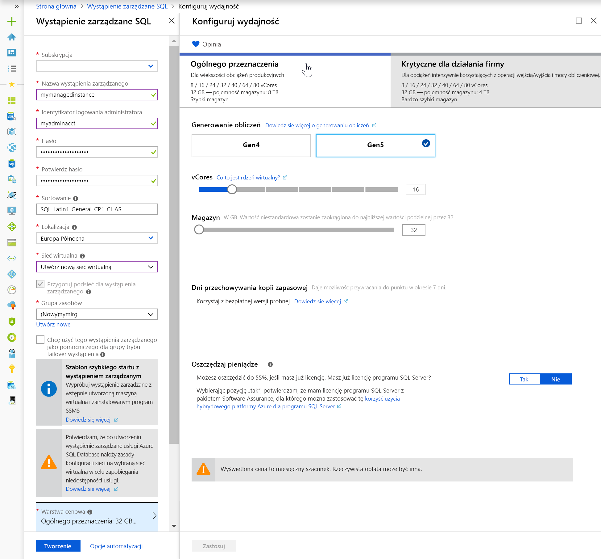
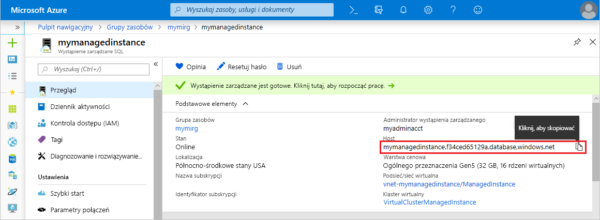

# Szybki start: Tworzenie wystąpienia zarządzanego usługi Azure SQL Database

Ten przewodnik Szybki Start przeprowadzi Cię przez proces tworzenia Azure SQL Database [wystąpienia zarządzanego](sql-database-managed-instance.md) w Azure Portal.

> [!IMPORTANT]
> Aby uzyskać ograniczenia, zobacz [Obsługiwane regiony](sql-database-managed-instance-resource-limits.md#supported-regions) i [obsługiwane typy subskrypcji](sql-database-managed-instance-resource-limits.md#supported-subscription-types).

## Logowanie się do witryny Azure Portal

Jeśli nie masz subskrypcji platformy Azure, utwórz [bezpłatne konto](https://azure.microsoft.com/free/).

Zaloguj się w witrynie [Azure Portal](https://portal.azure.com/).

## Tworzenie wystąpienia zarządzanego

Poniższe kroki przedstawiają sposób tworzenia wystąpienia zarządzanego.

1. Wybierz pozycję **Utwórz zasób** w lewym górnym rogu Azure Portal.
2. Znajdź **wystąpienie zarządzane**, a następnie wybierz **wystąpienie zarządzane Azure SQL**.
3. Wybierz pozycję **Utwórz**.

   

4. Wypełnij formularz **wystąpienia zarządzanego SQL** z żądanymi informacjami, korzystając z informacji podanych w poniższej tabeli.

   | Ustawienie| Sugerowana wartość | Opis |
   | ------ | --------------- | ----------- |
   | **Subskrypcja** | Twoja subskrypcja. | Subskrypcja, która zapewnia uprawnienia do tworzenia nowych zasobów. |
   |**Nazwa wystąpienia zarządzanego**|Dowolna prawidłowa nazwa.|Prawidłowe nazwy opisano w artykule [Ograniczenia i reguły nazewnictwa](https://docs.microsoft.com/azure/architecture/best-practices/naming-conventions).|
   |**Identyfikator logowania administratora wystąpienia zarządzanego**|Dowolna prawidłowa nazwa użytkownika.|Prawidłowe nazwy opisano w artykule [Ograniczenia i reguły nazewnictwa](https://docs.microsoft.com/azure/architecture/best-practices/naming-conventions). Nie należy używać elementu "serveradmin", ponieważ jest to zastrzeżona rola na poziomie serwera.|
   |**Hasło**|Dowolne prawidłowe hasło.|Hasło musi mieć co najmniej 16 znaków i spełniać [zdefiniowane wymagania dotyczące złożoności](../virtual-machines/windows/faq.md#what-are-the-password-requirements-when-creating-a-vm).|
   |**Strefa czasowa**|Strefa czasowa, która ma być zaobserwowana przez wystąpienie zarządzane.|Aby uzyskać więcej informacji, zobacz [strefy czasowe](sql-database-managed-instance-timezone.md).|
   |**Sortowanie**|Sortowanie, które ma być używane dla wystąpienia zarządzanego.|W przypadku migrowania baz danych z SQL Server sprawdź sortowanie źródłowe za `SELECT SERVERPROPERTY(N'Collation')` pomocą i Użyj tej wartości. Aby uzyskać informacje o sortowaniu, zobacz [Ustawianie lub zmienianie sortowania serwera](https://docs.microsoft.com/sql/relational-databases/collations/set-or-change-the-server-collation).|
   |**Location**|Lokalizacja, w której chcesz utworzyć wystąpienie zarządzane.|Aby uzyskać informacje na temat regionów, zobacz [Regiony systemu Azure](https://azure.microsoft.com/regions/).|
   |**Sieć wirtualna**|Wybierz opcję **Utwórz nową sieć wirtualną** lub prawidłową sieć wirtualną i podsieć.| Jeśli sieć lub podsieć jest niedostępna, należy ją [zmodyfikować, aby spełniała wymagania sieciowe](sql-database-managed-instance-configure-vnet-subnet.md) przed wybraniem jej jako docelowej dla nowego wystąpienia zarządzanego. Aby uzyskać informacje o wymaganiach dotyczących konfigurowania środowiska sieciowego dla wystąpienia zarządzanego, zobacz [Konfigurowanie sieci wirtualnej dla wystąpienia zarządzanego](sql-database-managed-instance-connectivity-architecture.md). |
   |**Włącz publiczny punkt końcowy**   |Zaznacz tę opcję, aby włączyć publiczny punkt końcowy   |Aby można było uzyskać dostęp do zarządzanego wystąpienia za pomocą publicznego punktu końcowego danych, należy sprawdzić, czy należy zaznaczyć opcję **publiczny punkt końcowy** .| 
   |**Zezwalaj na dostęp z**   |Wybierz jedną z opcji: <ul> <li>**Usługi platformy Azure**</li> <li>**Internet**</li> <li>**Brak dostępu**</li></ul>   |Środowisko portalu umożliwia skonfigurowanie grupy zabezpieczeń z publicznym punktem końcowym.     Na podstawie Twojego scenariusza wybierz jedną z następujących opcji:   <ul> <li>Usługi platformy Azure — zalecane w przypadku nawiązywania połączenia z poziomu usługi Power BI lub innej dzierżawy. </li> <li> Używanie Internetu do celów testowych, gdy chcesz szybko utworzyć wystąpienie zarządzane. Nie jest to zalecane do użycia w środowiskach produkcyjnych. </li> <li> Brak dostępu — ta opcja tworzy regułę odmowy zabezpieczeń. Należy zmodyfikować tę regułę, aby umożliwić dostęp do wystąpienia zarządzanego za poorednictwem publicznego punktu końcowego. </li> </ul>   Aby uzyskać więcej informacji o zabezpieczeniach publicznego punktu końcowego, zobacz [bezpieczne używanie Azure SQL Database wystąpienia zarządzanego z publicznym punktem końcowym](sql-database-managed-instance-public-endpoint-securely.md).|
   |**Typ połączenia**|Wybierz między serwerem proxy a typem połączenia przekierowania.|Aby uzyskać więcej informacji na temat typów połączeń, zobacz [Azure SQL Database Policy Connection](sql-database-connectivity-architecture.md#connection-policy).|
   |**Grupa zasobów**|nowa lub istniejąca grupa zasobów.|Prawidłowe nazwy grup zasobów opisano w artykule [Naming rules and restrictions](https://docs.microsoft.com/azure/architecture/best-practices/naming-conventions) (Reguły i ograniczenia nazewnictwa).|

   

5. Aby użyć wystąpienia zarządzanego jako pomocniczej grupy trybu failover wystąpienia, zaznacz pole wyboru i określ wystąpienie zarządzane DnsAzurePartner. Ta funkcja jest w wersji zapoznawczej i nie jest pokazana na poniższym zrzucie ekranu.
6. Wybierz pozycję **warstwa cenowa** , aby zmienić rozmiar zasobów obliczeniowych i magazynu oraz przejrzeć opcje warstwy cenowej. Wartość domyślna to warstwa cenowa Ogólnego przeznaczenia z 32 GB pamięci i 16 rdzeniami wirtualnymi.
7. Użyj suwaków lub pól tekstowych, aby określić ilość pamięci i liczbę rdzeni wirtualnych.
8. Po zakończeniu wybierz pozycję **Zastosuj** , aby zapisać swój wybór. 
9. Wybierz pozycję **Utwórz**, aby wdrożyć wystąpienie zarządzane.
10. Wybierz ikonę **powiadomienia** , aby wyświetlić stan wdrożenia.

    

11. Wybierz pozycję **Wdrażanie jest w toku**, aby otworzyć okno wystąpienia zarządzanego i dokładniej monitorować postęp wdrażania. 

> [!IMPORTANT]
> W przypadku pierwszego wystąpienia w podsieci czas wdrożenia jest zazwyczaj znacznie dłuższy niż w kolejnych wystąpieniach. Nie anuluj operacji wdrażania, ponieważ proces trwa dłużej niż oczekiwano.

## Przeglądanie zasobów i pobieranie w pełni kwalifikowanej nazwy serwera

Po pomyślnym wdrożeniu zapoznaj się z utworzonymi zasobami i Pobierz w pełni kwalifikowaną nazwę serwera do użycia w nowszych przewodnikach Szybki Start.

1. Otwórz grupę zasobów dla wystąpienia zarządzanego. Wyświetl zasoby, które zostały utworzone dla Ciebie, w oknie [Tworzenie wystąpienia zarządzanego](#create-a-managed-instance) — Szybki Start.

   

2. Wybierz tabelę tras, aby przejrzeć utworzoną przez użytkownika tabelę tras (UDR).

   

3. W tabeli tras zapoznaj się z wpisami na potrzeby kierowania ruchu z i do sieci wirtualnej wystąpienia zarządzanego. W przypadku ręcznego tworzenia lub konfigurowania tabeli tras należy koniecznie utworzyć te wpisy w tabeli tras.

   

4. Wróć do grupy zasobów i wybierz grupę zabezpieczeń sieci, aby przejrzeć reguły zabezpieczeń.

   

5. Zapoznaj się z zasadami zabezpieczeń dla ruchu przychodzącego i wychodzącego. Jeśli skonfigurowano publiczne punkty końcowe dla wystąpienia zarządzanego, zapoznaj się z artykułem [Konfigurowanie publicznego punktu końcowego](sql-database-managed-instance-public-endpoint-configure.md#allow-public-endpoint-traffic-on-the-network-security-group) , aby uzyskać więcej informacji.

   

6. Wróć do grupy zasobów, a następnie wybierz wystąpienie zarządzane.

   

7. Na karcie **Przegląd** Znajdź właściwość **host** . Skopiuj w pełni kwalifikowany adres hosta dla wystąpienia zarządzanego do użycia w następnym przewodniku Szybki Start.

   

   Nazwa jest podobna do **nazwa_maszyny.a1b2c3d4e5f6.database.windows.net**.

## Następne kroki

- Aby dowiedzieć się, jak nawiązać połączenie z wystąpieniem zarządzanym:
  - Aby zapoznać się z omówieniem opcji połączenia dla aplikacji, zobacz [łączenie aplikacji z wystąpieniem zarządzanym](sql-database-managed-instance-connect-app.md).
  - Aby zapoznać się z przewodnikiem Szybki Start, który pokazuje, jak nawiązać połączenie z wystąpieniem zarządzanym z maszyny wirtualnej platformy Azure, zobacz [Konfigurowanie połączenia z maszyną wirtualną platformy Azure](sql-database-managed-instance-configure-vm.md).
  - Aby zapoznać się z przewodnikiem Szybki Start, który pokazuje, jak połączyć się z wystąpieniem zarządzanym z lokalnego komputera klienckiego przy użyciu połączenia typu punkt-lokacja, zobacz [Konfigurowanie połączenia punkt-lokacja](sql-database-managed-instance-configure-p2s.md).
- Aby przywrócić istniejącą bazę danych SQL Server z lokalnego do wystąpienia zarządzanego: 
    - Aby przeprowadzić migrację z pliku kopii zapasowej bazy danych, użyj [Azure Database Migration Service (DMS)](../dms/tutorial-sql-server-to-managed-instance.md) do przetworzenia. 
    - Użyj [polecenia Przywróć T-SQL](sql-database-managed-instance-get-started-restore.md) , aby przywrócić plik kopii zapasowej bazy danych.
- Aby uzyskać zaawansowane monitorowanie wydajności bazy danych wystąpień zarządzanych przy użyciu wbudowanej analizy rozwiązywania problemów, zobacz [monitorowanie Azure SQL Database przy użyciu Azure SQL Analytics](../azure-monitor/insights/azure-sql.md).
