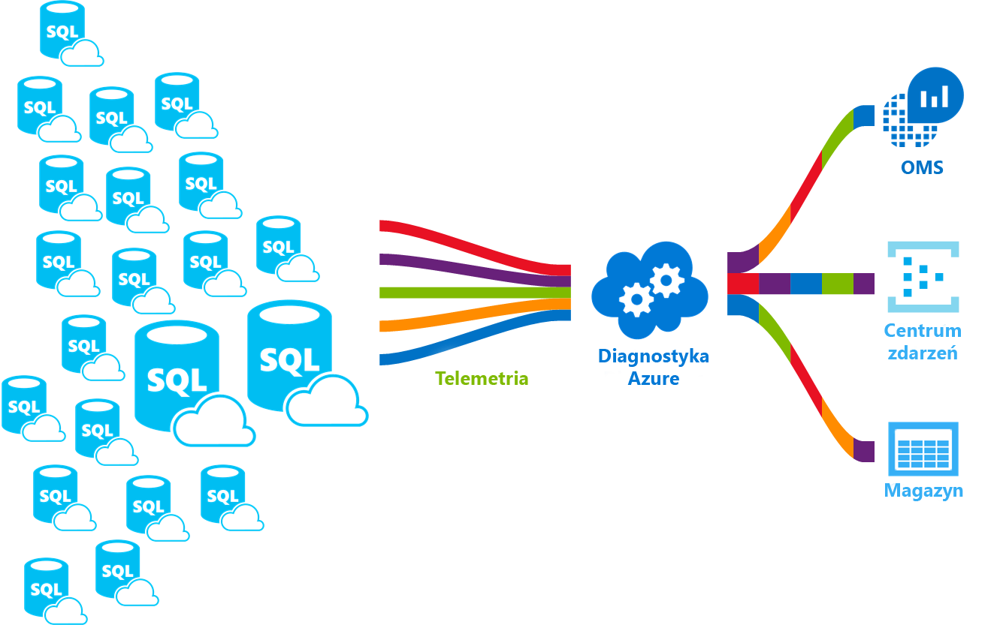

# <a name="azure-sql-database-metrics-and-diagnostics-logging"></a>Azure SQL Database metryki i rejestrowania diagnostyki

W tym temacie dowiesz się, jak skonfigurować rejestrowanie danych telemetrycznych diagnostyki dla Azure SQL Database za pomocą Azure Portal, programu PowerShell, interfejsu wiersza polecenia platformy Azure, Azure Monitor API REST i szablonu Azure Resource Manager. Te diagnostyki mogą służyć do oceny wykorzystania zasobów i statystyk wykonywania zapytań.

Pojedyncze bazy danych, pule baz danych w puli elastycznej, a bazy danych wystąpień w wystąpieniu zarządzanym mogą przesyłać strumieniowo metryki i dzienniki diagnostyczne w celu łatwiejszego monitorowania wydajności. Bazę danych można skonfigurować do przesyłania użycia zasobów, procesów roboczych i sesji oraz łączności z jednym z następujących zasobów platformy Azure:

- **Azure SQL Analytics**: Aby uzyskać inteligentne monitorowanie baz danych usługi Azure SQL Database, które obejmują raporty wydajności, alerty i zalecenia zaradcze.
- **Azure Event Hubs**: aby zintegrować telemetrię SQL Database z niestandardowymi rozwiązaniami do monitorowania lub potokami.
- **Azure Storage**: w celu archiwizowania ogromnych ilości danych telemetrycznych przez ułamek cen.

    

Aby uzyskać więcej informacji na temat metryk i kategorii dzienników obsługiwanych przez różne usługi platformy Azure, zobacz:

- [Przegląd metryk w Microsoft Azure](../monitoring-and-diagnostics/monitoring-overview-metrics.md)
- [Omówienie dzienników diagnostyki platformy Azure](../azure-monitor/platform/diagnostic-logs-overview.md)

Ten artykuł zawiera wskazówki ułatwiające włączenie telemetrii diagnostyki dla baz danych SQL Azure, pul elastycznych i wystąpień zarządzanych. Może również pomóc zrozumieć, jak skonfigurować Azure SQL Analytics jako narzędzie monitorowania do wyświetlania telemetrii diagnostyki bazy danych.

## <a name="enable-logging-of-diagnostics-telemetry"></a>Włącz rejestrowanie danych telemetrycznych diagnostyki

Można włączyć i zarządzać metrykami oraz diagnostycznym rejestrowaniem danych telemetrycznych za pomocą jednej z następujących metod:

- Azure Portal
- PowerShell
- Interfejs wiersza polecenia platformy Azure
- Interfejs API REST Azure Monitor
- Szablon usługi Azure Resource Manager

Po włączeniu rejestrowania metryk i diagnostyki należy określić miejsce docelowe zasobów platformy Azure na potrzeby zbierania danych telemetrycznych diagnostyki. Dostępne opcje to:

- Azure SQL Analytics
- Azure Event Hubs
- Azure Storage

Można zainicjować obsługę nowego zasobu platformy Azure lub wybrać istniejący zasób. Po wybraniu zasobu przy użyciu opcji **Ustawienia diagnostyczne** Określ, które dane mają być zbierane.

## <a name="supported-diagnostic-logging-for-azure-sql-databases-and-instance-databases"></a>Obsługiwane rejestrowanie diagnostyczne baz danych Azure SQL Database i wystąpienia baz danych

Włącz rejestrowanie metryk i diagnostyki w bazach danych SQL — nie są one domyślnie włączone.

Można skonfigurować bazy danych Azure SQL Database i wystąpienia baz danych, aby zbierać następujące dane telemetryczne diagnostyki:

| Monitorowanie telemetrii dla baz danych | Obsługa pojedynczej bazy danych i bazy danych w puli | Obsługa bazy danych wystąpień |
| :------------------- | ----- | ----- |
| [Metryki podstawowe](#basic-metrics): Zawiera wartość procentową jednostek DTU/procesor CPU, limit liczby jednostek DTU/procesora, procent odczytu danych fizycznych, procent zapisu w dzienniku, powodzenie/niepowodzenie/zablokowany przez połączenia zapory, procent sesji, procenty użycia, magazyn, procent magazynu i procent magazynu XTP. | Tak | Nie |
| [QueryStoreRuntimeStatistics](#query-store-runtime-statistics): Zawiera informacje o statystykach środowiska uruchomieniowego zapytań, takich jak użycie procesora CPU i statystyka czasu trwania zapytania. | Yes | Tak |
| [QueryStoreWaitStatistics](#query-store-wait-statistics): Zawiera informacje o statystyce oczekiwania zapytań (zapytania, w których oczekują zapytania), takie jak użycie procesora CPU, dziennika i blokowania. | Tak | Tak |
| [Błędy](#errors-dataset): Zawiera informacje o błędach SQL w bazie danych. | Tak | Tak |
| [DatabaseWaitStatistics](#database-wait-statistics-dataset): Zawiera informacje o tym, ile czasu baza danych poświęca na oczekiwanie na różne typy oczekiwania. | Tak | Nie |
| [Limity czasu](#time-outs-dataset): Zawiera informacje na temat limitów czasu w bazie danych. | Tak | Nie |
| [Bloki](#blockings-dataset): Zawiera informacje na temat blokowania zdarzeń w bazie danych. | Tak | Nie |
| [Zakleszczenia](#deadlocks-dataset): Zawiera informacje o zdarzeniach zakleszczenia w bazie danych. | Tak | Nie |
| [AutomaticTuning](#automatic-tuning-dataset): Zawiera informacje o zaleceniach dotyczących dostrajania automatycznego dla bazy danych. | Tak | Nie |
| [SQLInsights](#intelligent-insights-dataset): Zawiera Intelligent Insights do wydajności bazy danych. Aby dowiedzieć się więcej, zobacz [Intelligent Insights](sql-database-intelligent-insights.md). | Tak | Tak |

> [!IMPORTANT]
> Pule elastyczne i wystąpienia zarządzane mają osobne dane telemetryczne diagnostyki z baz danych, które zawierają. Jest to ważne, aby pamiętać, że dane telemetryczne diagnostyki są konfigurowane osobno dla każdego z tych zasobów, jak opisano poniżej.

> [!NOTE]
> Nie można włączyć inspekcji zabezpieczeń i dzienników SQLSecurityAuditEvents z ustawień diagnostycznych bazy danych (choć wyświetlanych na ekranie). Aby włączyć przesyłanie strumieniowe dzienników inspekcji, zobacz [Konfigurowanie inspekcji dla bazy danych](sql-database-auditing.md#subheading-2)i [Inspekcja dzienników w Azure monitor dziennikach i Event Hubs platformy Azure](https://techcommunity.microsoft.com/t5/Azure-SQL-Database/SQL-Audit-logs-in-Azure-Log-Analytics-and-Azure-Event-Hubs/ba-p/386242).

## <a name="azure-portal"></a>Azure Portal

Aby skonfigurować przesyłanie strumieniowe danych telemetrycznych diagnostyki, można użyć menu **Ustawienia diagnostyczne** dla każdej pojedynczej, w puli lub w Azure Portal. Ponadto dane telemetryczne diagnostyki można również skonfigurować osobno dla kontenerów bazy danych: pule elastyczne i wystąpienia zarządzane. Można ustawić następujące miejsca docelowe, aby przesyłać strumieniowo dane telemetryczne diagnostyki: Usługi Azure Storage, Azure Event Hubs i Azure Monitor.

### <a name="configure-streaming-of-diagnostics-telemetry-for-elastic-pools"></a>Konfigurowanie przesyłania strumieniowego danych telemetrycznych diagnostyki dla pul elastycznych

   

Można skonfigurować zasób puli elastycznej w celu zebrania następujących danych telemetrycznych diagnostyki:

| Resource | Monitorowanie telemetrii |
| :------------------- | ------------------- |
| **Elastyczna pula** | [Metryki podstawowe](sql-database-metrics-diag-logging.md#basic-metrics) zawierają wartości procentowe liczby jednostek EDTU/procesora, wartość EDTU/procesor CPU, procent odczytania danych fizycznych, procent zapisu w dzienniku, procent sesji, procent pracowników, magazyn, procent magazynu, limit magazynu i procent magazynu XTP. |

Aby skonfigurować strumieniowe dane telemetryczne diagnostyki dla pul elastycznych i baz danych w pulach elastycznych, należy oddzielnie skonfigurować **obie** następujące czynności:

- Włącz przesyłanie strumieniowe danych telemetrycznych diagnostyki dla puli elastycznej **i**
- Włącz przesyłanie strumieniowe telemetrii diagnostyki dla każdej bazy danych w puli elastycznej

Wynika to z faktu, że Pula elastyczna jest kontenerem bazy danych z własną telemetrią, która jest oddzielona od pojedynczej telemetrii.

Aby włączyć przesyłanie strumieniowe danych telemetrycznych diagnostyki dla zasobu puli elastycznej, wykonaj następujące kroki:

1. Przejdź do zasobu **puli elastycznej** w Azure Portal.
1. Wybierz pozycję **Ustawienia diagnostyki**.
1. Wybierz opcję **Włącz diagnostykę** , jeśli nie istnieją poprzednie ustawienia lub wybierz opcję **Edytuj ustawienie** , aby edytować poprzednie ustawienie.

   

1. Wprowadź nazwę ustawienia dla własnego odwołania.
1. Wybierz zasób docelowy dla danych diagnostycznych przesyłania strumieniowego: **Archiwizuj na koncie magazynu**, **przesyła strumieniowo do centrum zdarzeń**lub **wysyła do log Analytics**.
1. W przypadku usługi log Analytics wybierz pozycję **Konfiguruj** i Utwórz nowy obszar roboczy, wybierając pozycję **+ Utwórz nowy obszar roboczy**lub wybierz istniejący obszar roboczy.
1. Zaznacz pole wyboru dla telemetrii diagnostyki puli elastycznej: **Podstawowe** metryki.
   
1. Wybierz pozycję **Zapisz**.
1. Ponadto należy skonfigurować przesyłanie strumieniowe telemetrii diagnostyki dla każdej bazy danych w puli elastycznej, którą chcesz monitorować, wykonując czynności opisane w następnej sekcji.

> [!IMPORTANT]
> Oprócz skonfigurowania telemetrii diagnostyki dla puli elastycznej należy również skonfigurować dane telemetryczne diagnostyki dla każdej bazy danych w puli elastycznej, jak opisano poniżej.

### <a name="configure-streaming-of-diagnostics-telemetry-for-single-database-or-database-in-elastic-pool"></a>Konfigurowanie przesyłania strumieniowego telemetrii diagnostyki dla pojedynczej bazy danych lub bazy danych w puli elastycznej

   

Aby włączyć przesyłanie strumieniowe danych telemetrycznych diagnostyki dla pojedynczych lub w puli bazach, wykonaj następujące kroki:

1. Przejdź do zasobu usługi Azure **SQL Database** .
1. Wybierz pozycję **Ustawienia diagnostyki**.
1. Wybierz opcję **Włącz diagnostykę** , jeśli nie istnieją poprzednie ustawienia lub wybierz opcję **Edytuj ustawienie** , aby edytować poprzednie ustawienie.
   - Do telemetrii diagnostyki przesyłania strumieniowego można utworzyć maksymalnie trzy połączenia równoległe.
   - Wybierz pozycję **+ Dodaj ustawienie diagnostyczne** , aby skonfigurować równoległe przesyłanie strumieniowe danych diagnostycznych do wielu zasobów.

   
1. Wprowadź nazwę ustawienia dla własnego odwołania.
1. Wybierz zasób docelowy dla danych diagnostycznych przesyłania strumieniowego: **Archiwizuj na koncie magazynu**, **przesyła strumieniowo do centrum zdarzeń**lub **wysyła do log Analytics**.
1. W przypadku standardowego środowiska monitorowania opartego na zdarzeniach zaznacz następujące pola wyboru dla telemetrii dziennika diagnostyki bazy danych: **SQLInsights**, **AutomaticTuning**, **QueryStoreRuntimeStatistics**, **QueryStoreWaitStatistics**, **Błędy**, **DatabaseWaitStatistics**, **limity czasu**, **bloki**i **zakleszczenia**.
1. W przypadku zaawansowanego, opartego na minutę środowiska monitorowania zaznacz pole wyboru dla metryk **podstawowych** .
   
1. Wybierz pozycję **Zapisz**.
1. Powtórz te kroki dla każdej bazy danych, która ma być monitorowana.

> [!NOTE]
> Nie można włączyć inspekcji zabezpieczeń i dzienników SQLSecurityAuditEvents z ustawień diagnostyki bazy danych (choć są one wyświetlane na ekranie). Aby włączyć przesyłanie strumieniowe dzienników inspekcji, zobacz [Konfigurowanie inspekcji dla bazy danych](sql-database-auditing.md#subheading-2)i [Inspekcja dzienników w Azure monitor dziennikach i Event Hubs platformy Azure](https://techcommunity.microsoft.com/t5/Azure-SQL-Database/SQL-Audit-logs-in-Azure-Log-Analytics-and-Azure-Event-Hubs/ba-p/386242).
> [!TIP]
> Powtórz te kroki dla każdego Azure SQL Database, które chcesz monitorować.

### <a name="configure-streaming-of-diagnostics-telemetry-for-managed-instances"></a>Konfigurowanie przesyłania strumieniowego danych telemetrycznych diagnostyki dla wystąpień zarządzanych

   

Można skonfigurować zasób wystąpienia zarządzanego, aby zebrać następujące dane telemetryczne diagnostyki:

| Resource | Monitorowanie telemetrii |
| :------------------- | ------------------- |
| **Wystąpienie zarządzane** | [ResourceUsageStats](#resource-usage-stats-for-managed-instance) zawiera Licznik rdzeni wirtualnych, średni procent procesora CPU, żądania we/wy, bajty do odczytu/zapisu, zarezerwowane miejsce do magazynowania i miejsce do magazynowania. |

Aby skonfigurować strumieniowe dane telemetryczne diagnostyki dla wystąpień zarządzanych i baz danych wystąpień, należy oddzielnie skonfigurować **obie** następujące czynności:

- Włącz przesyłanie strumieniowe danych telemetrycznych diagnostyki dla wystąpienia zarządzanego **i**
- Włącz przesyłanie strumieniowe telemetrii diagnostyki dla każdej bazy danych wystąpienia

Wynika to z faktu, że wystąpienie zarządzane jest kontenerem bazy danych z własną telemetrią, niezależnie od danych telemetrycznych poszczególnych wystąpień.

Aby włączyć przesyłanie strumieniowe danych telemetrycznych diagnostyki dla zasobu wystąpienia zarządzanego, wykonaj następujące czynności:

1. Przejdź do zasobu **wystąpienia zarządzanego** w Azure Portal.
1. Wybierz pozycję **Ustawienia diagnostyki**.
1. Wybierz opcję **Włącz diagnostykę** , jeśli nie istnieją poprzednie ustawienia lub wybierz opcję **Edytuj ustawienie** , aby edytować poprzednie ustawienie.

   

1. Wprowadź nazwę ustawienia dla własnego odwołania.
1. Wybierz zasób docelowy dla danych diagnostycznych przesyłania strumieniowego: **Archiwizuj na koncie magazynu**, **przesyła strumieniowo do centrum zdarzeń**lub **wysyła do log Analytics**.
1. W przypadku usługi log Analytics wybierz pozycję **Konfiguruj** i Utwórz nowy obszar roboczy, wybierając pozycję **+ Utwórz nowy obszar roboczy**lub korzystając z istniejącego obszaru roboczego.
1. Zaznacz pole wyboru dla danych telemetrycznych diagnostyki wystąpienia: **ResourceUsageStats**.
   
1. Wybierz pozycję **Zapisz**.
1. Ponadto należy skonfigurować przesyłanie strumieniowe telemetryczne diagnostyki dla każdej bazy danych wystąpienia w zarządzanym wystąpieniu, które chcesz monitorować, wykonując kroki opisane w następnej sekcji.

> [!IMPORTANT]
> Oprócz skonfigurowania telemetrii diagnostyki dla wystąpienia zarządzanego należy również skonfigurować telemetrię diagnostyki dla każdej bazy danych wystąpienia, jak opisano poniżej.

### <a name="configure-streaming-of-diagnostics-telemetry-for-instance-databases"></a>Konfigurowanie przesyłania strumieniowego telemetrii diagnostyki dla baz danych wystąpień

   

Aby włączyć strumieniowe dane telemetryczne diagnostyki dla baz danych wystąpień, wykonaj następujące czynności:

1. Przejdź do zasobu **wystąpienia bazy danych** w ramach wystąpienia zarządzanego.
1. Wybierz pozycję **Ustawienia diagnostyki**.
1. Wybierz opcję **Włącz diagnostykę** , jeśli nie istnieją poprzednie ustawienia lub wybierz opcję **Edytuj ustawienie** , aby edytować poprzednie ustawienie.
   - Do telemetrii diagnostyki strumienia można utworzyć maksymalnie trzy (3) połączenia równoległe.
   - Wybierz pozycję **+ Dodaj ustawienie diagnostyczne** , aby skonfigurować równoległe przesyłanie strumieniowe danych diagnostycznych do wielu zasobów.

   

1. Wprowadź nazwę ustawienia dla własnego odwołania.
1. Wybierz zasób docelowy dla danych diagnostycznych przesyłania strumieniowego: **Archiwizuj na koncie magazynu**, **przesyła strumieniowo do centrum zdarzeń**lub **wysyła do log Analytics**.
1. Zaznacz pola wyboru dla telemetrii diagnostyki bazy danych: **SQLInsights**, **QueryStoreRuntimeStatistics**, **QueryStoreWaitStatistics** i **Błędy**.
   
1. Wybierz pozycję **Zapisz**.
1. Powtórz te kroki dla każdej bazy danych wystąpienia, która ma być monitorowana.

> [!TIP]
> Powtórz te kroki dla każdej bazy danych wystąpienia, która ma być monitorowana.

### <a name="powershell"></a>PowerShell

[!INCLUDE [updated-for-az](../../includes/updated-for-az.md)]
> [!IMPORTANT]
> Moduł Azure Resource Manager programu PowerShell jest nadal obsługiwany przez Azure SQL Database, ale wszystkie przyszłe Programowanie dla modułu AZ. SQL. W przypadku tych poleceń cmdlet zobacz [AzureRM. SQL](https://docs.microsoft.com/powershell/module/AzureRM.Sql/). Argumenty poleceń polecenia AZ module i w modułach AzureRm są zasadniczo identyczne.

Można włączyć funkcję rejestrowania metryk i diagnostyki przy użyciu programu PowerShell.

- Aby włączyć magazyn dzienniki diagnostyczne na koncie magazynu, użyj tego polecenia:

   ```powershell
   Set-AzDiagnosticSetting -ResourceId [your resource id] -StorageAccountId [your storage account id] -Enabled $true
   ```

   Identyfikator konta magazynu jest IDENTYFIKATORem zasobu dla docelowego konta magazynu.

- Aby włączyć strumieniowe przesyłanie dzienników diagnostycznych do Centrum zdarzeń, użyj tego polecenia:

   ```powershell
   Set-AzDiagnosticSetting -ResourceId [your resource id] -ServiceBusRuleId [your service bus rule id] -Enabled $true
   ```

   Identyfikator reguły usługi Azure Service Bus jest ciągiem o następującym formacie:

   ```powershell
   {service bus resource ID}/authorizationrules/{key name}
   ```

- Aby włączyć wysyłanie dzienników diagnostycznych do obszaru roboczego usługi Log Analytics, użyj tego polecenia:

   ```powershell
   Set-AzDiagnosticSetting -ResourceId [your resource id] -WorkspaceId [resource id of the log analytics workspace] -Enabled $true
   ```

- Identyfikator zasobu obszaru roboczego usługi Log Analytics można uzyskać za pomocą następującego polecenia:

   ```powershell
   (Get-AzOperationalInsightsWorkspace).ResourceId
   ```

Można połączyć te parametry, aby włączyć wiele opcji danych wyjściowych.

### <a name="to-configure-multiple-azure-resources"></a>Aby skonfigurować wiele zasobów platformy Azure

Aby obsługiwać wiele subskrypcji, Użyj skryptu programu PowerShell z okna [Włączanie rejestrowania metryk zasobów platformy Azure przy użyciu programu PowerShell](https://blogs.technet.microsoft.com/msoms/20../../enable-azure-resource-metrics-logging-using-powershell/).

Podaj identyfikator \<zasobu obszaru roboczego $WSID\> jako parametr podczas wykonywania skryptu `Enable-AzureRMDiagnostics.ps1` w celu wysyłania danych diagnostycznych z wielu zasobów do obszaru roboczego.

- Aby uzyskać identyfikator \<obszaru roboczego $WSID\> lokalizacji docelowej danych diagnostycznych, użyj następującego skryptu:

    ```powershell
    PS C:\> $WSID = "/subscriptions/<subID>/resourcegroups/<RG_NAME>/providers/microsoft.operationalinsights/workspaces/<WS_NAME>"
    PS C:\> .\Enable-AzureRMDiagnostics.ps1 -WSID $WSID
    ```

   \<Zastąp\> subID identyfikatorem subskrypcji, \<RG_NAME\> nazwą grupy zasobów i \<WS_NAME\> nazwą obszaru roboczego.

### <a name="azure-cli"></a>Interfejs wiersza polecenia platformy Azure

Możesz włączyć funkcję rejestrowania metryk i diagnostyki przy użyciu interfejsu wiersza polecenia platformy Azure.

> [!NOTE]
> Skrypty umożliwiające włączenie rejestrowania diagnostycznego są obsługiwane dla interfejsu wiersza polecenia platformy Azure w wersji 1.0. Należy pamiętać, że interfejs wiersza polecenia w wersji 2.0 jest w tej chwili nieobsługiwany.

- Aby włączyć przechowywanie dzienników diagnostycznych na koncie magazynu, użyj tego polecenia:

   ```azurecli-interactive
   azure insights diagnostic set --resourceId <resourceId> --storageId <storageAccountId> --enabled true
   ```

   Identyfikator konta magazynu jest IDENTYFIKATORem zasobu dla docelowego konta magazynu.

- Aby włączyć przesyłanie strumieniowe dzienników diagnostycznych do centrum zdarzeń, użyj tego polecenia:

   ```azurecli-interactive
   azure insights diagnostic set --resourceId <resourceId> --serviceBusRuleId <serviceBusRuleId> --enabled true
   ```

   Identyfikator reguły Service Bus jest ciągiem o tym formacie:

   ```azurecli-interactive
   {service bus resource ID}/authorizationrules/{key name}
   ```

- Aby włączyć wysyłanie dzienników diagnostycznych do obszaru roboczego Log Analytics, użyj tego polecenia:

   ```azurecli-interactive
   azure insights diagnostic set --resourceId <resourceId> --workspaceId <resource id of the log analytics workspace> --enabled true
   ```

Można połączyć te parametry, aby włączyć wiele opcji danych wyjściowych.

### <a name="rest-api"></a>Interfejs API REST

Dowiedz się więcej o sposobie [zmiany ustawień diagnostycznych przy użyciu interfejsu API REST Azure monitor](https://docs.microsoft.com/rest/api/monitor/diagnosticsettings).

### <a name="resource-manager-template"></a>Szablon usługi Resource Manager

Przeczytaj informacje o sposobie [włączania ustawień diagnostycznych podczas tworzenia zasobów przy użyciu szablonu Menedżer zasobów](../azure-monitor/platform/diagnostic-logs-stream-template.md).

## <a name="stream-into-azure-sql-analytics"></a>Przesyłanie strumieniowe do Azure SQL Analytics

Azure SQL Analytics to rozwiązanie w chmurze, które służy do monitorowania wydajności baz danych SQL Azure, pul elastycznych i wystąpień zarządzanych na dużą skalę i w wielu subskrypcjach. Może pomóc zbierać i wizualizować Azure SQL Database metryki wydajności i ma wbudowaną analizę na potrzeby rozwiązywania problemów z wydajnością.


SQL Database metryki i dzienniki diagnostyczne mogą być przesyłane strumieniowo do Azure SQL Analytics przy użyciu wbudowanej opcji **Wyślij do log Analytics** na karcie Ustawienia diagnostyki w portalu. Usługę log Analytics można również włączyć przy użyciu ustawień diagnostycznych za pośrednictwem poleceń cmdlet programu PowerShell, interfejsu wiersza polecenia platformy Azure lub protokołu API REST Azure Monitor.

### <a name="installation-overview"></a>Przegląd instalacji

SQL Database flotę można monitorować przy użyciu Azure SQL Analytics. Wykonaj następujące czynności:

1. Utwórz rozwiązanie Azure SQL Analytics w portalu Azure Marketplace.
2. Utwórz obszar roboczy monitorowania w rozwiązaniu.
3. Skonfiguruj bazy danych do przesyłania strumieniowego telemetrii diagnostyki do obszaru roboczego.

Jeśli używane są pule elastyczne lub wystąpienia zarządzane, należy również skonfigurować przesyłanie strumieniowe danych telemetrycznych diagnostyki z tych zasobów.

### <a name="create-azure-sql-analytics-resource"></a>Utwórz zasób Azure SQL Analytics

1. Wyszukaj Azure SQL Analytics w witrynie Azure Marketplace i wybierz ją.

   

2. Wybierz pozycję **Utwórz** na ekranie przegląd rozwiązania.

3. Wypełnij formularz Azure SQL Analytics informacjami o dodatkowych informacjach, które są wymagane: Nazwa obszaru roboczego, subskrypcja, Grupa zasobów, lokalizacja i warstwa cenowa.

   

4. Wybierz **przycisk OK** , aby potwierdzić, a następnie wybierz pozycję **Utwórz**.

### <a name="configure-databases-to-record-metrics-and-diagnostics-logs"></a>Konfigurowanie baz danych w celu rejestrowania metryk i dzienników diagnostycznych

Najprostszym sposobem skonfigurowania lokalizacji baz danych rekordów jest użycie Azure Portal. Jak wspomniano wcześniej, przejdź do zasobu SQL Database w Azure Portal i wybierz pozycję **Ustawienia diagnostyki**.

Jeśli są używane pule elastyczne lub wystąpienia zarządzane, należy również skonfigurować ustawienia diagnostyki w tych zasobach, aby umożliwić strumieniowe przesyłanie danych telemetrycznych do obszaru roboczego.

### <a name="use-the-sql-analytics-solution"></a>Korzystanie z rozwiązania analitycznego SQL

Usługi SQL Analytics można używać jako hierarchicznego pulpitu nawigacyjnego do wyświetlania zasobów SQL Database. Aby dowiedzieć się, jak używać rozwiązania analitycznego SQL, zobacz [monitorowanie SQL Database przy użyciu rozwiązania SQL Analytics](../log-analytics/log-analytics-azure-sql.md).

## <a name="stream-into-event-hubs"></a>Przesyłanie strumieniowe do usługi Event Hubs

Można przesyłać strumieniowo metryki i dzienniki diagnostyczne SQL Database do Event Hubs przy użyciu wbudowanego **strumienia do opcji centrum zdarzeń** w Azure Portal. Możesz również włączyć Identyfikator reguły Service Bus przy użyciu ustawień diagnostycznych za pomocą poleceń cmdlet programu PowerShell, interfejsu wiersza polecenia platformy Azure lub interfejsu API REST Azure Monitor.

### <a name="what-to-do-with-metrics-and-diagnostics-logs-in-event-hubs"></a>Co zrobić z użyciem metryk i dzienników diagnostycznych w Event Hubs

Gdy wybrane dane zostaną przesłane do Event Hubs, jest to jeden krok bliższy do włączenia zaawansowanych scenariuszy monitorowania. Event Hubs działa jako drzwi czołowe dla potoku zdarzeń. Po zebraniu danych do centrum zdarzeń można je przekształcać i przechowywać za pomocą dostawcy analiz w czasie rzeczywistym lub karty magazynu. Event Hubs oddziela produkcję strumienia zdarzeń od użycia tych zdarzeń. W ten sposób odbiorcy zdarzeń mogą uzyskiwać dostęp do zdarzeń zgodnie z ich własnymi harmonogramami. Aby uzyskać więcej informacji na temat Event Hubs, zobacz:

- [Co to jest platforma Azure Event Hubs?](../event-hubs/event-hubs-what-is-event-hubs.md)
- [Rozpoczynanie pracy z usługą Event Hubs](../event-hubs/event-hubs-csharp-ephcs-getstarted.md)

Metryki przesyłane strumieniowo można używać w Event Hubs do:

- **Wyświetl kondycję usługi, wysyłając strumieniowo dane na gorąco do Power BI**. Za pomocą Event Hubs, Stream Analytics i Power BI można łatwo przekształcać metryki i dane diagnostyczne na szczegółowe informacje w czasie rzeczywistym w ramach usług platformy Azure. Aby zapoznać się z omówieniem sposobu konfigurowania centrum zdarzeń, przetwarzania danych przy użyciu Stream Analytics i używania Power BI jako danych wyjściowych, zobacz [Stream Analytics i Power BI](../stream-analytics/stream-analytics-power-bi-dashboard.md).

- Przesyłaj strumieniowo strumienie **dzienników do rejestrowania i**telemetrii innych firm. Korzystając z Event Hubs streaming, możesz uzyskać dzienniki metryk i diagnostyki w różnych rozwiązaniach do monitorowania i analizy dzienników innych firm.

- **Utwórz niestandardową platformę telemetrii i rejestrowania**. Czy masz już utworzoną niestandardową platformę telemetrii lub rozważamy kompilację? Wysoce skalowalny charakter publikowania/subskrybowania Event Hubs umożliwia elastyczne pozyskiwanie dzienników diagnostycznych. Zobacz [Rosanova, aby korzystać z Event Hubs na platformie](https://azure.microsoft.com/documentation/videos/build-2015-designing-and-sizing-a-global-scale-telemetry-platform-on-azure-event-Hubs/)telemetrii na skalę globalną.

## <a name="stream-into-storage"></a>Przesyłanie strumieniowe do magazynu

Możesz przechowywać SQL Database metryki i dzienniki diagnostyczne w usłudze Azure Storage, korzystając z wbudowanego Archiwum w ramach opcji **konta magazynu** w Azure Portal. Magazyn można również włączyć przy użyciu ustawień diagnostycznych za pośrednictwem poleceń cmdlet programu PowerShell, interfejsu wiersza polecenia platformy Azure lub usługi Azure Monitor API REST.

### <a name="schema-of-metrics-and-diagnostics-logs-in-the-storage-account"></a>Schemat metryk i dzienników diagnostycznych na koncie magazynu

Po skonfigurowaniu zbierania metryk i dzienników diagnostycznych kontener magazynu jest tworzony na koncie magazynu wybranym podczas udostępniania pierwszego wiersza danych. Struktura obiektów BLOB jest:

```powershell
insights-{metrics|logs}-{category name}/resourceId=/SUBSCRIPTIONS/{subscription ID}/ RESOURCEGROUPS/{resource group name}/PROVIDERS/Microsoft.SQL/servers/{resource_server}/ databases/{database_name}/y={four-digit numeric year}/m={two-digit numeric month}/d={two-digit numeric day}/h={two-digit 24-hour clock hour}/m=00/PT1H.json
```

Lub, po prostu:

```powershell
insights-{metrics|logs}-{category name}/resourceId=/{resource Id}/y={four-digit numeric year}/m={two-digit numeric month}/d={two-digit numeric day}/h={two-digit 24-hour clock hour}/m=00/PT1H.json
```

Na przykład nazwa obiektu BLOB dla podstawowych metryk może być:

```powershell
insights-metrics-minute/resourceId=/SUBSCRIPTIONS/s1id1234-5679-0123-4567-890123456789/RESOURCEGROUPS/TESTRESOURCEGROUP/PROVIDERS/MICROSOFT.SQL/ servers/Server1/databases/database1/y=2016/m=08/d=22/h=18/m=00/PT1H.json
```

Nazwa obiektu BLOB do przechowywania danych z puli elastycznej wygląda następująco:

```powershell
insights-{metrics|logs}-{category name}/resourceId=/SUBSCRIPTIONS/{subscription ID}/ RESOURCEGROUPS/{resource group name}/PROVIDERS/Microsoft.SQL/servers/{resource_server}/ elasticPools/{elastic_pool_name}/y={four-digit numeric year}/m={two-digit numeric month}/d={two-digit numeric day}/h={two-digit 24-hour clock hour}/m=00/PT1H.json
```

## <a name="data-retention-policy-and-pricing"></a>Zasady przechowywania danych i Cennik

W przypadku wybrania Event Hubs lub konta magazynu można określić zasady przechowywania. Te zasady usuwają dane, które są starsze niż wybrany okres. W przypadku określenia Log Analytics zasady przechowywania są zależne od wybranej warstwy cenowej. W takim przypadku zapewnione bezpłatne jednostki pozyskiwania danych umożliwiają bezpłatne monitorowanie kilku baz danych w każdym miesiącu. Użycie danych telemetrycznych diagnostyki poza bezpłatnymi jednostkami może pociągnąć za sobą koszty. Należy pamiętać, że aktywne bazy danych z większymi obciążeniami pobierają więcej danych niż bezczynne bazy danych. Aby uzyskać więcej informacji, zobacz [Cennik usługi log Analytics](https://azure.microsoft.com/pricing/details/monitor/).

Jeśli używasz Azure SQL Analytics, możesz monitorować użycie pozyskiwania danych w rozwiązaniu, wybierając pozycję **obszar roboczy OMS** w menu nawigacji Azure SQL Analytics, a następnie wybierając pozycję **użycie** i **szacowane koszty**.

## <a name="metrics-and-logs-available"></a>Dostępne metryki i dzienniki

Dane telemetryczne monitorowania dostępne dla Azure SQL Database, pul elastycznych i wystąpienia zarządzanego zostały opisane poniżej. Zebrane dane telemetryczne monitorowania w usłudze SQL Analytics mogą służyć do własnej niestandardowej analizy i opracowywania aplikacji przy użyciu języka [zapytań dzienników Azure monitor](https://docs.microsoft.com/azure/log-analytics/query-language/get-started-queries) .

## <a name="basic-metrics"></a>Metryki podstawowe

Szczegółowe informacje na temat podstawowych metryk według zasobów można znaleźć w poniższych tabelach.

> [!NOTE]
> Podstawowa opcja metryk była wcześniej znana jako wszystkie metryki. Wprowadzona zmiana dotyczyła tylko nazewnictwa i nie wprowadzono żadnych zmian w monitorowanych metrykach. Ta zmiana została zainicjowana, aby umożliwić wprowadzenie dodatkowych kategorii metryk w przyszłości.

### <a name="basic-metrics-for-elastic-pools"></a>Podstawowe metryki dla pul elastycznych

|**Zasób**|**Metryki**|
|---|---|
|Pula elastyczna|procentowa wartość eDTU, użyta wartość eDTU, limit liczby jednostek eDTU, procent użycia procesora, procent odczytu danych fizycznych, procent zapisu w dzienniku, procent sesji, procent procesów roboczych, magazyn, procent magazynu, limit magazynu, procent magazynu XTP |

### <a name="basic-metrics-for-azure-sql-databases"></a>Podstawowe metryki dla baz danych Azure SQL Database

|**Zasób**|**Metryki**|
|---|---|
|Baza danych Azure SQL Database|Procent jednostek DTU, użytych jednostek DTU, limit jednostek DTU, procent użycia procesora, procent odczytu danych fizycznych, procent zapisu w dzienniku, pomyślne/nieudane/zablokowane przez połączenia zapory, procenty dla pracowników, wartość procentowa, magazyn, procent magazynu, procent magazynu XTP i zakleszczenia |

## <a name="basic-logs"></a>Dzienniki podstawowe

Szczegółowe informacje o telemetrii dostępne dla wszystkich dzienników zostały udokumentowane w poniższych tabelach. Zobacz [obsługiwane rejestrowanie diagnostyczne](#supported-diagnostic-logging-for-azure-sql-databases-and-instance-databases) , aby zrozumieć, które dzienniki są obsługiwane dla konkretnej wersji bazy danych — pojedynczej, puli lub bazy danych wystąpienia usługi Azure SQL Database.

### <a name="resource-usage-stats-for-managed-instance"></a>Statystyka użycia zasobów dla wystąpienia zarządzanego

|Właściwość|Opis|
|---|---|
|TenantId|Identyfikator dzierżawy |
|SourceSystem|Stałego Azure|
|TimeGenerated [UTC]|Sygnatura czasowa rejestrowania dziennika |
|Type|Stałego AzureDiagnostics |
|ResourceProvider|Nazwa dostawcy zasobów. Stałego MICROSOFT.SQL |
|Kategoria|Nazwa kategorii. Stałego ResourceUsageStats |
|Resource|Nazwa zasobu |
|ResourceType|Nazwa typu zasobu. Stałego MANAGEDINSTANCES |
|SubscriptionId|Identyfikator GUID subskrypcji bazy danych |
|Grupa zasobów|Nazwa grupy zasobów dla bazy danych |
|LogicalServerName_s|Nazwa wystąpienia zarządzanego |
|ResourceId|Identyfikator URI zasobu |
|SKU_s|Jednostka SKU produktu wystąpienia zarządzanego |
|virtual_core_count_s|Liczba dostępnych rdzeni wirtualnych |
|avg_cpu_percent_s|Średni procent procesora CPU |
|reserved_storage_mb_s|Zarezerwowana pojemność magazynu w wystąpieniu zarządzanym |
|storage_space_used_mb_s|Używany magazyn w wystąpieniu zarządzanym |
|io_requests_s|Liczba operacji we/wy |
|io_bytes_read_s|Odczytane bajty IOPS |
|io_bytes_written_s|Zapisano bajtów IOPS |

### <a name="query-store-runtime-statistics"></a>Statystyka środowiska uruchomieniowego magazynu zapytań

|Właściwość|Opis|
|---|---|
|TenantId|Identyfikator dzierżawy |
|SourceSystem|Stałego Azure |
|TimeGenerated [UTC]|Sygnatura czasowa rejestrowania dziennika |
|Type|Stałego AzureDiagnostics |
|ResourceProvider|Nazwa dostawcy zasobów. Stałego MICROSOFT.SQL |
|Kategoria|Nazwa kategorii. Stałego QueryStoreRuntimeStatistics |
|OperationName|Nazwa operacji. Stałego QueryStoreRuntimeStatisticsEvent |
|Resource|Nazwa zasobu |
|ResourceType|Nazwa typu zasobu. Stałego SERWERY/BAZY DANYCH |
|SubscriptionId|Identyfikator GUID subskrypcji bazy danych |
|Grupa zasobów|Nazwa grupy zasobów dla bazy danych |
|LogicalServerName_s|Nazwa serwera bazy danych |
|ElasticPoolName_s|Nazwa puli elastycznej dla bazy danych (jeśli istnieje) |
|DatabaseName_s|Nazwa bazy danych |
|ResourceId|Identyfikator URI zasobu |
|query_hash_s|Skrót zapytania |
|query_plan_hash_s|Wartość skrótu planu zapytania |
|statement_sql_handle_s|Dojście SQL instrukcji |
|interval_start_time_d|Rozpocznij DateTimeOffset dla interwału w liczbie taktów od 1900-1-1 |
|interval_end_time_d|Końcowa wartość DateTimeOffset interwału wyrażona w liczbie taktów od 1900-1-1 |
|logical_io_writes_d|Łączna liczba operacji zapisu logicznych operacji we/wy |
|max_logical_io_writes_d|Maksymalna liczba logicznych zapisów we/wy na wykonanie |
|physical_io_reads_d|Łączna liczba odczytów fizycznych operacji we/wy |
|max_physical_io_reads_d|Maksymalna liczba logicznych odczytów we/wy na wykonanie |
|logical_io_reads_d|Łączna liczba odczytów logicznych operacji we/wy |
|max_logical_io_reads_d|Maksymalna liczba logicznych odczytów we/wy na wykonanie |
|execution_type_d|Typ wykonywania |
|count_executions_d|Liczba wykonań zapytania |
|cpu_time_d|Łączny czas procesora CPU zużyty przez zapytanie w mikrosekundach |
|max_cpu_time_d|Maksymalny czas użycia procesora CPU przez pojedyncze wykonanie w mikrosekundach |
|dop_d|Suma stopni równoległości |
|max_dop_d|Maksymalny stopień równoległości używany do pojedynczego wykonywania |
|rowcount_d|Łączna liczba zwróconych wierszy |
|max_rowcount_d|Maksymalna liczba wierszy zwróconych w ramach pojedynczego wykonania |
|query_max_used_memory_d|Łączna ilość pamięci używanej w KB |
|max_query_max_used_memory_d|Maksymalna ilość pamięci używanej przez pojedyncze wykonanie w KB |
|duration_d|Łączny czas wykonywania w mikrosekundach |
|max_duration_d|Maksymalny czas wykonywania pojedynczego wykonania |
|num_physical_io_reads_d|Łączna liczba odczytów fizycznych |
|max_num_physical_io_reads_d|Maksymalna liczba odczytów fizycznych na wykonanie |
|log_bytes_used_d|Łączna ilość użytych bajtów dziennika |
|max_log_bytes_used_d|Maksymalna ilość bajtów dziennika użyta na wykonanie |
|query_id_d|Identyfikator zapytania w magazynie zapytań |
|plan_id_d|Identyfikator planu w magazynie zapytań |

Dowiedz się więcej o [danych statystyk środowiska uruchomieniowego magazynu zapytań](https://docs.microsoft.com/sql/relational-databases/system-catalog-views/sys-query-store-runtime-stats-transact-sql).

### <a name="query-store-wait-statistics"></a>Statystyka oczekiwania magazynu zapytań

|Właściwość|Opis|
|---|---|
|TenantId|Identyfikator dzierżawy |
|SourceSystem|Stałego Azure |
|TimeGenerated [UTC]|Sygnatura czasowa rejestrowania dziennika |
|Type|Stałego AzureDiagnostics |
|ResourceProvider|Nazwa dostawcy zasobów. Stałego MICROSOFT.SQL |
|Kategoria|Nazwa kategorii. Stałego QueryStoreWaitStatistics |
|OperationName|Nazwa operacji. Stałego QueryStoreWaitStatisticsEvent |
|Resource|Nazwa zasobu |
|ResourceType|Nazwa typu zasobu. Stałego SERWERY/BAZY DANYCH |
|SubscriptionId|Identyfikator GUID subskrypcji bazy danych |
|Grupa zasobów|Nazwa grupy zasobów dla bazy danych |
|LogicalServerName_s|Nazwa serwera bazy danych |
|ElasticPoolName_s|Nazwa puli elastycznej dla bazy danych (jeśli istnieje) |
|DatabaseName_s|Nazwa bazy danych |
|ResourceId|Identyfikator URI zasobu |
|wait_category_s|Kategoria oczekiwania |
|is_parameterizable_s|Czy zapytanie jest można sparametryzować |
|statement_type_s|Typ instrukcji |
|statement_key_hash_s|Skrót klucza instrukcji |
|exec_type_d|Typ wykonywania |
|total_query_wait_time_ms_d|Łączny czas oczekiwania zapytania w określonej kategorii oczekiwania |
|max_query_wait_time_ms_d|Maksymalny czas oczekiwania zapytania w poszczególnym wykonaniu dla określonej kategorii oczekiwania |
|query_param_type_d|0 |
|query_hash_s|Skrót zapytania w magazynie zapytań |
|query_plan_hash_s|Wartość skrótu planu zapytania w magazynie zapytań |
|statement_sql_handle_s|Dojście instrukcji w magazynie zapytań |
|interval_start_time_d|Rozpocznij DateTimeOffset dla interwału w liczbie taktów od 1900-1-1 |
|interval_end_time_d|Końcowa wartość DateTimeOffset interwału wyrażona w liczbie taktów od 1900-1-1 |
|count_executions_d|Liczba wykonań zapytania |
|query_id_d|Identyfikator zapytania w magazynie zapytań |
|plan_id_d|Identyfikator planu w magazynie zapytań |

Dowiedz się więcej na temat [danych statystycznych oczekiwania magazynu zapytań](https://docs.microsoft.com/sql/relational-databases/system-catalog-views/sys-query-store-wait-stats-transact-sql).

### <a name="errors-dataset"></a>Zestaw danych błędów

|Właściwość|Opis|
|---|---|
|TenantId|Identyfikator dzierżawy |
|SourceSystem|Stałego Azure |
|TimeGenerated [UTC]|Sygnatura czasowa rejestrowania dziennika |
|Type|Stałego AzureDiagnostics |
|ResourceProvider|Nazwa dostawcy zasobów. Stałego MICROSOFT.SQ |
|Kategoria|Nazwa kategorii. Stałego Błędy |
|OperationName|Nazwa operacji. Stałego ErrorEvent |
|Resource|Nazwa zasobu |
|ResourceType|Nazwa typu zasobu. Stałego SERWERY/BAZY DANYCH |
|SubscriptionId|Identyfikator GUID subskrypcji bazy danych |
|Grupa zasobów|Nazwa grupy zasobów dla bazy danych |
|LogicalServerName_s|Nazwa serwera bazy danych |
|ElasticPoolName_s|Nazwa puli elastycznej dla bazy danych (jeśli istnieje) |
|DatabaseName_s|Nazwa bazy danych |
|ResourceId|Identyfikator URI zasobu |
|Message|Komunikat o błędzie w postaci zwykłego tekstu |
|user_defined_b|Jest błędem bitowym zdefiniowanym przez użytkownika |
|error_number_d|Kod błędu |
|severity|Ważność błędu |
|state_d|Stan błędu |
|query_hash_s|Wartość skrótu zapytania zakończonego niepowodzeniem, jeśli jest dostępna |
|query_plan_hash_s|Wartość skrótu planu zapytania zakończonego niepowodzeniem, jeśli jest dostępna |

Dowiedz się więcej o [SQL Server komunikatach o błędach](https://msdn.microsoft.com/library/cc645603.aspx).

### <a name="database-wait-statistics-dataset"></a>Zestaw danych statystyki oczekiwania bazy danych

|Właściwość|Opis|
|---|---|
|TenantId|Identyfikator dzierżawy |
|SourceSystem|Stałego Azure |
|TimeGenerated [UTC]|Sygnatura czasowa rejestrowania dziennika |
|Type|Stałego AzureDiagnostics |
|ResourceProvider|Nazwa dostawcy zasobów. Stałego MICROSOFT.SQL |
|Kategoria|Nazwa kategorii. Stałego DatabaseWaitStatistics |
|OperationName|Nazwa operacji. Stałego DatabaseWaitStatisticsEvent |
|Resource|Nazwa zasobu |
|ResourceType|Nazwa typu zasobu. Stałego SERWERY/BAZY DANYCH |
|SubscriptionId|Identyfikator GUID subskrypcji bazy danych |
|Grupa zasobów|Nazwa grupy zasobów dla bazy danych |
|LogicalServerName_s|Nazwa serwera bazy danych |
|ElasticPoolName_s|Nazwa puli elastycznej dla bazy danych (jeśli istnieje) |
|DatabaseName_s|Nazwa bazy danych |
|ResourceId|Identyfikator URI zasobu |
|wait_type_s|Nazwa typu oczekiwania |
|start_utc_date_t [UTC]|Mierzony czas rozpoczęcia okresu |
|end_utc_date_t [UTC]|Czas zakończenia okresu mierzoną |
|delta_max_wait_time_ms_d|Maksymalny czas oczekiwania na wykonanie |
|delta_signal_wait_time_ms_d|Łączny czas oczekiwania sygnałów |
|delta_wait_time_ms_d|Łączny czas oczekiwania w okresie |
|delta_waiting_tasks_count_d|Liczba oczekujących zadań |

Dowiedz się więcej na temat [statystyk oczekiwania bazy danych](https://docs.microsoft.com/sql/relational-databases/system-dynamic-management-views/sys-dm-os-wait-stats-transact-sql).

### <a name="time-outs-dataset"></a>Zestaw danych przekroczenia czasu

|Właściwość|Opis|
|---|---|
|TenantId|Identyfikator dzierżawy |
|SourceSystem|Stałego Azure |
|TimeGenerated [UTC]|Sygnatura czasowa rejestrowania dziennika |
|Type|Stałego AzureDiagnostics |
|ResourceProvider|Nazwa dostawcy zasobów. Stałego MICROSOFT.SQL |
|Kategoria|Nazwa kategorii. Stałego Limity czasu |
|OperationName|Nazwa operacji. Stałego TimeoutEvent |
|Resource|Nazwa zasobu |
|ResourceType|Nazwa typu zasobu. Stałego SERWERY/BAZY DANYCH |
|SubscriptionId|Identyfikator GUID subskrypcji bazy danych |
|Grupa zasobów|Nazwa grupy zasobów dla bazy danych |
|LogicalServerName_s|Nazwa serwera bazy danych |
|ElasticPoolName_s|Nazwa puli elastycznej dla bazy danych (jeśli istnieje) |
|DatabaseName_s|Nazwa bazy danych |
|ResourceId|Identyfikator URI zasobu |
|error_state_d|Kod stanu błędu |
|query_hash_s|Skrót zapytania, jeśli jest dostępny |
|query_plan_hash_s|Wartość skrótu planu zapytania, jeśli jest dostępna |

### <a name="blockings-dataset"></a>Zestaw danych blokad

|Właściwość|Opis|
|---|---|
|TenantId|Identyfikator dzierżawy |
|SourceSystem|Stałego Azure |
|TimeGenerated [UTC]|Sygnatura czasowa rejestrowania dziennika |
|Type|Stałego AzureDiagnostics |
|ResourceProvider|Nazwa dostawcy zasobów. Stałego MICROSOFT.SQL |
|Kategoria|Nazwa kategorii. Stałego Propagowan |
|OperationName|Nazwa operacji. Stałego BlockEvent |
|Resource|Nazwa zasobu |
|ResourceType|Nazwa typu zasobu. Stałego SERWERY/BAZY DANYCH |
|SubscriptionId|Identyfikator GUID subskrypcji bazy danych |
|Grupa zasobów|Nazwa grupy zasobów dla bazy danych |
|LogicalServerName_s|Nazwa serwera bazy danych |
|ElasticPoolName_s|Nazwa puli elastycznej dla bazy danych (jeśli istnieje) |
|DatabaseName_s|Nazwa bazy danych |
|ResourceId|Identyfikator URI zasobu |
|lock_mode_s|Tryb blokowania używany przez zapytanie |
|resource_owner_type_s|Właściciel blokady |
|blocked_process_filtered_s|Zablokowany plik XML raportu procesu |
|duration_d|Czas trwania blokady w mikrosekundach |

### <a name="deadlocks-dataset"></a>Zestaw danych zakleszczenii

|Właściwość|Opis|
|---|---|
|TenantId|Identyfikator dzierżawy |
|SourceSystem|Stałego Azure |
|TimeGenerated [UTC] |Sygnatura czasowa rejestrowania dziennika |
|Type|Stałego AzureDiagnostics |
|ResourceProvider|Nazwa dostawcy zasobów. Stałego MICROSOFT.SQL |
|Kategoria|Nazwa kategorii. Stałego Zakleszczenia |
|OperationName|Nazwa operacji. Stałego DeadlockEvent |
|Resource|Nazwa zasobu |
|ResourceType|Nazwa typu zasobu. Stałego SERWERY/BAZY DANYCH |
|SubscriptionId|Identyfikator GUID subskrypcji bazy danych |
|Grupa zasobów|Nazwa grupy zasobów dla bazy danych |
|LogicalServerName_s|Nazwa serwera bazy danych |
|ElasticPoolName_s|Nazwa puli elastycznej dla bazy danych (jeśli istnieje) |
|DatabaseName_s|Nazwa bazy danych |
|ResourceId|Identyfikator URI zasobu |
|deadlock_xml_s|Zakleszczony raport XML |

### <a name="automatic-tuning-dataset"></a>Zestaw danych dostrajania automatycznego

|Właściwość|Opis|
|---|---|
|TenantId|Identyfikator dzierżawy |
|SourceSystem|Stałego Azure |
|TimeGenerated [UTC]|Sygnatura czasowa rejestrowania dziennika |
|Type|Stałego AzureDiagnostics |
|ResourceProvider|Nazwa dostawcy zasobów. Stałego MICROSOFT.SQL |
|Kategoria|Nazwa kategorii. Stałego AutomaticTuning |
|Resource|Nazwa zasobu |
|ResourceType|Nazwa typu zasobu. Stałego SERWERY/BAZY DANYCH |
|SubscriptionId|Identyfikator GUID subskrypcji bazy danych |
|Grupa zasobów|Nazwa grupy zasobów dla bazy danych |
|LogicalServerName_s|Nazwa serwera bazy danych |
|LogicalDatabaseName_s|Nazwa bazy danych |
|ElasticPoolName_s|Nazwa puli elastycznej dla bazy danych (jeśli istnieje) |
|DatabaseName_s|Nazwa bazy danych |
|ResourceId|Identyfikator URI zasobu |
|RecommendationHash_s|Unikatowy skrót zalecenia automatycznego dostrajania |
|OptionName_s|Operacja dostrajania automatycznego |
|Schema_s|Schemat bazy danych |
|Table_s|Tabela, której dotyczy |
|IndexName_s|Nazwa indeksu |
|IndexColumns_s|Nazwa kolumny |
|IncludedColumns_s|Uwzględnione kolumny |
|EstimatedImpact_s|Szacowany wpływ JSON zalecenia dostrajania automatycznego |
|Event_s|Typ zdarzenia dostrajania automatycznego |
|Timestamp_t|Ostatnia aktualizacja sygnatury czasowej |

### <a name="intelligent-insights-dataset"></a>Zestaw danych Intelligent Insights

Dowiedz się więcej o [formacie dziennika Intelligent Insights](sql-database-intelligent-insights-use-diagnostics-log.md).

## <a name="next-steps"></a>Kolejne kroki

Aby dowiedzieć się, jak włączyć rejestrowanie i zrozumieć metryki i kategorie dzienników obsługiwane przez różne usługi platformy Azure, zobacz:

- [Przegląd metryk w Microsoft Azure](../monitoring-and-diagnostics/monitoring-overview-metrics.md)
- [Omówienie dzienników diagnostyki platformy Azure](../azure-monitor/platform/diagnostic-logs-overview.md)

Aby dowiedzieć się więcej na temat Event Hubs, Przeczytaj:

- [Co to jest usługa Azure Event Hubs?](../event-hubs/event-hubs-what-is-event-hubs.md)
- [Rozpoczynanie pracy z usługą Event Hubs](../event-hubs/event-hubs-csharp-ephcs-getstarted.md)
