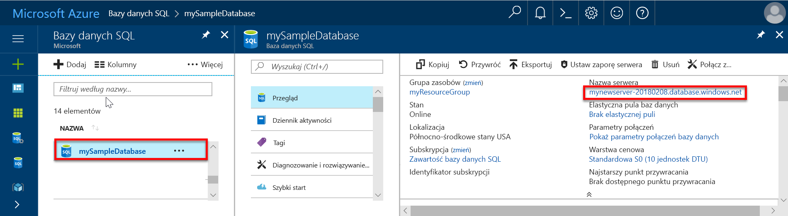
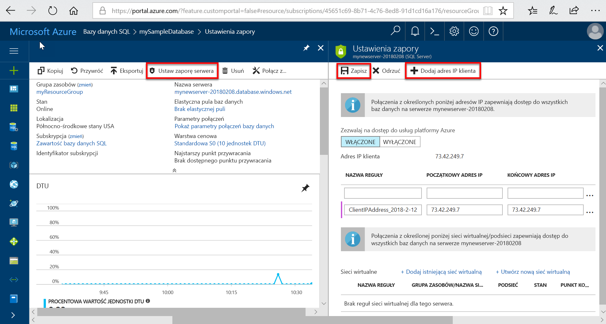

# Szybki start: Tworzenie reguły zapory na poziomie serwera dla pojedynczych baz danych i baz danych w puli za pomocą witryny Azure Portal

Ten przewodnik Szybki start przedstawia tworzenie [reguły zapory na poziomie serwera](sql-database-firewall-configure.md) dla pojedynczych baz danych i baz danych w puli w usłudze Azure SQL Database przy użyciu witryny Azure Portal. Ma to na celu umożliwienie nawiązywania połączeń z serwerami baz danych, pojedynczymi bazami danych oraz elastycznymi pulami i ich bazami danych. Reguła zapory jest wymagana do nawiązania połączenia z innymi zasobami platformy Azure i z zasobami lokalnymi.

## Wymagania wstępne

Jako punktu początkowego ten przewodnik Szybki start używa zasobów utworzonych w przewodniku [Tworzenie pojedynczej bazy danych za pomocą witryny Azure Portal](sql-database-single-database-get-started.md).

## Logowanie się do witryny Azure Portal

Zaloguj się w witrynie [Azure Portal](https://portal.azure.com/).

## Tworzenie reguły zapory bazującej na adresach IP na poziomie serwera

Usługa SQL Database tworzy zaporę na poziomie serwera bazy danych dla pojedynczej bazy danych lub bazy danych w puli. Ta zapora uniemożliwia aplikacjom klienckim nawiązywanie połączeń z serwerem i wszelkimi pojedynczymi bazami danych lub bazami danych w puli, chyba że utworzona zostanie reguła zapory bazująca na adresach IP otwierająca zaporę. Na potrzeby połączenia z adresu IP spoza platformy Azure utwórz regułę zapory dla określonego adresu lub zakresu adresów IP, z którymi połączenie ma być możliwe. Aby uzyskać więcej informacji na temat reguł zapory bazujących na adresach IP na poziomie serwera i na poziomie bazy danych, zobacz [Reguły zapory bazujące na adresach IP na poziomie serwera i na poziomie bazy danych dla usługi SQL Database](sql-database-firewall-configure.md).

> [!NOTE]
> Usługa SQL Database nawiązuje komunikację na porcie 1433. Jeśli próbujesz nawiązać połączenie z sieci firmowej, ruch wychodzący na porcie 1433 może być blokowany przez zaporę sieciową. Jeśli wystąpi taka sytuacja, nie będzie można nawiązać połączenia z serwerem usługi Azure SQL Database, chyba że dział IT otworzy port 1433.
> [!IMPORTANT]
> Reguła zapory 0.0.0.0 zapewnia wszystkim usługom platformy Azure zgodność z regułami zapory na poziomie serwera i podejmowanie próby nawiązania połączenia z pojedynczą bazą danych lub bazą danych w puli za pośrednictwem serwera. Aby dowiedzieć się więcej o korzystaniu z reguł sieci wirtualnej, zobacz [Reguły sieci wirtualnej jako alternatywa dla reguły IP](sql-database-firewall-configure.md#virtual-network-rules-as-alternatives-to-ip-rules).

Wykonaj następujące kroki, aby utworzyć regułę zapory bazującą na adresach IP na poziomie serwera dla podanego adresu IP klienta i włączyć zewnętrzną łączność przez zaporę usługi SQL Database wyłącznie dla konkretnego adresu IP.

1. Po zakończeniu wdrażania [wymaganej wstępnie bazy danych Azure SQL Database](#prerequisites) wybierz pozycję **Bazy danych SQL** w menu po lewej stronie, a następnie wybierz bazę danych **mySampleDatabase** na stronie **Bazy danych SQL**. Zostanie otwarta strona przeglądu bazy danych zawierająca w pełni kwalifikowaną nazwę serwera (na przykład **mynewserver-20170824.database.windows.net**) i opcje dalszej konfiguracji.

2. Skopiuj tę w pełni kwalifikowaną nazwę serwera do użycia podczas nawiązywania połączenia z serwerem i jego bazami danych w innych przewodnikach Szybki start.

   

3. Wybierz pozycję **Ustaw zaporę serwera** na pasku narzędzi. Zostanie otwarta strona **Ustawienia zapory** dla serwera bazy danych.

   

4. Wybierz pozycję **Dodaj adres IP klienta** na pasku narzędzi, aby dodać bieżący adres IP do nowej reguły zapory bazującej na adresach IP na poziomie serwera. Reguła zapory bazująca na adresach IP na poziomie serwera może otworzyć port 1433 dla pojedynczego adresu IP lub zakresu adresów IP.

   > [!IMPORTANT]
   > Domyślnie dostęp za pośrednictwem zapory usługi SQL Database jest włączony dla wszystkich usług platformy Azure. Wybierz przycisk **WYŁ.** na tej stronie, aby wyłączyć tę opcję dla wszystkich usług platformy Azure.
   >

5. Wybierz pozycję **Zapisz**. Dla bieżącego adresu IP zostanie utworzona reguła zapory bazująca na adresach IP na poziomie serwera otwierająca port 1433 na serwerze usługi SQL Database.

6. Zamknij stronę **Ustawienia zapory**.

Teraz można połączyć się z serwerem usługi SQL Database i jego bazami danych przy użyciu programu SQL Server Management Studio lub innego wybranego narzędzia z tego adresu IP przy użyciu poprzednio utworzonego konta administratora serwera.

## Oczyszczanie zasobów

Zapisz te zasoby, jeśli chcesz przejść do sekcji [Następne kroki](#next-steps) i dowiedzieć się, jak połączyć bazę danych i wykonywać w niej zapytania przy użyciu różnych metod. Jeśli jednak chcesz usunąć zasoby utworzone w tym przewodniku Szybki start, wykonaj poniższe czynności.

1. W menu znajdującym się po lewej stronie w witrynie Azure Portal wybierz pozycję **Grupy zasobów**, a następnie wybierz pozycję **myResourceGroup**.
2. Na stronie grupy zasobów wybierz pozycję **Usuń**, wpisz w polu tekstowym nazwę **myResourceGroup**, a następnie wybierz pozycję **Usuń**.

## Następne kroki

- Teraz, gdy już masz bazę danych, możesz [nawiązać z nią połączenie i uruchamiać zapytania](sql-database-connect-query.md) za pomocą jednego z Twoich ulubionych narzędzi lub języków, w tym
  - [Nawiązywanie połączeń i wykonywanie zapytań przy użyciu programu SQL Server Management Studio](sql-database-connect-query-ssms.md)
  - [Nawiązywanie połączeń i wykonywanie zapytań za pomocą usługi Azure Data Studio](/sql/azure-data-studio/quickstart-sql-database?toc=/azure/sql-database/toc.json)
- Aby dowiedzieć się, jak zaprojektować pierwszą bazę danych, tworzyć tabele i wstawiać dane, zapoznaj się z jednym z następujących samouczków:
  - [Projektowanie pierwszej pojedynczej bazy danych w usłudze Azure SQL Database przy użyciu programu SSMS](sql-database-design-first-database.md)
  - [Projektowanie pojedynczej bazy danych w usłudze Azure SQL Database i nawiązywanie połączenia za pomocą języka C# i narzędzia ADO.NET](sql-database-design-first-database-csharp.md)
