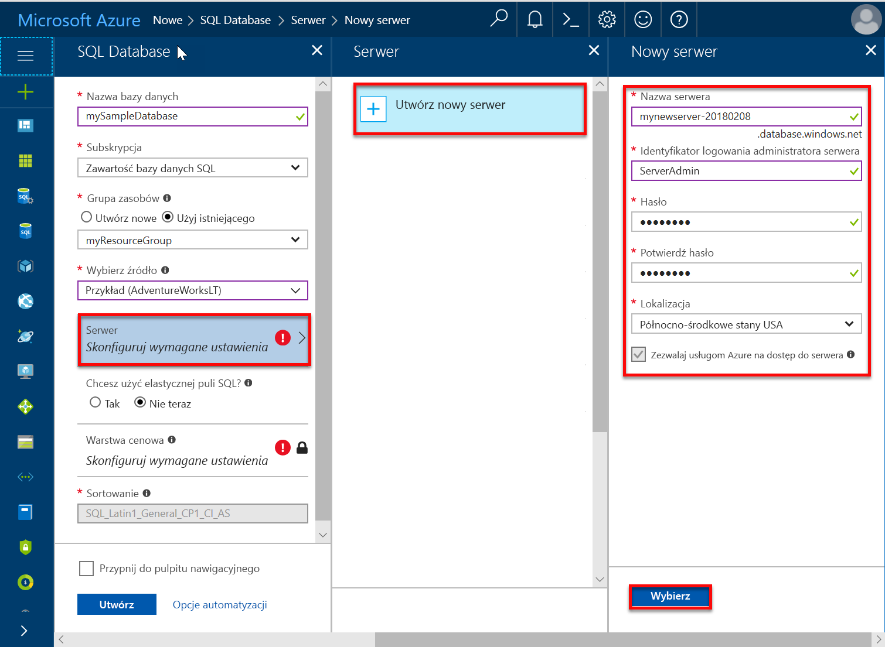
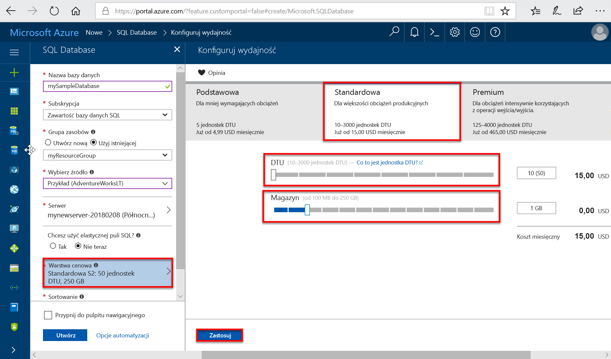
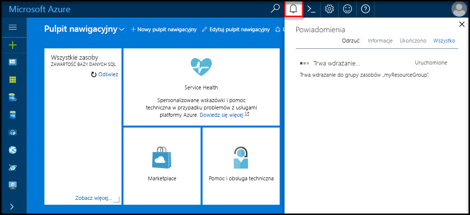

# <a name="quickstart-create-a-single-database-in-azure-sql-database-using-the-azure-portal"></a>Szybki start: Tworzenie pojedynczej bazy danych w usłudze Azure SQL Database za pomocą witryny Azure Portal

Tworzenie [pojedynczej bazy danych](sql-database-single-database.md) to najszybsza i najprostsza opcja wdrażania w przypadku tworzenia bazy danych w usłudze Azure SQL Database. W tym przewodniku Szybki start przedstawiono, jak utworzyć pojedynczą bazę danych i wykonywać względem jej zapytania za pomocą witryny Azure Portal.

Jeśli nie masz subskrypcji platformy Azure, utwórz [bezpłatne konto](https://azure.microsoft.com/free/).

W przypadku wszystkich kroków z tego przewodnika Szybki start musisz zalogować się do witryny [Azure Portal](https://portal.azure.com/).

## <a name="create-a-single-database"></a>Tworzenie pojedynczej bazy danych

Pojedyncza baza danych ma zdefiniowany zestaw zasobów obliczeniowych, pamięci, we/wy i magazynu przy użyciu jednego z dwóch modeli zakupu [purchasing model(sql-database-service-tiers.md). Podczas tworzenia pojedynczej bazy danych definiowany jest również [serwer usługi SQL Database](sql-database-servers.md) służący do zarządzania tą bazą danych i umieszczania jej w ramach [grupy zasobów platformy Azure](../azure-resource-manager/resource-group-overview.md) w określonym regionie.

Aby utworzyć bazę danych zawierającą przykładowe dane firmy Adventure Works LT:

1. W lewym górnym rogu witryny Azure Portal wybierz pozycję **Utwórz zasób**.
2. Wybierz pozycję **Bazy danych**, a następnie wybierz opcję **SQL Database**.
3. W formularzu **Utwórz bazę danych SQL Database** wpisz lub wybierz następujące wartości:

   - **Nazwa bazy danych**: Wprowadź ciąg *mySampleDatabase*.
   - **Subskrypcja**: otwórz listę rozwijaną i wybierz poprawną subskrypcję, jeśli nie została wyświetlona.
   - **Grupa zasobów**: wybierz pozycję **Utwórz nową**, wpisz *myResourceGroup*, a następnie wybierz przycisk **OK**.
   - **Wybierz źródło**: otwórz listę rozwijaną i wybierz pozycję **Przykład (AdventureWorksLT)**.

    >[!IMPORTANT]
    >Pamiętaj, aby wybrać dane **Przykład (AdventureWorksLT)**, co umożliwi łatwe wykonanie tego i innych przewodników Szybki start usługi Azure SQL Database korzystających z tych danych.
  
   

4. W obszarze **Serwer** wybierz pozycję **Utwórz nowy**.
5. W formularzu **Nowy serwer** wpisz lub wybierz następujące wartości:

   - **Nazwa serwera**: Wprowadź nazwę *mysqlserver*.
   - **Identyfikator logowania administratora serwera**: wpisz *azureuser*.
   - **Hasło**: Wprowadź ciąg *Azure1234567*.
   - **Potwierdź hasło**: wpisz ponownie hasło.
   - **Lokalizacja**: otwórz listę rozwijaną, a następnie wybierz dowolną prawidłową lokalizację.  

   >[!IMPORTANT]
   >Pamiętaj, aby zapisać identyfikator logowania administratora serwera i hasło, aby logować się do serwera i baz danych dla tego przewodnika Szybki start oraz pozostałych. Jeśli zapomnisz swój identyfikator logowania lub hasło, możesz uzyskać identyfikator logowania lub zresetować hasło na stronie **serwera SQL**. Aby otworzyć stronę **serwera SQL**, wybierz nazwę serwera na stronie **Przegląd** po utworzeniu bazy danych.

    

6. Wybierz pozycję **Wybierz**.
7. W formularzu **SQL Database** wybierz opcję **Warstwa cenowa**. Sprawdź liczbę jednostek DTU i wielkość miejsca do magazynowania dostępne dla poszczególnych warstw usługi.

   >[!NOTE]
   >W tym przewodniku Szybki start jest używany [model zakupu w oparciu o jednostki DTU](sql-database-service-tiers-dtu.md), ale dostępny jest także [model zakupu w oparciu o rdzeń wirtualny](sql-database-service-tiers-vcore.md).
   >[!IMPORTANT]
   >Więcej niż 1 TB magazynu w warstwie Premium jest obecnie dostępne we wszystkich regionach poza następującymi: Północne Zjednoczone Królestwo, Zachodnio-środkowe stany USA, Południowe Zjednoczone Królestwo2, Chiny Wschodnie, USDoDCentral, Niemcy Środkowe, USDoDEast, Południowo-Zachodnie Stany USA US Gov, Południowo-środkowe stany USA US Gov, Niemcy Północno-Wschodnie, Chiny Północne oraz Wschodnie stany US Gov. W tych regionach maksymalna wielkość magazynu w warstwie Premium jest ograniczona do 1 TB. Aby uzyskać więcej informacji, zobacz [bieżące ograniczenia poziomów P11–P15](sql-database-dtu-resource-limits-single-databases.md#single-database-limitations-of-p11-and-p15-when-the-maximum-size-greater-than-1-tb).  

8. Na potrzeby tego przewodnika Szybki start wybierz warstwę usługi **Standardowa**, a następnie wybierz za pomocą suwaka **10 jednostek DTU (S0)** i **1** GB miejsca do magazynowania.
9. Wybierz przycisk **Zastosuj**.  

   

10. W formularzu **SQL Database** wybierz opcję **Utwórz**, aby wdrożyć i aprowizować grupę zasobów, serwer i bazę danych.

   Wdrożenie zajmuje kilka minut. Aby monitorować postęp wdrożenia, wybierz pozycję **Powiadomienia** na pasku narzędzi.

   

## <a name="query-the-database"></a>Wykonywanie zapytań względem bazy danych

Teraz, po utworzeniu bazy danych, użyjemy wbudowanego narzędzia do obsługi zapytań w witrynie Azure Portal, aby nawiązać połączenie z bazą danych i wykonać zapytanie dotyczące danych.

1. Na stronie **SQL Database** dla używanej bazy danych wybierz pozycję **Edytor zapytań (wersja zapoznawcza)** w menu po lewej stronie.

   

2. Wprowadź informacje dotyczące logowania, a następnie wybierz przycisk **OK**.
3. Wprowadź następujące zapytanie w okienku **Edytora zapytań**.

   ```sql
   SELECT TOP 20 pc.Name as CategoryName, p.name as ProductName
   FROM SalesLT.ProductCategory pc
   JOIN SalesLT.Product p
   ON pc.productcategoryid = p.productcategoryid;
   ```

4. Wybierz opcję **Uruchom**, a następnie przejrzyj wyniki zapytania w okienku **Wyniki**.

   

5. Zamknij stronę **Edytor zapytań**, a następnie kliknij przycisk **OK** po wyświetleniu monitu o odrzucenie niezapisanych zmian.

## <a name="clean-up-resources"></a>Oczyszczanie zasobów

Zachowaj tę grupę zasobów, serwer bazy danych i pojedynczą bazę danych, jeśli chcesz przejść do [następnych kroków](#next-steps). W następnych krokach pokazano, jak różnymi metodami łączyć się z bazą danych i wykonywać w niej zapytania.

Po zakończeniu korzystania z tych zasobów możesz je usunąć w następujący sposób:

1. W menu znajdującym się po lewej stronie w witrynie Azure Portal wybierz pozycję **Grupy zasobów**, a następnie wybierz pozycję **myResourceGroup**.
2. Na stronie grupy zasobów wybierz pozycję **Usuń grupę zasobów**.
3. Wprowadź w polu ciąg *myResourceGroup*, a następnie wybierz opcję **Usuń**.

## <a name="next-steps"></a>Następne kroki

- Utwórz regułę zapory na poziomie serwera w celu nawiązania połączenia z pojedynczą bazą danych za pomocą narzędzi lokalnych lub zdalnych. Aby uzyskać więcej informacji, zobacz temat [Tworzenie reguły zapory na poziomie serwera](sql-database-server-level-firewall-rule.md).
- Po utworzeniu reguły zapory na poziomie serwera [nawiąż połączenie z bazą danych i wykonaj zapytania](sql-database-connect-query.md) przy użyciu różnych narzędzi i języków.
  - [Nawiązywanie połączeń i wykonywanie zapytań przy użyciu programu SQL Server Management Studio](sql-database-connect-query-ssms.md)
  - [Nawiązywanie połączeń i wykonywanie zapytań za pomocą usługi Azure Data Studio](https://docs.microsoft.com/sql/azure-data-studio/quickstart-sql-database?toc=/azure/sql-database/toc.json)
- Aby tworzyć pojedyncze bazy danych przy użyciu interfejsu wiersza polecenia platformy Azure, zobacz [Przykłady interfejsu wiersza polecenia platformy Azure](sql-database-cli-samples.md).
- Aby tworzyć pojedyncze bazy danych przy użyciu usługi Azure PowerShell, zobacz [Przykłady programu Azure PowerShell](sql-database-powershell-samples.md).
