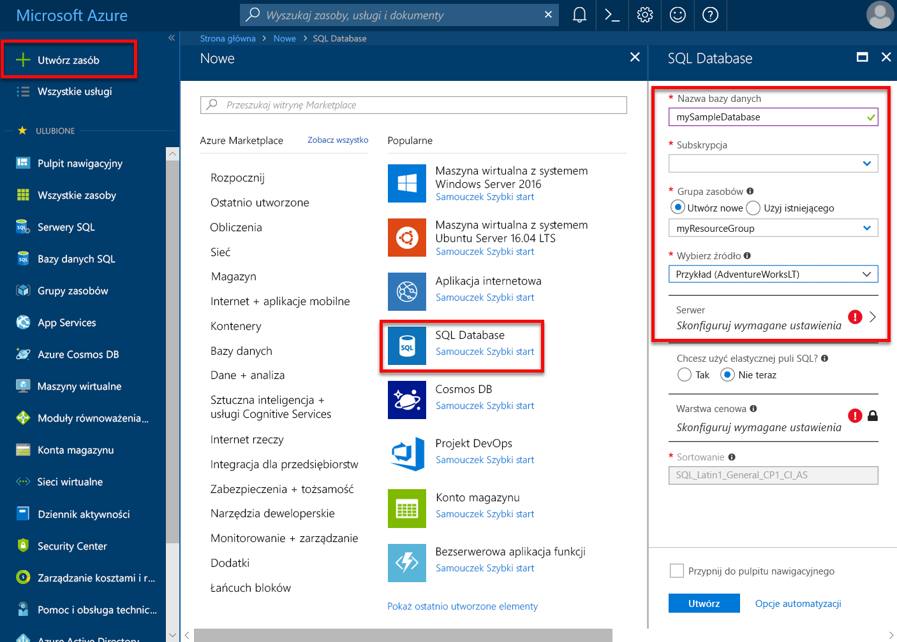
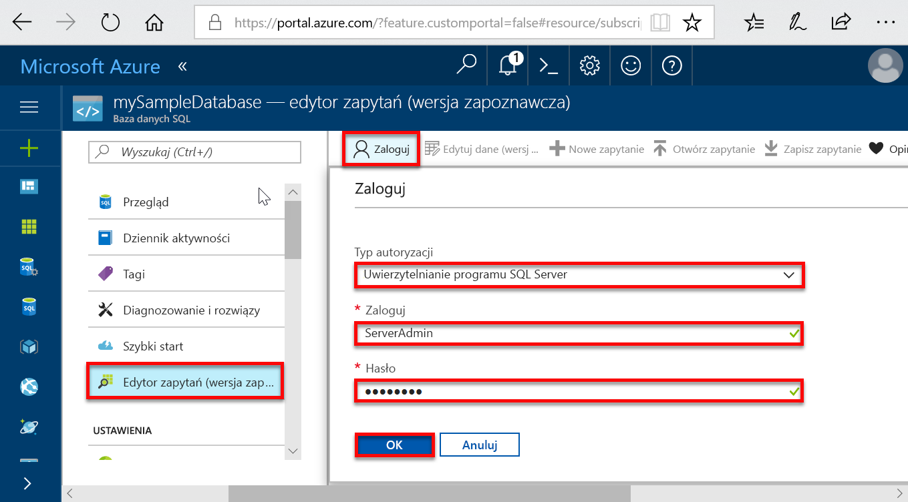
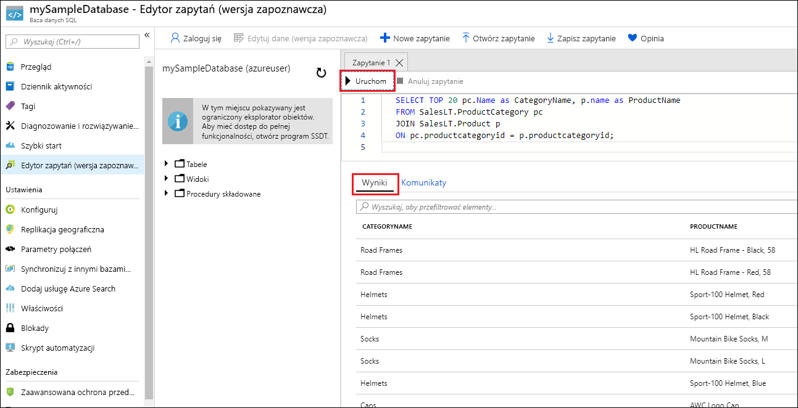

# <a name="quickstart-create-a-single-database-in-azure-sql-database-using-the-azure-portal"></a>Szybki start: Tworzenie pojedynczej bazy danych w usłudze Azure SQL Database za pomocą witryny Azure Portal

Tworzenie [pojedynczej bazy danych](sql-database-single-database.md) to najszybsza i najprostsza opcja wdrażania w przypadku tworzenia bazy danych w usłudze Azure SQL Database. W tym przewodniku Szybki start przedstawiono, jak utworzyć pojedynczą bazę danych i wykonywać względem jej zapytania za pomocą witryny Azure Portal.

Jeśli nie masz subskrypcji platformy Azure, utwórz [bezpłatne konto](https://azure.microsoft.com/free/).

W przypadku wszystkich kroków z tego przewodnika Szybki start musisz zalogować się do witryny [Azure Portal](https://portal.azure.com/).

## <a name="create-a-single-database"></a>Tworzenie pojedynczej bazy danych

Pojedynczą bazę danych można utworzyć albo aprowizowane lub bez użycia serwera warstwa wystąpień obliczeniowych (wersja zapoznawcza).

- Pojedynczą bazę danych w warstwie zainicjowanych zasobów obliczeniowych ma określoną ilość zasobów obliczeniowych wstępnie przydzielić oraz zestaw zasobów pamięci i magazynu przy użyciu jednej z dwóch [zakupu modeli](sql-database-purchase-models.md).
- Pojedynczą bazę danych w warstwie bezserwerowe środowisko obliczeniowe zawiera szeroką gamę zasobów obliczeniowych, które są automatycznie skalowanych oraz określoną ilość pamięci na rdzeń i określoną ilość zasobów magazynu i jest dostępna tylko w [oparty na rdzeniach wirtualnych zakupu modeli ](sql-database-service-tiers-vcore.md).

Podczas tworzenia pojedynczej bazy danych definiowany jest również [serwer usługi SQL Database](sql-database-servers.md) służący do zarządzania tą bazą danych i umieszczania jej w ramach [grupy zasobów platformy Azure](../azure-resource-manager/resource-group-overview.md) w określonym regionie.

> [!NOTE]
> Ten przewodnik Szybki Start używa [modelu zakupu opartego na rdzeniach wirtualnych](sql-database-service-tiers-vcore.md) i [bez użycia serwera](sql-database-serverless.md) obliczeniowych warstwy, ale [modelu zakupu opartego na jednostkach DTU](sql-database-service-tiers-DTU.md) jest również dostępna.

Aby utworzyć bazę danych zawierającą przykładowe dane firmy Adventure Works LT:

1. W lewym górnym rogu witryny Azure Portal wybierz pozycję **Utwórz zasób**.
2. Wybierz **baz danych** , a następnie wybierz **bazy danych SQL** otworzyć **tworzenie bazy danych SQL** strony.

   

3. Na **podstawy** na karcie **Project Details** sekcji, wpisz lub wybierz następujące wartości:

   - **Subskrypcja**: otwórz listę rozwijaną i wybierz poprawną subskrypcję, jeśli nie została wyświetlona.
   - **Grupa zasobów**: Wybierz **Utwórz nową**, typ `myResourceGroup`i wybierz **OK**.

     

4. W **Szczegóły bazy danych** sekcji, wpisz lub wybierz następujące wartości:

   - **Nazwa bazy danych**: Wprowadź polecenie `mySampleDatabase`.
   - **Serwer**: Wybierz **Utwórz nową** i wprowadź następujące wartości, a następnie wybierz pozycję **wybierz**.
       - **Nazwa serwera**: Typ `mysqlserver`; wraz z niektórych numerów, aby zapewnić unikatowość.
       - **Identyfikator logowania administratora serwera**: Wpisz polecenie `azureuser`.
       - **Hasło**: Wpisz hasło złożone, który spełnia wymagania dotyczące hasła.
       - **Lokalizacja**: Wybierz lokalizację z listy rozwijanej, takich jak `West US 2`.

         

      > [!IMPORTANT]
      > Pamiętaj, aby zapisać identyfikator logowania administratora serwera i hasło, aby logować się do serwera i baz danych dla tego przewodnika Szybki start oraz pozostałych. Jeśli zapomnisz swój identyfikator logowania lub hasło, możesz uzyskać identyfikator logowania lub zresetować hasło na stronie **serwera SQL**. Aby otworzyć stronę **serwera SQL**, wybierz nazwę serwera na stronie **Przegląd** po utworzeniu bazy danych.

        

   - **Aby użyć elastycznej puli SQL**: Wybierz **nie** opcji.
   - **Obliczeniowe i magazyn**: Wybierz **bazy danych skonfiguruj** i w tym przewodniku Szybki Start wybierz **oparty na rdzeniach wirtualnych opcje zakupu**

     

   - Wybierz **bezserwerowe**.

     

   - Sprawdź ustawienia **maksymalnej liczby rdzeni wirtualnych**, **rdzeni wirtualnych Min**, **opóźnienia automatycznego wstrzymywania**, i **danych maksymalny rozmiar**. Zmień je zgodnie z potrzebami.
   - Zaakceptuj warunki wersji zapoznawczej, a następnie kliknij przycisk **OK**.
   - Wybierz przycisk **Zastosuj**.

5. Wybierz **dodatkowe ustawienia** kartę. 
6. W **źródła danych** sekcji w obszarze **korzystać z istniejących danych**, wybierz opcję `Sample`. 

   

   > [!IMPORTANT]
   > Pamiętaj, aby wybrać dane **Przykład (AdventureWorksLT)**, co umożliwi łatwe wykonanie tego i innych przewodników Szybki start usługi Azure SQL Database korzystających z tych danych.

7. Pozostałe wartości Pozostaw domyślne, a następnie wybierz pozycję **przeglądu + Utwórz** w dolnej części formularza.
8. Przejrzyj ustawienia końcowe i wybierz **Utwórz**.

9. W formularzu **SQL Database** wybierz opcję **Utwórz**, aby wdrożyć i aprowizować grupę zasobów, serwer i bazę danych.

## <a name="query-the-database"></a>Wykonywanie zapytań względem bazy danych

Teraz, po utworzeniu bazy danych, użyjemy wbudowanego narzędzia do obsługi zapytań w witrynie Azure Portal, aby nawiązać połączenie z bazą danych i wykonać zapytanie dotyczące danych.

1. Na stronie **SQL Database** dla używanej bazy danych wybierz pozycję **Edytor zapytań (wersja zapoznawcza)** w menu po lewej stronie.

   

2. Wprowadź informacje dotyczące logowania, a następnie wybierz przycisk **OK**.
3. Wprowadź następujące zapytanie w okienku **Edytora zapytań**.

   ```sql
   SELECT TOP 20 pc.Name as CategoryName, p.name as ProductName
   FROM SalesLT.ProductCategory pc
   JOIN SalesLT.Product p
   ON pc.productcategoryid = p.productcategoryid;
   ```

4. Wybierz opcję **Uruchom**, a następnie przejrzyj wyniki zapytania w okienku **Wyniki**.

   

5. Zamknij stronę **Edytor zapytań**, a następnie kliknij przycisk **OK** po wyświetleniu monitu o odrzucenie niezapisanych zmian.

## <a name="clean-up-resources"></a>Oczyszczanie zasobów

Zachowaj tę grupę zasobów, serwer bazy danych i pojedynczą bazę danych, jeśli chcesz przejść do [następnych kroków](#next-steps). W następnych krokach pokazano, jak różnymi metodami łączyć się z bazą danych i wykonywać w niej zapytania.

Po zakończeniu korzystania z tych zasobów możesz je usunąć w następujący sposób:

1. W menu znajdującym się po lewej stronie w witrynie Azure Portal wybierz pozycję **Grupy zasobów**, a następnie wybierz pozycję **myResourceGroup**.
2. Na stronie grupy zasobów wybierz pozycję **Usuń grupę zasobów**.
3. Wprowadź w polu ciąg *myResourceGroup*, a następnie wybierz opcję **Usuń**.

## <a name="next-steps"></a>Kolejne kroki

- Utwórz regułę zapory na poziomie serwera w celu nawiązania połączenia z pojedynczą bazą danych za pomocą narzędzi lokalnych lub zdalnych. Aby uzyskać więcej informacji, zobacz temat [Tworzenie reguły zapory na poziomie serwera](sql-database-server-level-firewall-rule.md).
- Po utworzeniu reguły zapory na poziomie serwera [nawiąż połączenie z bazą danych i wykonaj zapytania](sql-database-connect-query.md) przy użyciu różnych narzędzi i języków.
  - [Nawiązywanie połączeń i wykonywanie zapytań przy użyciu programu SQL Server Management Studio](sql-database-connect-query-ssms.md)
  - [Nawiązywanie połączeń i wykonywanie zapytań za pomocą usługi Azure Data Studio](https://docs.microsoft.com/sql/azure-data-studio/quickstart-sql-database?toc=/azure/sql-database/toc.json)
- Aby utworzyć pojedynczą bazę danych w warstwie zainicjowanych zasobów obliczeniowych, przy użyciu wiersza polecenia platformy Azure, zobacz [przykłady interfejsu wiersza polecenia platformy Azure](sql-database-cli-samples.md).
- Aby utworzyć pojedynczą bazę danych w warstwie zainicjowanych zasobów obliczeniowych, przy użyciu programu Azure PowerShell, zobacz [przykładów programu Azure PowerShell](sql-database-powershell-samples.md).
- Aby utworzyć pojedynczą bazę danych w warstwie bezserwerowe środowisko obliczeniowe przy użyciu programu Azure Powershell, zobacz [bezserwerowa baza danych utwórz przy użyciu programu PowerShell](sql-database-serverless.md#create-new-database-using-powershell)
