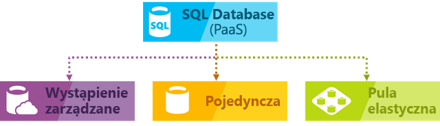
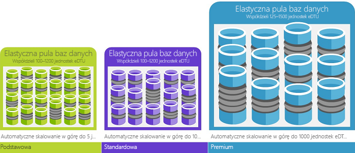

# Co to jest usługa Azure SQL Database

Usługa Azure SQL Database to usługa relacyjnej bazy danych ogólnego przeznaczenia zarządzana, która pozwala na tworzenie wysoko dostępnych i warstwa magazynowania danych o wysokiej wydajności dla aplikacji i rozwiązań w chmurze Microsoft Azure. Baza danych SQL może być dobrym wyborem dla różnych nowoczesnych aplikacji w chmurze, ponieważ pozwala na użytek zaawansowane funkcje przetwarzania zarówno dla danych relacyjnych i [nierelacyjnych struktury](sql-database-multi-model-features.md) takich jak wykresy, JSON, dane przestrzenne i XML. Jest on oparty na najnowsza stabilna wersja [aparatu bazy danych programu Microsoft SQL Server](https://docs.microsoft.com/sql/sql-server/sql-server-technical-documentation?toc=/azure/sql-database/toc.json) i pozwala na użycie bogaty zestaw zaawansowanych zapytań przetwarzania funkcje, takie jak [o wysokiej wydajności w pamięci technologii](sql-database-in-memory.md)i [przetwarzania zapytań inteligentnych](https://docs.microsoft.com/sql/relational-databases/performance/intelligent-query-processing?toc=/azure/sql-database/toc.json). Zgodnie ze strategią firmy Microsoft skupiającej się na chmurze najnowsze funkcjonalności programu SQL Server są wydawane najpierw w usłudze SQL Database, a dopiero później w samym programie SQL Server. Podejście to umożliwia użytkownikom dostęp do najnowszych możliwości programu SQL Server bez potrzeby wdrażania poprawek lub wykonywania uaktualnień — a na dodatek funkcje te są już przetestowane w milionach baz danych. SQL Database pozwala na łatwe definiowanie i skalowanie wydajności w dwóch różnych modeli zakupu: [modelu zakupu opartego na rdzeniach wirtualnych](sql-database-service-tiers-vcore.md) i [modelu zakupu opartego na jednostkach DTU](sql-database-service-tiers-dtu.md). SQL Database to w pełni zarządzana usługa, która ma wbudowaną wysoką dostępność podczas tworzenia kopii zapasowych i innych typowych operacji obsługi. Firma Microsoft obsługuje wprowadzanie poprawek i bezproblemowe aktualizowanie kodu SQL i systemu operacyjnego i ukrywa procesy zarządzania podstawową infrastrukturą.

> [!NOTE]
> Słownik terminów w usłudze Azure SQL Database, zobacz [słownik terminów bazy danych SQL](sql-database-glossary-terms.md)

Usługa Azure SQL Database udostępnia następujące opcje wdrażania na potrzeby bazy danych Azure SQL Database:

- [Pojedynczą bazę danych](sql-database-single-database.md) reprezentuje w pełni zarządzane odizolowane bazy danych, która jest doskonałym rozwiązaniem dla nowoczesnych aplikacji w chmurze i mikrousług, które wymagają pojedyncze wiarygodne źródło danych. Pojedyncza baza danych jest podobny do [zawartych baz danych](https://docs.microsoft.com/sql/relational-databases/databases/contained-databases?toc=/azure/sql-database/toc.json) w [aparatu bazy danych programu Microsoft SQL Server](https://docs.microsoft.com/sql/sql-server/sql-server-technical-documentation?toc=/azure/sql-database/toc.json).
- [Wystąpienie zarządzane](sql-database-managed-instance.md) to w pełni zarządzane wystąpienie [aparatu bazy danych programu Microsoft SQL Server](https://docs.microsoft.com/sql/sql-server/sql-server-technical-documentation?toc=/azure/sql-database/toc.json) zawierający zestaw baz danych, które mogą być używane razem. Jest doskonałym rozwiązaniem dla łatwą migrację lokalnych baz danych programu SQL Server do chmury platformy Azure i aplikacji, które muszą korzystać z funkcji zaawansowanych bazy danych, które zawiera aparat bazy danych programu SQL Server.
- [Pula elastyczna](sql-database-elastic-pool.md) to zbiór [pojedyncze bazy danych](sql-database-single-database.md) z współdzielonym zestawem zasobów, takich jak procesor CPU lub pamięci. Pojedyncze bazy danych mogą być przenoszone do i z puli elastycznej.

> [!IMPORTANT]
> Aby poznać różnice funkcji SQL Database i programu SQL Server, a także różnice między różne opcje wdrażania usługi Azure SQL Database, zobacz [funkcje SQL](sql-database-features.md).

SQL Database oferuje przewidywalną wydajność z wielu typów zasobów, warstwy usług i rozmiarów wystąpień obliczeniowych, która zapewnia dynamiczną skalowalność nie przestojów, wbudowany mechanizm inteligentnej optymalizacji, globalną skalowalność i dostępność i zaawansowane zabezpieczenia Opcje — wszystko przy bliskich zeru nakładach na administrację. Te możliwości pozwalają Ci skoncentrować się na szybkim tworzeniu aplikacji i skracaniu czasu wejścia na rynek, a nie na poświęcaniu cennego czasu i cennych zasobów na zarządzanie maszynami wirtualnymi i infrastrukturą. Usługa SQL Database jest obecnie dostępna w 38 centrach danych na całym świecie z coraz większą liczbą centrów danych regularnie dołączanych, dzięki czemu możesz uruchomić swoją bazę danych w centrum danych położonym w pobliżu.

## Skalowalna wydajność i pule

Wszystkie odmianami bazy danych SQL Database umożliwia zdefiniowanie ilości zasobów, które zostaną przypisane. 
- Pojedyncze bazy danych każda baza danych jest odizolowana od innych i przenośna, z własną gwarantowaną ilość zasobów obliczeniowych, pamięci i magazynu. Usługa SQL Database udostępnia różnych zasobów obliczeniowych, pamięci i magazynu dla różnych potrzeb — i możliwość dynamicznego [skalowanie pojedynczej bazy danych zasobów](sql-database-single-database-scale.md) górę i w dół. [Warstwy usługi w hiperskali](sql-database-service-tier-hyperscale.md) dla pojedynczej bazy danych można skalować do 100 TB, przy użyciu szybkich kopii zapasowej i przywracanie możliwości.
- Dzięki pulom elastycznym, można tworzyć nowe bazy danych lub Przenieś pojedynczych baz danych do puli zasobów do optymalnego wykorzystania zasobów i Zapisz pieniędzy — i możliwość dynamicznego [skalowanie elastycznej puli zasobów](sql-database-elastic-pool-scale.md) górę i w dół.
- Za pomocą wystąpienia zarządzanego każdego wystąpienia zarządzanego jest odizolowana od innych wystąpień z gwarantowanymi zasobami. W ramach wystąpienia zarządzanego wystąpienia bazy danych mają zestaw zasoby — i możliwość dynamicznie [skalowanie wystąpienia zarządzanego zasobów](sql-database-managed-instance-resource-limits.md) górę i w dół.

Możesz utworzyć pierwszą aplikację na małej, pojedynczej bazy danych na niskim poziomie kosztów miesięcznie w warstwie ogólnego przeznaczenia i następnie zmienić warstwę usługi ręcznie lub programowo w dowolnym momencie do krytycznych usług warstwy biznesowej do potrzeb rozwiązania. Wydajność można dostosować bez przestoju aplikacji i przerwy w świadczeniu usługi klientom. Dynamiczna skalowalność umożliwia bazie danych przezroczyste odpowiadanie na gwałtownie zmieniające się wymagania dotyczące zasobów oraz płacenie tylko za potrzebne zasoby i tylko gdy są używane.

Dynamiczna skalowalność różni się od skalowania automatycznego. O skalowaniu automatycznym mówimy, gdy usługa jest skalowana automatycznie na podstawie kryteriów, natomiast dynamiczna skalowalność uwzględnia skalowanie ręczne bez przestojów. Pojedyncza baza danych obsługuje ręcznego dynamiczną skalowalność, ale nie automatycznego skalowania. Aby zapewnić środowisko bardziej *zautomatyzowane*, rozważ użycie elastycznych pul baz danych, które umożliwiają bazom danych udostępnianie zasobów w puli w zależności od potrzeb. Istnieją jednak skrypty, które mogą pomóc zautomatyzować skalowalność dla pojedynczej bazy danych. Aby uzyskać przykład, zobacz [Użyj programu PowerShell do monitorowania i skalowania pojedynczej bazy danych](scripts/sql-database-monitor-and-scale-database-powershell.md).

### Zakup modeli, warstwy usług, rozmiarów wystąpień obliczeniowych i magazynu kwoty

Usługa SQL Database oferuje dwa modele zakupu:
- [Modelu zakupu opartego na rdzeniach wirtualnych](sql-database-service-tiers-vcore.md) pozwala wybrać liczbę rdzeni wirtualnych, ilość lub pamięć i wielkość i szybkość magazynu. Model zakupu opartego na rdzeniach wirtualnych pozwala również na używanie [korzyść użycia hybrydowego platformy Azure dla programu SQL Server](https://azure.microsoft.com/pricing/hybrid-benefit/) uzyskanie oszczędności kosztów. Aby uzyskać więcej informacji na temat korzyści użycia hybrydowego platformy Azure, zobacz [— często zadawane pytania](#sql-database-frequently-asked-questions-faq).
- [Modelu zakupu opartego na jednostkach DTU](sql-database-service-tiers-dtu.md) oferuje blend obliczeniowych, pamięci, we/wy pozwalający w trzech warstwach usług do obsługi niewielkich obciążeń bazy danych. Obliczenia rozmiarów w każdej warstwie udostępniają różne kombinacje tych zasobów, do których można dodawać kolejne zasoby magazynu.

### Pule elastyczne umożliwiające zmaksymalizowanie wykorzystania zasobów

W przypadku wielu firm i aplikacji możliwość tworzenia pojedynczych baz danych i dostosowywania wydajności na żądanie jest wystarczająca, zwłaszcza gdy wzorce użycia są względnie przewidywalne. Jednak w przypadku nieprzewidywalnych wzorców zarządzanie kosztami i modelem biznesowym może być trudne. [Pule elastyczne](sql-database-elastic-pool.md) zostały zaprojektowane, aby rozwiązać ten problem. Koncepcja jest prosta. Przydzielasz zasoby wydajności do puli, a nie poszczególnych baz danych i płać za zasoby zbiorczą wydajnością puli, a nie dla wydajności pojedynczej bazy danych.

   

Pule elastyczne nie wymagają koncentrowania się na skalowaniu wydajności bazy danych w górę i w dół w miarę zmian zapotrzebowania na zasoby. Bazy danych w puli używają zasobów wydajności puli elastycznej w miarę potrzeb. Bazy danych w puli zużywają zasoby, ale nie przekraczają limitów puli, więc koszt pozostaje przewidywalny nawet wtedy, gdy nie można przewidzieć użycia poszczególnych baz danych. Ponadto możliwe jest [dodawanie i usuwanie baz danych w puli](sql-database-elastic-pool-manage-portal.md) i skalowanie aplikacji od kilku do tysięcy baz danych — wszystko w ramach kontrolowanego budżetu. Możesz również kontrolować minimum i maksimum zasobów dostępnych dla baz danych w puli w celu zapewnienia, że żadna baza danych w puli nie używa wszystkich zasobów i jednocześnie każda baza danych w puli ma gwarantowaną minimalną ilość zasobów. Aby dowiedzieć się więcej na temat wzorców projektowych dla aplikacji SaaS wykorzystujących pule elastyczne, zobacz artykuł [Design Patterns for Multi-tenant SaaS Applications with Azure SQL Database](sql-database-design-patterns-multi-tenancy-saas-applications.md) (Wzorce projektowe dla wielodostępnych aplikacji SaaS korzystających z usługi Azure SQL Database).

Skrypty mogą ułatwić monitorowanie i skalowanie elastycznych pul baz danych. Na przykład zobacz temat [Monitorowanie i skalowanie elastycznej puli SQL w usłudze Azure SQL Database za pomocą programu PowerShell](scripts/sql-database-monitor-and-scale-pool-powershell.md)

> [!IMPORTANT]
> Wystąpienie zarządzane nie obsługuje pul elastycznych. Przeciwnie wystąpienia zarządzanego jest kolekcją wystąpienia baz danych, które współużytkują zasoby wystąpienia zarządzanego.

### Mieszaj pojedyncze bazy danych z bazami danych w puli

Możesz łączyć pojedyncze bazy danych z pulami elastycznymi i zmieniać warstwy usług pojedynczych baz danych i pul elastycznych, szybko i łatwo dostosować do swojej sytuacji. Korzystając z siły i zasięgu platformy Azure, możesz łączyć inne usługi Azure z usługą SQL Database i dopasowywać je do niej, aby zaspokoić potrzeby unikatowego projektu aplikacji, zwiększyć efektywność kosztową i poprawić wykorzystanie zasobów oraz otworzyć się na nowe możliwości biznesowe.

## Możliwości rozbudowanego monitorowania i zgłaszania alertów

Narzędzi [wbudowanego monitorowania wydajności](sql-database-performance.md) i [alertów](sql-database-insights-alerts-portal.md) możesz używać w połączeniu z ocenami wydajności. Za pomocą tych narzędzi możesz szybko ocenić wpływ skalowania w górę lub w dół na podstawie bieżących lub przewidywanych wymagań dotyczących wydajności. Ponadto usługa SQL Database może [tworzyć metryki i dzienniki diagnostyczne](sql-database-metrics-diag-logging.md), które ułatwiają monitorowanie. Usługę SQL Database można skonfigurować do przechowywania danych dotyczących użycia zasobów, pracowników i sesji oraz połączeń z jednym z następujących zasobów platformy Azure:

- **Azure Storage**: W celu archiwizowania ogromnych ilości danych telemetrycznych za niewielką cenę
- **Centrum zdarzeń platformy Azure**: Do integracji danych telemetrycznych usługi SQL Database z niestandardowym rozwiązaniem monitorowania lub potokami
- **Dzienniki platformy Azure Monitor**: Aby uzyskać wbudowanego rozwiązania monitorowania obejmującego raportowania, zgłaszania alertów i łagodzenia możliwości.

    

## Możliwości dostępności

W środowisku programu SQL Server tradycyjnych zazwyczaj trzeba maszyn (co najmniej) 2 lokalnie skonfigurować przy użyciu dokładnie (synchronicznie utrzymywane w dobrym stanie) kopii danych (za pomocą funkcji, takich jak zawsze włączone grupy dostępności lub wystąpienia klastra trybu Failover) do ochrony przed awaria pojedynczego komputera/składnika.  To zapewnia wysoką dostępność, ale nie chroni przed klęskami żywiołowymi niszczenie centrum danych.

Odzyskiwanie po awarii przyjęto założenie, że katastrofy będzie geograficznie zlokalizowane wystarczająco dużo, aby mieć inny maszyny/zestaw maszyn przy użyciu kopii danych daleko.  W programie SQL Server można użyć zawsze włączone grupy dostępności działają w trybie async można pobrać tę możliwość.  Szybkość światła problemów zwykle oznacza, że osoby nie chcesz czekać replikacji się zdarzyć, że daleko przed zatwierdzeniem transakcji, dlatego jest potencjalną utratę danych podczas wykonywania nieplanowane tryby Failover.

Bazy danych w usłudze premium i biznesowe krytyczne warstwy już [w bardzo podobny sposób użyć](sql-database-high-availability.md#premium-and-business-critical-service-tier-availability) do synchronizacji grupy dostępności. Bazy danych w niższych warstwach usług zapewniają nadmiarowość za pomocą magazynu [mechanizm różnych, ale równoważne](sql-database-high-availability.md#basic-standard-and-general-purpose-service-tier-availability). Brak logiki, która chroni przed awarią pojedynczego komputera.  Funkcji aktywnej replikacji geograficznej zapewnia możliwość ochrony przed awarii gdzie jest niszczony całego regionu.

Strefy dostępności platformy Azure jest play na problem wysokiej dostępności.  Próbuje ochronę przed awarią centrum danych jednego tworzenia w jednym regionie.  Dlatego chce zapobiec utracie zasilania lub sieć w celu tworzenia. W usługach SQL Azure, będzie to możliwe, umieszczając różnych replik w różnych strefach dostępności (różnych budynkach, efektywnie), a w przeciwnym razie działa tak jak poprzednio.

W rzeczywistości, Umowa dotycząca poziomu usług platformy Azure w branży wiodących 99,99% dostępności [(SLA)](https://azure.microsoft.com/support/legal/sla/), obsługiwana przez globalną sieć centrów danych zarządzanych przez firmę Microsoft, pomaga zapewnić działanie aplikacji przez 24/7. Platforma Azure w pełni zarządza każdej bazy danych i gwarantuje brak utraty danych i wysoki odsetek dostępność danych. Platforma Azure automatycznie obsługuje stosowanie poprawek, tworzenie kopii zapasowych, replikację, wykrywanie błędów, bazowe potencjalne awarie sprzętu, oprogramowania lub sieci, wdrażanie poprawek usterek, przełączanie w tryb failover, uaktualnianie bazy danych oraz inne zadania konserwacji. Dostępność w warstwie Standardowa jest osiągana przez oddzielenie warstw obliczeń i magazynu. Premium dostępność jest osiągana integracji zasobów obliczeniowych i magazynu na jednym węźle wydajności, a następnie wdrażania technologii podobne do zawsze włączonych grup dostępności w sposób niewidoczny. Aby uzyskać pełne omówienie możliwości wysokiej dostępności usługi Azure SQL Database, zobacz [dostępności bazy danych SQL](sql-database-high-availability.md). Ponadto usługa SQL Database oferuje wbudowane funkcje [zapewnienia ciągłości działalności biznesowej i globalnej skalowalności](sql-database-business-continuity.md), takie jak:

- **[Automatyczne kopie zapasowe](sql-database-automated-backups.md)** :

  SQL Database automatycznie wykonuje pełne, różnicowe kopie zapasowe oraz kopie zapasowe dziennika transakcji baz danych Azure SQL Database umożliwia przywracanie do dowolnego punktu w czasie. Dla pojedynczych baz danych i baz danych w puli można skonfigurować bazy danych SQL do przechowywania tworzenia pełnych kopii zapasowych do magazynu platformy Azure w celu długoterminowego przechowywania kopii zapasowych. Dla wystąpienia zarządzanego można również wykonać kopie zapasowe tylko do kopiowania długoterminowego przechowywania kopii zapasowych.

- **[W momencie przywracania](sql-database-recovery-using-backups.md)** :

  Wszystkich opcjach wdrażania bazy danych SQL Database obsługuje odzyskiwanie do dowolnego punktu w czasie w okresie przechowywania automatycznych kopii zapasowych dla dowolnej bazy danych Azure SQL.
- **[Aktywna replikacja geograficzna](sql-database-active-geo-replication.md)** :

  Pojedynczą bazę danych i baz danych w puli pozwala na skonfigurowanie maksymalnie czterech odczytu pomocniczych baz danych w jednym centrów danych platformy Azure w tej samej lub w globalnie rozproszonych.  Na przykład, jeśli masz aplikację SaaS z bazą danych katalogu charakteryzującą się dużą liczbą równoczesnych transakcji tylko do odczytu, włącz aktywną replikację geograficzną, aby umożliwić globalne skalowanie odczytu i pozbyć się wąskich gardeł w podstawowej bazie danych, spowodowanych obciążeniami odczytu. Dla wystąpienia zarządzanego przy użyciu grup automatyczny tryb failover.
- **[Automatyczny tryb failover grupy](sql-database-auto-failover-group.md)** :

  Wszystkich opcjach wdrażania bazy danych SQL Database umożliwiają używanie grupy trybu failover, aby włączyć wysoką dostępność i równoważenie obciążeń w skali globalnej, w tym przezroczystą replikację geograficzną i tryb failover dla dużych zestawów baz danych, pul elastycznych i wystąpienia zarządzanego. Grupy trybu failover umożliwiają tworzenie globalnie rozproszonych aplikacji SaaS przy minimalnych nakładach na administrację obciążenie opuszczania wszystkich złożonego monitorowania, routing i organizację trybu failover do usługi SQL Database.
- **[Strefowo nadmiarowe bazy danych](sql-database-high-availability.md)** :

  SQL Database umożliwia aprowizowanie — wersja premium lub krytyczny biznes lub pul elastycznych w wielu strefach dostępności. Ponieważ te bazy danych oraz elastyczne pule mają wiele nadmiarowych replik zapewniających wysoką dostępność, umieszczenie tych replik w wielu strefach dostępności zapewnia wyższą niezawodność, w tym możliwość automatycznego odzyskania po awarii w skali centrum danych bez utraty danych.

## Wbudowane narzędzie analizy

Usługa SQL Database udostępnia wbudowane narzędzie analizy, które pomaga znacznie zmniejszyć koszty działania baz danych i zarządzania nimi oraz zmaksymalizować wydajność i zabezpieczenia aplikacji. Nieprzerwanie obsługując miliony obciążeń klientów, usługa SQL Database zbiera i przetwarza ogromne ilości danych telemetrycznych, w pełni przestrzegając przy tym zasad ochrony prywatności klientów. Rozmaite algorytmy stale analizują dane telemetryczne, dzięki czemu usługa może zdobywać wiedzę i dostosować się do Twojej aplikacji. Dzięki tej analizie usługa funkcjonuje ze zwiększoną wydajnością wynikającą z uwzględnienia zaleceń dostosowanych do określonego obciążenia.

### Automatyczne monitorowanie i dostosowywanie wydajności

Usługa SQL Database udostępnia szczegółowy wgląd w zapytania, których monitorowanie jest wymagane. Usługa SQL Database uzyskuje informacje o wzorcach Twoich baz danych i umożliwia dostosowanie schematu bazy danych do obciążenia. Usługa SQL Database udostępnia [zalecenia dotyczące dostrajania wydajności](sql-database-advisor.md) pozwalające na przeglądanie i stosowanie akcji dostrajających.

Jednak nieprzerwane monitorowanie bazy danych jest trudnym i żmudnym zadaniem, szczególnie w przypadku pracy z wieloma bazami danych. Funkcja [Intelligent Insights](sql-database-intelligent-insights.md) zapewnia to przez automatyczne monitorowanie wydajności bazy danych SQL w odpowiedniej skali oraz informowanie o problemach ze spadkiem wydajności. Identyfikuje główną przyczynę problemu i oferuje zalecenia dotyczące podnoszenia wydajności, jeśli to możliwe.

Wydajne zarządzanie olbrzymią liczbą baz danych może być niemożliwe, nawet przy zastosowaniu wszystkich dostępnych narzędzi i raportów udostępnianych przez usługę SQL Database i witrynę Azure Portal. Zamiast ręcznego monitorowania i dostrajania bazy danych można rozważyć delegowanie niektórych działań monitorowania i dostrajania do usługi SQL Database przy użyciu funkcji [automatycznego dostrajania](sql-database-automatic-tuning.md). Usługa SQL Database automatycznie stosuje zalecenia, testy i sprawdza każdą z akcji dostrajania, upewniając się, że następuje poprawa wydajności. W ten sposób usługa SQL Database automatycznie dostosowuje się do obciążenia w kontrolowany i bezpieczny sposób. Automatyczne dostrajanie oznacza, że wydajność bazy danych jest dokładnie monitorowana i porównywana przed i po wykonaniu każdej akcji dostrajania. W przypadku, gdy wydajność nie uległa poprawie, akcja dostrajania zostanie wycofana.

Dzisiaj wielu naszych partnerów uruchamiających [wielodostępne aplikacje SaaS](sql-database-design-patterns-multi-tenancy-saas-applications.md) korzystające z usługi SQL Database korzysta z automatycznego dostrajania wydajności, mając pewność, że ich aplikacje zawsze działają ze stabilną i przewidywalną wydajnością. Z ich punktu widzenia ta funkcja znacznie zmniejsza ryzyko wystąpienia w środku nocy zdarzenia związanego z wydajnością. Ponadto ponieważ niektórzy ich klienci używają także programu SQL Server, stosują oni te same zalecenia indeksowania podane przez usługę SQL Database w odniesieniu do klientów korzystających z programu SQL Server.

W usłudze [SQL Database dostępne są](sql-database-automatic-tuning.md) dwa aspekty automatycznego dostrajania:

- **Automatyczne Zarządzanie indeksami**: Identyfikuje indeksy, które powinny zostać dodane w bazie danych i indeksów, które powinny zostać usunięte.
- **Automatyczna korekta planu**: Identyfikuje plany, problemy i rozwiązuje problemy z wydajnością planów SQL (dostępne wkrótce, dostępnych w programie SQL Server 2017).

### Adaptacyjne przetwarzanie zapytań

Do usługi SQL Database dodajemy również rodzinę [funkcji adaptacyjnego przetwarzania zapytań](/sql/relational-databases/performance/intelligent-query-processing), takich jak przeplatane wykonywanie funkcji o wielu instrukcjach zwracających tabelę, informacja zwrotna przydziału pamięci w trybie wsadowym i adaptacyjne sprzężenia w trybie wsadowym. Każda z tych adaptacyjnych funkcji przetwarzania zapytań stosuje podobne techniki „poznaj i dostosuj” ułatwiające dalsze rozwiązywanie problemów dotyczących wydajności związanych z historycznie trudnymi do rozwiązania problemami z optymalizacją zapytań.

## Zaawansowane zabezpieczenia i zgodność

Usługa SQL Database oferuje szeroką gamę [wbudowanych funkcji zabezpieczeń i zgodności](sql-database-security-overview.md), co ułatwia spełnienie przez aplikację różnych wymagań dotyczących zabezpieczeń i zgodności.

> [!IMPORTANT]
> Usługa Azure SQL Database (wszystkich opcjach wdrażania) zostanie certyfikowana na liczbie standardów zgodności. Aby uzyskać więcej informacji, zobacz [Microsoft Azure Trust Center](https://gallery.technet.microsoft.com/Overview-of-Azure-c1be3942) gdzie można znaleźć najbardziej aktualną listą ze zgodnością bazy danych SQL.

### Advanced Threat Protection

Zabezpieczeń zaawansowanych danych to ujednolicone pakiet dla zaawansowane funkcje zabezpieczeń programu SQL. Obejmuje to funkcję wykrywania i klasyfikowania danych poufnych, likwidowanie luk w zabezpieczeniach bazy danych i wykrywanie nietypowych działań, które mogą wskazywać, że baza danych jest zagrożona. Zapewnia ona pojedynczą lokalizację, w której można włączać te możliwości i zarządzać nimi.

- [Odnajdywanie i klasyfikacja danych](sql-database-data-discovery-and-classification.md):

  Ta funkcja (obecnie w wersji zapoznawczej) zapewnia funkcje wbudowane w usłudze Azure SQL Database na potrzeby odnajdywania, klasyfikowania, etykietowania i ochrony poufnych danych w bazach danych. Za jej pomocą można zapewniać wgląd w stan klasyfikacji bazy danych oraz śledzić dostęp do danych poufnych w bazie danych i poza jej granicami.
- [Ocena luk w zabezpieczeniach](sql-vulnerability-assessment.md):

  Ta usługa może odnaleźć, śledzenie i ułatwić korygowanie potencjalnych luk w bazie danych. Zapewnia wgląd w stan zabezpieczeń i zapewnia kroki, które można wykonać w celu rozwiązania problemów z zabezpieczeniami oraz zwiększenia bezpieczeństwa bazy danych.
- [Wykrywanie zagrożeń](sql-database-threat-detection.md):

  Ta funkcja wykrywa nietypowe działania wskazujące na nietypowe i potencjalnie szkodliwe próby uzyskania dostępu lub wykorzystania bazy danych. Stale monitoruje Twoją bazę danych pod kątem podejrzanych działań i zapewnia natychmiastowe alerty zabezpieczeń dotyczące potencjalnych luk w zabezpieczeniach, ataków polegających na wstrzyknięciu kodu SQL oraz anomalii we wzorcach dostępu do bazy danych. Alerty wykrywania zagrożeń zawierają szczegółowe informacje o podejrzanych działaniach i zalecane czynności dotyczące sposobu badania i ograniczenia zagrożenia.

### Inspekcja zgodności i zabezpieczeń

[Inspekcja](sql-database-auditing.md) śledzi zdarzenia bazy danych i zapisuje je do inspekcji logowania na koncie magazynu platformy Azure. Inspekcja pomaga zachować zgodność z przepisami, analizować aktywność bazy danych oraz uzyskać wgląd w odchylenia i anomalie, które mogą oznaczać problemy biznesowe lub podejrzane naruszenia zabezpieczeń.

### Szyfrowanie danych

Usługa SQL Database zabezpiecza dane, zapewniając szyfrowanie danych w ruchu przy użyciu [zabezpieczeń warstwy transportu](https://support.microsoft.com/kb/3135244), dla danych magazynowanych za pomocą [technologii transparent data encryption](https://docs.microsoft.com/sql/relational-databases/security/encryption/transparent-data-encryption-azure-sql)oraz dla danych używanych z [ zawsze szyfrowane](https://docs.microsoft.com/sql/relational-databases/security/encryption/always-encrypted-database-engine).

### Integracja usługi Azure Active Directory z uwierzytelnianiem wieloskładnikowym

Usługa SQL Database umożliwia centralne zarządzanie tożsamościami użytkowników bazy danych i innych usług firmy Microsoft dzięki funkcji [integracji usługi Azure Active Directory](sql-database-aad-authentication.md). Ta funkcja upraszcza zarządzanie uprawnieniami i zwiększa bezpieczeństwo. Usługa Azure Active Directory obsługuje [uwierzytelnianie wieloskładnikowe](sql-database-ssms-mfa-authentication.md) (MFA, Multi-Factor Authentication) w celu zwiększenia bezpieczeństwa danych i aplikacji, korzystając z procesu jednokrotnego logowania.

### Certyfikacja zgodności

Usługa SQL Database jest poddawana regularnym inspekcjom i ma certyfikat kilku standardów zgodności. Aby uzyskać więcej informacji, zobacz [Microsoft Azure Trust Center](https://gallery.technet.microsoft.com/Overview-of-Azure-c1be3942) gdzie można znaleźć najbardziej aktualną listą ze zgodnością bazy danych SQL.

## Łatwe w użyciu narzędzia

Dzięki usłudze SQL Database tworzenie i konserwowanie aplikacji jest łatwiejsze i bardziej produktywne. Usługa SQL Database pozwala Ci skoncentrować się na tym, co robisz najlepiej: tworzeniu wspaniałych aplikacji. W usłudze SQL Database możesz zarządzać i projektować, korzystając z narzędzi i umiejętności, które już masz.

- **[Witryna Azure portal](https://portal.azure.com/)** :

  Aplikacja sieci web do zarządzania wszystkich usług platformy Azure
- **[SQL Server Management Studio](https://docs.microsoft.com/sql/ssms/download-sql-server-management-studio-ssms)** :

  Bezpłatna, dostępna do pobrania aplikacja kliencka do zarządzania dowolną infrastrukturą SQL — od programu SQL Server do usługi SQL Database
- **[SQL Server Data Tools in Visual Studio](https://docs.microsoft.com/sql/ssdt/download-sql-server-data-tools-ssdt)** :

  Bezpłatna, dostępna do pobrania aplikacja kliencka do projektowania relacyjnych baz danych programu SQL Server, bazy danych Azure SQL, pakiety usług Integration Services, modele danych usług Analysis Services i raporty usług Reporting Services.
- **[Visual Studio Code](https://code.visualstudio.com/docs)** :

  Edytor kodu bezpłatny, dostępny do pobrania, typu open source dla Windows, macOS i Linux obsługujący rozszerzenia, w tym [rozszerzenie mssql](https://aka.ms/mssql-marketplace) do wykonywania zapytań programu Microsoft SQL Server, usługi Azure SQL Database i SQL Data Warehouse.

Usługa SQL Database obsługuje tworzenie aplikacji za pomocą narzędzi Python, Java, Node.js, PHP, Ruby i .NET w systemach MacOS, Linux i Windows. Usługa SQL Database obsługuje te same [biblioteki połączeń](sql-database-libraries.md) co program SQL Server.

## SQL Database — często zadawane pytania (FAQ)

### Co to jest bieżąca wersja bazy danych SQL

Bieżąca wersja bazy danych SQL jest wersja V12. W wersji V11 został wycofany.

### Czy mogę kontrolować to sytuacji poprawek przestoju

Nie. Zwykle wpływ poprawek nie jest widoczne w przypadku możesz [stosować logikę ponawiania próby](sql-database-develop-overview.md#resiliency) w swojej aplikacji. Aby uzyskać więcej informacji na temat przygotowywania w planowanych pracach konserwacyjnych na bazie danych Azure SQL, zobacz [planowanie zdarzenia konserwacji platformy Azure w usłudze Azure SQL Database](sql-database-planned-maintenance.md).

### Pytania dotyczące korzyści użycia hybrydowego platformy Azure

#### Czy istnieją praw produktów podwójnego zastosowania dzięki korzyści użycia hybrydowego platformy Azure dla programu SQL Server

Masz prawa do używania dwóch licencji na upewnij się, że migracja działają bezproblemowo na 180 dni. Po tym okresie 180-dniowy licencję programu SQL Server można używać tylko w chmurze w usłudze SQL Database i nie ma podwójnego zastosowania praw w środowisku lokalnym i w chmurze.

#### Czym różni się korzyści użycia hybrydowego platformy Azure dla programu SQL Server z przenoszenia licencji

Obecnie firma Microsoft oferuje korzyści przenoszenia licencji dla klientów programu SQL Server z pakietem Software Assurance, która umożliwia ponowne przypisanie licencji do udostępnionego serwerów innych firm. Ta korzyść może służyć w modelu IaaS platformy Azure i usługi EC2 usług AWS.
Korzyść użycia hybrydowego platformy Azure dla programu SQL Server różni się od przenoszenia licencji w dwóch podstawowych obszarach:

- Zapewnia korzyści ekonomiczne przenoszenie wysoce zwirtualizowanych obciążeń na platformę Azure. SQL EE klienci mogą uzyskać 4 rdzenie na platformie Azure w jednostki SKU ogólnego przeznaczenia na każdy rdzeń posiadanych on-premises dla wysoko zwirtualizowane aplikacje. Przenośność licencji nie zezwala na żadnych specjalnych oszczędności przenoszenia zwirtualizowanych obciążeń do chmury.
- Zapewnia miejsce docelowe PaaS na platformie Azure (wystąpienie zarządzane SQL Database), wysoce zgodną z programu SQL Server w środowisku lokalnym

#### Co to są określone prawa korzyść użycia hybrydowego platformy Azure dla programu SQL Server

Baza danych SQL, klienci będą mogli korzystać następujące prawa, które są skojarzone z korzyścią użycia hybrydowego platformy Azure dla programu SQL Server:

|Zużycie licencji|Jaki jest korzyść użycia hybrydowego platformy Azure dla programu SQL Server uzyskać Ciebie?|
|---|---|
|SQL Server Enterprise Edition core klientom SA|<li>Płacić można stawka podstawowa, ogólnego przeznaczenia lub jednostki SKU krytycznej biznesowych</li> <li>1 rdzeń w środowisku lokalnym = 4 rdzenie w jednostki SKU ogólnego przeznaczenia</li> <li>1 rdzeń w środowisku lokalnym = 1 rdzeń w jednostce SKU krytycznej biznesowych</li>|
|SQL Server Standard Edition core klientom SA|<li>Można tylko płacić stawka podstawowa według jednostki SKU ogólnego przeznaczenia</li> <li>1 rdzeń w środowisku lokalnym = 1 rdzeń w jednostki SKU ogólnego przeznaczenia</li>|
|||

## Kontakt z zespołem inżynierów programu SQL Server

- [DBA Stack Exchange](https://dba.stackexchange.com/questions/tagged/sql-server): Zadawaj pytania dotyczące administrowania bazy danych
- [Stack Overflow](https://stackoverflow.com/questions/tagged/sql-server): Zadawaj pytania dotyczące programowania
- [Fora MSDN](https://social.msdn.microsoft.com/Forums/home?category=sqlserver): Zadawaj pytania techniczne
- [Opinie](https://aka.ms/sqlfeedback): Tworzenie raportów usterek i poprosić o dodanie funkcji
- [Reddit](https://www.reddit.com/r/SQLServer/): Omówienie programu SQL Server

## Kolejne kroki

- Zapoznać się z [cennikiem](https://azure.microsoft.com/pricing/details/sql-database/) zawierającym porównania i kalkulatory kosztów dla pojedynczej bazy danych i pul elastycznych.
- Zobacz te przewodniki Szybki start, aby rozpocząć pracę:

  - [Tworzenia bazy danych SQL w witrynie Azure Portal](sql-database-single-database-get-started.md)  
  - [Tworzenia bazy danych SQL za pomocą interfejsu wiersza polecenia platformy Azure](sql-database-get-started-cli.md)
  - [Tworzenie bazy danych SQL za pomocą programu PowerShell](sql-database-get-started-powershell.md)

- Aby uzyskać zestaw przykładów interfejsu wiersza polecenia platformy Azure i programu PowerShell, zobacz:
  - [Przykłady interfejsu wiersza polecenia platformy Azure dla usługi SQL Database](sql-database-cli-samples.md)
  - [Przykłady programu Azure PowerShell dla usługi SQL Database](sql-database-powershell-samples.md)

 - Aby uzyskać informacje o nowych możliwościach miarę ich publikowania, zobacz 
   - **[Plan usługi Azure SQL Database](https://azure.microsoft.com/roadmap/?category=databases)**  — miejscu, aby dowiedzieć się, co nowego i co będzie dalej.
  - **[Blog usługi Azure SQL Database](https://azure.microsoft.com/blog/topics/database)**  — miejscu, gdzie blogu elementów członkowskich, temat wiadomości bazy danych SQL i funkcje zespołu produktu SQL Server.

