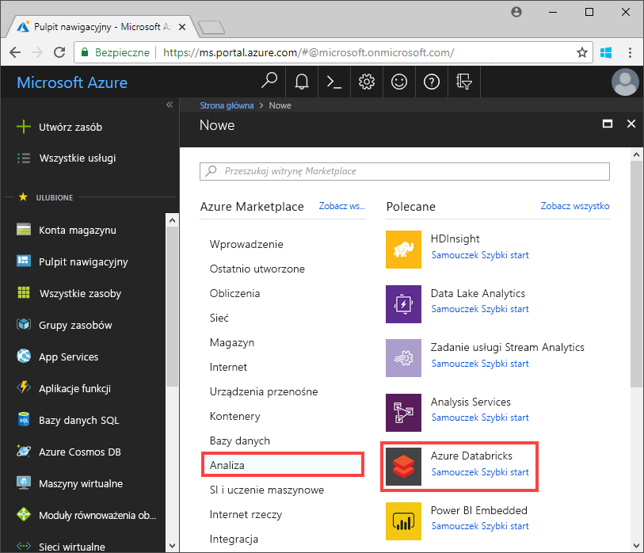
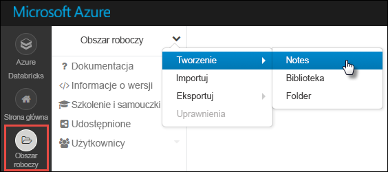

# <a name="tutorial-implement-the-data-lake-capture-pattern-to-update-a-databricks-delta-table"></a>Samouczek: Implementowanie wzorca przechwytywania danych w celu zaktualizowania tabeli różnicowej datakostki

W tym samouczku pokazano, jak obsługiwać zdarzenia na koncie magazynu, które ma hierarchiczną przestrzeń nazw.

Utworzysz małe rozwiązanie, które umożliwi użytkownikowi wypełnianie tabeli różnicowej datakostki przez przekazanie pliku wartości rozdzielanych przecinkami (CSV) opisującego zamówienie sprzedaży. To rozwiązanie zostanie skompilowane, łącząc się z subskrypcją Event Grid, funkcją platformy Azure i [zadaniem](https://docs.azuredatabricks.net/user-guide/jobs.html) w Azure Databricks.

W tym samouczku wykonasz następujące czynności:

> [!div class="checklist"]
> * Utwórz subskrypcję Event Grid, która wywołuje funkcję platformy Azure.
> * Utwórz funkcję platformy Azure, która odbiera powiadomienie ze zdarzenia, a następnie uruchamia zadanie w Azure Databricks.
> * Utwórz zadanie datacegły, które wstawia zamówienie klienta do tabeli różnicowej datakostki, która znajduje się na koncie magazynu.

Skompilujemy to rozwiązanie w odwrotnej kolejności, rozpoczynając od obszaru roboczego Azure Databricks.

## <a name="prerequisites"></a>Wymagania wstępne

* Jeśli nie masz subskrypcji platformy Azure, przed rozpoczęciem utwórz [bezpłatne konto](https://azure.microsoft.com/free/?WT.mc_id=A261C142F).

* Utwórz konto magazynu, które ma hierarchiczną przestrzeń nazw (Azure Data Lake Storage Gen2). W tym samouczku jest stosowane konto magazynu o nazwie `contosoorders`. Upewnij się, że Twoje konto użytkownika ma przypisaną [rolę Współautor danych obiektu blob magazynu](https://docs.microsoft.com/azure/storage/common/storage-auth-aad-rbac).

  Zobacz [Tworzenie konta Azure Data Lake Storage Gen2](data-lake-storage-quickstart-create-account.md).

* Tworzenie jednostki usługi. Zobacz [Instrukcje: używanie portalu do tworzenia aplikacji usługi Azure AD i jednostki usługi w celu uzyskiwania dostępu do zasobów](https://docs.microsoft.com/azure/active-directory/develop/howto-create-service-principal-portal).

  Jest kilka rzeczy, o których należy pamiętać podczas wykonywania kroków przedstawionych w tym artykule.

  :heavy_check_mark: Wykonując kroki opisane w sekcji [Przypisywanie aplikacji do roli](https://docs.microsoft.com/azure/active-directory/develop/howto-create-service-principal-portal#assign-the-application-to-a-role) tego artykułu, upewnij się, że przypisano rolę **Współautor danych obiektu blob magazynu** do jednostki usługi.

  > [!IMPORTANT]
  > Upewnij się, że przypisano rolę w zakresie konta magazynu usługi Data Lake Storage Gen2. Możesz przypisać rolę do nadrzędnej grupy zasobów lub subskrypcji, ale będzie zgłaszany błąd dotyczący uprawnień do momentu rozpropagowania przypisań roli do konta magazynu.

  :heavy_check_mark: Podczas wykonywania kroków opisanych w sekcji [pobieranie wartości dla logowania w](https://docs.microsoft.com/azure/active-directory/develop/howto-create-service-principal-portal#get-values-for-signing-in) artykule wklej identyfikator dzierżawy, identyfikator aplikacji i hasło do pliku tekstowego. Te wartości będą potrzebne później.

## <a name="create-a-sales-order"></a>Utwórz zamówienie sprzedaży

Najpierw utwórz plik CSV, który opisuje zamówienie sprzedaży, a następnie Przekaż ten plik na konto magazynu. Później będziesz używać danych z tego pliku do wypełniania pierwszego wiersza w tabeli różnicowej datakostek.

1. Otwórz Eksplorator usługi Azure Storage. Następnie przejdź do swojego konta magazynu i w sekcji **kontenery obiektów BLOB** Utwórz nowy kontener o nazwie **dane**.

   (./media/data-lake-storage-events/data-container.png "folder danych") ![folderu danych]

   Aby uzyskać więcej informacji o sposobach korzystania z Eksplorator usługi Storage, zobacz [używanie Eksplorator usługi Azure Storage do zarządzania danymi w ramach konta Azure Data Lake Storage Gen2](data-lake-storage-explorer.md).

2. W kontenerze **dane** Utwórz folder o nazwie **Input**.

3. Wklej następujący tekst do edytora tekstu.

   ```
   InvoiceNo,StockCode,Description,Quantity,InvoiceDate,UnitPrice,CustomerID,Country
   536365,85123A,WHITE HANGING HEART T-LIGHT HOLDER,6,12/1/2010 8:26,2.55,17850,United Kingdom
   ```

4. Zapisz ten plik na komputerze lokalnym i nadaj mu nazwę **Data. csv**.

5. W Eksplorator usługi Storage Przekaż ten plik do folderu **Input** .  

## <a name="create-a-job-in-azure-databricks"></a>Tworzenie zadania w Azure Databricks

W tej sekcji wykonasz następujące zadania:

* Tworzenie obszaru roboczego usługi Azure Databricks.
* Utwórz notes.
* Tworzenie i wypełnianie tabeli różnicowej w danych.
* Dodaj kod, który wstawia wiersze do tabeli delty datakosteks.
* Utwórz zadanie.

### <a name="create-an-azure-databricks-workspace"></a>Tworzenie obszaru roboczego usługi Azure Databricks

W tej sekcji utworzysz obszar roboczy usługi Azure Databricks przy użyciu witryny Azure Portal.

1. W witrynie Azure Portal wybierz pozycję **Utwórz zasób** > **Analiza** > **Azure Databricks**.

    

2. W obszarze **Usługa Azure Databricks** podaj wartości umożliwiające utworzenie obszaru roboczego usługi Databricks.

    

    Tworzenie obszaru roboczego trwa kilka minut. Stan operacji można monitorować za pomocą paska postępu znajdującego się u góry.

### <a name="create-a-spark-cluster-in-databricks"></a>Tworzenie klastra Spark w usłudze Databricks

1. W [Azure Portal](https://portal.azure.com)przejdź do utworzonego obszaru roboczego Azure Databricks, a następnie wybierz pozycję **Uruchom obszar roboczy**.

2. Nastąpi przekierowanie do portalu usługi Azure Databricks. W portalu wybierz pozycję **Nowy** > **Klaster**.

    

3. Na stronie **Nowy klaster** podaj wartości, aby utworzyć klaster.

    

    Zaakceptuj pozostałe wartości domyślne poza następującymi:

    * Wprowadź nazwę klastra.
    * Upewnij się, że pole wyboru **Zakończ po 120 min aktywności** zostało zaznaczone. Podaj czas (w minutach), po jakim działanie klastra ma zostać zakończone, jeśli nie jest używany.

4. Wybierz pozycję **Utwórz klaster**. Po uruchomieniu klastra możesz dołączyć do niego notesy i uruchamiać zadania Spark.

Aby uzyskać więcej informacji na temat tworzenia klastrów, zobacz [Create a Spark cluster in Azure Databricks](https://docs.azuredatabricks.net/user-guide/clusters/create.html) (Tworzenie klastra Spark w usłudze Azure Databricks).

### <a name="create-a-notebook"></a>Tworzenie notesu

1. W lewym okienku wybierz pozycję **Obszar roboczy**. Z listy rozwijanej **Obszar roboczy** wybierz pozycję **Utwórz** > **Notes**.

    

2. W oknie dialogowym**Tworzenie notesu** wprowadź nazwę notesu. Jako język wybierz pozycję **Python**, a następnie wybierz utworzony wcześniej klaster Spark.

    

    Wybierz pozycję **Utwórz**.

### <a name="create-and-populate-a-databricks-delta-table"></a>Tworzenie i wypełnianie tabeli różnicowej datakostki

1. W utworzonym notesie skopiuj i wklej poniższy blok kodu w pierwszej komórce, ale nie uruchamiaj jeszcze tego kodu.  

   Zastąp wartości symboli zastępczych `appId`, `password`, `tenant` w tym bloku kodu wartościami, które zostały zebrane podczas wykonywania wymagań wstępnych w tym samouczku.

    ```Python
    dbutils.widgets.text('source_file', "", "Source File")

    spark.conf.set("fs.azure.account.auth.type", "OAuth")
    spark.conf.set("fs.azure.account.oauth.provider.type", "org.apache.hadoop.fs.azurebfs.oauth2.ClientCredsTokenProvider")
    spark.conf.set("fs.azure.account.oauth2.client.id", "<appId>")
    spark.conf.set("fs.azure.account.oauth2.client.secret", "<password>")
    spark.conf.set("fs.azure.account.oauth2.client.endpoint", "https://login.microsoftonline.com/<tenant>/oauth2/token")

    adlsPath = 'abfss://data@contosoorders.dfs.core.windows.net/'
    inputPath = adlsPath + dbutils.widgets.get('source_file')
    customerTablePath = adlsPath + 'delta-tables/customers'
    ```

    Ten kod tworzy widżet o nazwie **source_file**. Później utworzysz funkcję platformy Azure, która wywoła ten kod i przekaże ścieżkę pliku do tego widżetu.  Ten kod uwierzytelnia również nazwę główną usługi przy użyciu konta magazynu i tworzy pewne zmienne, które będą używane w innych komórkach.

    > [!NOTE]
    > W środowisku produkcyjnym rozważ przechowywanie klucza uwierzytelniania w usłudze Azure Databricks. Następnie dodaj do bloku kodu klucz wyszukiwania zamiast klucza uwierzytelniania. <br><br>Na przykład zamiast korzystania z tego wiersza kodu: `spark.conf.set("fs.azure.account.oauth2.client.secret", "<password>")`, należy użyć następującego wiersza kodu: `spark.conf.set("fs.azure.account.oauth2.client.secret", dbutils.secrets.get(scope = "<scope-name>", key = "<key-name-for-service-credential>"))`. <br><br>Po ukończeniu tego samouczka zapoznaj się z artykułem [Azure Data Lake Storage Gen2](https://docs.azuredatabricks.net/spark/latest/data-sources/azure/azure-datalake-gen2.html) w witrynie internetowej Azure Databricks, aby zobaczyć przykłady tego podejścia.

2. Naciśnij klawisze **SHIFT+ENTER**, aby uruchomić kod w tym bloku.

3. Skopiuj i wklej poniższy blok kodu do innej komórki, a następnie naciśnij klawisze **SHIFT + ENTER** , aby uruchomić kod w tym bloku.

   ```Python
   from pyspark.sql.types import StructType, StructField, DoubleType, IntegerType, StringType


   inputSchema = StructType([
   StructField("InvoiceNo", IntegerType(), True),
   StructField("StockCode", StringType(), True),
   StructField("Description", StringType(), True),
   StructField("Quantity", IntegerType(), True),
   StructField("InvoiceDate", StringType(), True),
   StructField("UnitPrice", DoubleType(), True),
   StructField("CustomerID", IntegerType(), True),
   StructField("Country", StringType(), True)
   ])

   rawDataDF = (spark.read
    .option("header", "true")
    .schema(inputSchema)
    .csv(adlsPath + 'input')
   )

   (rawDataDF.write
     .mode("overwrite")
     .format("delta")
     .saveAsTable("customer_data", path=customerTablePath))
   ```

   Ten kod tworzy tabelę różnicową datacegły na koncie magazynu, a następnie ładuje pewne dane początkowe z pliku CSV, który został wcześniej przekazany.

4. Po pomyślnym uruchomieniu tego bloku kodu Usuń ten blok kodu z notesu.

### <a name="add-code-that-inserts-rows-into-the-databricks-delta-table"></a>Dodaj kod, który wstawia wiersze do tabeli różnicowej datakostki

1. Skopiuj i wklej poniższy blok kodu do innej komórki, ale nie uruchamiaj tej komórki.

   ```Python
   upsertDataDF = (spark
     .read
     .option("header", "true")
     .csv(inputPath)
   )
   upsertDataDF.createOrReplaceTempView("customer_data_to_upsert")
   ```

   Ten kod wstawia dane do tymczasowego widoku tabeli przy użyciu danych z pliku CSV. Ścieżka do tego pliku CSV pochodzi z widżetu danych wejściowych utworzonego we wcześniejszym kroku.

2. Dodaj następujący kod, aby scalić zawartość widoku tabeli tymczasowej z tabelą różnicową datacegłs.

   ```
   %sql
   MERGE INTO customer_data cd
   USING customer_data_to_upsert cu
   ON cd.CustomerID = cu.CustomerID
   WHEN MATCHED THEN
     UPDATE SET
       cd.StockCode = cu.StockCode,
       cd.Description = cu.Description,
       cd.InvoiceNo = cu.InvoiceNo,
       cd.Quantity = cu.Quantity,
       cd.InvoiceDate = cu.InvoiceDate,
       cd.UnitPrice = cu.UnitPrice,
       cd.Country = cu.Country
   WHEN NOT MATCHED
     THEN INSERT (InvoiceNo, StockCode, Description, Quantity, InvoiceDate, UnitPrice, CustomerID, Country)
     VALUES (
       cu.InvoiceNo,
       cu.StockCode,
       cu.Description,
       cu.Quantity,
       cu.InvoiceDate,
       cu.UnitPrice,
       cu.CustomerID,
       cu.Country)
   ```

### <a name="create-a-job"></a>Tworzenie zadania

Utwórz zadanie z uruchomionym wcześniej utworzonym notesem. Później utworzysz funkcję platformy Azure, która uruchamia to zadanie, gdy zostanie zgłoszone zdarzenie.

1. Kliknij pozycję **zadania**.

2. Na stronie **zadania** kliknij przycisk **Utwórz zadanie**.

3. Nadaj nazwę zadaniu, a następnie wybierz skoroszyt `upsert-order-data`.

   ![Tworzenie]zadania(./media/data-lake-storage-events/create-spark-job.png "Tworzenie zadania")

## <a name="create-an-azure-function"></a>Tworzenie funkcji platformy Azure

Utwórz funkcję platformy Azure, która uruchamia zadanie.

1. W górnym rogu obszaru roboczego datakostki wybierz ikonę osoby, a następnie wybierz pozycję **Ustawienia użytkownika**.

    konta

2. Kliknij przycisk **Generuj nowy token** , a następnie kliknij przycisk **Generuj** .

   Pamiętaj, aby skopiować token do bezpiecznego miejsca. Funkcja platformy Azure wymaga tego tokenu do uwierzytelniania za pomocą datakostki, aby można było uruchomić zadanie.
  
3. Wybierz przycisk **Utwórz zasób** znajdujący się w lewym górnym rogu Azure Portal, a następnie wybierz pozycję **COMPUTE > Aplikacja funkcji**.

   

4. Na stronie **tworzenie** aplikacja funkcji upewnij się, że wybrano opcję **.NET Core** dla stosu środowiska uruchomieniowego i pamiętaj o skonfigurowaniu wystąpienia Application Insights.

   

5. Na stronie **przegląd** aplikacja funkcji kliknij pozycję **Konfiguracja**.

   

6. Na stronie **Ustawienia aplikacji** wybierz przycisk **Ustawienia nowej aplikacji** , aby dodać każde ustawienie.

   

   Dodaj następujące ustawienia:

   |Nazwa ustawienia | Value |
   |----|----|
   |**DBX_INSTANCE**| Region obszaru roboczego kostki danych. Na przykład: `westus2.azuredatabricks.net`|
   |**DBX_PAT**| Osobisty token dostępu wygenerowany wcześniej. |
   |**DBX_JOB_ID**|Identyfikator uruchomionego zadania. W naszym przypadku ta wartość jest `1`.|
7. Na stronie Przegląd aplikacji funkcji kliknij przycisk **Nowa funkcja** .

    funkcji

8. Wybierz **wyzwalacz Azure Event Grid**.

   Zainstaluj rozszerzenie **Microsoft. Azure. WebJobs. Extensions. EventGrid** , jeśli zostanie wyświetlony odpowiedni monit. W razie potrzeby instalacji należy ponownie wybrać **Azure Event Grid wyzwalacza** , aby utworzyć funkcję.

   Zostanie wyświetlone **nowe okienko funkcji** .

9. W okienku **Nowa funkcja** Nazwij funkcję **UpsertOrder**, a następnie kliknij przycisk **Utwórz** .

10. Zastąp zawartość pliku kodu tym kodem, a następnie kliknij przycisk **Zapisz** :

    ```cs
    using "Microsoft.Azure.EventGrid"
    using "Newtonsoft.Json"
    using Microsoft.Azure.EventGrid.Models;
    using Newtonsoft.Json;
    using Newtonsoft.Json.Linq;

    private static HttpClient httpClient = new HttpClient();

    public static async Task Run(EventGridEvent eventGridEvent, ILogger log)
    {
        log.LogInformation("Event Subject: " + eventGridEvent.Subject);
        log.LogInformation("Event Topic: " + eventGridEvent.Topic);
        log.LogInformation("Event Type: " + eventGridEvent.EventType);
        log.LogInformation(eventGridEvent.Data.ToString());

        if (eventGridEvent.EventType == "Microsoft.Storage.BlobCreated" | | eventGridEvent.EventType == "Microsoft.Storage.FileRenamed") {
            var fileData = ((JObject)(eventGridEvent.Data)).ToObject<StorageBlobCreatedEventData>();
            if (fileData.Api == "FlushWithClose") {
                log.LogInformation("Triggering Databricks Job for file: " + fileData.Url);
                var fileUrl = new Uri(fileData.Url);
                var httpRequestMessage = new HttpRequestMessage {
                    Method = HttpMethod.Post,
                    RequestUri = new Uri(String.Format("https://{0}/api/2.0/jobs/run-now", System.Environment.GetEnvironmentVariable("DBX_INSTANCE", EnvironmentVariableTarget.Process))),
                    Headers = {
                        { System.Net.HttpRequestHeader.Authorization.ToString(), "Bearer " +  System.Environment.GetEnvironmentVariable ("DBX_PAT", EnvironmentVariableTarget.Process)},
                        { System.Net.HttpRequestHeader.ContentType.ToString (), "application/json" }
                    },
                    Content = new StringContent(JsonConvert.SerializeObject(new {
                        job_id = System.Environment.GetEnvironmentVariable ("DBX_JOB_ID", EnvironmentVariableTarget.Process) ,
                        notebook_params = new {
                            source_file = String.Join("", fileUrl.Segments.Skip(2))
                        }
                    }))
                 };
                var response = await httpClient.SendAsync(httpRequestMessage);
                response.EnsureSuccessStatusCode();
            }
        }
    }
    ```

   Ten kod analizuje informacje o zdarzeniu magazynu, które zostało zgłoszone, a następnie tworzy komunikat żądania z adresem URL pliku, który wyzwolił zdarzenie. W ramach komunikatu funkcja przekazuje wartość do widżetu **source_file** , który został utworzony wcześniej. kod funkcji wysyła komunikat do zadania datakostki i używa tokenu uzyskanego wcześniej jako uwierzytelnianie.

## <a name="create-an-event-grid-subscription"></a>Tworzenie subskrypcji usługi Event Grid

W tej sekcji utworzysz subskrypcję Event Grid, która wywołuje funkcję platformy Azure w przypadku przekazania plików na konto magazynu.

1. Na stronie kod funkcji kliknij przycisk **Dodaj subskrypcję Event Grid** .

   Nowa subskrypcja zdarzeń(./media/data-lake-storage-events/new-event-subscription.png "nowej subskrypcji") ![zdarzeń]

2. Na stronie **Tworzenie subskrypcji zdarzeń** Nazwij subskrypcję, a następnie Użyj pól na stronie, aby wybrać konto magazynu.

   Nowa subskrypcja zdarzeń(./media/data-lake-storage-events/new-event-subscription-2.png "nowej subskrypcji") ![zdarzeń]

3. Z listy rozwijanej **Filtruj do typów zdarzeń** wybierz pozycję **utworzony obiekt BLOB**, a następnie pozycję **usunięte** obiekty blob, a następnie kliknij przycisk **Utwórz** .

## <a name="test-the-event-grid-subscription"></a>Testowanie subskrypcji Event Grid

1. Utwórz plik o nazwie `customer-order.csv`, wklej następujące informacje do tego pliku i Zapisz go na komputerze lokalnym.

   ```
   InvoiceNo,StockCode,Description,Quantity,InvoiceDate,UnitPrice,CustomerID,Country
   536371,99999,EverGlow Single,228,1/1/2018 9:01,33.85,20993,Sierra Leone
   ```

2. W Eksplorator usługi Storage Przekaż ten plik do folderu **wejściowego** konta magazynu.

   Przekazywanie pliku wywołuje zdarzenie **Microsoft. Storage. BlobCreated** . Event Grid powiadamia wszystkich subskrybentów o tym zdarzeniu. W naszym przypadku jedyną subskrybentem jest funkcja platformy Azure. Funkcja platformy Azure analizuje parametry zdarzenia w celu ustalenia, które zdarzenie wystąpiło. Następnie przekazuje adres URL pliku do zadania datakostki. Zadanie datakostki odczytuje plik i dodaje wiersz do tabeli różnicowej DataRows, w której znajduje się konto magazynu.

3. Aby sprawdzić, czy zadanie zakończyło się pomyślnie, Otwórz obszar roboczy datacegły, kliknij przycisk **zadania** , a następnie otwórz zadanie.

4. Wybierz zadanie, aby otworzyć stronę zadanie.

    dla zadania Spark

   Po zakończeniu zadania zostanie wyświetlony stan ukończenia.

    .

5. W nowej komórce skoroszytu Uruchom to zapytanie w komórce, aby wyświetlić zaktualizowaną tabelę różnicową.

   ```
   %sql select * from customer_data
   ```

   W zwracanej tabeli przedstawiono najnowszy rekord.

    pojawia się najnowszy rekord w tabeli

6. Aby zaktualizować ten rekord, Utwórz plik o nazwie `customer-order-update.csv`, wklej następujące informacje do tego pliku i Zapisz go na komputerze lokalnym.

   ```
   InvoiceNo,StockCode,Description,Quantity,InvoiceDate,UnitPrice,CustomerID,Country
   536371,99999,EverGlow Single,22,1/1/2018 9:01,33.85,20993,Sierra Leone
   ```

   Ten plik CSV jest niemal identyczny z poprzednim, z wyjątkiem tego, że ilość zamówienia została zmieniona z `228` na `22`.

7. W Eksplorator usługi Storage Przekaż ten plik do folderu **wejściowego** konta magazynu.

8. Uruchom ponownie zapytanie `select`, aby wyświetlić zaktualizowaną tabelę różnicową.

   ```
   %sql select * from customer_data
   ```

   W zwracanej tabeli jest wyświetlany zaktualizowany rekord.

    w tabeli

## <a name="clean-up-resources"></a>Oczyszczanie zasobów

Gdy grupa zasobów i wszystkie pokrewne zasoby nie będą już potrzebne, usuń je. W tym celu zaznacz grupę zasobów konta magazynu i wybierz pozycję **Usuń**.

## <a name="next-steps"></a>Następne kroki

> [!div class="nextstepaction"]
> [Reagowanie na zdarzenia usługi Blob Storage](storage-blob-event-overview.md)
