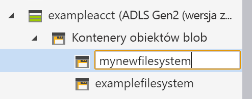

# Szybki start: zarządzanie danymi na koncie usługi Azure Data Lake Storage Gen2 przy użyciu Eksploratora usługi Azure Storage

W tym przewodniku Szybki start dowiesz się, jak utworzyć katalog i obiekt blob, korzystając z [Eksploratora usługi Azure Storage](https://azure.microsoft.com/features/storage-explorer/). Następnie dowiesz się, jak pobrać obiekt blob na komputer lokalny i jak wyświetlać wszystkie obiekty blob w katalogu. Dowiesz się również, jak utworzyć migawkę obiektu blob, zarządzać zasadami dostępu do katalogu i utworzyć sygnaturę dostępu współdzielonego.

## Wymagania wstępne

[!INCLUDE [storage-quickstart-prereq-include](../../../includes/storage-quickstart-prereq-include.md)]

W przypadku tego przewodnika Szybki start wymagane jest zainstalowanie Eksploratora usługi Azure Storage. Aby zainstalować Eksplorator usługi Azure Storage dla systemu Windows, Macintosh lub Linux, zobacz [Eksplorator usługi Azure Storage](https://azure.microsoft.com/features/storage-explorer/).

## Zaloguj się do Eksploratora usługi Storage

Podczas pierwszego uruchomienia wyświetlane jest okno **Eksplorator usługi Microsoft Azure Storage — nawiązywanie połączenia**. Chociaż Eksplorator usługi Storage oferuje kilka sposobów łączenia się z kontem magazynu, tylko jeden ze sposobów jest obecnie obsługiwany na potrzeby zarządzania listami kontroli dostępu.

|Zadanie|Przeznaczenie|
|---|---|
|Dodawanie konta platformy Azure | Przekierowuje Cię do strony logowania organizacji w celu uwierzytelniania na platformie Azure. Obecnie jest to jedyna obsługiwana metoda uwierzytelniania, jeśli chcesz ustawić listy kontroli dostępu i zarządzać nimi. |

Wybierz pozycję **Dodaj konto platformy Azure**, a następnie kliknij pozycję **Zaloguj się...**. Postępuj zgodnie z monitami wyświetlanymi na ekranie, aby zalogować się do konta platformy Azure.

Po nawiązaniu połączenia Eksplorator usługi Azure Storage zostanie załadowany z wyświetloną kartą **Eksplorator**. Ten widok udostępnia szczegółowe informacje dotyczące wszystkich kont usługi Azure Storage, a także magazynu lokalnego skonfigurowanego za pomocą kont [emulatora magazynu Azure](../common/storage-use-emulator.md?toc=%2fazure%2fstorage%2fblobs%2ftoc.json) lub bazy danych [Cosmos DB](../../cosmos-db/storage-explorer.md?toc=%2fazure%2fstorage%2fblobs%2ftoc.json) bądź środowisk usługi [Azure Stack](/azure-stack/user/azure-stack-storage-connect-se?toc=%2fazure%2fstorage%2fblobs%2ftoc.json).

## Tworzenie systemu plików

Obiekty blob są zawsze przekazywane do katalogu. Umożliwia to organizowanie grup obiektów blob w sposób podobny do organizowania plików w folderach na komputerze.

Aby utworzyć katalog, rozwiń konto magazynu utworzone w poprzednim kroku. Wybierz pozycję **Kontener obiektów blob**, kliknij ją prawym przyciskiem myszy, a następnie wybierz pozycję **Utwórz kontener obiektów blob**. Wprowadź nazwę dla systemu plików. Po zakończeniu naciśnij **Enter** utworzyć systemu plików. Po pomyślnym utworzeniu katalog obiektów blob zostanie wyświetlony w folderze **Kontener obiektów blob** dla wybranego konta magazynu.

## Przekazywanie obiektów blob do katalogu

Usługa Blob Storage obsługuje blokowe, uzupełnialne i stronicowe obiekty blob. Pliki VHD używane do tworzenia kopii maszyn wirtualnych IaaS są stronicowymi obiektami blob. Uzupełnialne obiekty blob są używane do rejestrowania, na przykład w sytuacji, w której konieczny jest zapis do pliku, a następnie dodawanie kolejnych informacji. Większość plików przechowywanych w usłudze Blob Storage to blokowe obiekty blob.

Na wstążce katalogu wybierz pozycję **Przekaż**. Ta operacja udostępnia opcję przekazania folderu lub pliku.

Wybierz pliki lub folder do przekazania. Wybierz **typ obiektu blob**. Dopuszczalne wartości to **uzupełniany**, **stronicowy** lub **blokowy** obiekt blob.

W przypadku przekazywania pliku VHD lub VHDX wybierz pozycję **Przekazuj pliki VHD lub VHDX jako stronicowe obiekty blob (zalecane)**.

W polu **Przekaż do folderu (opcjonalnie)** wprowadź nazwę folderu do przechowywania plików lub folderów w folderze w ramach katalogu. Jeśli nie zostanie wybrany żaden folder, pliki zostaną przekazane bezpośrednio w ramach katalogu.

Po wybraniu przycisku **OK** zaznaczone pliki zostaną umieszczone w kolejce do przekazania, a następnie przekazane. Po zakończeniu przekazywania wyniki zostaną wyświetlone w oknie **Działania**.

## Wyświetlanie obiektów blob w katalogu

W aplikacji **Eksplorator usługi Azure Storage** wybierz katalog w ramach konta magazynu. W okienku głównym wyświetlana jest lista obiektów blob w wybranym katalogu.

## Pobieranie obiektów blob

Aby pobrać obiekty blob przy użyciu **Eksploratora usługi Azure Storage**, zaznacz obiekt blob, a następnie wybierz pozycję **Pobierz** ze wstążki. Zostanie wyświetlone okno dialogowe, w którym możliwe jest wprowadzenie nazwy pliku. Wybierz pozycję **Zapisz**, aby rozpocząć pobieranie obiektu blob do lokalizacji lokalnej.

## Kolejne kroki

W tym przewodniku Szybki start przedstawiono metodę transferowania plików między dyskiem lokalnym i usługą Azure Blob Storage przy użyciu **Eksploratora usługi Azure Storage**. Aby dowiedzieć się więcej na temat ustawiania list kontroli dostępu do plików i katalogów, przejdź do naszych przewodników na ten temat.

> [!div class="nextstepaction"]
> [Konfigurowanie list kontroli dostępu do plików i katalogów](data-lake-storage-how-to-set-permissions-storage-explorer.md)
