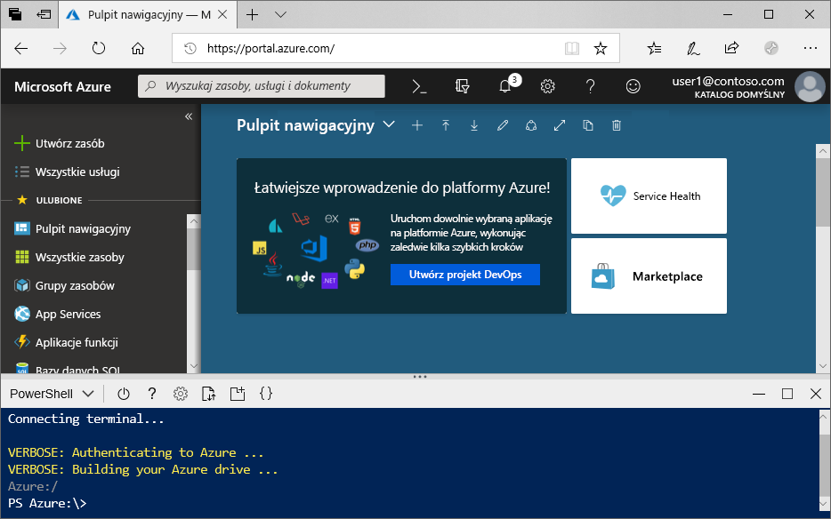

# <a name="create-an-azure-data-lake-storage-gen2-storage-account"></a>Tworzenie konta usługi Azure Data Lake Storage 2. generacji

Azure Data Lake Storage Gen2 [obsługuje hierarchiczną przestrzeń nazw](data-lake-storage-introduction.md) , która zapewnia natywny kontener oparty na katalogu dostosowany do pracy z rozproszony system plików HADOOP (HDFS). Dostęp do danych usługi Data Lake Storage 2. generacji z systemu plików HDFS można uzyskiwać za pośrednictwem [sterownika ABFS](data-lake-storage-abfs-driver.md).

W tym artykule przedstawiono sposób tworzenia konta przy użyciu Azure Portal, Azure PowerShell lub za pośrednictwem interfejsu wiersza polecenia platformy Azure.

## <a name="prerequisites"></a>Wymagania wstępne

Jeśli nie masz subskrypcji platformy Azure, przed rozpoczęciem utwórz [bezpłatne konto](https://azure.microsoft.com/free/). 

|           | Warunek wstępny |
|-----------|--------------|
|Portal     | Brak         |
|PowerShell | Ten artykuł wymaga modułu PowerShell AZ. Storage w wersji **0,7** lub nowszej. Aby określić bieżącą wersję, uruchom polecenie `Get-Module -ListAvailable Az.Storage`. Jeśli po uruchomieniu tego polecenia nie zostaną wyświetlone żadne wyniki lub zostanie wyświetlona wersja niższa niż **0,7** , należy uaktualnić moduł programu PowerShell. Zobacz sekcję [Uaktualnianie modułu PowerShell](#upgrade-your-powershell-module) w tym przewodniku.
|Interfejs CLI        | Możesz zalogować się do platformy Azure i uruchamiać polecenia interfejsu wiersza poleceń platformy Azure na jeden z dwóch sposobów: <ul><li>Polecenia interfejsu wiersza polecenia platformy Azure możesz uruchamiać z poziomu witryny Azure Portal w usłudze Azure Cloud Shell </li><li>Możesz zainstalować interfejs wiersza polecenia i uruchamiać jego polecenia lokalnie</li></ul>|

Podczas pracy w wierszu polecenia masz opcję uruchamiania powłoki chmury platformy Azure lub instalowania interfejsu wiersza polecenia lokalnie.

### <a name="use-azure-cloud-shell"></a>Używanie usługi Azure Cloud Shell

Usługa Azure Cloud Shell jest bezpłatną powłoką Bash, którą można uruchamiać bezpośrednio w witrynie Azure Portal. Ma ona wstępnie zainstalowany interfejs wiersza polecenia platformy Azure skonfigurowany do użycia z Twoim kontem. Kliknij przycisk **Cloud Shell** w menu w prawym górnym rogu witryny Azure Portal:

[](https://portal.azure.com)

Przycisk uruchamia interaktywną powłokę, której można użyć do uruchomienia kroków opisanych w tym artykule:

[](https://portal.azure.com)

### <a name="install-the-cli-locally"></a>Instalowanie interfejsu wiersza polecenia lokalnie

Interfejs wiersza polecenia platformy Azure możesz również zainstalować i używać go lokalnie. Ten artykuł wymaga uruchomienia interfejsu wiersza polecenia platformy Azure w wersji 2.0.38 lub nowszej. Uruchom polecenie `az --version`, aby dowiedzieć się, jaka wersja jest używana. Jeśli konieczna będzie instalacja lub uaktualnienie interfejsu, zobacz [Instalowanie interfejsu wiersza polecenia platformy Azure](/cli/azure/install-azure-cli).

## <a name="create-a-storage-account-with-azure-data-lake-storage-gen2-enabled"></a>Tworzenie konta magazynu z włączoną usługą Azure Data Lake Storage Gen2

Konto usługi Azure Storage zawiera wszystkie obiekty danych usługi Azure Storage: obiektów blob, plików, kolejek, tabel i dysków. Konto magazynu zapewnia unikatową przestrzeń nazw dla danych usługi Azure Storage, która jest dostępna z dowolnego miejsca na świecie za pośrednictwem protokołu HTTP lub HTTPS. Dane na koncie usługi Azure Storage są trwałe i wysoce dostępne, bezpieczne i skalowalne.

> [!NOTE]
> Aby korzystać z zalet funkcji usługi Data Lake Storage 2. generacji, należy tworzyć nowe konta magazynu jako typ **StorageV2 (ogólnego przeznaczenia w wersji 2)** .  

Aby uzyskać więcej informacji dotyczących kont magazynu, zobacz temat [Azure Storage account overview](../common/storage-account-overview.md) (Omówienie konta usługi Azure Storage).

## <a name="create-an-account-using-the-azure-portal"></a>Tworzenie konta przy użyciu witryny Azure Portal

Zaloguj się do [portalu Azure](https://portal.azure.com).

### <a name="create-a-storage-account"></a>Tworzenie konta magazynu

Każde konto magazynu musi należeć do grupy zasobów platformy Azure. Grupa zasobów to logiczny kontener przeznaczony do grupowania usług platformy Azure. Podczas tworzenia konta magazynu masz możliwość utworzenia nowej grupy zasobów lub użycia istniejącej grupy zasobów. W tym artykule pokazano, jak utworzyć nową grupę zasobów.

Aby utworzyć konto magazynu ogólnego przeznaczenia w wersji 2 w witrynie Azure Portal, wykonaj następujące kroki:

> [!NOTE]
> Hierarchiczna przestrzeń nazw jest obecnie dostępna we wszystkich regionach publicznych.

1. Wybierz subskrypcję, w ramach której chcesz utworzyć konto magazynu.
2. W Azure Portal wybierz przycisk **Utwórz zasób** , a następnie wybierz pozycję **konto magazynu**.
3. W polu **Grupa zasobów** wybierz pozycję **Utwórz nową**. Wprowadź nazwę nowej grupy zasobów.
   
   Grupa zasobów to logiczny kontener przeznaczony do grupowania usług platformy Azure. Podczas tworzenia konta magazynu masz możliwość utworzenia nowej grupy zasobów lub użycia istniejącej grupy zasobów.

4. Następnie wprowadź nazwę konta magazynu. Wybrana nazwa musi być unikatowa w obrębie całej platformy Azure. Ponadto nazwa musi mieć długość od 3 do 24 znaków i może zawierać tylko cyfry i małe litery.
5. Wybierz lokalizację.
6. Upewnij się, że na liście rozwijanej **rodzaj konta** zostanie wyświetlona pozycja **StorageV2 (ogólnego przeznaczenia w wersji 2)** .
7. Opcjonalnie Zmień wartości w każdym z tych pól: **wydajność**, **replikacja**, **Warstwa dostępu**. Aby dowiedzieć się więcej na temat tych opcji, zobacz [wprowadzenie do usługi Azure Storage](https://docs.microsoft.com/azure/storage/common/storage-introduction#azure-storage-services).
8. Wybierz kartę **Zaawansowane** .
10. W sekcji **Data Lake Storage Gen2** ustaw pole **Hierarchiczna przestrzeń nazw** na **Włączono**.
11. Kliknij pozycję **Przeglądanie + tworzenie**, aby utworzyć konto magazynu.

Konto magazynu zostało utworzone za pośrednictwem portalu.

### <a name="clean-up-resources"></a>Oczyszczanie zasobów

Aby usunąć grupę zasobów za pomocą witryny Azure Portal:

1. W witrynie Azure Portal rozwiń menu po lewej stronie, aby otworzyć menu usług, a następnie wybierz pozycję **Grupy zasobów**, aby wyświetlić listę grup zasobów.
2. Znajdź grupę zasobów do usunięcia, a następnie kliknij prawym przyciskiem myszy przycisk **Więcej** ( **...** ) po prawej stronie listy.
3. Wybierz pozycję **Usuń grupę zasobów** i potwierdź.

## <a name="create-an-account-using-powershell"></a>Tworzenie konta przy użyciu programu PowerShell

Najpierw zainstaluj najnowszą wersję modułu [PowerShellGet](/powershell/scripting/gallery/installing-psget).

Następnie Uaktualnij moduł programu PowerShell, zaloguj się do subskrypcji platformy Azure, Utwórz grupę zasobów, a następnie utwórz konto magazynu.

### <a name="upgrade-your-powershell-module"></a>Uaktualnianie modułu PowerShell

[!INCLUDE [updated-for-az](../../../includes/updated-for-az.md)]

Aby zapewnić interakcję z usługą Data Lake Storage 2. generacji przy użyciu programu PowerShell, należy zainstalować moduł Az.Storage w wersji **0.7** lub nowszej.

Rozpocznij od otwarcia sesji programu PowerShell z podwyższonym poziomem uprawnień.

Instalacja modułu Az.Storage

```powershell
Install-Module Az.Storage -Repository PSGallery -AllowClobber -Force
```

### <a name="sign-in-to-your-azure-subscription"></a>Zaloguj się do subskrypcji platformy Azure

Użyj polecenia `Login-AzAccount`, a następnie postępuj zgodnie z instrukcjami wyświetlanymi na ekranie w celu uwierzytelnienia.

```powershell
Login-AzAccount
```

### <a name="create-a-resource-group"></a>Utwórz grupę zasobów

Aby utworzyć nową grupę zasobów za pomocą programu PowerShell, użyj polecenia [New-AzResourceGroup](/powershell/module/az.resources/new-azresourcegroup): 

> [!NOTE]
> Hierarchiczna przestrzeń nazw jest obecnie dostępna we wszystkich regionach publicznych.

```powershell
# put resource group in a variable so you can use the same group name going forward,
# without hardcoding it repeatedly
$resourceGroup = "storage-quickstart-resource-group"
$location = "westus2"
New-AzResourceGroup -Name $resourceGroup -Location $location
```

### <a name="create-a-general-purpose-v2-storage-account"></a>Tworzenie konta magazynu ogólnego przeznaczenia w wersji 2

Aby utworzyć konto magazynu ogólnego przeznaczenia w wersji 2 z poziomu programu PowerShell przy użyciu magazynu lokalnie nadmiarowego (LRS), użyj polecenia [New-AzStorageAccount](/powershell/module/az.storage/New-azStorageAccount):

```powershell
$location = "westus2"

New-AzStorageAccount -ResourceGroupName $resourceGroup `
  -Name "storagequickstart" `
  -Location $location `
  -SkuName Standard_LRS `
  -Kind StorageV2 `
  -EnableHierarchicalNamespace $True
```

### <a name="clean-up-resources"></a>Oczyszczanie zasobów

Aby usunąć grupę zasobów i skojarzone z nią zasoby, w tym nowe konto magazynu, użyj polecenia [Remove-AzResourceGroup](/powershell/module/az.resources/remove-azresourcegroup): 

```powershell
Remove-AzResourceGroup -Name $resourceGroup
```

## <a name="create-an-account-using-azure-cli"></a>Tworzenie konta przy użyciu interfejsu wiersza polecenia platformy Azure

Aby rozpocząć Azure Cloud Shell, zaloguj się do [Azure Portal](https://portal.azure.com).

Jeśli chcesz zalogować się do lokalnej instalacji interfejsu wiersza polecenia, uruchom polecenie logowania:

```cli
az login
```

### <a name="add-the-cli-extension-for-azure-data-lake-gen-2"></a>Dodawanie rozszerzenia wiersza polecenia dla usługi Azure Data Lake 2. generacji

Aby zapewnić interakcję z usługą Data Lake Storage 2. generacji przy użyciu interfejsu wiersza polecenia, dodaj rozszerzenie do powłoki.

W tym celu wprowadź następujące polecenie przy użyciu usługi Cloud Shell lub powłoki lokalnej: `az extension add --name storage-preview`

### <a name="create-a-resource-group"></a>Utwórz grupę zasobów

Aby utworzyć nową grupę zasobów za pomocą interfejsu wiersza polecenia platformy Azure, użyj polecenia [az group create](/cli/azure/group).

```azurecli-interactive
az group create `
    --name storage-quickstart-resource-group `
    --location westus2
```

> [!NOTE]
> > Hierarchiczna przestrzeń nazw jest obecnie dostępna we wszystkich regionach publicznych.

### <a name="create-a-general-purpose-v2-storage-account"></a>Tworzenie konta magazynu ogólnego przeznaczenia w wersji 2

Aby utworzyć konto magazynu ogólnego przeznaczenia w wersji 2 z poziomu interfejsu wiersza polecenia platformy Azure przy użyciu magazynu lokalnie nadmiarowego, użyj polecenia [az storage account create](/cli/azure/storage/account).

```azurecli-interactive
az storage account create `
    --name storagequickstart `
    --resource-group storage-quickstart-resource-group `
    --location westus2 `
    --sku Standard_LRS `
    --kind StorageV2 `
    --enable-hierarchical-namespace true
```

### <a name="clean-up-resources"></a>Oczyszczanie zasobów

Aby usunąć grupę zasobów i skojarzone z nią zasoby, w tym nowe konto magazynu, użyj polecenia [az group delete](/cli/azure/group).

```azurecli-interactive
az group delete --name myResourceGroup
```

## <a name="next-steps"></a>Następne kroki

W tym artykule utworzono konto magazynu z możliwościami Data Lake Storage Gen2. Aby dowiedzieć się, jak przekazywać i pobierać obiekty blob z konta magazynu i do niego, zobacz następujący temat.

* [AzCopy V10](https://docs.microsoft.com/azure/storage/common/storage-use-azcopy-v10?toc=%2fazure%2fstorage%2fblobs%2ftoc.json)
