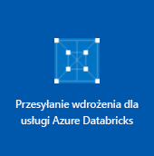

# <a name="quickstart-run-a-spark-job-on-azure-databricks-using-the-azure-portal"></a>Szybki start: uruchamianie zadania Spark w usłudze Azure Databricks przy użyciu witryny Azure Portal

W tym przewodniku Szybki start pokazano, jak uruchomić zadanie Spark przy użyciu usługi Azure Databricks w celu przeprowadzenia analizy danych przechowywanych na koncie magazynu z włączoną usługą Azure Data Lake Storage Gen2 w wersji zapoznawczej.

W ramach zadania Spark przeanalizujesz dane subskrypcji kanałów radiowych, aby na podstawie danych demograficznych uzyskać szczegółowe informacje dotyczące korzystania z usług płatnych/bezpłatnych.

Jeśli nie masz subskrypcji platformy Azure, przed rozpoczęciem [utwórz bezpłatne konto](https://azure.microsoft.com/free/).

## <a name="prerequisites"></a>Wymagania wstępne

- [Utworzenie konta magazynu z włączoną usługą Data Lake Storage Gen2](data-lake-storage-quickstart-create-account.md)

## <a name="set-aside-storage-account-configuration"></a>Zapisywanie konfiguracji konta magazynu na później

> [!IMPORTANT]
> Podczas pracy z tym samouczkiem musisz mieć dostęp do nazwy konta magazynu i klucza dostępu. W witrynie Azure Portal wybierz pozycję **Wszystkie usługi** i odfiltruj je według *magazynu*. Wybierz pozycję **Konta usługi Storage** i znajdź konto utworzone na potrzeby tego samouczka.
>
> W obszarze **Omówienie** skopiuj **nazwę** konta magazynu do edytora tekstów. Następnie wybierz pozycję **Klucze dostępu** i skopiuj wartość **key1** do edytora tekstów, ponieważ obydwie wartości będą potrzebne w przypadku poleceń używanych później.

## <a name="create-an-azure-databricks-workspace"></a>Tworzenie obszaru roboczego usługi Azure Databricks

W tej sekcji utworzysz obszar roboczy usługi Azure Databricks przy użyciu witryny Azure Portal.

1. W witrynie Azure Portal wybierz pozycję **Utwórz zasób** > **Analiza** > **Azure Databricks**.

    

2. W obszarze **Usługa Azure Databricks** podaj wartości umożliwiające utworzenie obszaru roboczego usługi Databricks.

    

    Podaj następujące wartości:

    |Właściwość  |Opis  |
    |---------|---------|
    |**Nazwa obszaru roboczego**     | Podaj nazwę obszaru roboczego usługi Databricks.        |
    |**Subskrypcja**     | Z listy rozwijanej wybierz subskrypcję platformy Azure.        |
    |**Grupa zasobów**     | Określ, czy chcesz utworzyć nową grupę zasobów, czy użyć istniejącej grupy. Grupa zasobów to kontener, który zawiera powiązane zasoby dla rozwiązania platformy Azure. Aby uzyskać więcej informacji, zobacz [Omówienie usługi Azure Resource Manager](../../azure-resource-manager/resource-group-overview.md). |
    |**Lokalizacja**     | Wybierz pozycję **Zachodnie stany USA 2**. Jeśli wolisz, możesz wybrać inny region publiczny.        |
    |**Warstwa cenowa**     |  Wybierz warstwę **Standardowa** lub **Premium**. Aby uzyskać więcej informacji o tych warstwach, zobacz [stronę usługi Databricks](https://azure.microsoft.com/pricing/details/databricks/).       |

    Zaznacz opcję **Przypnij do pulpitu nawigacyjnego**, a następnie kliknij pozycję **Utwórz**.

3. Tworzenie obszaru roboczego trwa kilka minut. Podczas tworzenia obszaru roboczego po prawej stronie portalu jest wyświetlany kafelek **Przesyłanie wdrożenia dla usługi Azure Databricks**. Aby go zobaczyć, być może trzeba będzie przesunąć pulpit nawigacyjny w prawo. W górnej części ekranu jest również wyświetlany pasek postępu. Postęp można obserwować w dowolnym z tych obszarów.

    

## <a name="create-a-spark-cluster-in-databricks"></a>Tworzenie klastra Spark w usłudze Databricks

1. W witrynie Azure Portal przejdź do utworzonego obszaru roboczego usługi Databricks, a następnie wybierz pozycję **Uruchom obszar roboczy**.

2. Nastąpi przekierowanie do portalu usługi Azure Databricks. W portalu wybierz pozycję **Nowy** > **Klaster**.

    

3. Na stronie **Nowy klaster** podaj wartości, aby utworzyć klaster.

    

    Zaakceptuj pozostałe wartości domyślne poza następującymi:

    * Wprowadź nazwę klastra.
    * Utwórz klaster, używając środowiska uruchomieniowego w wersji **5.1 beta**.
    * Upewnij się, że pole wyboru **Zakończ po 120 min aktywności** zostało zaznaczone. Podaj czas (w minutach), po jakim działanie klastra ma zostać zakończone, jeśli nie jest używany.

4. Wybierz pozycję **Utwórz klaster**. Po uruchomieniu klastra możesz dołączyć do niego notesy i uruchamiać zadania Spark.

Aby uzyskać więcej informacji na temat tworzenia klastrów, zobacz [Create a Spark cluster in Azure Databricks](https://docs.azuredatabricks.net/user-guide/clusters/create.html) (Tworzenie klastra Spark w usłudze Azure Databricks).

## <a name="create-storage-account-file-system"></a>Tworzenie systemu plików konta magazynu

W tej sekcji utworzysz notes w obszarze roboczym usługi Azure Databricks, a następnie uruchomisz fragmenty kodu, aby skonfigurować konto magazynu.

1. W witrynie [Azure Portal](https://portal.azure.com) przejdź do utworzonego obszaru roboczego usługi Azure Databricks, a następnie wybierz pozycję **Uruchom obszar roboczy**.

2. W lewym okienku wybierz pozycję **Obszar roboczy**. Z listy rozwijanej **Obszar roboczy** wybierz pozycję **Utwórz** > **Notes**.

    

3. W oknie dialogowym**Tworzenie notesu** wprowadź nazwę notesu. Jako język wybierz pozycję **Scala**, a następnie wybierz utworzony wcześniej klaster Spark.

    

    Wybierz pozycję **Utwórz**.

4. Połącz obszar roboczy usługi Databricks z kontem usługi ADLS Gen2. Istnieją trzy obsługiwane mechanizmy umożliwiające osiągnięcie tego celu: instalowanie przy użyciu protokołu OAuth, dostęp bezpośredni przy użyciu protokołu OAuth oraz dostęp bezpośredni przy użyciu klucza wspólnego. 

    Każdy mechanizm przedstawiono w poniższym przykładzie. Podczas testowania przykładów pamiętaj, aby w przykładowym kodzie zastąpić symbole zastępcze widoczne w nawiasach własnymi wartościami:

    **Instalacja przy użyciu protokołu OAuth**     
        
    ```scala
    %python%
    configs = {"fs.azure.account.auth.type": "OAuth",
        "fs.azure.account.oauth.provider.type": "org.apache.hadoop.fs.azurebfs.oauth2.ClientCredsTokenProvider",
        "fs.azure.account.oauth2.client.id": "<service-client-id>",
        "fs.azure.account.oauth2.client.secret": "<service-credentials>",
        "fs.azure.account.oauth2.client.endpoint": "https://login.microsoftonline.com/<tenant-id>/oauth2/token"}
    
    dbutils.fs.mount(
        source = "abfss://<file-system-name>@<account-name>.dfs.core.windows.net/[<directory-name>]",
        mount_point = "/mnt/<mount-name>",
        extra_configs = configs)
    ```

    **Dostęp bezpośredni przy użyciu protokołu OAuth**

    ```scala
    spark.conf.set("fs.azure.account.auth.type.<account-name>.dfs.core.windows.net": "OAuth")
    spark.conf.set("fs.azure.account.oauth.provider.type.<account-name>.dfs.core.windows.net", "org.apache.hadoop.fs.azurebfs.oauth2.ClientCredsTokenProvider")
    spark.conf.set("fs.azure.account.oauth2.client.id.<account-name>.dfs.core.windows.net": "<service-client-id>")
    spark.conf.set("fs.azure.account.oauth2.client.secret.<account-name>.dfs.core.windows.net": "<service-credentials>")
    spark.conf.set("fs.azure.account.oauth2.client.endpoint.<account-name>.dfs.core.windows.net": "https://login.microsoftonline.com/<tenant-id>/oauth2/token")

    dbutils.fs.ls("abfss://<file-system-name>@<account-name>.dfs.core.windows.net/")
    ```
        
    **Dostęp bezpośredni przy użyciu klucza wspólnego** 

    ```scala    
    spark.conf.set("fs.azure.account.key.<account-name>.dfs.core.windows.net", "<account-key>")

    dbutils.fs.ls("abfss://<file-system-name>@<account-name>.dfs.core.windows.net/")
    ```

5. Wprowadź kod w pierwszej komórce i naciśnij klawisze **SHIFT + ENTER**, aby go uruchomić.

Został utworzony system plików dla konta magazynu.

## <a name="ingest-sample-data"></a>Pozyskiwanie przykładowych danych

Przed przystąpieniem do pracy z tą sekcją musisz zapewnić spełnienie następujących wymagań wstępnych:

Wprowadź następujący kod w komórce notesu:

    %sh wget -P /tmp https://raw.githubusercontent.com/Azure/usql/master/Examples/Samples/Data/json/radiowebsite/small_radio_json.json

W tej komórce naciśnij klawisze **SHIFT + ENTER**, aby uruchomić kod.

Teraz w nowej komórce pod tą komórką wprowadź następujący kod, zastępując wartości w nawiasach tymi samymi wartościami, których użyto wcześniej:

    dbutils.fs.cp("file:///tmp/small_radio_json.json", "abfss://<file-system>@<account-name>.dfs.core.windows.net/")

W tej komórce naciśnij klawisze **SHIFT + ENTER**, aby uruchomić kod.

## <a name="run-a-spark-sql-job"></a>Uruchamianie zadania Spark SQL

Aby uruchomić zadanie Spark SQL w danych, wykonaj poniższe zadania.

1. Uruchom instrukcję SQL, aby utworzyć tabelę tymczasową przy użyciu danych z przykładowego pliku danych JSON, **small_radio_json.json**. W poniższym fragmencie kodu zamień wartości symboli zastępczych na właściwe nazwy systemu plików i konta magazynu. Za pomocą utworzonego wcześniej notesu wklej ten fragment w nowej komórce kodu w notesie, a następnie naciśnij klawisze SHIFT+ENTER.

    ```sql
    %sql
    DROP TABLE IF EXISTS radio_sample_data;
    CREATE TABLE radio_sample_data
    USING json
    OPTIONS (
     path  "abfss://<file-system-name>@<account-name>.dfs.core.windows.net/<PATH>/small_radio_json.json"
    )
    ```

    Po pomyślnym wykonaniu polecenia wszystkie dane z pliku JSON znajdą się w tabeli w klastrze usługi Databricks.

    Magiczne polecenie języka `%sql` umożliwia uruchamianie kodu SQL z notesu, nawet jeśli notes jest innego typu. Aby uzyskać więcej informacji, zobacz [Mixing languages in a notebook](https://docs.azuredatabricks.net/user-guide/notebooks/index.html#mixing-languages-in-a-notebook) (Łączenie języków w notesie).

2. Przyjrzyjmy się migawce przykładowych danych JSON, aby lepiej zrozumieć uruchamiane zapytanie. Wklej poniższy fragment kodu w komórce kodu i naciśnij klawisze **SHIFT+ENTER**.

    ```sql
    %sql
    SELECT * from radio_sample_data
    ```

3. Pojawią się tabelaryczne dane wyjściowe, takie jak pokazano na poniższym zrzucie ekranu (przedstawiono tu tylko niektóre kolumny):

    

    W danych przykładowych jest rejestrowana między innymi płeć odbiorców kanału radiowego (nazwa kolumny **gender** — „płeć”) i informacja o tym, czy subskrypcja jest bezpłatna, czy płatna (nazwa kolumny **level** — „poziom”).

4. Teraz utworzysz reprezentację wizualną tych danych w celu pokazania, ilu użytkowników każdej płci ma konta bezpłatne, a ilu opłaca subskrypcję. U dołu tabelarycznych danych wyjściowych kliknij ikonę **Wykres słupkowy**, a następnie pozycję **Opcje wykresu**.

    

5. W obszarze **Dostosowywanie wykresu** przeciągnij i upuść wartości, jak pokazano na zrzucie ekranu.

    

    - W obszarze **Klucze** ustaw wartość **gender** (płeć).
    - W obszarze **Grupowania serii** ustaw wartość **level** (poziom).
    - W obszarze **Wartości** ustaw wartość **level** (poziom).
    - W obszarze **Agregacja** ustaw wartość **LICZBA**.

6. Kliknij przycisk **Zastosuj**.

7. Wynikiem będzie reprezentacja wizualna przedstawiona na zrzucie ekranu:

     

## <a name="clean-up-resources"></a>Oczyszczanie zasobów

Gdy skończysz pracować z tym artykułem, możesz zakończyć działanie klastra. W obszarze roboczym usługi Azure Databricks wybierz pozycję **Klastry** i znajdź klaster, którego działanie chcesz zakończyć. Przesuń kursor myszy na wielokropek w kolumnie **Akcje** i wybierz ikonę **Przerwij**.


Jeśli nie zakończysz działania klastra ręcznie, zostanie on automatycznie zatrzymany, o ile podczas tworzenia klastra zaznaczono pole wyboru **Zakończ po \_\_ min nieaktywności**. Jeśli ustawisz tę opcję, klaster zatrzyma się po upłynięciu wyznaczonego okresu nieaktywności.

## <a name="next-steps"></a>Następne kroki

W tym artykule utworzono klaster Spark w usłudze Azure Databricks i uruchomiono zadanie Spark przy użyciu danych na koncie magazynu z włączoną usługą Data Lake Storage Gen2. Aby dowiedzieć się, jak zaimportować dane z innych źródeł danych do usługi Azure Databricks, zobacz [Spark data sources](https://docs.azuredatabricks.net/spark/latest/data-sources/index.html) (Źródła danych platformy Spark). Przejdź do następnego artykułu, aby dowiedzieć się, jak wykonać operację ETL (wyodrębnianie, przekształcanie i ładowanie danych) przy użyciu usługi Azure Databricks.

> [!div class="nextstepaction"]
>[Wyodrębnianie, przekształcanie i ładowanie danych przy użyciu usługi Azure Databricks](../../azure-databricks/databricks-extract-load-sql-data-warehouse.md)
