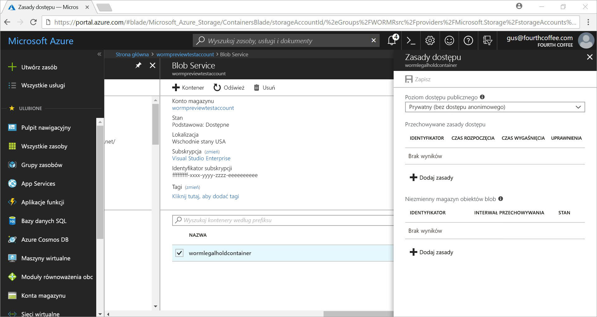
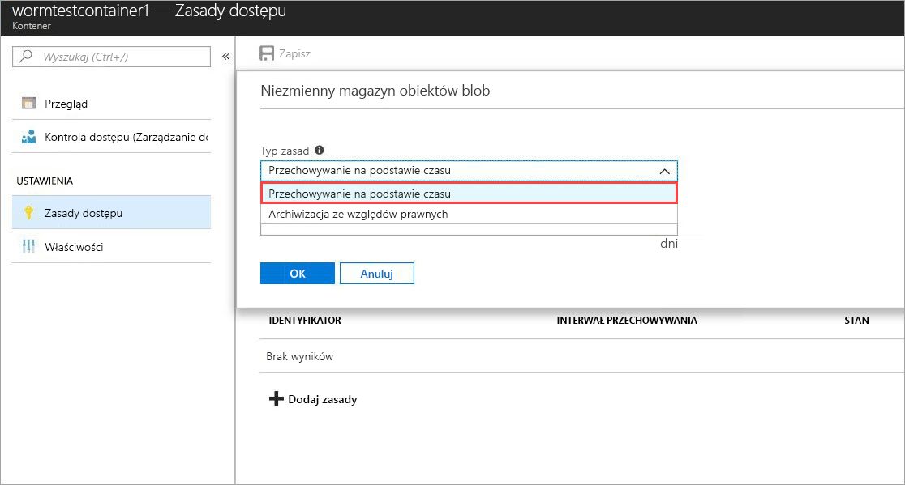
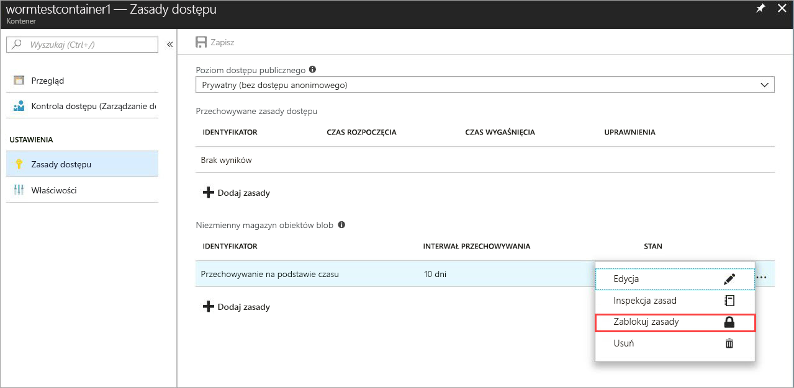
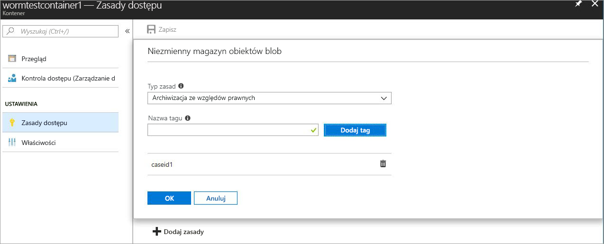

# <a name="store-business-critical-data-in-azure-blob-storage-immutably"></a>Przechowywanie danych o kluczowym znaczeniu dla firmy w usłudze Azure Blob Storage immutably 

Niezmienny magazyn usługi Azure Blob Storage umożliwia użytkownikom przechowywanie obiektów danych o kluczowym znaczeniu dla firmy w ROBAKu (zapis jeden raz, odczyt wielu). Ten stan sprawia, że dane nie są wymazywane i nie są modyfikowane dla interwału określonego przez użytkownika. Obiekty blob można tworzyć i odczytywać, ale nie modyfikować ani usuwać, na czas trwania interwału przechowywania. Niezmienny magazyn jest włączony dla kont Ogólnego przeznaczenia v2 i Blob Storage we wszystkich regionach świadczenia usługi Azure.

## <a name="overview"></a>Przegląd

Niezmienny magazyn ułatwia organizacjom opieki zdrowotnej, instytucjom finansowym i pokrewnym branżom, a w szczególności organizację dealerów — w celu bezpiecznego przechowywania danych. Można go również wykorzystać w każdym scenariuszu, aby chronić krytyczne dane przed modyfikacją lub usunięciem. 

Typowe zastosowania tej funkcji to:

- **Zgodność z przepisami**: Niezmienny magazyn usługi Azure Blob Storage ułatwia organizacjom adresowanie w sek. 4 (f), CFTC 1.31 (d), FINRA i innych. Oficjalny dokument techniczny według Cohasset kojarzy szczegóły dotyczące tego, w jaki sposób magazyny te wymagania prawne są pobierane za pośrednictwem [portalu zaufania usługi firmy Microsoft](https://aka.ms/AzureWormStorage). [Centrum zaufania Azure](https://www.microsoft.com/trustcenter/compliance/compliance-overview) zawiera szczegółowe informacje dotyczące naszych certyfikatów zgodności.

- **Przechowywanie bezpiecznego dokumentu**: Niezmienny magazyn usługi Azure Blob Storage gwarantuje, że dane nie mogą być modyfikowane ani usuwane przez żadnego użytkownika, w tym użytkowników z uprawnieniami administracyjnymi konta.

- **Blokada prawna**: Niezmienny magazyn usługi Azure Blob Storage umożliwia użytkownikom przechowywanie poufnych informacji, które są istotne dla celów sądowych lub użycia w firmie w stanie niewłaściwego potwierdzenia przez czas niezbędny do usunięcia blokady. Ta funkcja nie jest ograniczona tylko do przypadków użycia prawnego, ale można również traktować ją jako blokadę opartą na zdarzeniach lub blokadę przedsiębiorstwa, w której wymagane jest ochronę danych na podstawie wyzwalaczy zdarzeń lub zasad firmowych.

Niezmienny magazyn obsługuje następujące elementy:

- **[Obsługa zasad przechowywania opartych na czasie](#time-based-retention)** : Użytkownicy mogą ustawiać zasady w celu przechowywania danych przez określony interwał. W przypadku ustawienia zasad przechowywania opartych na czasie obiekty blob można tworzyć i odczytywać, ale nie modyfikować ani usuwać. Po upływie okresu przechowywania obiekty blob mogą być usuwane, ale nie są zastępowane.

- **[Wsparcie prawne dotyczące zasad](#legal-holds)** : Jeśli Interwał przechowywania nie jest znany, użytkownicy mogą ustawić blokady prawne do przechowywania danych immutably do momentu wyczyszczenia blokady prawnej.  W przypadku ustawienia zasad wstrzymania, obiekty blob można tworzyć i odczytywać, ale nie modyfikować ani usuwać. Każde wstrzymanie prawne jest skojarzone ze zdefiniowanym przez użytkownika tagiem alfanumerycznym (np. IDENTYFIKATORem przypadku, nazwą zdarzenia itp.), który jest używany jako ciąg identyfikatora. 

- **Obsługa wszystkich warstw obiektów BLOB**: Zasady ROBAKów są niezależne od warstwy magazynu obiektów blob platformy Azure i są stosowane do wszystkich warstw: gorąca, chłodna i archiwalna. Użytkownicy mogą przenosić dane do najbardziej zoptymalizowanej warstwy dla swoich obciążeń przy zachowaniu niezmienności danych.

- **Konfiguracja na poziomie kontenera**: Użytkownicy mogą konfigurować zasady przechowywania oparte na czasie i Tagi blokady prawne na poziomie kontenera. Korzystając z prostych ustawień na poziomie kontenera, użytkownicy mogą tworzyć i blokować zasady przechowywania oparte na czasie, zwiększać interwały przechowywania, ustawiać i czyścić blokady prawne itd. Te zasady mają zastosowanie do wszystkich obiektów BLOB w kontenerze, zarówno istniejących, jak i nowych.

- **Obsługa rejestrowania inspekcji**: Każdy kontener zawiera dziennik inspekcji zasad. Pokazuje do siedmiu poleceń przechowywania opartych na czasie dla zablokowanych zasad przechowywania opartych na czasie i zawiera identyfikator użytkownika, Typ polecenia, sygnatury czasowe i Interwał przechowywania. W przypadku blokad prawnych dziennik zawiera identyfikator użytkownika, Typ polecenia, sygnatury czasowe i urzędowe znaczniki. Ten dziennik jest zachowywany przez okres istnienia zasad, zgodnie z wytycznymi dotyczącymi przepisów w zakresie s 17a-4 (f). [Dziennik aktywności platformy Azure](../../azure-monitor/platform/activity-logs-overview.md) zawiera bardziej obszerny dziennik wszystkich działań płaszczyzny kontroli; podczas włączania [dzienników diagnostycznych platformy Azure](../../azure-monitor/platform/resource-logs-overview.md) są zachowywane i wyświetlane operacje płaszczyzny danych. Użytkownik jest odpowiedzialny za trwałe przechowywanie dzienników, co może być wymagane do celów prawnych lub w innych celach.

## <a name="how-it-works"></a>Jak to działa

Niezmienny magazyn usługi Azure Blob Storage obsługuje dwa typy ROBAKów lub niemodyfikowalnych zasad: przechowywanie na podstawie czasu i informacje prawne. Gdy zasady przechowywania oparte na czasie lub wstrzymanie prawne są stosowane w kontenerze, wszystkie istniejące obiekty blob są przenoszone do niezmiennego stanu ROBAKa w mniej niż 30 sekund. Wszystkie nowe obiekty blob przekazane do tego kontenera również będą przenoszone do niezmiennego stanu. Gdy wszystkie obiekty blob zostały przeniesione do niezmiennego stanu, niezmienne zasady zostaną potwierdzone i wszystkie operacje zastępowania lub usuwania istniejących i nowych obiektów w niezmiennym kontenerze są niedozwolone.

Usuwanie kontenerów i kont nie jest również dozwolone, jeśli istnieją obiekty blob chronione przez niezmienne zasady. Operacja usuwania kontenera zakończy się niepowodzeniem, jeśli istnieje co najmniej jeden obiekt BLOB z zablokowanymi zasadami przechowywania opartymi na czasie lub blokadą prawną. Usunięcie konta magazynu nie powiedzie się, jeśli zawiera ono co najmniej jeden kontener z zasadami WORM i ustawionym stanem archiwizacji ze względów prawnych lub co najmniej jeden obiekt blob z aktywnym okresem przechowywania. 

### <a name="time-based-retention"></a>Przechowywanie na podstawie czasu

> [!IMPORTANT]
> Zasady przechowywania oparte na czasie muszą być *zablokowane* , aby obiekt BLOB był zgodny z niezmiennym (zapisem i usuwanie chronione) dla sek. 4 (f) i innych zgodności z przepisami. Zalecamy zablokowanie zasad w rozsądnym czasie, zwykle krótszym niż 24 godziny. Początkowy stan zastosowanych zasad przechowywania oparty na czasie jest *odblokowany*, co pozwala na testowanie funkcji i wprowadzanie zmian zasad przed ich zablokowaniem. Gdy *odblokowany* stan zapewnia ochronę niezmienności, nie zalecamy używania *niezablokowanego* stanu do celów innych niż krótkoterminowe wersje próbne funkcji. 

Gdy zasady przechowywania oparte na czasie są stosowane w kontenerze, wszystkie obiekty blob w kontenerze pozostaną w niezmiennym stanie przez okres *obowiązywania obowiązującego* okresu przechowywania. Obowiązujący okres przechowywania w przypadku istniejących obiektów blob to różnica między czasem utworzenia obiektu blob a określonym przez użytkownika okresem przechowywania.

W przypadku nowych obiektów blob obowiązujący okres przechowywania jest równy okresowi przechowywania określonemu przez użytkownika. Ponieważ użytkownicy mogą zwiększyć Interwał przechowywania, niezmienny magazyn używa najnowszej wartości interwału przechowywania określonego przez użytkownika, aby obliczyć obowiązujący okres przechowywania.

> [!TIP]
> **Przykład:** Użytkownik tworzy zasady przechowywania oparte na czasie z interwałem przechowywania równym pięciu lat.
>
> Istniejący obiekt BLOB w tym kontenerze, _testblob1_, został utworzony jeden rok temu. Obowiązujący okres przechowywania dla _testblob1_ to cztery lata.
>
> Nowy obiekt BLOB _testblob2_jest teraz przekazywany do kontenera. Obowiązujący okres przechowywania dla nowego obiektu BLOB wynosi pięć lat.

Odblokowanie zasad przechowywania opartych na czasie jest zalecane tylko w przypadku testowania funkcji, a zasady muszą być zablokowane, aby były zgodne z godziną 4. (f) i innymi zgodnościami z przepisami. Gdy zasady przechowywania oparte na czasie są zablokowane, nie można usunąć zasad, a maksymalna liczba 5 zwiększa się do obowiązującego okresu przechowywania. Więcej informacji na temat sposobu ustawiania i blokowania zasad przechowywania opartych na czasie znajduje się w sekcji [wprowadzenie](#getting-started) .

### <a name="legal-holds"></a>Archiwizacja ze względów prawnych

Po ustawieniu blokady z przyczyn prawnych wszystkie istniejące i nowe obiekty blob pozostają w stanie niezmiennym do momentu wyczyszczenia blokady z przyczyn prawnych. Aby uzyskać więcej informacji na temat sposobu ustawiania i czyszczenia blokad prawnych, zobacz sekcję [wprowadzenie](#getting-started) .

Kontener może jednocześnie mieć zarówno dozwoloną blokadę, jak i zasady przechowywania oparte na czasie. Wszystkie obiekty blob w tym kontenerze pozostają w stanie niezmiennym, dopóki nie zostaną wyczyszczone wszystkie prawne, nawet jeśli ich obowiązujący okres przechowywania wygasł. Z kolei obiekt BLOB pozostaje w niezmiennym stanie do momentu wygaśnięcia obowiązujących okresów przechowywania, mimo że wszystkie blokady prawne zostały wyczyszczone.

W poniższej tabeli przedstawiono typy operacji obiektów blob, które są wyłączone dla różnych niezmiennych scenariuszy. Aby uzyskać więcej informacji, zobacz dokumentację [interfejsu API usługi Azure Blob Service](https://docs.microsoft.com/rest/api/storageservices/blob-service-rest-api) .

|Scenariusz  |Stan obiektu BLOB  |Operacje obiektu BLOB są niedozwolone  |
|---------|---------|---------|
|Trwa obowiązujący okres przechowywania obiektu blob i/lub ustawiono stan archiwizacji ze względów prawnych     |Niezmienny: ochrona przed usuwaniem i zapisem         | Put obiekt BLOB<sup>1</sup>, Put blok<sup>1</sup>, Put Block list<sup>1</sup>, DELETE Container, DELETE BLOB, Set Metadata BLOB, Put Page, Set BLOB Properties, Snapshot BLOB         |
|Upłynął obowiązujący okres przechowywania obiektu blob     |Ochrona tylko przed zapisem (operacje usuwania są dozwolone)         |Put obiekt BLOB<sup>1</sup>, Put blok<sup>1</sup>, Put Block list<sup>1</sup>, Set Metadata BLOB, Put Page, Set BLOB Properties, Snapshot BLOB, obiekt BLOB Copy, Append Block         |
|Wszystkie informacje prawne zostały wyczyszczone, a w kontenerze nie ustawiono zasad przechowywania opartych na czasie     |Modyfikowalny         |Brak         |
|Nie utworzono żadnych zasad ROBAKów (przechowywanie oparte na czasie lub wstrzymanie z przyczyn prawnych)     |Modyfikowalny         |Brak         |

<sup>1</sup> aplikacja umożliwia wykonywanie tych operacji w celu utworzenia nowego obiektu BLOB raz. Wszystkie kolejne operacje zastępowania w istniejącej ścieżce obiektu BLOB w niezmiennym kontenerze są niedozwolone.

## <a name="supported-values"></a>Obsługiwane wartości

### <a name="time-based-retention"></a>Przechowywanie na podstawie czasu
- W przypadku konta magazynu Maksymalna liczba kontenerów z niezmiennymi zasadami opartymi na czasie wynosi 1 000.
- Minimalny interwał przechowywania to 1 dzień. Wartość maksymalna to 146 000 dni (400 lat).
- W przypadku kontenera Maksymalna liczba zmian w celu zwiększenia interwału przechowywania dla zabudowanych, opartych na czasie limitów zasad wynosi 5.
- W przypadku kontenera do zablokowanych zasad są zachowywane maksymalnie 7 dzienników inspekcji zasad przechowywania opartych na czasie.

### <a name="legal-hold"></a>Archiwizacja ze względów prawnych
- W przypadku konta magazynu Maksymalna liczba kontenerów z ustawieniem wstrzymania prawnego to 1 000.
- W przypadku kontenera Maksymalna liczba dozwolonych tagów w blokadzie wynosi 10.
- Minimalna długość urzędowego tagu blokady to 3 znaki alfanumeryczne. Maksymalna długość to 23 znaków alfanumerycznych.
- W przypadku kontenera Maksymalna liczba dzienników inspekcji zasad dozwolonych w ramach systemu 10 jest zachowywana na czas trwania zasad.

## <a name="pricing"></a>Cennik

Za korzystanie z tej funkcji nie są naliczane dodatkowe opłaty. Zmienne dane są wyceniane w taki sam sposób jak regularne, modyfikowalne dane. Szczegóły cennika dotyczące usługi Azure Blob Storage można znaleźć na [stronie cennika usługi Azure Storage](https://azure.microsoft.com/pricing/details/storage/blobs/).

## <a name="getting-started"></a>Wprowadzenie
Niezmienny magazyn jest dostępny tylko dla kont Ogólnego przeznaczenia v2 i Blob Storage. Te konta muszą być zarządzane za [Azure Resource Manager](https://docs.microsoft.com/azure/azure-resource-manager/resource-group-overview). Aby uzyskać informacje dotyczące uaktualniania istniejącego konta magazynu Ogólnego przeznaczenia V1, zobacz [uaktualnianie konta magazynu](../common/storage-account-upgrade.md).

Najnowsze wersje [Azure Portal](https://portal.azure.com), [interfejsu wiersza polecenia platformy Azure](https://docs.microsoft.com/cli/azure/install-azure-cli?view=azure-cli-latest)i [Azure PowerShell](https://github.com/Azure/azure-powershell/releases) obsługują niezmienny magazyn dla magazynu obiektów blob platformy Azure. Dostępna jest również [Obsługa biblioteki klienta](#client-libraries) .

### <a name="azure-portal"></a>Azure Portal

1. Utwórz nowy kontener lub wybierz istniejący kontener, w którym będą przechowywane obiekty blob wymagające przechowywania w stanie niezmiennym.
 Kontener musi znajdować się na koncie GPv2 lub BLOB Storage.
2. Wybierz pozycję **zasady dostępu** w ustawieniach kontenera. Następnie wybierz pozycję **+ Dodaj zasady** w obszarze **niemodyfikowalny magazyn obiektów BLOB**.

    

3. Aby włączyć przechowywanie na podstawie czasu, wybierz pozycję **przechowywanie na podstawie czasu** z menu rozwijanego.

    

4. Wprowadź interwał przechowywania (w dniach) (dopuszczalne wartości od 1 do 146000 dni).

    

    Początkowy stan zasad jest odblokowany, co pozwala na testowanie funkcji i wprowadzanie zmian zasad przed ich zablokowaniem. Zablokowanie zasad jest niezbędne do zgodności z przepisami, takimi jak sekundy 17a-4.

5. Zablokuj zasady. Kliknij prawym przyciskiem myszy wielokropek ( **...** ), a następnie wyświetli się następujące menu z dodatkowymi akcjami:

    

6. Wybierz pozycję **zasady blokowania** i Potwierdź blokadę. Zasady są teraz zablokowane i nie można ich usunąć. dozwolone są tylko rozszerzenia interwału przechowywania. Operacje usuwania i zastąpienia obiektów BLOB są niedozwolone. 

    

7. Aby włączyć blokady prawne, wybierz pozycję **+ Dodaj zasady**. Wybierz pozycję **Blokada** z menu rozwijanego.

    

8. Utwórz blokadę prawną z co najmniej jednym tagiem.

    

9. Aby wyczyścić blokadę prawną, po prostu usuń zastosowany tag identyfikatora blokady dozwolonej.

### <a name="azure-cli"></a>Interfejs wiersza polecenia platformy Azure

Ta funkcja jest uwzględniona w następujących grupach poleceń: `az storage container immutability-policy` i `az storage container legal-hold`. Uruchom `-h` na nich, aby zobaczyć polecenia.

### <a name="powershell"></a>PowerShell

Moduł AZ. Storage obsługuje niezmienny magazyn.  Aby włączyć tę funkcję, wykonaj następujące kroki:

1. Upewnij się, że masz zainstalowaną najnowszą wersję programu `Install-Module PowerShellGet –Repository PSGallery –Force`PowerShellGet:.
2. Usuń poprzednią instalację Azure PowerShell.
3. Zainstaluj Azure PowerShell: `Install-Module Az –Repository PSGallery –AllowClobber`.

[Przykładowa sekcja kodu programu PowerShell](#sample-powershell-code) w dalszej części tego artykułu ilustruje użycie funkcji.

## <a name="client-libraries"></a>Biblioteki klienckie

Następujące biblioteki klienta obsługują niezmienny magazyn dla magazynu obiektów blob platformy Azure:

- [Biblioteka klienta .NET w wersji 7.2.0 — wersja zapoznawcza lub nowsza](https://www.nuget.org/packages/Microsoft.Azure.Management.Storage/7.2.0-preview)
- [Biblioteka klienta Node. js w wersji 4.0.0 lub nowszej](https://www.npmjs.com/package/azure-arm-storage)
- [Biblioteka klienta języka Python w wersji 2.0.0 Release Candidate 2 lub nowszej](https://pypi.org/project/azure-mgmt-storage/2.0.0rc2/)
- [Biblioteka klienta Java](https://github.com/Azure/azure-rest-api-specs/tree/master/specification/storage/resource-manager/Microsoft.Storage/preview/2018-03-01-preview)

## <a name="faq"></a>Często zadawane pytania

**Czy można udostępnić dokumentację zgodności z ROBAKiem?**

Tak. Aby udokumentować zgodność, firma Microsoft zachowała wiodące niezależne przedsiębiorstwo oceniające, które jest wyspecjalizowane w usłudze Reports Management and Information ładu, Cohasset Associates, aby ocenić niezmienne Blob Storage i zgodność z wymaganiami określonymi przez do branży usług finansowych. Cohasset sprawdzona, że platforma Azure jest niezmienna Blob Storage, gdy jest używana do zachowywania obiektów BLOB opartych na czasie w stanie ROBAKa, spełnia odpowiednie wymagania dotyczące magazynu CFTC Rule 1.31 (d)-(t), FINRA Rule 4511 i s reguła 17a-4. Ten zestaw reguł jest przeznaczony dla firmy Microsoft, ponieważ reprezentuje on najbardziej szczegółowe wytyczne globalne dla rekordów przechowywanych przez instytucje finansowe. Raport Cohasset jest dostępny w [Centrum zaufania usługi firmy Microsoft](https://aka.ms/AzureWormStorage). Aby zażądać list zaświadczania od firmy Microsoft dotyczących zgodności ROBAKa, skontaktuj się z pomocą techniczną platformy Azure.

**Czy funkcja ma zastosowanie tylko do blokowych obiektów blob, czy też do stron i dołączania obiektów BLOB?**

Niezmienny magazyn może być używany z dowolnym typem obiektu BLOB ustawionym na poziomie kontenera, ale zalecamy używanie ROBAKa dla kontenerów, które głównie przechowują blokowe obiekty blob. W przeciwieństwie do blokowych obiektów blob, wszelkie nowe, stronicowe obiekty blob i dołączanie obiektów BLOB muszą być tworzone poza kontenerem ROBAKa, a następnie kopiowane w. Po skopiowaniu tych obiektów BLOB do kontenera WORM nie są dozwolone żadne dalsze dołączenie do dołączanego obiektu BLOB lub zmiany w obiekcie blob strony. W związku z tym, ustawienie zasad ROBAKa w kontenerze, w którym są przechowywane wirtualne dyski twarde (stronicowe obiekty blob) dla dowolnego aktywnego Virtual Machines jest zdecydowanie odradzane, ponieważ spowoduje to zablokowanie dysku maszyny wirtualnej.

**Czy muszę utworzyć nowe konto magazynu, aby użyć tej funkcji?**

Nie, możesz użyć niezmiennego magazynu z istniejącymi lub nowo utworzonymi kontami Ogólnego przeznaczenia w wersji 2 lub BLOB Storage. Ta funkcja jest przeznaczona do użycia w przypadku blokowych obiektów BLOB na kontach GPv2 i Blob Storage. Konta magazynu Ogólnego przeznaczenia w wersji 1 nie są obsługiwane, ale można je łatwo uaktualnić do wersji Ogólnego przeznaczenia v2. Aby uzyskać informacje dotyczące uaktualniania istniejącego konta magazynu Ogólnego przeznaczenia V1, zobacz [uaktualnianie konta magazynu](../common/storage-account-upgrade.md).

**Czy mogę zastosować zasady przechowywania zarówno z przyczyn prawnych, jak i czasu?**

Tak. kontener może jednocześnie mieć zarówno dozwoloną blokadę, jak i zasady przechowywania oparte na czasie. Wszystkie obiekty blob w tym kontenerze pozostają w stanie niezmiennym, dopóki nie zostaną wyczyszczone wszystkie prawne, nawet jeśli ich obowiązujący okres przechowywania wygasł. Z kolei obiekt BLOB pozostaje w niezmiennym stanie do momentu wygaśnięcia obowiązujących okresów przechowywania, mimo że wszystkie blokady prawne zostały wyczyszczone.

**Czy zasady są dozwolone tylko w przypadku postępowania sądowego lub czy istnieją inne scenariusze użycia?**

Nie, wstrzymanie prawne jest tylko ogólnym terminem używanym w odniesieniu do zasad przechowywania opartych na czasie. Nie musi być używany tylko w przypadku postępowań związanych z postępowaniem sądowym. Zasady wstrzymania prawnego są przydatne do wyłączania zastąpień i usunięć do ochrony ważnych danych ROBAKa przedsiębiorstwa, gdzie okres przechowywania jest nieznany. Możesz użyć go jako zasad przedsiębiorstwa do ochrony krytycznych obciążeń ROBAKów lub użyć go jako zasad przejściowych przed zastosowaniem przez wyzwalacz zdarzenia niestandardowego zasad przechowywania opartych na czasie. 

**Czy mogę usunąć _zablokowane_ zasady przechowywania oparte na czasie lub wstrzymać z przyczyn prawnych?**

Z kontenera można usuwać tylko nieodblokowane zasady przechowywania oparte na czasie. Gdy zasady przechowywania oparte na czasie są zablokowane, nie można ich usunąć. dozwolone są tylko rozszerzenia okresu przechowywania. Można usunąć Tagi blokady dozwolone. Gdy wszystkie Tagi prawne zostaną usunięte, wstrzymanie prawne zostanie usunięte.

**Co się stanie, jeśli spróbuję usunąć kontener z *zablokowanymi* zasadami przechowywania na podstawie czasu lub z ustawionym stanem archiwizacji ze względów prawnych?**

Operacja usuwania kontenera zakończy się niepowodzeniem, jeśli istnieje co najmniej jeden obiekt BLOB z zablokowanymi zasadami przechowywania opartymi na czasie lub blokadą prawną. Operacja usuwania kontenera powiedzie się tylko wtedy, gdy istnieje żaden obiekt BLOB z aktywnym interwałem przechowywania i nie ma żadnych blokad prawnych. Przed usunięciem kontenera należy usunąć obiekty blob.

**Co się stanie, jeśli spróbuję usunąć konto magazynu zawierające kontener z zasadami WORM — *zablokowanymi* zasadami przechowywania na podstawie czasu lub ustawionym stanem archiwizacji ze względów prawnych?**

Usunięcie konta magazynu nie powiedzie się, jeśli zawiera ono co najmniej jeden kontener z zasadami WORM i ustawionym stanem archiwizacji ze względów prawnych lub co najmniej jeden obiekt blob z aktywnym okresem przechowywania. Aby można było usunąć konto magazynu, należy usunąć wszystkie kontenery WORM. Aby uzyskać informacje na temat usuwania kontenera, zobacz poprzednie pytanie.

**Czy mogę przenosić dane pomiędzy warstwami magazynowania (gorącą, chłodną, zimną), gdy obiekt blob znajduje się w stanie niezmiennym?**

Tak, możesz użyć polecenia Set BLOB warstwy, aby przenieść dane między warstwami obiektów blob, zachowując dane w zgodnym niezmiennym stanie. Niezmienny magazyn jest obsługiwany w warstwach obiektów BLOB gorąca, chłodna i archiwalna.

**Co się stanie, jeśli nie uiszczę opłaty, a okres przechowywania jeszcze nie wygasł?**

W przypadku braku płatności normalne zasady przechowywania danych będą stosowane zgodnie z warunkami i postanowieniami kontraktu z firmą Microsoft.

**Czy jest oferowany okres próbny, umożliwiający przetestowanie tej funkcji?**

Tak. Po pierwszym utworzeniu zasad przechowywania na podstawie czasu jest ona w stanie *odblokowanym* . W tym stanie można wprowadzić dowolną żądaną zmianę interwału przechowywania, na przykład zwiększyć lub zmniejszyć, a nawet usunąć zasady. Po zablokowaniu zasad pozostaje ono zablokowane do momentu wygaśnięcia interwału przechowywania. Te zablokowane zasady uniemożliwiają usunięcie i modyfikację interwału przechowywania. Zdecydowanie zalecamy użycie niezablokowanego stanu tylko do celów próbnych i zablokowanie zasad w ciągu 24 godzin. Te praktyki pomagają zapewnić zgodność z SEKUNDą 17a-4 (f) i innymi przepisami.

**Czy można używać nietrwałego usuwania wraz z niezmiennymi zasadami obiektów BLOB?**

Tak. [Usuwanie nietrwałe dla magazynu obiektów blob platformy Azure](storage-blob-soft-delete.md) ma zastosowanie do wszystkich kontenerów w ramach konta magazynu, niezależnie od zasad przechowywania z przyczyn prawnych lub opartych na czasie. Zalecamy włączenie usuwania nietrwałego w celu zapewnienia dodatkowej ochrony przed zastosowaniem i potwierdzeniem jakichkolwiek niemodyfikowalnych zasad ROBAKów. 

**Gdzie jest dostępna funkcja?**

Niezmienny magazyn jest dostępny w regionach publicznych, Chiny i instytucji rządowych platformy Azure. Jeśli niezmienny magazyn nie jest dostępny w Twoim regionie, skontaktuj się z pomocą azurestoragefeedback@microsoft.comtechniczną i Wyślij wiadomość e-mail.

## <a name="sample-powershell-code"></a>Przykładowy kod programu PowerShell

[!INCLUDE [updated-for-az](../../../includes/updated-for-az.md)]

Poniższy przykładowy skrypt programu PowerShell jest przeznaczony do celów referencyjnych. Ten skrypt tworzy nowe konto magazynu i kontener. Następnie pokazano, jak ustawić i wyczyścić blokady prawne, utworzyć i zablokować zasady przechowywania oparte na czasie (znane także jako zasady niezmienności) i zwiększyć Interwał przechowywania.

Skonfiguruj i przetestuj konto usługi Azure Storage:

```powershell
$ResourceGroup = "<Enter your resource group>”
$StorageAccount = "<Enter your storage account name>"
$container = "<Enter your container name>"
$container2 = "<Enter another container name>”
$location = "<Enter the storage account location>"

# Log in to the Azure Resource Manager account
Login-AzAccount
Register-AzResourceProvider -ProviderNamespace "Microsoft.Storage"

# Create your Azure resource group
New-AzResourceGroup -Name $ResourceGroup -Location $location

# Create your Azure storage account
New-AzStorageAccount -ResourceGroupName $ResourceGroup -StorageAccountName `
    $StorageAccount -SkuName Standard_LRS -Location $location -Kind StorageV2

# Create a new container
New-AzStorageContainer -ResourceGroupName $ResourceGroup `
    -StorageAccountName $StorageAccount -Name $container

# Create Container 2 with a storage account object
$accountObject = Get-AzStorageAccount -ResourceGroupName $ResourceGroup `
    -StorageAccountName $StorageAccount
New-AzStorageContainer -StorageAccount $accountObject -Name $container2

# Get a container
Get-AzStorageContainer -ResourceGroupName $ResourceGroup `
    -StorageAccountName $StorageAccount -Name $container

# Get a container with an account object
$containerObject = Get-AzStorageContainer -StorageAccount $accountObject -Name $container

# List containers
Get-AzStorageContainer -ResourceGroupName $ResourceGroup `
    -StorageAccountName $StorageAccount

# Remove a container (add -Force to dismiss the prompt)
Remove-AzStorageContainer -ResourceGroupName $ResourceGroup `
    -StorageAccountName $StorageAccount -Name $container2

# Remove a container with an account object
Remove-AzStorageContainer -StorageAccount $accountObject -Name $container2

# Remove a container with a container object
$containerObject2 = Get-AzStorageContainer -StorageAccount $accountObject -Name $container2
Remove-AzStorageContainer -InputObject $containerObject2
```

Ustaw i wyczyść blokady prawne:

```powershell
# Set a legal hold
Add-AzRmStorageContainerLegalHold -ResourceGroupName $ResourceGroup `
    -StorageAccountName $StorageAccount -Name $container -Tag <tag1>,<tag2>,...

# with an account object
Add-AzRmStorageContainerLegalHold -StorageAccount $accountObject -Name $container -Tag <tag3>

# with a container object
Add-AzRmStorageContainerLegalHold -Container $containerObject -Tag <tag4>,<tag5>,...

# Clear a legal hold
Remove-AzRmStorageContainerLegalHold -ResourceGroupName $ResourceGroup `
    -StorageAccountName $StorageAccount -Name $container -Tag <tag2>

# with an account object
Remove-AzRmStorageContainerLegalHold -StorageAccount $accountObject -Name $container -Tag <tag3>,<tag5>

# with a container object
Remove-AzRmStorageContainerLegalHold -Container $containerObject -Tag <tag4>
```

Utwórz lub zaktualizuj zasady niezmienności:
```powershell
# with an account name or container name
Set-AzRmStorageContainerImmutabilityPolicy -ResourceGroupName $ResourceGroup `
    -StorageAccountName $StorageAccount -ContainerName $container -ImmutabilityPeriod 10

# with an account object
Set-AzRmStorageContainerImmutabilityPolicy -StorageAccount $accountObject `
    -ContainerName $container -ImmutabilityPeriod 1 -Etag $policy.Etag

# with a container object
$policy = Set-AzRmStorageContainerImmutabilityPolicy -Container `
    $containerObject -ImmutabilityPeriod 7

# with an immutability policy object
Set-AzRmStorageContainerImmutabilityPolicy -ImmutabilityPolicy $policy -ImmutabilityPeriod 5
```

Pobierz zasady niezmienności:
```powershell
# Get an immutability policy
Get-AzRmStorageContainerImmutabilityPolicy -ResourceGroupName $ResourceGroup `
    -StorageAccountName $StorageAccount -ContainerName $container

# with an account object
Get-AzRmStorageContainerImmutabilityPolicy -StorageAccount $accountObject `
    -ContainerName $container

# with a container object
Get-AzRmStorageContainerImmutabilityPolicy -Container $containerObject
```

Zablokuj zasady niezmienności (Dodaj-Wymuś, aby odrzucić monit):
```powershell
# with an immutability policy object
$policy = Get-AzRmStorageContainerImmutabilityPolicy -ResourceGroupName `
    $ResourceGroup -StorageAccountName $StorageAccount -ContainerName $container
$policy = Lock-AzRmStorageContainerImmutabilityPolicy -ImmutabilityPolicy $policy -force

# with an account name or container name
$policy = Lock-AzRmStorageContainerImmutabilityPolicy -ResourceGroupName `
    $ResourceGroup -StorageAccountName $StorageAccount -ContainerName $container `
    -Etag $policy.Etag

# with an account object
$policy = Lock-AzRmStorageContainerImmutabilityPolicy -StorageAccount `
    $accountObject -ContainerName $container -Etag $policy.Etag

# with a container object
$policy = Lock-AzRmStorageContainerImmutabilityPolicy -Container `
    $containerObject -Etag $policy.Etag -force
```

Rozwiń zasady niezmienności:
```powershell

# with an immutability policy object
$policy = Get-AzRmStorageContainerImmutabilityPolicy -ResourceGroupName `
    $ResourceGroup -StorageAccountName $StorageAccount -ContainerName $container

$policy = Set-AzRmStorageContainerImmutabilityPolicy -ImmutabilityPolicy `
    $policy -ImmutabilityPeriod 11 -ExtendPolicy

# with an account name or container name
$policy = Set-AzRmStorageContainerImmutabilityPolicy -ResourceGroupName `
    $ResourceGroup -StorageAccountName $StorageAccount -ContainerName $container `
    -ImmutabilityPeriod 11 -Etag $policy.Etag -ExtendPolicy

# with an account object
$policy = Set-AzRmStorageContainerImmutabilityPolicy -StorageAccount `
    $accountObject -ContainerName $container -ImmutabilityPeriod 12 -Etag `
    $policy.Etag -ExtendPolicy

# with a container object
$policy = Set-AzRmStorageContainerImmutabilityPolicy -Container `
    $containerObject -ImmutabilityPeriod 13 -Etag $policy.Etag -ExtendPolicy
```

Usuń odblokowane zasady niezmienności (Dodaj-Wymuś, aby odrzucić monit):
```powershell
# with an immutability policy object
$policy = Get-AzRmStorageContainerImmutabilityPolicy -ResourceGroupName `
    $ResourceGroup -StorageAccountName $StorageAccount -ContainerName $container
Remove-AzRmStorageContainerImmutabilityPolicy -ImmutabilityPolicy $policy

# with an account name or container name
Remove-AzRmStorageContainerImmutabilityPolicy -ResourceGroupName `
    $ResourceGroup -StorageAccountName $StorageAccount -ContainerName $container `
    -Etag $policy.Etag

# with an account object
Remove-AzRmStorageContainerImmutabilityPolicy -StorageAccount $accountObject `
    -ContainerName $container -Etag $policy.Etag

# with a container object
Remove-AzRmStorageContainerImmutabilityPolicy -Container $containerObject `
    -Etag $policy.Etag

```
