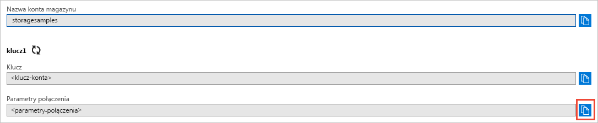

# <a name="quickstart-azure-blob-storage-client-library-v11-for-net"></a>Szybki start: biblioteka klienta magazynu obiektów Blob platformy Azure w wersji 11 dla platformy .NET

Wprowadzenie do biblioteki klienta usługi Azure Blob Storage w wersji 11 dla platformy .NET. Usługa Azure Blob Storage to rozwiązanie magazynu obiektów firmy Microsoft dla chmury. Wykonaj kroki, aby zainstalować pakiet i wypróbować przykładowy kod dla podstawowych zadań. Usługa Blob Storage jest zoptymalizowana pod kątem przechowywania olbrzymich ilości danych bez struktury.

Użyj biblioteki klienta usługi Azure Blob Storage dla platformy .NET, aby:

* Tworzenie kontenera
* Ustawianie uprawnień do kontenera
* Tworzenie obiektu blob w usłudze Azure Storage
* Pobieranie obiektu blob na komputer lokalny
* Lista wszystkich obiektów blob w kontenerze
* Usuwanie kontenera

[Dokumentacja](https://docs.microsoft.com/dotnet/api/overview/azure/storage?view=azure-dotnet) | dokumentacji interfejsu API[Przykłady pakietu kodu źródłowego](https://github.com/Azure/azure-storage-net/tree/master/Blob) | (NuGet) kod źródłowy[(Biblioteka](https://www.nuget.org/packages/Microsoft.Azure.Storage.Blob/) | [api)](https://azure.microsoft.com/resources/samples/?sort=0&service=storage&platform=dotnet&term=blob)

[!INCLUDE [storage-multi-protocol-access-preview](../../../includes/storage-multi-protocol-access-preview.md)]

## <a name="prerequisites"></a>Wymagania wstępne

* Subskrypcja platformy Azure — [utwórz bezpłatną subskrypcję](https://azure.microsoft.com/free/)
* Konto usługi Azure Storage — [tworzenie konta magazynu](https://docs.microsoft.com/azure/storage/common/storage-quickstart-create-account)
* Bieżący [sdk .NET Core](https://dotnet.microsoft.com/download/dotnet-core) dla systemu operacyjnego. Pamiętaj, aby uzyskać SDK, a nie środowisko uruchomieniowe.

## <a name="setting-up"></a>Konfigurowanie

W tej sekcji przeprowadzi Cię proces przygotowania projektu do pracy z biblioteką klienta usługi Azure Blob Storage dla platformy .NET.

### <a name="create-the-project"></a>Tworzenie projektu

Najpierw utwórz aplikację .NET Core o nazwie *blob-szybki start*.

1. W oknie konsoli (takim jak cmd, PowerShell `dotnet new` lub Bash) użyj polecenia, aby utworzyć nową aplikację konsoli o nazwie *blob-szybki start*. To polecenie tworzy prosty projekt "Hello World" C# z jednym plikiem źródłowym: *Program.cs*.

   ```console
   dotnet new console -n blob-quickstart
   ```

2. Przełącz się do nowo utworzonego folderu *przewodnika Blob-Szybki start* i skompiluj aplikację, aby sprawdzić, czy wszystko jest dobrze.

   ```console
   cd blob-quickstart
   ```

   ```console
   dotnet build
   ```

Oczekiwane dane wyjściowe z kompilacji powinny wyglądać mniej więcej tak:

```output
C:\QuickStarts\blob-quickstart> dotnet build
Microsoft (R) Build Engine version 16.0.450+ga8dc7f1d34 for .NET Core
Copyright (C) Microsoft Corporation. All rights reserved.

  Restore completed in 44.31 ms for C:\QuickStarts\blob-quickstart\blob-quickstart.csproj.
  blob-quickstart -> C:\QuickStarts\blob-quickstart\bin\Debug\netcoreapp2.1\blob-quickstart.dll

Build succeeded.
    0 Warning(s)
    0 Error(s)

Time Elapsed 00:00:03.08
```

### <a name="install-the-package"></a>Zainstaluj pakiet

Będąc jeszcze w katalogu aplikacji, zainstaluj bibliotekę klienta usługi Azure Blob Storage dla pakietu .NET za pomocą `dotnet add package` polecenia.

```console
dotnet add package Microsoft.Azure.Storage.Blob
```

### <a name="set-up-the-app-framework"></a>Konfigurowanie struktury aplikacji

Z katalogu projektu:

1. Otwieranie pliku *Program.cs* w edytorze
2. Usuwanie `Console.WriteLine` instrukcji
3. Dodawanie `using` dyrektyw
4. Utwórz `ProcessAsync` metodę, w której znajduje się główny kod dla przykładu
5. Asynchronicznie wywołać `ProcessAsync` metodę z`Main`

Oto kod:

```csharp
using System;
using System.IO;
using System.Threading.Tasks;
using Microsoft.Azure.Storage;
using Microsoft.Azure.Storage.Blob;

namespace blob_quickstart
{
    class Program
    {
        public static void Main()
        {
            Console.WriteLine("Azure Blob Storage - .NET quickstart sample\n");

            // Run the examples asynchronously, wait for the results before proceeding
            ProcessAsync().GetAwaiter().GetResult();

            Console.WriteLine("Press any key to exit the sample application.");
            Console.ReadLine();
        }

        private static async Task ProcessAsync()
        {
        }
    }
}
```

### <a name="copy-your-credentials-from-the-azure-portal"></a>Kopiowanie poświadczeń z witryny Azure Portal

Gdy przykładowa aplikacja wystosuje żądanie do usługi Azure Storage, musi być autoryzowana. Aby autoryzować żądanie, dodaj poświadczenia konta magazynu do aplikacji jako parametry połączenia. Wyświetl poświadczenia konta magazynu, wykonując następujące czynności:

1. Przejdź do [witryny Azure portal](https://portal.azure.com).
2. Odszukaj konto magazynu.
3. W sekcji **Ustawienia** omówienia kont magazynu wybierz pozycję **Klucze dostępu**. W tym miejscu możesz przeglądać klucze dostępu do konta oraz pełne parametry połączenia dla każdego klucza.
4. Znajdź wartość **Parametry połączenia** w obszarze **key1** i wybierz przycisk **Kopiuj**, aby skopiować parametry połączenia. W następnym kroku dodasz wartość parametrów połączenia do zmiennej środowiskowej.

    

### <a name="configure-your-storage-connection-string"></a>Konfigurowanie parametrów połączenia magazynu

Po skopiowaniu parametrów połączenia zapisz je w nowej zmiennej środowiskowej na komputerze, na którym uruchomiona jest aplikacja. Aby ustawić zmienną środowiskową, otwórz okno konsoli i postępuj zgodnie z instrukcjami dla systemu operacyjnego. Zamień `<yourconnectionstring>` na rzeczywisty ciąg połączenia.

#### <a name="windows"></a>Windows

```cmd
setx AZURE_STORAGE_CONNECTION_STRING "<yourconnectionstring>"
```

Po dodaniu zmiennej środowiskowej w systemie Windows należy uruchomić nowe wystąpienie okna polecenia.

#### <a name="linux"></a>Linux

```bash
export AZURE_STORAGE_CONNECTION_STRING="<yourconnectionstring>"
```

#### <a name="macos"></a>MacOS

```bash
export AZURE_STORAGE_CONNECTION_STRING="<yourconnectionstring>"
```

Po dodaniu zmiennej środowiskowej uruchom ponownie wszystkie uruchomione programy, które będą musiały odczytać zmienną środowiskową. Na przykład uruchom ponownie środowisko programistyczne lub edytor przed kontynuowaniem.

## <a name="object-model"></a>Model obiektu

Usługa Azure Blob storage jest zoptymalizowana pod kątem przechowywania ogromnych ilości nieustrukturyzowanych danych. Dane bez struktury są danymi, które nie są zgodne z żadnym modelem lub definicją danych, jak na przykład dane tekstowe lub binarne. Magazyn obiektów blob oferuje trzy typy zasobów:

* Konto magazynu
* Kontener na koncie magazynu
* Obiekt blob w kontenerze

Na poniższym diagramie przedstawiono relacje między tymi zasobami.


Użyj następujących klas platformy .NET, aby wchodzić w interakcje z tymi zasobami:

* [CloudStorageAccount:](/dotnet/api/microsoft.azure.storage.cloudstorageaccount) `CloudStorageAccount` Klasa reprezentuje twoje konto usługi Azure storage. Ta klasa służy do autoryzowania dostępu do magazynu obiektów Blob przy użyciu kluczy dostępu do konta.
* [CloudBlobClient:](/dotnet/api/microsoft.azure.storage.blob.cloudblobclient) `CloudBlobClient` Klasa zapewnia punkt dostępu do usługi obiektów Blob w kodzie.
* [CloudBlobContainer:](/dotnet/api/microsoft.azure.storage.blob.cloudblobcontainer) `CloudBlobContainer` Klasa reprezentuje kontener obiektów blob w kodzie.
* [CloudBlockBlob:](/dotnet/api/microsoft.azure.storage.blob.cloudblockblob) `CloudBlockBlob` Obiekt reprezentuje blok obiektu blob w kodzie. Blokowe obiekty blob składają się z bloków danych, którymi można zarządzać indywidualnie.

## <a name="code-examples"></a>Przykłady kodu

Te przykładowe fragmenty kodu pokazują, jak wykonać następujące czynności za pomocą biblioteki klienta magazynu obiektów Blob platformy Azure dla platformy .NET:

   * [Uwierzytelnij klienta](#authenticate-the-client)
   * [Tworzenie kontenera](#create-a-container)
   * [Ustawianie uprawnień do kontenera](#set-permissions-on-a-container)
   * [Przekazywanie obiektów blob do kontenera](#upload-blobs-to-a-container)
   * [Wyświetlanie listy obiektów blob w kontenerze](#list-the-blobs-in-a-container)
   * [Pobieranie obiektów blob](#download-blobs)
   * [Usuwanie kontenera](#delete-a-container)

### <a name="authenticate-the-client"></a>Uwierzytelnij klienta

Poniższy kod sprawdza, czy zmienna środowiskowa zawiera parametry połączenia, które mogą być analizowane w celu utworzenia [Obiektu CloudStorageAccount](/dotnet/api/microsoft.azure.storage.cloudstorageaccount?view=azure-dotnet) wskazującego konto magazynu. Aby sprawdzić, czy parametry połączenia są prawidłowe, należy użyć metody [TryParse](/dotnet/api/microsoft.azure.storage.cloudstorageaccount.tryparse?view=azure-dotnet). Jeśli `TryParse` się powiedzie, inicjuje zmienną `storageAccount` i zwraca `true`.

Dodaj ten kod `ProcessAsync` wewnątrz metody:

```csharp
// Retrieve the connection string for use with the application. The storage 
// connection string is stored in an environment variable on the machine 
// running the application called AZURE_STORAGE_CONNECTION_STRING. If the 
// environment variable is created after the application is launched in a 
// console or with Visual Studio, the shell or application needs to be closed
// and reloaded to take the environment variable into account.
string storageConnectionString = Environment.GetEnvironmentVariable("AZURE_STORAGE_CONNECTION_STRING");

// Check whether the connection string can be parsed.
CloudStorageAccount storageAccount;
if (CloudStorageAccount.TryParse(storageConnectionString, out storageAccount))
{
    // If the connection string is valid, proceed with operations against Blob
    // storage here.
    // ADD OTHER OPERATIONS HERE
}
else
{
    // Otherwise, let the user know that they need to define the environment variable.
    Console.WriteLine(
        "A connection string has not been defined in the system environment variables. " +
        "Add an environment variable named 'AZURE_STORAGE_CONNECTION_STRING' with your storage " +
        "connection string as a value.");
    Console.WriteLine("Press any key to exit the application.");
    Console.ReadLine();
}
```

> [!NOTE]
> Aby wykonać pozostałe operacje w tym `// ADD OTHER OPERATIONS HERE` artykule, zastąp w powyższym kodzie fragmentami kodu w poniższych sekcjach.

### <a name="create-a-container"></a>Tworzenie kontenera

Aby utworzyć kontener, najpierw utwórz wystąpienie obiektu [CloudBlobClient](/dotnet/api/microsoft.azure.storage.blob.cloudblobclient), które wskazuje na magazynu obiektów blob na koncie magazynu. Następnie utwórz wystąpienie obiektu [CloudBlobContainer](/dotnet/api/microsoft.azure.storage.blob.cloudblobcontainer) i utwórz kontener.

W takim przypadku kod wywołuje [CreateAsync](/dotnet/api/microsoft.azure.storage.blob.cloudblobcontainer.createasync) metody, aby utworzyć kontener. Wartość identyfikatora GUID jest dołączana do nazwy kontenera w celu zapewnienia, że jest ona unikatowa. W środowisku produkcyjnym często zaleca się użycie metody [CreateIfNotExistsAsync](/dotnet/api/microsoft.azure.storage.blob.cloudblobcontainer.createifnotexistsasync) do utworzenia kontenera tylko wtedy, gdy jeszcze nie istnieje.

> [!IMPORTANT]
> Nazwy kontenerów muszą być zapisane małymi literami. Aby uzyskać więcej informacji o nazewnictwie kontenerów i obiektów blob, zobacz temat [Nazewnictwo i odwoływanie się do kontenerów, obiektów blob i metadanych](https://docs.microsoft.com/rest/api/storageservices/naming-and-referencing-containers--blobs--and-metadata).

```csharp
// Create the CloudBlobClient that represents the 
// Blob storage endpoint for the storage account.
CloudBlobClient cloudBlobClient = storageAccount.CreateCloudBlobClient();

// Create a container called 'quickstartblobs' and 
// append a GUID value to it to make the name unique.
CloudBlobContainer cloudBlobContainer = 
    cloudBlobClient.GetContainerReference("quickstartblobs" + 
        Guid.NewGuid().ToString());
await cloudBlobContainer.CreateAsync();
```

### <a name="set-permissions-on-a-container"></a>Ustawianie uprawnień do kontenera

Ustaw uprawnienia do kontenera, tak aby wszystkie obiekty blob w kontenerze były publiczne. Jeśli obiekt blob jest publiczny, dowolny klient może uzyskiwać do niego anonimowy dostęp.

```csharp
// Set the permissions so the blobs are public.
BlobContainerPermissions permissions = new BlobContainerPermissions
{
    PublicAccess = BlobContainerPublicAccessType.Blob
};
await cloudBlobContainer.SetPermissionsAsync(permissions);
```

### <a name="upload-blobs-to-a-container"></a>Przekazywanie obiektów blob do kontenera

Poniższy fragment kodu pobiera odwołanie do `CloudBlockBlob` obiektu, wywołując [GetBlockBlobReference](/dotnet/api/microsoft.azure.storage.blob.cloudblobcontainer.getblockblobreference) metody w kontenerze utworzonym w poprzedniej sekcji. Następnie przekazuje wybrany plik lokalny do obiektu blob, wywołując [metodę UploadFromFileAsync.](/dotnet/api/microsoft.azure.storage.blob.cloudblockblob.uploadfromfileasync) Jeśli obiekt blob nie istnieje, zostanie utworzony przez metodę. W przeciwnym razie zostanie zastąpiony.

```csharp
// Create a file in your local MyDocuments folder to upload to a blob.
string localPath = Environment.GetFolderPath(Environment.SpecialFolder.MyDocuments);
string localFileName = "QuickStart_" + Guid.NewGuid().ToString() + ".txt";
string sourceFile = Path.Combine(localPath, localFileName);
// Write text to the file.
File.WriteAllText(sourceFile, "Hello, World!");

Console.WriteLine("Temp file = {0}", sourceFile);
Console.WriteLine("Uploading to Blob storage as blob '{0}'", localFileName);

// Get a reference to the blob address, then upload the file to the blob.
// Use the value of localFileName for the blob name.
CloudBlockBlob cloudBlockBlob = cloudBlobContainer.GetBlockBlobReference(localFileName);
await cloudBlockBlob.UploadFromFileAsync(sourceFile);
```

### <a name="list-the-blobs-in-a-container"></a>Wyświetlanie listy obiektów blob w kontenerze

Lista obiektów blob w kontenerze przy użyciu [ListBlobsSegmentedAsync](/dotnet/api/microsoft.azure.storage.blob.cloudblobcontainer.listblobssegmentedasync) metody. W takim przypadku tylko jeden obiekt blob został dodany do kontenera, więc operacja listy zwraca tylko ten jeden obiekt blob.

Jeśli istnieje zbyt wiele obiektów blob do zwrócenia w jednym wywołaniu (domyślnie więcej niż 5000), a następnie `ListBlobsSegmentedAsync` metoda zwraca segment zestawu wyników całkowitej i token kontynuacji. Aby pobrać następny segment obiektów blob, udostępnij token kontynuacji zwrócony przez poprzednie wywołanie i tak dalej, aż token kontynuacji będzie mieć wartość null. Token kontynuacji o wartości null wskazuje, że wszystkie obiekty blob zostały pobrane. Kod pokazuje, jak używać tokenu kontynuacji ze względu na najlepsze rozwiązania.

```csharp
// List the blobs in the container.
Console.WriteLine("List blobs in container.");
BlobContinuationToken blobContinuationToken = null;
do
{
    var results = await cloudBlobContainer.ListBlobsSegmentedAsync(null, blobContinuationToken);
    // Get the value of the continuation token returned by the listing call.
    blobContinuationToken = results.ContinuationToken;
    foreach (IListBlobItem item in results.Results)
    {
        Console.WriteLine(item.Uri);
    }
} while (blobContinuationToken != null); // Loop while the continuation token is not null.

```

### <a name="download-blobs"></a>Pobieranie obiektów blob

Pobierz obiekt blob utworzony wcześniej do lokalnego systemu plików przy użyciu [metody DownloadToFileAsync.](/dotnet/api/microsoft.azure.storage.blob.cloudblob.downloadtofileasync) Przykładowy kod dodaje sufiks "_DOWNLOADED" do nazwy obiektu blob, dzięki czemu można zobaczyć oba pliki w lokalnym systemie plików.

```csharp
// Download the blob to a local file, using the reference created earlier.
// Append the string "_DOWNLOADED" before the .txt extension so that you 
// can see both files in MyDocuments.
string destinationFile = sourceFile.Replace(".txt", "_DOWNLOADED.txt");
Console.WriteLine("Downloading blob to {0}", destinationFile);
await cloudBlockBlob.DownloadToFileAsync(destinationFile, FileMode.Create);
```

### <a name="delete-a-container"></a>Usuwanie kontenera

Poniższy kod czyści zasoby utworzone przez aplikację, usuwając cały kontener za pomocą [CloudBlobContainer.DeleteAsync](/dotnet/api/microsoft.azure.storage.blob.cloudblobcontainer.deleteasync). Jeśli chcesz, możesz także usunąć pliki lokalne.

```csharp
Console.WriteLine("Press the 'Enter' key to delete the example files, " +
    "example container, and exit the application.");
Console.ReadLine();
// Clean up resources. This includes the container and the two temp files.
Console.WriteLine("Deleting the container");
if (cloudBlobContainer != null)
{
    await cloudBlobContainer.DeleteIfExistsAsync();
}
Console.WriteLine("Deleting the source, and downloaded files");
File.Delete(sourceFile);
File.Delete(destinationFile);
```

## <a name="run-the-code"></a>Uruchamianie kodu

Ta aplikacja tworzy plik testowy w lokalnym folderze *MyDocuments* i przekazuje go do magazynu obiektów Blob. W przykładzie następnie wyświetla listę obiektów blob w kontenerze i pobiera plik o nowej nazwie, dzięki czemu można porównać stare i nowe pliki.

Przejdź do katalogu aplikacji, a następnie skompiluj i uruchom aplikację.

```console
dotnet build
```

```console
dotnet run
```

Dane wyjściowe aplikacji są podobne do następującego przykładu:

```output
Azure Blob storage - .NET Quickstart example

Created container 'quickstartblobs33c90d2a-eabd-4236-958b-5cc5949e731f'

Temp file = C:\Users\myusername\Documents\QuickStart_c5e7f24f-a7f8-4926-a9da-96
97c748f4db.txt
Uploading to Blob storage as blob 'QuickStart_c5e7f24f-a7f8-4926-a9da-9697c748f
4db.txt'

Listing blobs in container.
https://storagesamples.blob.core.windows.net/quickstartblobs33c90d2a-eabd-4236-
958b-5cc5949e731f/QuickStart_c5e7f24f-a7f8-4926-a9da-9697c748f4db.txt

Downloading blob to C:\Users\myusername\Documents\QuickStart_c5e7f24f-a7f8-4926
-a9da-9697c748f4db_DOWNLOADED.txt

Press any key to delete the example files and example container.
```

Po naciśnięciu klawisza **Enter** aplikacja usunie kontener magazynu i pliki. Przed ich usunięciem sprawdź, czy folder *Moje dokumenty* zawiera dwa pliki. Możesz je otworzyć i sprawdzić, czy są identyczne. Skopiuj adres URL obiektu blob z okna konsoli i wklej go do przeglądarki, aby wyświetlić zawartość obiektu blob.

Po zweryfikowaniu plików naciśnij dowolny klawisz, aby zakończyć demonstrację i usunąć pliki testowe.

## <a name="next-steps"></a>Następne kroki

W tym przewodniku Szybki start opisano następujące czynności: przekazywanie, pobieranie i wyświetlanie listy obiektów blob przy użyciu platformy .NET.

Aby dowiedzieć się, jak utworzyć aplikację sieci Web, która przekazuje obraz do magazynu obiektów Blob, przejdź do:

> [!div class="nextstepaction"]
> [Przekazywanie i przetwarzanie obrazu](storage-upload-process-images.md)

* Aby dowiedzieć się więcej na temat platformy .NET Core, zobacz [Get started with .NET in 10 minutes (Rozpoczynanie pracy z platformą .NET w 10 minut)](https://www.microsoft.com/net/learn/get-started/).
* Aby zapoznać się z przykładową aplikacją, którą można wdrożyć z programu Visual Studio dla systemu Windows, zobacz [.NET Photo Gallery Web Application Sample with Azure Blob Storage (Przykład internetowej aplikacji platformy .NET z galerią zdjęć i z usługą Azure Blob Storage)](https://azure.microsoft.com/resources/samples/storage-blobs-dotnet-webapp/).
