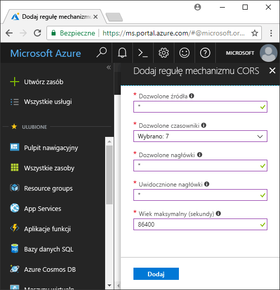

<!-- Customer intent: As a web application developer I want to interface with Azure Blob storage entirely on the client so that I can build a SPA application that is able to upload and delete files on blob storage. -->

# <a name="quickstart-upload-list-and-delete-blobs-using-azure-storage-v10-sdk-for-javascripthtml-in-the-browser"></a>Szybki start: Przekazywanie, listy i usuwanie obiektów blob za pomocą zestawu SDK usługi Azure Storage v10 JavaScript/HTML w przeglądarce

W tym przewodniku Szybki Start dowiesz się użyć [usługi Azure Storage SDK V10 dla języka JavaScript — obiekt Blob](https://github.com/Azure/azure-sdk-for-js/tree/master/sdk/storage/storage-blob#readme) biblioteki, aby zarządzać obiektami blob za pomocą kodu JavaScript, uruchamianego wyłącznie w przeglądarce. Podejście użyte w tym miejscu pokazuje, jak użyć wymaganych środków zabezpieczeń do zapewnienia chronionego dostępu do konta magazynu obiektów blob.

## <a name="prerequisites"></a>Wymagania wstępne

[!INCLUDE [storage-quickstart-prereq-include](../../../includes/storage-quickstart-prereq-include.md)]

Biblioteki klienta JavaScript usługi Azure Storage nie będzie działać bezpośrednio z systemu plików i muszą być obsługiwane przez serwer sieci web. W tym temacie używany [Node.js](https://nodejs.org) można uruchomić serwera podstawowego. Jeśli nie chcesz zainstalować węzeł, można użyć w inny sposób uruchamiania lokalnego serwera internetowego.

Aby wykonać kroki dotyczące debugowania, potrzebny będzie [programu Visual Studio Code](https://code.visualstudio.com) i [debuger dla Chrome](vscode:extension/msjsdiag.debugger-for-chrome) lub [debugera dla programu Microsoft Edge](vscode:extension/msjsdiag.debugger-for-edge) rozszerzenia.

## <a name="setting-up-storage-account-cors-rules"></a>Konfigurowanie reguł CORS konta magazynu

Zanim aplikacja sieci web dostęp do magazynu obiektów blob z klienta, należy skonfigurować konta tak, aby umożliwić [współużytkowanie zasobów między źródłami](https://docs.microsoft.com/rest/api/storageservices/cross-origin-resource-sharing--cors--support-for-the-azure-storage-services), lub mechanizmu CORS.

Wróć do witryny Azure Portal i wybierz konto magazynu. Aby zdefiniować nową regułę CORS, przejdź do **ustawienia** sekcji, a następnie kliknij polecenie **CORS** łącza. Następnie kliknij przycisk **Dodaj**, aby otworzyć okno **Dodawanie reguły CORS**. W tym przewodniku Szybki start utworzymy otwartą regułę CORS:



W poniższej tabeli przedstawiono poszczególne ustawienia mechanizmu CORS i wyjaśniono, jakie wartości zostały użyte do zdefiniowania reguły.

|Ustawienie  |Wartość  | Opis |
|---------|---------|---------|
| Dozwolone źródła | * | Dopuszczalne źródła można podać w postaci listy domen rozdzielonych przecinkami. Podanie wartości `*` umożliwia dostęp do konta magazynu ze wszystkich domen. |
| Dozwolone polecenia     | delete, get, head, merge, post, options i put | Wyświetla listę poleceń HTTP, które można wykonać na koncie magazynu. Na potrzeby tego przewodnika Szybki start wybierz wszystkie dostępne opcje. |
| Dozwolone nagłówki | * | Definiuje listę nagłówków żądań (łącznie z nagłówkami z prefiksem) dozwolonych na koncie magazynu. Ustawienie wartości `*` zezwala na dostęp za pomocą wszystkich nagłówków. |
| Uwidocznione nagłówki | * | Wyświetla listę dozwolonych nagłówków odpowiedzi według kont. Ustawienie wartości `*` zezwala kontu na wysyłanie dowolnego nagłówka.  |
| Maksymalny wiek (w sekundach) | 86400 | Maksymalny czas buforowania żądania wstępnego OPTIONS przez przeglądarkę. Podanie wartości *86400* powoduje, że buforowanie trwa całą dobę. |

> [!IMPORTANT]
> Upewnij się, że wszystkie ustawienia, którego używasz w środowisku produkcyjnym zapewniały minimalny dostęp do swojego konta magazynu, aby zapewnić bezpieczny dostęp do. Opisane w tym przewodniku Szybki start ustawienia mechanizmu CORS definiują łagodne zasady zabezpieczeń. Te ustawienia nie są jednak zalecane w rzeczywistym kontekście.

Następnie utworzymy token zabezpieczający za pomocą usługi Azure Cloud Shell.

[!INCLUDE [Open the Azure cloud shell](../../../includes/cloud-shell-try-it.md)]

## <a name="create-a-shared-access-signature"></a>Utworzenie sygnatury dostępu współdzielonego

Sygnatura dostępu współdzielonego (SAS, Shared Access Signature) jest używana przez kod uruchomiony w przeglądarce do autoryzowania żądań w usłudze Blob Storage. Sygnatura dostępu współdzielonego umożliwia klientowi autoryzację dostępu do zasobów magazynu bez użycia klucza dostępu konta ani parametrów połączenia. Zobacz [Using shared access signatures (SAS) (Używanie sygnatur dostępu współdzielonego)](../common/storage-dotnet-shared-access-signature-part-1.md), aby uzyskać więcej informacji.

Można utworzyć sygnaturę dostępu Współdzielonego przy użyciu wiersza polecenia platformy Azure za pomocą usługi Azure cloud shell lub w witrynie Azure portal lub Eksploratora usługi Azure Storage. W poniższej tabeli opisano parametry, musisz podać wartości, aby wygenerować sygnaturę dostępu Współdzielonego przy użyciu interfejsu wiersza polecenia.

| Parametr      |Opis  | Symbol zastępczy |
|----------------|-------------|-------------|
| *expiry*       | Data wygaśnięcia tokenu dostępu w formacie RRRR-MM-DD. Na potrzeby tego przewodnika Szybki start wprowadź jutrzejszą datę. | *FUTURE_DATE* |
| *account-name* | Nazwa konta magazynu. Użyj nazwy zanotowanej w poprzednim kroku. | *YOUR_STORAGE_ACCOUNT_NAME* |
| *account-key*  | Klucz konta magazynu. Użyj klucza zanotowanego w poprzednim kroku. | *YOUR_STORAGE_ACCOUNT_KEY* |

Użyj następującego polecenia interfejsu wiersza polecenia, za pomocą rzeczywistych wartości dla każdego symbolu zastępczego, aby wygenerować sygnaturę dostępu Współdzielonego, można użyć w kodzie JavaScript.

```azurecli-interactive
az storage account generate-sas \
  --permissions racwdl \
  --resource-types sco \
  --services b \
  --expiry FUTURE_DATE \
  --account-name YOUR_STORAGE_ACCOUNT_NAME \
  --account-key YOUR_STORAGE_ACCOUNT_KEY
```

Serie wartości występujące po każdym parametrze mogą wydawać się niezrozumiałe. Te wartości parametrów odpowiadają pierwszym literom odpowiednich uprawnień. W poniższej tabeli wyjaśniono pochodzenie tych wartości:

| Parametr        | Wartość   | Opis  |
|------------------|---------|---------|
| *uprawnienia*    | racwdl  | Ta sygnatura dostępu współdzielonego umożliwia używanie poleceń *read*, *append*, *create*, *write*, *delete* i *list*. |
| *resource-types* | sco     | Ta sygnatura dostępu współdzielonego dotyczy następujących zasobów: *usługa*, *kontener* i *obiekt*. |
| *services*       | b       | Ta sygnatura dostępu współdzielonego dotyczy usługi *obiektów blob*. |

Teraz, gdy sygnatura dostępu Współdzielonego jest generowany, kopiuje wartości zwracanej, a następnie zapisać go w lokalizacji dostępnej do użytku w następnym kroku. Jeśli wygenerowany z sygnatury dostępu Współdzielonego przy użyciu innej metody niż wiersza polecenia platformy Azure, musisz usunąć początkowej `?` Jeśli jest obecny. Ten znak jest separator adresu URL, który znajduje się już w szablonie adresu URL w dalszej części tego tematu, gdzie używane jest sygnatura dostępu Współdzielonego.

> [!IMPORTANT]
> W środowisku produkcyjnym zawsze przekazuj tokeny sygnatur dostępu współdzielonego przy użyciu protokołu SSL. Ponadto tokeny sygnatur dostępu współdzielonego powinny być generowane na serwerze i wysyłane do strony HTML w celu przekazania ich z powrotem do usługi Azure Blob Storage. Jedna z metod polega na wygenerowaniu tokenów sygnatur dostępu współdzielonego przy użyciu funkcji bezserwerowej. Witryna Azure Portal zawiera szablony funkcji umożliwiające generowanie sygnatury dostępu współdzielonego za pomocą funkcji języka JavaScript.

## <a name="implement-the-html-page"></a>Implementowanie strony HTML

W tej sekcji możesz utworzyć podstawowa strona internetowa i skonfigurować program VS Code, aby uruchomić i debugować strony. Zanim można uruchomić, jednak należy używać narzędzia Node.js do uruchamiania lokalnego serwera internetowego i obsługiwać strony, gdy żądanie przeglądarki. Następnie dodasz kod JavaScript do wywołania magazynu obiektów blob różnych interfejsów API i wyświetlić wyniki na stronie. Można również wyświetlić wyniki tych wywołań w [witryny Azure portal](https://portal.azure.com), [Eksploratora usługi Azure Storage](https://azure.microsoft.com/features/storage-explorer)i [rozszerzenia Azure Storage](vscode:extension/ms-azuretools.vscode-azurestorage) dla programu VS Code.

### <a name="set-up-the-web-application"></a>Konfigurowanie aplikacji internetowej

Najpierw utwórz nowy folder o nazwie *azure-blobs-javascript* i otwórz go w programie VS Code. Następnie utwórz nowy plik w programie VS Code, Dodaj poniższy kod HTML i zapisz go jako *index.html* w *azure-blobs-javascript* folderu.

```html
<!DOCTYPE html>
<html>

<body>
    <button id="create-container-button">Create container</button>
    <button id="delete-container-button">Delete container</button>
    <button id="select-button">Select and upload files</button>
    <input type="file" id="file-input" multiple style="display: none;" />
    <button id="list-button">List files</button>
    <button id="delete-button">Delete selected files</button>
    <p><b>Status:</b></p>
    <p id="status" style="height:160px; width: 593px; overflow: scroll;" />
    <p><b>Files:</b></p>
    <select id="file-list" multiple style="height:222px; width: 593px; overflow: scroll;" />
</body>

<!-- You'll add code here later in this quickstart. -->

</html>
```

### <a name="configure-the-debugger"></a>Skonfiguruj debugera

Aby skonfigurować rozszerzenie debugera w programie VS Code, wybierz **Debuguj > Dodawanie konfiguracji...** , a następnie wybierz **Chrome** lub **krawędzi**, w zależności od rozszerzenia, których wcześniej zainstalowano w sekcji wymagania wstępne. Ta akcja powoduje utworzenie *launch.json* pliku i otwiera go w edytorze.

Następnie zmodyfikuj *launch.json* pliku tak, aby `url` wartość obejmuje `/index.html` jak pokazano:

```json
{
    // Use IntelliSense to learn about possible attributes.
    // Hover to view descriptions of existing attributes.
    // For more information, visit: https://go.microsoft.com/fwlink/?linkid=830387
    "version": "0.2.0",
    "configurations": [
        {
            "type": "chrome",
            "request": "launch",
            "name": "Launch Chrome against localhost",
            "url": "http://localhost:8080/index.html",
            "webRoot": "${workspaceFolder}"
        }
    ]
}
```

Ta konfiguracja informuje program VS Code, przeglądarki, z której można uruchomić i adres URL, który można załadować.

### <a name="launch-the-web-server"></a>Uruchamianie serwera sieci web

Aby uruchomić lokalny serwer sieci web środowiska Node.js, wybierz **Widok > terminalu** aby otworzyć okno konsoli w programie VS Code, a następnie wprowadź następujące polecenie.

```console
npx http-server
```

To polecenie spowoduje zainstalowanie *serwer http* pakietów i uruchomienie serwera, udostępniając w bieżącym folderze za pomocą domyślne adresy URL, w tym wskazana w poprzednim kroku.

### <a name="start-debugging"></a>Rozpocznij debugowanie

Aby uruchomić *index.html* w przeglądarce, za pomocą debugera programu VS Code, dołączony, wybierz opcję **Debuguj > Rozpocznij debugowanie** lub naciśnij klawisz F5 w programie VS Code.

Interfejs użytkownika wyświetlany jeszcze nic nie robi, ale należy dodać kod JavaScript w poniższej sekcji implementacji każda funkcja wyświetlane. Można następnie ustawić punkty przerwania i wchodzić w interakcje z debugerem, gdy została wstrzymana na jej kodzie.

Podczas wprowadzania zmian do *index.html*, pamiętaj ponownie załadować stronę aby zobaczyć zmiany w przeglądarce. W programie VS Code, możesz również wybrać **Debuguj > Uruchom ponownie debugowanie** lub naciśnij klawisze CTRL + SHIFT + F5.

### <a name="add-the-blob-storage-client-library"></a>Dodawanie biblioteki klienta magazynu obiektów blob

Umożliwia wywołania interfejsu API, magazynu obiektów blob [Pobierz zestaw SDK usługi Azure Storage dla języka JavaScript — Biblioteka klienta obiektu Blob](https://aka.ms/downloadazurestoragejsblob), a następnie Wyodrębnij zawartość pliku zip i umieść *azure storage.blob.js* pliku *azure-blobs-javascript* folderu.

Następnie wklej poniższy kod HTML do *index.html* po `</body>` tag zamykający, zastępując symbol zastępczy komentarz.

```html
<script src="azure-storage.blob.js" charset="utf-8"></script>

<script>
// You'll add code here in the following sections.
</script>
```

Ten kod dodaje odwołanie do pliku skryptu i miejsce dla kodu JavaScript. Na potrzeby tego przewodnika Szybki Start używamy *azure storage.blob.js* pliku skryptu, aby można go otworzyć w programie VS Code przeczytać jego zawartość i ustawiania punktów przerwania. W środowisku produkcyjnym, należy użyć więcej compact *azure storage.blob.min.js* pliku, który jest również udostępniany w pliku zip.

Możesz dowiedzieć się więcej na temat każdej funkcji magazyn obiektów blob w [dokumentację referencyjną](https://docs.microsoft.com/javascript/api/%40azure/storage-blob/index). Należy pamiętać, że niektóre funkcje zestawu SDK są tylko dostępne w środowisku Node.js lub dostępna tylko w przeglądarce.

Kod w *azure storage.blob.js* eksportuje globalny zmienną o nazwie `azblob`, której użyjesz w kodzie JavaScript, aby uzyskać dostęp do magazynu obiektów blob interfejsów API.

### <a name="add-the-initial-javascript-code"></a>Dodaj kod JavaScript, początkowa

Następnie wklej następujący kod do `<script>` element ukazał poprzedni blok kodu, zastępując symbol zastępczy komentarz.

```javascript
const createContainerButton = document.getElementById("create-container-button");
const deleteContainerButton = document.getElementById("delete-container-button");
const selectButton = document.getElementById("select-button");
const fileInput = document.getElementById("file-input");
const listButton = document.getElementById("list-button");
const deleteButton = document.getElementById("delete-button");
const status = document.getElementById("status");
const fileList = document.getElementById("file-list");

const reportStatus = message => {
    status.innerHTML += `${message}<br/>`;
    status.scrollTop = status.scrollHeight;
}
```

Ten kod tworzy pola dla każdego elementu HTML, który będzie używany przez następujący kod i implementuje `reportStatus` funkcję, aby wyświetlić dane wyjściowe.

W poniższych sekcjach należy dodać każdy nowy blok kodu w języku JavaScript po poprzednim bloku.

### <a name="add-your-storage-account-info"></a>Dodawanie informacji zabezpieczających konta magazynu

Następnie dodaj kod, aby uzyskać dostęp do konta magazynu, zastępując symbole zastępcze nazwą Twojego konta i sygnaturę dostępu Współdzielonego wygenerowaną w poprzednim kroku.

```javascript
const accountName = "<Add your storage account name>";
const sasString = "<Add the SAS you generated earlier>";
const containerName = "testcontainer";
const containerURL = new azblob.ContainerURL(
    `https://${accountName}.blob.core.windows.net/${containerName}?${sasString}`,
    azblob.StorageURL.newPipeline(new azblob.AnonymousCredential));
```

Ten kod używa skojarzeń zabezpieczeń i informacje o koncie, aby utworzyć [ContainerURL](https://docs.microsoft.com/javascript/api/@azure/storage-blob/ContainerURL) wystąpienia, co jest przydatne w przypadku tworzenia i manipulowania kontenera magazynu.

### <a name="create-and-delete-a-storage-container"></a>Tworzenie i usuwanie kontenera magazynu

Następnie dodaj kod do tworzenia i usuwania kontenera magazynu, po naciśnięciu klawisza odpowiedni przycisk.

```javascript
const createContainer = async () => {
    try {
        reportStatus(`Creating container "${containerName}"...`);
        await containerURL.create(azblob.Aborter.none);
        reportStatus(`Done.`);
    } catch (error) {
        reportStatus(error.body.message);
    }
};

const deleteContainer = async () => {
    try {
        reportStatus(`Deleting container "${containerName}"...`);
        await containerURL.delete(azblob.Aborter.none);
        reportStatus(`Done.`);
    } catch (error) {
        reportStatus(error.body.message);
    }
};

createContainerButton.addEventListener("click", createContainer);
deleteContainerButton.addEventListener("click", deleteContainer);
```

Ten kod wywołuje obiektu ContainerURL [tworzenie](https://docs.microsoft.com/javascript/api/@azure/storage-blob/ContainerURL#create-aborter--icontainercreateoptions-) i [Usuń](https://docs.microsoft.com/javascript/api/@azure/storage-blob/ContainerURL#delete-aborter--icontainerdeletemethodoptions-) funkcji bez użycia [Aborter](https://docs.microsoft.com/javascript/api/@azure/storage-blob/aborter) wystąpienia. Dla uproszczenia w tym przewodniku Szybki Start, ten kod zakłada, że konta magazynu została utworzona i jest włączona. W kodzie produkcyjnym należy użyć wystąpienia Aborter dodać funkcję limitu czasu.

### <a name="list-blobs"></a>Wyświetlanie listy obiektów blob

Następnie dodaj kod, aby wyświetlić listę zawartości kontenera magazynu, po naciśnięciu klawisza **wyświetlić listę plików** przycisku.

```javascript
const listFiles = async () => {
    fileList.size = 0;
    fileList.innerHTML = "";
    try {
        reportStatus("Retrieving file list...");
        let marker = undefined;
        do {
            const listBlobsResponse = await containerURL.listBlobFlatSegment(
                azblob.Aborter.none, marker);
            marker = listBlobsResponse.nextMarker;
            const items = listBlobsResponse.segment.blobItems;
            for (const blob of items) {
                fileList.size += 1;
                fileList.innerHTML += `<option>${blob.name}</option>`;
            }
        } while (marker);
        if (fileList.size > 0) {
            reportStatus("Done.");
        } else {
            reportStatus("The container does not contain any files.");
        }
    } catch (error) {
        reportStatus(error.body.message);
    }
};

listButton.addEventListener("click", listFiles);
```

Ten kod wywołuje [ContainerURL.listBlobFlatSegment](https://docs.microsoft.com/javascript/api/@azure/storage-blob/ContainerURL#listblobflatsegment-aborter--string--icontainerlistblobssegmentoptions-) funkcji w pętli, aby upewnić się, że wszystkie segmenty są pobierane. Dla każdego segmentu pętli za pośrednictwem listy elementów obiekt blob zawiera i aktualizuje **pliki** listy.

### <a name="upload-blobs"></a>Przekazywanie obiektów blob

Następnie dodaj kod, aby przekazać pliki do kontenera magazynu, gdy użytkownik naciśnie klawisz **wybierz i przekaż pliki** przycisku.

```javascript
const uploadFiles = async () => {
    try {
        reportStatus("Uploading files...");
        const promises = [];
        for (const file of fileInput.files) {
            const blockBlobURL = azblob.BlockBlobURL.fromContainerURL(containerURL, file.name);
            promises.push(azblob.uploadBrowserDataToBlockBlob(
                azblob.Aborter.none, file, blockBlobURL));
        }
        await Promise.all(promises);
        reportStatus("Done.");
        listFiles();
    } catch (error) {
        reportStatus(error.body.message);
    }
}

selectButton.addEventListener("click", () => fileInput.click());
fileInput.addEventListener("change", uploadFiles);
```

Ten kod łączy **wybierz i przekaż pliki** przycisk, aby ukryte `file-input` elementu. W ten sposób przycisku `click` zdarzenie jest wyzwalane pliku wejściowego `click` zdarzeń i wyświetla selektora plików. Po wybraniu pliki i zamknąć okno dialogowe `input` wystąpi zdarzenie i `uploadFiles` funkcja jest wywoływana. Ta funkcja wymaga tylko do przeglądarki [uploadBrowserDataToBlockBlob](https://docs.microsoft.com/javascript/api/@azure/storage-blob/#uploadbrowserdatatoblockblob-aborter--blob---arraybuffer---arraybufferview--blockbloburl--iuploadtoblockbloboptions-) funkcję dla każdego wybrany plik. Każde wywołanie zwraca Promise, który zostanie dodany do listy, tak aby ich można wszystkie oczekiwany jednocześnie, powodując plików do przekazania równolegle.

### <a name="delete-blobs"></a>Usuwanie obiektów blob

Następnie dodaj kod, aby usunąć pliki z kontenera magazynu, po naciśnięciu klawisza **usunąć wybrane pliki** przycisku.

```javascript
const deleteFiles = async () => {
    try {
        if (fileList.selectedOptions.length > 0) {
            reportStatus("Deleting files...");
            for (const option of fileList.selectedOptions) {
                const blobURL = azblob.BlobURL.fromContainerURL(containerURL, option.text);
                await blobURL.delete(azblob.Aborter.none);
            }
            reportStatus("Done.");
            listFiles();
        } else {
            reportStatus("No files selected.");
        }
    } catch (error) {
        reportStatus(error.body.message);
    }
};

deleteButton.addEventListener("click", deleteFiles);
```

Ten kod wywołuje [BlobURL.delete](https://docs.microsoft.com/javascript/api/@azure/storage-blob/BlobURL#delete-aborter--iblobdeleteoptions-) funkcję, aby usunąć każdy plik zaznaczony na liście. Następnie wywołuje `listFiles` funkcja pokazano wcześniej, aby odświeżyć zawartość **pliki** listy.

### <a name="run-and-test-the-web-application"></a>Uruchamianie i testowanie aplikacji sieci web

W tym momencie możesz uruchomić strony i eksperymentowania, aby można było uzyskać pewne pojęcie dotyczące usługi blob storage działa. Jeśli wystąpią błędy (na przykład podczas próby wyświetlanie listy plików przed został utworzony kontener), **stan** okienko wyświetli komunikat o błędzie otrzymany. Można również ustawić punkty przerwania w kodzie JavaScript, aby sprawdzić wartości zwracanych przez Magazyn interfejsów API.

## <a name="clean-up-resources"></a>Oczyszczanie zasobów

Aby wyczyścić zasoby utworzone podczas tego przewodnika Szybki Start, przejdź do [witryny Azure portal](https://portal.azure.com) i Usuń grupę zasobów utworzoną w sekcji wymagania wstępne.

## <a name="next-steps"></a>Kolejne kroki

W tym przewodniku Szybki Start utworzono prostą witrynę sieci Web, które uzyskuje dostęp do obiektu blob magazynu w języku JavaScript oparte na przeglądarce. Aby dowiedzieć się, jak hostować witryny sieci Web w usłudze blob storage, przejdź do następującego samouczka:

> [!div class="nextstepaction"]
> [Hostowania statycznej witryny internetowej w usłudze Blob Storage](https://docs.microsoft.com/azure/storage/blobs/storage-blob-static-website-host)
