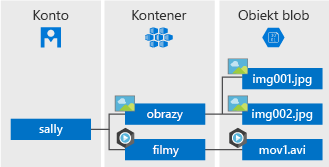

# <a name="quickstart-azure-blob-storage-client-library-v12-for-javascript"></a>Szybki Start: Biblioteka kliencka usługi Azure Blob Storage V12 dla języka JavaScript

Rozpocznij pracę z biblioteką klienta usługi Azure Blob Storage V12 dla języka JavaScript. Azure Blob Storage to rozwiązanie do magazynowania obiektów w chmurze firmy Microsoft. Postępuj zgodnie z instrukcjami, aby zainstalować pakiet, i wypróbuj przykładowy kod dla podstawowych zadań. Usługa Blob Storage jest zoptymalizowana pod kątem przechowywania olbrzymich ilości danych bez struktury.

> [!NOTE]
> Aby rozpocząć pracę z poprzednią wersją zestawu SDK, zobacz [Szybki Start: Biblioteka kliencka usługi Azure Blob Storage dla języka JavaScript](storage-quickstart-blobs-nodejs-v10.md).

Użyj biblioteki klienta usługi Azure Blob Storage V12 dla języka JavaScript, aby:

* Tworzenie kontenera
* Przekazywanie obiektu BLOB do usługi Azure Storage
* Wyświetl listę wszystkich obiektów BLOB w kontenerze
* Pobieranie obiektu BLOB na komputer lokalny
* Usuwanie kontenera

[Dokumentacja interfejsu API odwołująca](/javascript/api/@azure/storage-blob) się do [kodu źródłowego | biblioteki](https://github.com/Azure/azure-sdk-for-js/tree/master/sdk/storage/storage-blob) | [pakietu (Menedżer pakietów Node)](https://www.npmjs.com/package/@azure/storage-blob/v/12.0.0) | [przykłady](https://github.com/Azure/azure-sdk-for-js/tree/master/sdk/storage/storage-blob/samples)

[!INCLUDE [storage-multi-protocol-access-preview](../../../includes/storage-multi-protocol-access-preview.md)]

## <a name="prerequisites"></a>Wymagania wstępne

* Subskrypcja platformy Azure — [Utwórz ją bezpłatnie](https://azure.microsoft.com/free/)
* Konto magazynu platformy Azure — [Tworzenie konta magazynu](https://docs.microsoft.com/azure/storage/common/storage-quickstart-create-account)
* Bieżący [Node. js](https://nodejs.org/en/download/) dla Twojego systemu operacyjnego.

## <a name="setting-up"></a>Konfigurowanie

W tej sekcji omówiono przygotowanie projektu do pracy z biblioteką klienta usługi Azure Blob Storage V12 dla języka JavaScript.

### <a name="create-the-project"></a>Tworzenie projektu

Utwórz aplikację JavaScript o nazwie *BLOB-Start-V12*.

1. W oknie konsoli (na przykład cmd, PowerShell lub bash) Utwórz nowy katalog dla projektu.

    ```console
    mkdir blob-quickstart-v12
    ```

1. Przejdź do nowo utworzonego katalogu *obiektów BLOB — szybki start-V12* .

    ```console
    cd blob-quickstart-v12
    ```

1. Utwórz nowy plik tekstowy o nazwie *Package. JSON*. Ten plik definiuje projekt node. js. Zapisz ten plik w katalogu *BLOB-Start-V12* . Poniżej znajduje się zawartość pliku:

    ```json
    {
        "name": "blob-quickstart-v12",
        "version": "1.0.0",
        "description": "Use the @azure/storage-blob SDK version 12 to interact with Azure Blob storage",
        "main": "blob-quickstart-v12.js",
        "scripts": {
            "start": "node blob-quickstart-v12.js"
        },
        "author": "Your Name",
        "license": "MIT",
        "dependencies": {
            "@azure/storage-blob": "^12.0.0",
            "@types/dotenv": "^4.0.3",
            "dotenv": "^6.0.0"
        }
    }
    ```
    
    Możesz wprowadzić własną nazwę w polu `author`, jeśli chcesz.
   
### <a name="install-the-package"></a>Zainstaluj pakiet

Mimo że w katalogu *obiektów BLOB-szybkiego startu V12* Zainstaluj bibliotekę klienta usługi Azure Blob Storage dla pakietu JavaScript za pomocą polecenia `npm install`. To polecenie odczytuje plik *Package. JSON* i instaluje bibliotekę klienta usługi Azure Blob Storage V12 dla pakietu JavaScript i wszystkie biblioteki, od których jest zależna.

```console
npm install
```

### <a name="set-up-the-app-framework"></a>Konfigurowanie struktury aplikacji

Z katalogu projektu:

1. Otwórz inny nowy plik tekstowy w edytorze kodu
1. Dodawanie wywołań `require` do ładowania modułów platformy Azure i środowiska Node. js
1. Utwórz strukturę dla programu, w tym bardzo podstawową obsługę wyjątków

    Oto kod:

    ```javascript
    const { BlobServiceClient } = require('@azure/storage-blob');
    const uuidv1 = require('uuid/v1');
    
    async function main() {
        console.log('Azure Blob storage v12 - Javascript quickstart sample');
        // Quick start code goes here
    }
    
    main().then(() => console.log('Done')).catch((ex) => console.log(ex.message));
    ```

1. Zapisz nowy plik jako *BLOB-QuickStart-V12. js* w katalogu *BLOB-Start-V12* .

### <a name="copy-your-credentials-from-the-azure-portal"></a>Kopiowanie poświadczeń z witryny Azure Portal

Gdy aplikacja Przykładowa wysyła żądanie do usługi Azure Storage, musi mieć autoryzację. Aby autoryzować żądanie, Dodaj poświadczenia konta magazynu do aplikacji jako parametry połączenia. Wyświetl poświadczenia konta magazynu, wykonując następujące czynności:

1. Zaloguj się w witrynie [Azure Portal](https://portal.azure.com).
2. Odszukaj konto magazynu.
3. W sekcji **Ustawienia** omówienia kont magazynu wybierz pozycję **Klucze dostępu**. W tym miejscu możesz przeglądać klucze dostępu do konta oraz pełne parametry połączenia dla każdego klucza.
4. Znajdź wartość **Parametry połączenia** w obszarze **key1** i wybierz przycisk **Kopiuj**, aby skopiować parametry połączenia. W następnym kroku dodasz wartość parametrów połączenia do zmiennej środowiskowej.

    

### <a name="configure-your-storage-connection-string"></a>Konfigurowanie parametrów połączenia magazynu

Po skopiowaniu parametrów połączenia zapisz je w nowej zmiennej środowiskowej na komputerze, na którym uruchomiona jest aplikacja. Aby ustawić zmienną środowiskową, otwórz okno konsoli i postępuj zgodnie z instrukcjami dla systemu operacyjnego. Zastąp `<yourconnectionstring>` rzeczywistymi parametrami połączenia.

#### <a name="windows"></a>Windows

```cmd
setx CONNECT_STR "<yourconnectionstring>"
```

Po dodaniu zmiennej środowiskowej w systemie Windows należy uruchomić nowe wystąpienie okna polecenia.

#### <a name="linux"></a>Linux

```bash
export CONNECT_STR="<yourconnectionstring>"
```

#### <a name="macos"></a>macOS

```bash
export CONNECT_STR="<yourconnectionstring>"
```

#### <a name="restart-programs"></a>Uruchom ponownie programy

Po dodaniu zmiennej środowiskowej Uruchom ponownie wszystkie uruchomione programy, które będą wymagały odczytania zmiennej środowiskowej. Na przykład przed kontynuowaniem Uruchom ponownie środowisko programistyczne lub Edytor.

## <a name="object-model"></a>Model obiektów

Usługa Azure Blob Storage jest zoptymalizowana pod kątem przechowywania dużych ilości danych bez struktury. Dane bez struktury są danymi, które nie są zgodne z żadnym modelem lub definicją danych, jak na przykład dane tekstowe lub binarne. Magazyn obiektów blob oferuje trzy typy zasobów:

* Konto magazynu
* Kontener na koncie magazynu
* Obiekt BLOB w kontenerze

Na poniższym diagramie przedstawiono relacje między tymi zasobami.



Użyj następujących klas języka JavaScript do korzystania z tych zasobów:

* [BlobServiceClient](/javascript/api/@azure/storage-blob/blobserviceclient): Klasa `BlobServiceClient` umożliwia manipulowanie zasobami usługi Azure Storage i kontenerami obiektów BLOB.
* [ContainerClient](/javascript/api/@azure/storage-blob/containerclient): Klasa `ContainerClient` umożliwia manipulowanie kontenerami usługi Azure Storage i ich obiektami BLOB.
* [BlobClient](/javascript/api/@azure/storage-blob/blobclient): Klasa `BlobClient` umożliwia manipulowanie obiektami BLOB usługi Azure Storage.

## <a name="code-examples"></a>Przykłady kodu

Te przykładowe fragmenty kodu pokazują, jak wykonać następujące czynności z biblioteką klienta usługi Azure Blob Storage dla języka JavaScript:

* [Pobierz parametry połączenia](#get-the-connection-string)
* [Tworzenie kontenera](#create-a-container)
* [Przekazywanie obiektów BLOB do kontenera](#upload-blobs-to-a-container)
* [Wyświetlanie listy obiektów BLOB w kontenerze](#list-the-blobs-in-a-container)
* [Pobieranie obiektów BLOB](#download-blobs)
* [Usuwanie kontenera](#delete-a-container)

### <a name="get-the-connection-string"></a>Pobieranie parametrów połączenia

Poniższy kod pobiera parametry połączenia dla konta magazynu ze zmiennej środowiskowej utworzonej w sekcji [Konfigurowanie parametrów połączenia magazynu](#configure-your-storage-connection-string) .

Dodaj ten kod wewnątrz funkcji `main`:

```javascript
// Retrieve the connection string for use with the application. The storage
// connection string is stored in an environment variable on the machine
// running the application called CONNECT_STR. If the environment variable is
// created after the application is launched in a console or with Visual Studio,
// the shell or application needs to be closed and reloaded to take the
// environment variable into account.
const CONNECT_STR = process.env.CONNECT_STR;
```

### <a name="create-a-container"></a>Tworzenie kontenera

Określ nazwę nowego kontenera. Poniższy kod dołącza wartość identyfikatora UUID do nazwy kontenera, aby upewnić się, że jest ona unikatowa.

> [!IMPORTANT]
> Nazwy kontenerów muszą być zapisane małymi literami. Aby uzyskać więcej informacji o nazewnictwie kontenerów i obiektów blob, zobacz temat [Nazewnictwo i odwoływanie się do kontenerów, obiektów blob i metadanych](/rest/api/storageservices/naming-and-referencing-containers--blobs--and-metadata).

Utwórz wystąpienie klasy [BlobServiceClient](/javascript/api/@azure/storage-blob/blobserviceclient) przez wywołanie metody [fromConnectionString](/javascript/api/@azure/storage-blob/blobserviceclient#fromconnectionstring-string--newpipelineoptions-) . Następnie Wywołaj metodę [getContainerClient](/javascript/api/@azure/storage-blob/blobserviceclient#getcontainerclient-string-) , aby uzyskać odwołanie do kontenera. Na koniec Wywołaj polecenie [Utwórz](/javascript/api/@azure/storage-blob/containerclient#create-containercreateoptions-) , aby utworzyć kontener na koncie magazynu.

Dodaj ten kod na końcu funkcji `main`:

```javascript
// Create the BlobServiceClient object which will be used to create a container client
const blobServiceClient = await new BlobServiceClient.fromConnectionString(CONNECT_STR);

// Create a unique name for the container
const containerName = 'quickstart' + uuidv1();

console.log('\nCreating container...');
console.log('\t', containerName);

// Get a reference to a container
const containerClient = await blobServiceClient.getContainerClient(containerName);

// Create the container
await containerClient.create();
```

### <a name="upload-blobs-to-a-container"></a>Przekazywanie obiektów BLOB do kontenera

Następujący fragment kodu:

1. Tworzy ciąg tekstowy do przekazania do obiektu BLOB.
1. Pobiera odwołanie do obiektu [BlockBlobClient](/javascript/api/@azure/storage-blob/blockblobclient) przez wywołanie metody [getBlockBlobClient](/javascript/api/@azure/storage-blob/containerclient#getblockblobclient-string-) na [ContainerClient](/javascript/api/@azure/storage-blob/containerclient) z sekcji [Create a Container](#create-a-container) .
1. Przekazuje dane ciągu tekstowego do obiektu BLOB przez wywołanie metody [przekazywania](/javascript/api/@azure/storage-blob/blockblobclient#upload-httprequestbody--number--blockblobuploadoptions-) .

Dodaj ten kod na końcu funkcji `main`:

```javascript
// Create a unique name for the blob
const blobName = 'quickstart' + uuidv1() + '.txt';

// Get a block blob client
const blockBlobClient = containerClient.getBlockBlobClient(blobName);

console.log('\nUploading to Azure Storage as blob:\n\t', blobName);

// Upload data to the blob
const data = 'Hello, World!';
await blockBlobClient.upload(data, data.length);
```

### <a name="list-the-blobs-in-a-container"></a>Wyświetlanie listy obiektów blob w kontenerze

Utwórz listę obiektów BLOB w kontenerze, wywołując metodę [listBlobsFlat](/javascript/api/@azure/storage-blob/containerclient#listblobsflat-containerlistblobsoptions-) . W takim przypadku tylko jeden obiekt BLOB został dodany do kontenera, więc operacja tworzenia listy zwraca tylko jeden obiekt BLOB.

Dodaj ten kod na końcu funkcji `main`:

```javascript
console.log('\nListing blobs...');

// List the blob(s) in the container.
for await (const blob of containerClient.listBlobsFlat()) {
    console.log('\t', blob.name);
}
```

### <a name="download-blobs"></a>Pobieranie obiektów blob

Pobierz utworzony wcześniej obiekt BLOB, wywołując metodę [pobierania](/javascript/api/@azure/storage-blob/blockblobclient#download-undefined---number--undefined---number--blobdownloadoptions-) . Przykładowy kod zawiera funkcję pomocnika o nazwie `streamToString`, która jest używana do odczytywania strumienia do odczytu ze środowiska Node. js do ciągu.

Dodaj ten kod na końcu funkcji `main`:

```javascript
// Get blob content from position 0 to the end
// In Node.js, get downloaded data by accessing downloadBlockBlobResponse.readableStreamBody
// In browsers, get downloaded data by accessing downloadBlockBlobResponse.blobBody
const downloadBlockBlobResponse = await blockBlobClient.download(0);
console.log('\nDownloaded blob content...');
console.log('\t', await streamToString(downloadBlockBlobResponse.readableStreamBody));
```

Dodaj tę funkcję pomocnika *po* funkcji `main`:

```javascript
// A helper function used to read a Node.js readable stream into a string
async function streamToString(readableStream) {
  return new Promise((resolve, reject) => {
    const chunks = [];
    readableStream.on("data", (data) => {
      chunks.push(data.toString());
    });
    readableStream.on("end", () => {
      resolve(chunks.join(""));
    });
    readableStream.on("error", reject);
  });
}
```

### <a name="delete-a-container"></a>Usuwanie kontenera

Poniższy kod czyści zasoby utworzone przez aplikację przez usunięcie całego kontenera przy użyciu metody [delete](/javascript/api/@azure/storage-blob/containerclient#delete-containerdeletemethodoptions-) . Możesz również usunąć pliki lokalne, jeśli chcesz.

Dodaj ten kod na końcu funkcji `main`:

```javascript
console.log('\nDeleting container...');

// Delete container
await containerClient.delete();
```

## <a name="run-the-code"></a>Uruchamianie kodu

Ta aplikacja tworzy ciąg tekstowy i przekazuje go do magazynu obiektów BLOB. W przykładzie zostanie wyświetlona lista obiektów BLOB w kontenerze, program pobierze obiekt BLOB i wyświetli pobrane dane.

W wierszu konsoli przejdź do katalogu zawierającego plik *BLOB-QuickStart-V12.py* , a następnie wykonaj następujące polecenie `node`, aby uruchomić aplikację.

```console
node blob-quickstart-v12.js
```

Dane wyjściowe aplikacji są podobne do następujących:

```output
Azure Blob storage v12 - JavaScript quickstart sample

Creating container...
         quickstart4a0780c0-fb72-11e9-b7b9-b387d3c488da

Uploading to Azure Storage as blob:
         quickstart4a3128d0-fb72-11e9-b7b9-b387d3c488da.txt

Listing blobs...
         quickstart4a3128d0-fb72-11e9-b7b9-b387d3c488da.txt

Downloaded blob content...
         Hello, World!

Deleting container...
Done
```

Przechodzenie przez kod w debugerze i sprawdzanie Azure Portal w trakcie całego procesu. Sprawdź, czy kontener jest tworzony. Możesz otworzyć obiekt BLOB wewnątrz kontenera i wyświetlić jego zawartość.

## <a name="next-steps"></a>Następne kroki

W tym przewodniku szybki start przedstawiono sposób przekazywania, pobierania i wyświetlania listy obiektów BLOB za pomocą języka JavaScript.

Aby wyświetlić przykładowe aplikacje dla magazynu obiektów blob, przejdź do:

> [!div class="nextstepaction"]
> [Przykłady kodu JavaScript V12 zestawu SDK usługi Azure Blob Storage](https://github.com/Azure/azure-sdk-for-js/tree/master/sdk/storage/azure-storage-blob/samples)

* Aby dowiedzieć się więcej, zobacz [zestaw Azure SDK dla języka JavaScript](https://github.com/Azure/azure-sdk-for-js/blob/master/sdk/storage/storage-blob/README.md).
* Samouczki, przykłady, Przewodniki Szybki Start i inne dokumenty można znaleźć [w dokumentacji języka JavaScript zestawu Azure SDK](/azure/javascript/).
