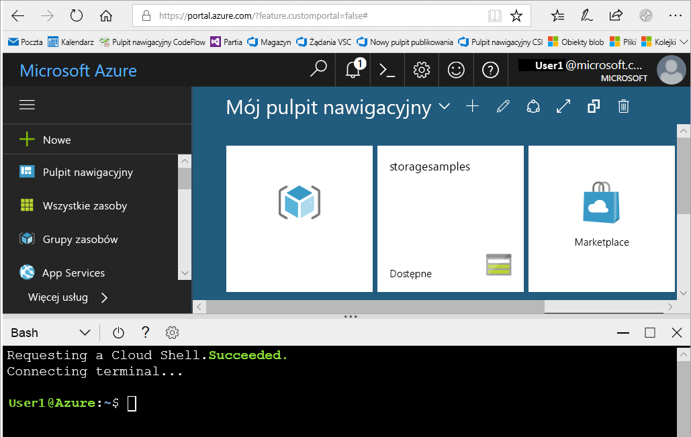

# <a name="create-an-azure-storage-account"></a>Tworzenie konta usługi Azure Storage

Konto magazynu platformy Azure zawiera wszystkie obiekty danych usługi Azure Storage: obiekty blob, pliki, kolejki, tabele i dyski. Konto magazynu udostępnia unikatowy obszar nazw dla danych usługi Azure Storage, który jest dostępny z dowolnego miejsca na świecie za pośrednictwem protokołu HTTP lub HTTPS. Dane na koncie magazynu platformy Azure są trwałe i wysoce dostępne, bezpieczne i skalowalne.

W tym artykule opisano, że można utworzyć konto magazynu przy użyciu [witryny Azure portal,](https://portal.azure.com/) [azure powershell,](https://docs.microsoft.com/powershell/azure/overview) [interfejsu wiersza polecenia platformy Azure](https://docs.microsoft.com/cli/azure?view=azure-cli-latest)lub [szablonu usługi Azure Resource Manager.](../../azure-resource-manager/management/overview.md)  

[!INCLUDE [updated-for-az](../../../includes/updated-for-az.md)]

## <a name="prerequisites"></a>Wymagania wstępne

Jeśli nie masz subskrypcji platformy Azure, utwórz [bezpłatne konto](https://azure.microsoft.com/free/) przed rozpoczęciem.

# <a name="portal"></a>[Portal](#tab/azure-portal)

Brak.

# <a name="powershell"></a>[Powershell](#tab/azure-powershell)

Aby utworzyć konto magazynu platformy Azure za pomocą programu PowerShell, upewnij się, że zainstalowano moduł Az usługi Azure PowerShell w wersji 0.7 lub nowszej. Aby uzyskać więcej informacji, zobacz [Wprowadzenie modułu Az programu Azure PowerShell](/powershell/azure/new-azureps-module-az).

Aby znaleźć bieżącą wersję, uruchom następujące polecenie:

```powershell
Get-InstalledModule -Name "Az"
```

Aby zainstalować lub uaktualnić program Azure PowerShell, zobacz [Instalowanie modułu programu Azure PowerShell](/powershell/azure/install-Az-ps).

# <a name="azure-cli"></a>[Interfejs wiersza polecenia platformy Azure](#tab/azure-cli)

Możesz zalogować się na platformie Azure i uruchomić polecenia interfejsu wiersza polecenia platformy Azure na jeden z dwóch sposobów:

- Polecenia interfejsu wiersza polecenia można uruchamiać z poziomu witryny Azure portal w usłudze Azure Cloud Shell.
- Można zainstalować interfejsu wiersza polecenia i uruchomić polecenia interfejsu wiersza polecenia lokalnie.

### <a name="use-azure-cloud-shell"></a>Używanie usługi Azure Cloud Shell

Usługa Azure Cloud Shell jest bezpłatną powłoką Bash, którą można uruchamiać bezpośrednio w witrynie Azure Portal. Narzędzie wiersza polecenia platformy Azure jest wstępnie zainstalowane i skonfigurowane do używania z kontem. Kliknij przycisk **Cloud Shell** w menu w prawej górnej części witryny Azure portal:

[](https://portal.azure.com)

Przycisk uruchamia powłokę interaktywną, której można użyć do uruchomienia kroków opisanych w tym artykule inspekcyjnym:

[](https://portal.azure.com)

### <a name="install-the-cli-locally"></a>Instalowanie interfejsu wiersza polecenia lokalnie

Interfejs wiersza polecenia platformy Azure możesz również zainstalować i używać lokalnie. Ten artykuł in how-to wymaga, aby uruchomić interfejsu wiersza polecenia platformy Azure w wersji 2.0.4 lub nowszej. Uruchom polecenie `az --version`, aby dowiedzieć się, jaka wersja jest używana. Jeśli konieczna będzie instalacja lub uaktualnienie interfejsu, zobacz [Instalowanie interfejsu wiersza polecenia platformy Azure](/cli/azure/install-azure-cli). 

# <a name="template"></a>[Szablonu](#tab/template)

Brak.

---

## <a name="sign-in-to-azure"></a>Logowanie do platformy Azure

# <a name="portal"></a>[Portal](#tab/azure-portal)

Zaloguj się do [Portalu Azure](https://portal.azure.com).

# <a name="powershell"></a>[Powershell](#tab/azure-powershell)

Zaloguj się do subskrypcji `Connect-AzAccount` platformy Azure za pomocą polecenia i postępuj zgodnie ze wskazówkami wyświetlanymi na ekranie, aby uwierzytelnić.

```powershell
Connect-AzAccount
```

# <a name="azure-cli"></a>[Interfejs wiersza polecenia platformy Azure](#tab/azure-cli)

Aby uruchomić usługę Azure Cloud Shell, zaloguj się do [witryny Azure portal](https://portal.azure.com).

Aby zalogować się do lokalnej instalacji interfejsu wiersza polecenia, uruchom polecenie [logowania az:](/cli/azure/reference-index#az-login)

```azurecli-interactive
az login
```

# <a name="template"></a>[Szablonu](#tab/template)

Nie dotyczy

---

## <a name="create-a-storage-account"></a>Tworzenie konta magazynu

Teraz możesz przystąpić do tworzenia konta magazynu.

Każde konto magazynu musi należeć do grupy zasobów platformy Azure. Grupa zasobów to logiczny kontener przeznaczony do grupowania usług platformy Azure. Podczas tworzenia konta magazynu masz możliwość utworzenia nowej grupy zasobów lub użycia istniejącej grupy zasobów. W tym artykule pokazano, jak utworzyć nową grupę zasobów.

Konto magazynu **ogólnego przeznaczenia, wersja 2** zapewnia dostęp do wszystkich usług magazynu Azure Storage: obiektów blob, plików, kolejek, tabel i dysków. Kroki opisane w tym miejscu utworzyć ogólne przeznaczenie konta magazynu w wersji 2, ale kroki, aby utworzyć dowolny typ konta magazynu są podobne.

# <a name="portal"></a>[Portal](#tab/azure-portal)

[!INCLUDE [storage-create-account-portal-include](../../../includes/storage-create-account-portal-include.md)]

# <a name="powershell"></a>[Powershell](#tab/azure-powershell)

Najpierw użyj polecenia [New-AzResourceGroup](/powershell/module/az.resources/new-azresourcegroup) w programie PowerShell, aby utworzyć nową grupę zasobów:

```powershell
# put resource group in a variable so you can use the same group name going forward,
# without hard-coding it repeatedly
$resourceGroup = "storage-resource-group"
$location = "westus"
New-AzResourceGroup -Name $resourceGroup -Location $location
```

Jeśli nie masz pewności, który region należy określić dla parametru `-Location`, za pomocą polecenia [Get-AzLocation](/powershell/module/az.resources/get-azlocation) możesz pobrać listę obsługiwanych regionów dla swojej subskrypcji:

```powershell
Get-AzLocation | select Location
```

Następnie należy utworzyć konto magazynu ogólnego przeznaczenia w wersji 2 z magazynem geograficznym dostępu do odczytu (RA-GRS) przy użyciu polecenia [New-AzStorageAccount.](/powershell/module/az.storage/New-azStorageAccount) Należy pamiętać, że nazwa konta magazynu musi być unikatowa na platformie Azure, więc zastąp wartość symbolu zastępczego w nawiasach własną unikatową wartością:

```powershell
New-AzStorageAccount -ResourceGroupName $resourceGroup `
  -Name <account-name> `
  -Location $location `
  -SkuName Standard_RAGRS `
  -Kind StorageV2
```

> [!IMPORTANT]
> Jeśli planujesz używać usługi Azure `-EnableHierarchicalNamespace $True` Data Lake [Storage,](https://azure.microsoft.com/services/storage/data-lake-storage/)należy uwzględnić na tej liście parametrów.

Aby utworzyć konto magazynu ogólnego przeznaczenia w wersji 2 z inną opcją replikacji, zastąp żądaną wartość w poniższej tabeli parametrem **SkuName.**

|Opcja replikacji  |Parametr SkuName  |
|---------|---------|
|Magazyn lokalnie nadmiarowy (LRS)     |Standard_LRS         |
|Magazyn strefowo nadmiarowy (ZRS)     |Standard_ZRS         |
|Magazyn geograficznie nadmiarowy (GRS)     |Standard_GRS         |
|Magazyn geograficznie nadmiarowy dostępny do odczytu (GRS)     |Standard_RAGRS         |
|Magazyn geograficznie nadmiarowy (GZRS) (wersja zapoznawcza)    |Standard_GZRS         |
|Magazyn geograficzny dostępu do odczytu (RA-GZRS) (wersja zapoznawcza)    |Standard_RAGZRS         |

# <a name="azure-cli"></a>[Interfejs wiersza polecenia platformy Azure](#tab/azure-cli)

Najpierw użyj polecenia [az group create](/cli/azure/group#az_group_create) interfejsu wiersza polecenia platformy Azure, aby utworzyć nową grupę zasobów.

```azurecli-interactive
az group create \
    --name storage-resource-group \
    --location westus
```

Jeśli nie masz pewności, który region należy określić dla parametru `--location`, za pomocą polecenia [az account list-locations](/cli/azure/account#az_account_list) możesz pobrać listę obsługiwanych regionów dla swojej subskrypcji.

```azurecli-interactive
az account list-locations \
    --query "[].{Region:name}" \
    --out table
```

Następnie utwórz konto magazynu ogólnego przeznaczenia w wersji 2 z magazynem geograficznym dostępu do odczytu przy użyciu polecenia [tworzenie konta magazynu az.](/cli/azure/storage/account#az_storage_account_create) Należy pamiętać, że nazwa konta magazynu musi być unikatowa na platformie Azure, więc zastąp wartość symbolu zastępczego w nawiasach własną unikatową wartością:

```azurecli-interactive
az storage account create \
    --name <account-name> \
    --resource-group storage-resource-group \
    --location westus \
    --sku Standard_RAGRS \
    --kind StorageV2
```

> [!IMPORTANT]
> Jeśli planujesz używać usługi Azure `--enable-hierarchical-namespace true` Data Lake [Storage,](https://azure.microsoft.com/services/storage/data-lake-storage/)należy uwzględnić na tej liście parametrów. 

Aby utworzyć konto magazynu ogólnego przeznaczenia w wersji 2 z inną opcją replikacji, zastąp żądaną wartość w poniższej tabeli parametrem **sku.**

|Opcja replikacji  |parametr sku  |
|---------|---------|
|Magazyn lokalnie nadmiarowy (LRS)     |Standard_LRS         |
|Magazyn strefowo nadmiarowy (ZRS)     |Standard_ZRS         |
|Magazyn geograficznie nadmiarowy (GRS)     |Standard_GRS         |
|Magazyn geograficznie nadmiarowy dostępny do odczytu (GRS)     |Standard_RAGRS         |
|Magazyn geograficznie nadmiarowy (GZRS) (wersja zapoznawcza)    |Standard_GZRS         |
|Magazyn geograficzny dostępu do odczytu (RA-GZRS) (wersja zapoznawcza)    |Standard_RAGZRS         |

# <a name="template"></a>[Szablonu](#tab/template)

Za pomocą usługi Azure Powershell lub interfejsu wiersza polecenia platformy Azure można wdrożyć szablon Usługi Resource Manager w celu utworzenia konta magazynu. Szablon użyty w tym artykule insektuj jest z [szablonów szybkiego startu usługi Azure Resource Manager](https://azure.microsoft.com/resources/templates/101-storage-account-create/). Aby uruchomić skrypty, wybierz pozycję **Wypróbuj,** aby otworzyć powłokę usługi Azure Cloud. Aby wkleić skrypt, kliknij prawym przyciskiem myszy powłokę, a następnie wybierz polecenie **Wklej**.

```azurepowershell-interactive
$resourceGroupName = Read-Host -Prompt "Enter the Resource Group name"
$location = Read-Host -Prompt "Enter the location (i.e. centralus)"

New-AzResourceGroup -Name $resourceGroupName -Location "$location"
New-AzResourceGroupDeployment -ResourceGroupName $resourceGroupName -TemplateUri "https://raw.githubusercontent.com/Azure/azure-quickstart-templates/master/101-storage-account-create/azuredeploy.json"
```

```azurecli-interactive
echo "Enter the Resource Group name:" &&
read resourceGroupName &&
echo "Enter the location (i.e. centralus):" &&
read location &&
az group create --name $resourceGroupName --location "$location" &&
az group deployment create --resource-group $resourceGroupName --template-file "https://raw.githubusercontent.com/Azure/azure-quickstart-templates/master/101-storage-account-create/azuredeploy.json"
```

> [!NOTE]
> Ten szablon służy tylko jako przykład. Istnieje wiele ustawień konta magazynu, które nie są skonfigurowane jako część tego szablonu. Na przykład, jeśli chcesz użyć [usługi Azure Data Lake Storage,](https://azure.microsoft.com/services/storage/data-lake-storage/)należy zmodyfikować ten szablon, ustawiając `isHnsEnabledad` właściwość `StorageAccountPropertiesCreateParameters` obiektu na `true`. 

Aby dowiedzieć się, jak zmodyfikować ten szablon lub utworzyć nowy, zobacz:

- [Dokumentacja usługi Azure Resource Manager](/azure/azure-resource-manager/).
- [Odwołanie do szablonu konta magazynu](/azure/templates/microsoft.storage/allversions).
- [Przykłady szablonów dodatkowych kont magazynu](https://azure.microsoft.com/resources/templates/?resourceType=Microsoft.Storage).

---

Aby uzyskać więcej informacji na temat dostępnych opcji replikacji, zobacz [Storage replication options (Opcje replikacji danych usługi Storage)](storage-redundancy.md).

## <a name="delete-a-storage-account"></a>Usuwanie konta magazynu

Usunięcie konta magazynu powoduje usunięcie całego konta, w tym wszystkich danych na koncie, i nie można ich cofnąć.

# <a name="portal"></a>[Portal](#tab/azure-portal)

1. Przejdź do konta magazynu w [witrynie Azure portal](https://portal.azure.com).
1. Kliknij **pozycję Usuń**.

# <a name="powershell"></a>[Powershell](#tab/azure-powershell)

Aby usunąć konto magazynu, użyj polecenia [Usuń konto AzStorageAccount:](/powershell/module/az.storage/remove-azstorageaccount)

```powershell
Remove-AzStorageAccount -Name <storage-account> -ResourceGroupName <resource-group>
```

# <a name="azure-cli"></a>[Interfejs wiersza polecenia platformy Azure](#tab/azure-cli)

Aby usunąć konto magazynu, użyj polecenia [usuń konto magazynu az:](/cli/azure/storage/account#az-storage-account-delete)

```azurecli-interactive
az storage account delete --name <storage-account> --resource-group <resource-group>
```

# <a name="template"></a>[Szablonu](#tab/template)

Aby usunąć konto magazynu, użyj narzędzia Azure PowerShell lub interfejsu wiersza polecenia platformy Azure.

```azurepowershell-interactive
$storageResourceGroupName = Read-Host -Prompt "Enter the resource group name"
$storageAccountName = Read-Host -Prompt "Enter the storage account name"
Remove-AzStorageAccount -Name $storageAccountName -ResourceGroupName $storageResourceGroupName
```

```azurecli-interactive
echo "Enter the resource group name:" &&
read resourceGroupName &&
echo "Enter the storage account name:" &&
read storageAccountName &&
az storage account delete --name storageAccountName --resource-group resourceGroupName
```

---

Alternatywnie można usunąć grupę zasobów, która usuwa konto magazynu i inne zasoby w tej grupie zasobów. Aby uzyskać więcej informacji na temat usuwania grupy zasobów, zobacz [Usuwanie grupy zasobów i zasobów](../../azure-resource-manager/management/delete-resource-group.md).

> [!WARNING]
> Nie można przywrócić usuniętego konta magazynu ani odzyskać żadnej zawartości znajdującej się na koncie przed usunięciem. Zanim usuniesz konto, wykonaj kopię zapasową wszystkich danych, które chcesz zapisać. Dotyczy to również wszystkich zasobów na koncie — po usunięciu obiektu Blob, tabeli, kolejki lub pliku elementy te są trwale usuwane.
>
> Podczas próby usunięcia konta magazynu skojarzonego z maszyną wirtualną platformy Azure może zostać wyświetlony komunikat o błędzie dotyczący wciąż używanego konta magazynu. Aby uzyskać pomoc dotyczącą rozwiązywania tego błędu, zobacz [Rozwiązywanie problemów z błędami podczas usuwania kont magazynu](../common/storage-resource-manager-cannot-delete-storage-account-container-vhd.md).

## <a name="next-steps"></a>Następne kroki

W tym artykule in how-to utworzono standardowe konto magazynu ogólnego przeznaczenia w wersji 2. Aby dowiedzieć się, jak przekazywać i pobierać obiekty BLOB do i z konta magazynu, przejdź do jednego z przewodników Szybki start magazynu obiektów Blob.

# <a name="portal"></a>[Portal](#tab/azure-portal)

> [!div class="nextstepaction"]
> [Praca z obiektami blob za pomocą witryny Azure Portal](../blobs/storage-quickstart-blobs-portal.md)

# <a name="powershell"></a>[Powershell](#tab/azure-powershell)

> [!div class="nextstepaction"]
> [Praca z obiektami blob za pomocą programu PowerShell](../blobs/storage-quickstart-blobs-powershell.md)

# <a name="azure-cli"></a>[Interfejs wiersza polecenia platformy Azure](#tab/azure-cli)

> [!div class="nextstepaction"]
> [Praca z obiektami blob za pomocą interfejsu wiersza polecenia platformy Azure](../blobs/storage-quickstart-blobs-cli.md)

# <a name="template"></a>[Szablonu](#tab/template)

> [!div class="nextstepaction"]
> [Praca z obiektami blob za pomocą witryny Azure Portal](../blobs/storage-quickstart-blobs-portal.md)

---
