# Szybki start: tworzenie i zarządzanie udostępnianiem plików platformy Azure maszynom wirtualnym z systemem Windows

W tym artykule przedstawiono podstawowe kroki tworzenia i używania udziału usługi Azure Files. W tym przewodniku Szybki start położono nacisk na szybkie konfigurowanie udziału usługi Azure Files, aby można było sprawdzić, jak działa ta usługa. Jeśli potrzebujesz bardziej szczegółowych instrukcji dotyczących tworzenia i używania udziałów plików platformy Azure we własnym środowisku, zobacz [Korzystanie z udziału plików platformy Azure w systemie Windows](storage-how-to-use-files-windows.md).

Jeśli nie masz subskrypcji platformy Azure, utwórz [bezpłatne konto](https://azure.microsoft.com/free/?WT.mc_id=A261C142F) przed rozpoczęciem.

## Logowanie do platformy Azure

Zaloguj się do [Portalu Azure](https://portal.azure.com).

## Przygotowywanie środowiska

W tym przewodniku Szybki start skonfigurujesz następujące elementy:

- Konto magazynu i udział plików platformy Azure
- Maszyna wirtualna z systemem Windows Server 2016 Datacenter

### Tworzenie konta magazynu

Przed rozpoczęciem pracy z udziałem plików platformy Azure musisz utworzyć konto magazynu platformy Azure. Konto magazynu ogólnego przeznaczenia w wersji 2 zapewnia dostęp do wszystkich usług magazynu Azure Storage: obiektów blob, plików, kolejek i tabel. W tym samouczku przedstawiono tworzenie konta magazynu ogólnego przeznaczenia w wersji 2, ale kroki tworzenia dowolnego typu konta magazynu są podobne. Konto magazynu może zawierać nieograniczoną liczbę udziałów. W udziale można przechowywać nieograniczoną liczbę plików, aż do osiągnięcia limitów pojemności konta magazynu.

[!INCLUDE [storage-create-account-portal-include](../../../includes/storage-create-account-portal-include.md)]

### Tworzenie udziału plików platformy Azure

Następnie utwórz udział plików.

1. Po wdrożeniu konta magazynu platformy Azure wybierz pozycję **Przejdź do zasobu**.
1. Wybierz pozycję **Pliki** w okienku konta magazynu.

    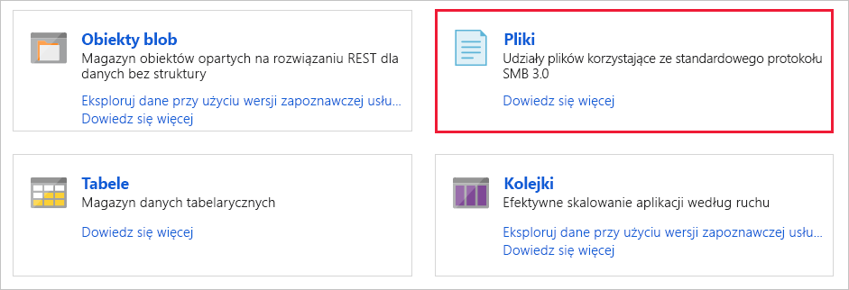

1. Wybierz **pozycję Udział plików**.

    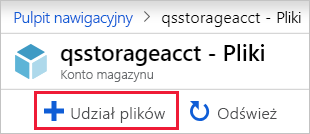

1. Nadaj nowemu udziałowi plików nazwę *qsfileshare*, wprowadź wartość „1” w polu **Limit przydziału**, a następnie wybierz pozycję **Utwórz**. Maksymalny limit przydziału to 5 TiB, ale w tym przewodniku Szybki start potrzebujesz tylko 1 GiB.
1. Utwórz nowy plik tekstowy o nazwie *qsTestFile* na komputerze lokalnym.
1. Wybierz nowy udział plików, a następnie w lokalizacji udziału plików wybierz pozycję **Przekaż**.

    

1. Przejdź do lokalizacji, w której utworzono plik txt, wybierz plik *qsTestFile.txt* i wybierz pozycję **Przekaż**.

Na razie na platformie Azure utworzono konto magazynu i udział plików zawierający jeden plik. Następnie utworzysz maszynę wirtualną platformy Azure z systemem Windows Server 2016 Datacenter do reprezentowania serwera lokalnego w ramach tego przewodnika Szybki start.

### Wdrażanie maszyny wirtualnej

1. Następnie rozwiń menu po lewej stronie portalu i wybierz pozycję **Utwórz zasób** w lewym górnym rogu witryny Azure Portal.
1. W polu wyszukiwania nad listą zasobów **portalu Azure Marketplace** wyszukaj i wybierz pozycję Centrum danych systemu Windows Server **2016**, a następnie wybierz pozycję **Utwórz**.
1. Na karcie **Podstawy** w obszarze **Szczegóły projektu** wybierz grupę zasobów utworzoną w ramach tego przewodnika Szybki start.

   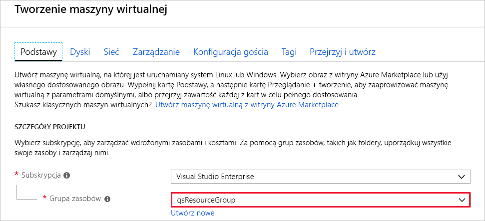

1. W obszarze **Szczegóły wystąpienia** wprowadź nazwę maszyny wirtualnej: *qsVM*.
1. Pozostaw wartości domyślne w polach **Region**, **Opcje dostępności**, **Obraz** i **Rozmiar**.
1. W obszarze **Konto administratora** dodaj wartość *VMadmin* w polu **Nazwa użytkownika** i wprowadź **hasło** dla maszyny wirtualnej.
1. W obszarze **Reguły portów wejściowych** wybierz opcję **Zezwalaj na wybrane porty**, a następnie wybierz **RDP (3389)** i **HTTP** z listy rozwijanej.
1. Wybierz pozycję **Przegląd + utwórz**.
1. Wybierz **pozycję Utwórz**. Tworzenie nowej maszyny wirtualnej potrwa kilka minut.

1. Po zakończeniu wdrażania maszyny wirtualnej wybierz pozycję **Przejdź do zasobu**.

Na tym etapie utworzono nową maszynę wirtualną i dołączono dysk z danymi. Teraz musisz nawiązać połączenie z maszyną wirtualną.

### Łączenie z maszyną wirtualną

1. Wybierz pozycję **Połącz** na stronie właściwości maszyny wirtualnej.

   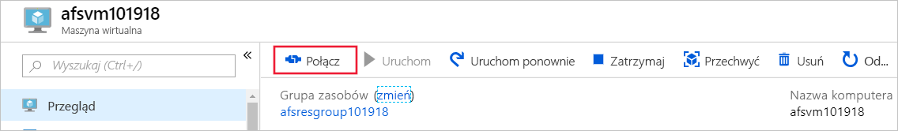

1. Na stronie **Nawiązywanie połączenia z maszyną wirtualną** zostaw opcje domyślne, aby połączyć się za pomocą **adresu IP** przez **numer portu** *3389* i wybierz pozycję **Pobierz plik RDP**.
1. Otwórz pobrany plik RDP i wybierz polecenie **Połącz**, gdy wyświetli się odpowiedni monit.
1. W oknie **Zabezpieczenia systemu Windows** wybierz pozycję **Więcej opcji**, a następnie pozycję **Użyj innego konta**. Wpisz nazwę użytkownika w formacie *localhost\nazwa_użytkownika*, gdzie &lt;nazwa_użytkownika&gt; jest nazwą użytkownika administratora maszyny wirtualnej utworzoną dla danej maszyny wirtualnej. Wprowadź hasło utworzone dla maszyny wirtualnej, a następnie wybierz pozycję **OK**.

   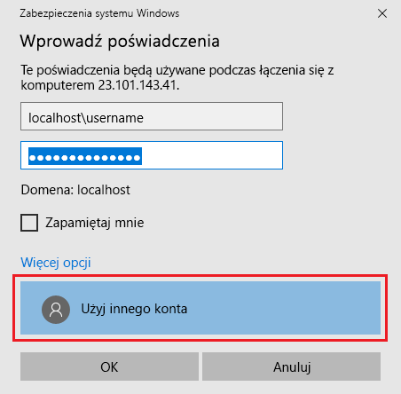

1. Podczas procesu logowania może pojawić się ostrzeżenie o certyfikacie. Wybierz pozycję **Tak** lub **Kontynuuj**, aby utworzyć połączenie.

## Mapowanie udziału plików platformy Azure na dysk systemu Windows

1. W witrynie Azure Portal przejdź do udziału plików *qsfileshare* i wybierz pozycję **Połącz**.
1. Skopiuj zawartość drugiego pola, a następnie wklej ją w **Notatniku**.

   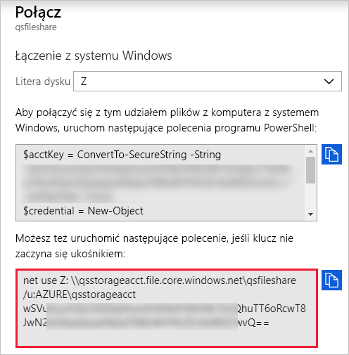

1. Na maszynie wirtualnej otwórz **Eksploratora plików** i w oknie wybierz pozycję **Ten komputer**. Ten wybór spowoduje zmianę menu dostępnego na wstążce. W menu **Komputer** wybierz pozycję **Mapuj dysk sieciowy**.
1. Wybierz literę dysku i wprowadź ścieżkę UNC. Jeśli w tym przewodniku Szybki start zostały zastosowane sugestie dotyczące nazewnictwa, * \\skopiuj qsstorageacct.file.core.windows.net\qsfileshare* z **Notatnika**.

   Upewnij się, że oba pola wyboru są zaznaczone.

   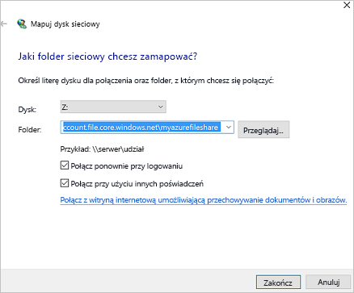

1. Wybierz **pozycję Zakończ**.
1. W oknie dialogowym **Zabezpieczenia systemu Windows**:

   - Skopiuj nazwę konta magazynu poprzedzoną ciągiem AZURE\ z Notatnika, a następnie wklej ją w oknie dialogowym **Zabezpieczenia systemu Windows** jako nazwę użytkownika. Jeśli nadawane nazwy były zgodne z sugestiami w tym przewodniku Szybki start, skopiuj wartość *AZURE\qsstorageacct*.
   - Skopiuj klucz konta magazynu z Notatnika, a następnie wklej go w oknie dialogowym **Zabezpieczenia systemu Windows** jako hasło.

      

## Tworzenie migawki udziału

Teraz, gdy dysk został zamapowany, możesz utworzyć migawkę.

1. W portalu przejdź do swojego udziału plików i wybierz pozycję **Utwórz migawkę**.

   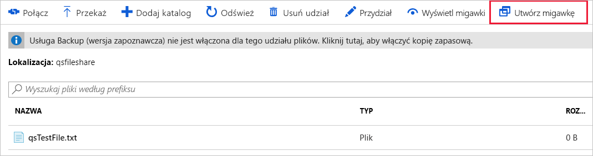

1. Na maszynie wirtualnej otwórz plik *qstestfile.txt* i wpisz ciąg „ten plik został zmodyfikowany”, a następnie zapisz i zamknij plik.
1. Utwórz kolejną migawkę.

## Przeglądanie migawek udziału

1. W udziale plików wybierz pozycję **Wyświetl migawki**.
1. W okienku **Migawki udziału plików** wybierz pierwszą migawkę na liście.

   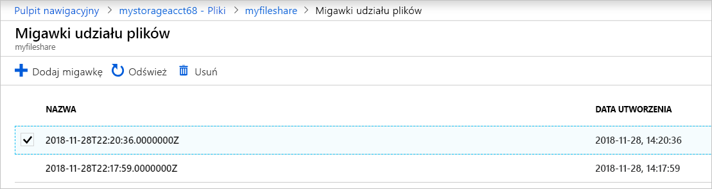

1. W okienku dla tej migawki wybierz plik *qsTestFile.txt*.

## Przywracanie z migawki

1. W bloku migawki udziału plików kliknij prawym przyciskiem myszy pozycję *qsTestFile* i wybierz przycisk **Przywróć**.
1. Wybierz pozycję **Zastąp oryginalny plik**.

   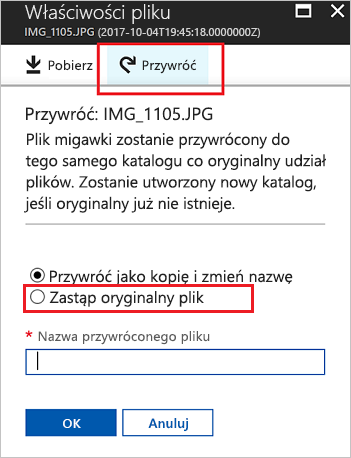

1. Na maszynie wirtualnej otwórz plik. Przywrócono niezmodyfikowaną wersję.

## Usuwanie migawki udziału

1. W udziale plików wybierz pozycję **Wyświetl migawki**.
1. W okienku **Migawki udziału plików** wybierz ostatnią migawkę na liście i kliknij przycisk **Usuń**.

   

## Używanie migawki udziału w systemie Windows

Podobnie jak w przypadku migawek usługi VSS w środowisku lokalnym, możesz wyświetlać migawki z zainstalowanego udziału plików platformy Azure za pomocą karty Poprzednie wersje.

1. W Eksploratorze plików znajdź zainstalowany udział.

   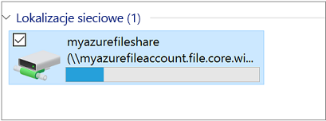

1. Wybierz plik *qsTestFile.txt*, kliknij go prawym przyciskiem myszy i wybierz pozycję **Właściwości** z menu.

   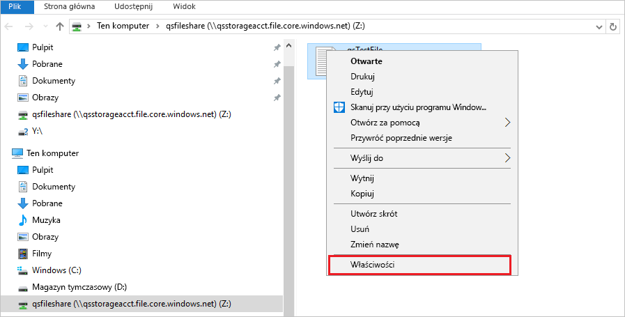

1. Wybierz pozycję **Poprzednie wersje**, aby wyświetlić listę migawek udziału dla tego katalogu.

1. Wybierz pozycję **Otwórz**, aby otworzyć migawkę.

   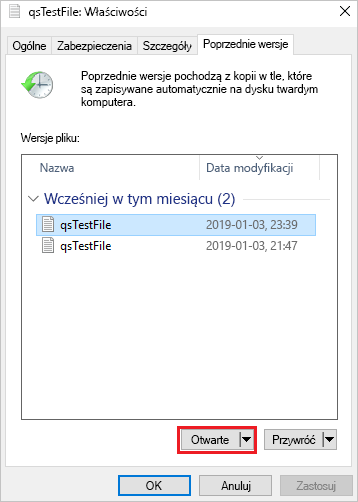

## Uaktualnianie z poprzedniej wersji

1. Wybierz pozycję **Przywróć**. Ta akcja rekursywnie kopiuje zawartość całego katalogu do oryginalnej lokalizacji w momencie utworzenia migawki udziału.

   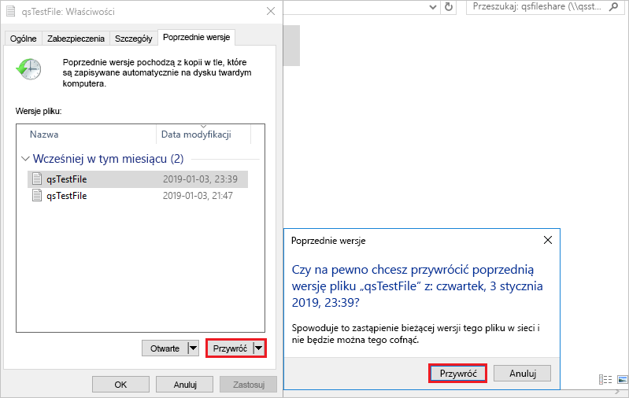 ostrzegawczym Uwaga: Jeśli plik nie uległ zmianie, nie zostanie wyświetlone poprzednia wersja tego pliku, ponieważ ten plik jest tą samą wersją co migawka. Jest to zgodne z tym, jak to działa na serwerze plików systemu Windows.

## Oczyszczanie zasobów

[!INCLUDE [storage-files-clean-up-portal](../../../includes/storage-files-clean-up-portal.md)]

## Następne kroki

> [!div class="nextstepaction"]
> [Korzystanie z udziału plików platformy Azure w systemie Windows](storage-how-to-use-files-windows.md)
