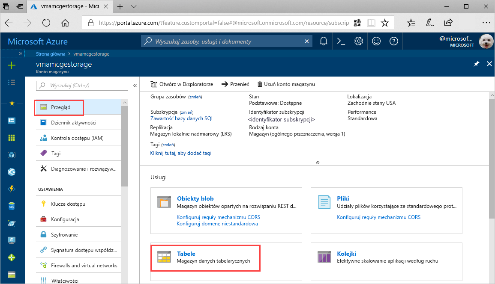
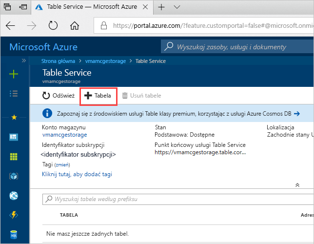
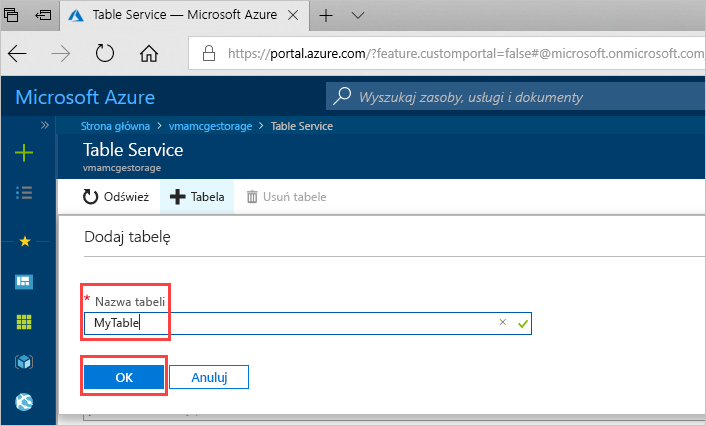

# Szybki start: Tworzenie tabeli usługi Azure Storage w witrynie Azure Portal 

W tym przewodniku Szybki start opisano tworzenie tabel i jednostek w witrynie internetowej Azure Portal. Przedstawiono również tworzenie konta usługi Azure Storage.

[!INCLUDE [quickstarts-free-trial-note](../../../includes/quickstarts-free-trial-note.md)]

## Wymagania wstępne

Aby ukończyć ten przewodnik Szybki start, najpierw utwórz konto usługi Azure Storage w witrynie [Azure Portal](https://portal.azure.com/#create/Microsoft.StorageAccount-ARM). Aby uzyskać pomoc przy tworzeniu konta, zobacz [Tworzenie konta magazynu](../common/storage-quickstart-create-account.md).

## Dodawanie tabeli

Teraz możesz użyć usługi Table service w witrynie Azure Portal, aby utworzyć tabelę.

1. Kliknij pozycję Przegląd > Tabele.

   

2. Kliknij pozycję **+ Tabela**.

   

3. Wpisz nazwę tabeli w polu **Nazwa tabeli**, a następnie kliknij pozycję **OK**. 

   

## Kolejne kroki

- [Wytyczne dotyczące projektu tabel](table-storage-design-guidelines.md)
