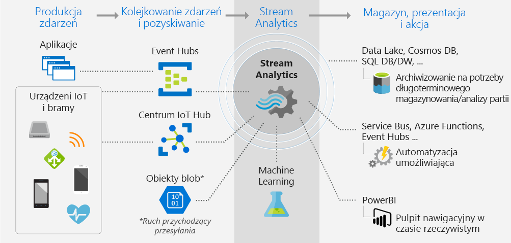
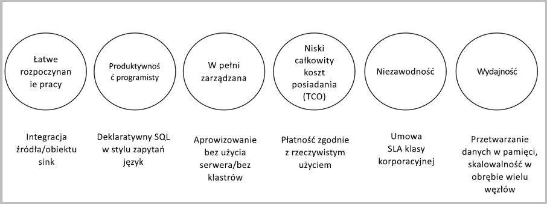

# Co to jest usługa Azure Stream Analytics?

Azure Stream Analytics to analiza i skomplikowany aparat przetwarzania zdarzeń w czasie rzeczywistym, który służy do analizowania i przetwarzania dużych ilości danych szybkiego przesyłania strumieniowego z wielu źródeł jednocześnie. Wzorce i relacje można zidentyfikować w informacjach wyodrębnionych z różnych źródeł danych wejściowych, w tym na urządzeniach, czujników, strumieni kliknięć, źródłach mediów społecznościowych i aplikacjach. Wzorce te mogą służyć do wyzwalania akcji i inicjowania przepływów pracy, takich jak tworzenie alertów, podawanie informacji do narzędzia raportowania lub przechowywanie przekształconych danych do późniejszego użycia. Ponadto usługa Stream Analytics jest dostępna w środowisku uruchomieniowym Azure IoT Edge i obsługuje ten sam język lub składnię co chmura. 

Poniżej przedstawiono przykładowe scenariusze, w których można użyć Azure Stream Analytics:

* Analizowanie strumieni telemetrycznych w czasie rzeczywistym z urządzeń IoT
* Analiza strumienia kliknięć w internecie oraz analiza dzienników internetowych
* Geoprzestrzenna analiza na potrzeby zarządzania flotą i korzystania z pojazdów nie wymagających kierowcy
* Zdalne monitorowanie i konserwacja predykcyjna zasobów o wysokiej wartości
* Analiza danych punktu sprzedaży w czasie rzeczywistym na potrzeby kontroli zapasów i wykrywania anomalii

## Jak działa usługa Stream Analytics?

Zadanie Azure Stream Analytics składa się z danych wejściowych, zapytań i danych wyjściowych. Stream Analytics pobiera dane z usługi Azure Event Hubs, platformy Azure IoT Hub lub Blob Storage platformy Azure. Zapytanie, które jest oparte na języku zapytań SQL, może służyć do łatwego filtrowania, sortowania, agregowania i przyłączania danych przesyłanych strumieniowo w określonym czasie. Możesz również zwiększyć ten język SQL za pomocą języka JavaScript C# i funkcji zdefiniowanych przez użytkownika (UDF). Można łatwo dostosować opcje porządkowania zdarzeń i czas trwania okien czasu podczas preprezentowania operacji agregacji za pomocą prostych konstrukcji językowych i/lub konfiguracji.

Każde zadanie ma dane wyjściowe dla przekształconych danych i pozwala kontrolować, co się dzieje w odpowiedzi na analizowane informacje. Możesz na przykład:

* Wyślij dane do usług, takich jak Azure Functions, Service Bus tematy lub kolejki, aby wyzwolić komunikację lub niestandardowe przepływy pracy.
* Wyślij dane do pulpitu nawigacyjnego Power BI, aby uzyskać pulpit nawigacyjny w czasie rzeczywistym.
* Przechowuj dane w innych usługach Azure Storage, aby uczenie modelu uczenia maszynowego na podstawie danych historycznych lub wykonywania analiz wsadowych.

Na poniższej ilustracji pokazano, jak dane są wysyłane do Stream Analytics, analizowane i wysyłane do innych akcji, takich jak magazyn czy Prezentacja:

## Najważniejsze funkcje i korzyści

Usługa Stream Analytics została zaprojektowana tak, aby była łatwa w użyciu, elastyczna, niezawodna i skalowalna do dowolnej wielkości zadania. Jest ona dostępna w wielu regionach platformy Azure. Na poniższej ilustracji przedstawiono kluczowe możliwości Azure Stream Analytics:

## Łatwość rozpoczynania pracy

Azure Stream Analytics jest łatwy do uruchomienia. Wystarczy kilka kliknięć, aby nawiązać połączenie z wieloma źródłami i ujściami, tworząc kompleksowe potoki. Stream Analytics może nawiązać połączenie z [usługą azure Event Hubs](/azure/event-hubs/) i [IoT Hub platformy Azure](/azure/iot-hub/) na potrzeby pozyskiwania danych przesyłanych strumieniowo oraz z usługi [Azure Blob Storage](/azure/storage/storage-introduction) w celu pozyskiwania danych historycznych. Dane wejściowe zadania mogą również zawierać statyczne lub wolne zmiany danych referencyjnych z usługi Azure Blob Storage lub [SQL Database](stream-analytics-use-reference-data.md#azure-sql-database) , które można dołączyć do danych przesyłanych strumieniowo w celu wykonania operacji wyszukiwania.

Stream Analytics może kierować dane wyjściowe zadań do wielu systemów magazynowych, takich jak [Azure Blob Storage](/azure/storage/storage-introduction), [Azure SQL Database](/azure/sql-database/), [Azure Data Lake Store](/azure/data-lake-store/)i [Azure CosmosDB](/azure/cosmos-db/introduction). Usługę Batch Analytics można uruchomić na przechowywanych danych wyjściowych za pomocą usługi Azure HDInsight lub można wysłać dane wyjściowe do innej usługi, takiej jak Event Hubs do użycia lub [Power BI](https://docs.microsoft.com/power-bi/) do wizualizacji w czasie rzeczywistym.

Aby uzyskać pełną listę Stream Analytics danych wyjściowych, zobacz [Opis danych wyjściowych z Azure Stream Analytics](stream-analytics-define-outputs.md).

## Produktywność programisty

Azure Stream Analytics używa prostego języka zapytań opartego na języku SQL, który został rozszerzony o zaawansowane ograniczenia czasowe do analizowania danych w ruchu. Aby zdefiniować przekształcenia zadań, należy użyć prostego, deklaratywnego [języka zapytań usługi Stream Analytics](https://docs.microsoft.com/stream-analytics-query/stream-analytics-query-language-reference), który umożliwia tworzenie złożonych zapytań czasowych i analizy przy użyciu prostych konstrukcji języka SQL. Ponieważ język zapytań Stream Analytics jest spójny z językiem SQL, znajomość programu SQL jest wystarczająca do rozpoczęcia tworzenia zadań. Możesz również tworzyć zadania przy użyciu narzędzi programistycznych, takich jak Azure PowerShell, [Stream Analytics narzędzia Visual Studio](stream-analytics-tools-for-visual-studio-install.md), [rozszerzenia Stream Analytics Visual Studio Code](quick-create-vs-code.md)lub szablony Azure Resource Manager. Narzędzia dla deweloperów pozwalają tworzyć zapytania przekształceń w trybie offline i używać [potoków ciągłej integracji/ciągłego wdrażania](stream-analytics-tools-for-visual-studio-cicd.md) w celu przesłania zadań na platformę Azure.

Język zapytań Stream Analytics oferuje szeroką gamę funkcji służących do analizowania i przetwarzania danych przesyłanych strumieniowo. Ten język zapytań obsługuje proste manipulowanie danymi, funkcje agregacji i złożone funkcje geoprzestrzenne. Można edytować zapytania w portalu i testować je przy użyciu przykładowych danych wyodrębnionych z strumienia na żywo.

Możliwości języka zapytań można rozszerzyć, definiując i wywołując dodatkowe funkcje. Możesz definiować wywołania funkcji w Azure Machine Learning, aby skorzystać z rozwiązań Azure Machine Learning, i zintegrować skrypty JavaScript lub C# funkcje zdefiniowane przez użytkownika (UDF) lub agregacje zdefiniowane przez użytkownika, aby wykonywać złożone obliczenia jako część strumienia. Zapytanie analityczne.

## W pełni zarządzana

Usługa Azure Stream Analytics to bezserwerowe w pełni zarządzane rozwiązanie typu „platforma jako usługa” (PaaS) platformy Azure. Nie trzeba udostępniać żadnego sprzętu ani zarządzać klastrami w celu uruchamiania zadań. Azure Stream Analytics w pełni zarządzać zadaniem przez skonfigurowanie złożonych klastrów obliczeniowych w chmurze i wzięcie pod uwagę dostrajania wydajności niezbędnego do uruchomienia zadania. Integracja z usługą Azure Event Hubs i usługą Azure IoT Hub pozwala na pozyskiwanie milionów zdarzeń na sekundę pochodzących z różnych źródeł, aby uwzględnić połączone urządzenia, strumieni kliknięć i pliki dziennika. Za pomocą funkcji partycjonowania Event Hubs można podzielić obliczenia na etapy logiczne, z których każdy może być dodatkowo podzielony, aby zwiększyć skalowalność.

## Uruchamiaj w chmurze lub na inteligentnej granicy

Azure Stream Analytics można uruchamiać w chmurze, w przypadku analiz na dużą skalę lub działać na IoT Edge na potrzeby analizy niezwykle niskich opóźnień. Azure Stream Analytics używa tego samego języka zapytań zarówno w chmurze, jak i krawędzi, co umożliwia deweloperom tworzenie prawdziwie architektur hybrydowych na potrzeby przetwarzania strumieniowego. 

## Niski całkowity koszt posiadania

Jako usługa w chmurze usługa Stream Analytics jest zoptymalizowana pod kątem niskiego kosztu. Nie ma żadnych kosztów ponoszonych z góry — płacisz tylko za użyte [jednostki przesyłania strumieniowego](stream-analytics-streaming-unit-consumption.md)i ilość przetworzonych danych. Nie jest wymagane zobowiązanie ani Inicjowanie obsługi klastrów, a zadanie można skalować w górę lub w dół zgodnie z potrzebami biznesowymi.

## Gotowość na sytuacje krytyczne dla działalności firmy

Usługa Azure Stream Analytics jest dostępna w wielu regionach na całym świecie i jest przeznaczona do uruchamiania obciążeń o kluczowym znaczeniu dzięki obsłudze wymagań dotyczących niezawodności, bezpieczeństwa i zgodności.

### Niezawodność

Poza tym usługa Azure Stream Analytics gwarantuje przeprowadzenie dokładnie jednej aprowizacji zdarzenia oraz co najmniej jednokrotnego dostarczenia zdarzeń, więc nigdy nie dochodzi do utraty zdarzeń. Przetwarzanie dokładnie jednokrotne jest gwarantowane dla wybranych danych wyjściowych zgodnie z opisem w obszarze [gwarancji dostarczania zdarzeń](/stream-analytics-query/event-delivery-guarantees-azure-stream-analytics).

Usługa Azure Stream Analytics ma wbudowane funkcje odzyskiwania na wypadek awarii podczas dostarczania zdarzeń. Stream Analytics udostępnia również wbudowane punkty kontrolne do utrzymania stanu zadania i zapewniają powtarzalne wyniki.

Jako usługa zarządzana, Stream Analytics gwarantuje przetwarzanie zdarzeń o dostępności 99,9% na poziomie minuty. Aby uzyskać więcej informacji, zobacz stronę [umów SLA Stream Analytics](https://azure.microsoft.com/support/legal/sla/stream-analytics/v1_0/) . 

### Bezpieczeństwo

Z punktu widzenia zabezpieczeń usługa Azure Stream Analytics szyfruje całą komunikację przychodzącą i wychodzącą oraz obsługuje protokół TLS 1.2. Wbudowane punkty kontrolne również są szyfrowane. Usługa Stream Analytics nie przechowuje danych przychodzących, ponieważ całe przetwarzanie odbywa się w pamięci.

### Zgodność

Usługa Azure Stream Analytics zapewnia dostosowanie do wielu certyfikatów zgodności, co zostało opisane w [przeglądzie zgodności platformy Azure](https://gallery.technet.microsoft.com/Overview-of-Azure-c1be3942). 

## Wydajność

Stream Analytics może przetwarzać miliony zdarzeń co sekundę i może dostarczać wyniki przy użyciu bardzo małych opóźnień. Umożliwia skalowanie w górę lub zwiększanie skali w poziomie w celu obsługi dużych aplikacji z przetwarzaniem złożonych zdarzeń oraz przetwarzaniem w czasie rzeczywistym. Stream Analytics obsługuje wyższą wydajność przez partycjonowanie, dzięki czemu złożone zapytania mogą być równoległe i wykonywane na wielu węzłach przesyłania strumieniowego. Usługa Azure Stream Analytics jest oparta na [Trill](https://github.com/Microsoft/Trill), aparacie analizy przesyłania strumieniowego w pamięci o wysokiej wydajności opracowanym we współpracy z Microsoft Research.

## Następne kroki

Masz już podstawowe informacje o usłudze Azure Stream Analytics. Teraz możesz utworzyć pierwsze zadanie w usłudze Stream Analytics:

* [Tworzenie zadania usługi Stream Analytics przy użyciu witryny Azure Portal](stream-analytics-quick-create-portal.md).
* [Tworzenie zadania usługi Stream Analytics przy użyciu programu Azure PowerShell](stream-analytics-quick-create-powershell.md).
* [Tworzenie zadania usługi Stream Analytics przy użyciu programu Visual Studio](stream-analytics-quick-create-vs.md).
* [Utwórz zadanie Stream Analytics przy użyciu Visual Studio Code](quick-create-vs-code.md).
